# ADFS 2012 R2 Web Application Proxy – Re-Establish Proxy Trust
🗓️ Published: 2025-05-28

---

> **Quick Summary**  
> The short-lived WAP authentication certificate expired. As a result, trust between the proxy and the AD FS server was broken. This guide shows how to re-establish trust using either the GUI or PowerShell.

## What Happened?

In this lab scenario, the WAP authentication certificate expired. Communication between the proxy and the Federation Service stopped. Internal AD FS remained healthy, but external traffic through the proxy failed.

### Symptoms

- **Remote Access Console** throws `0x8007520C`.  

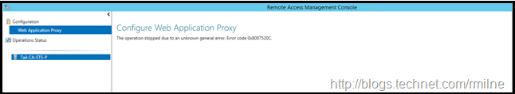

- **Event ID 422** on the proxy:  
  ```
  401 Unauthorized fetching proxy config.
  ```

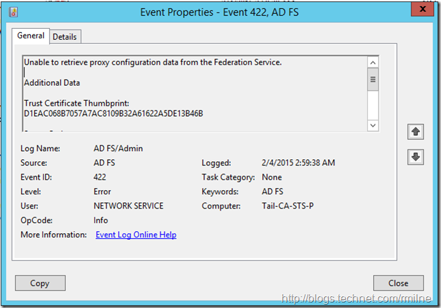

- **Event ID 394** on ADFS:  
  > “Proxy trust certificate … has expired.”  

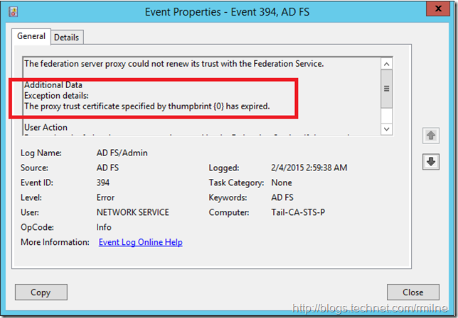

- **Event ID 276** indicates that the proxy trust should be re-established.

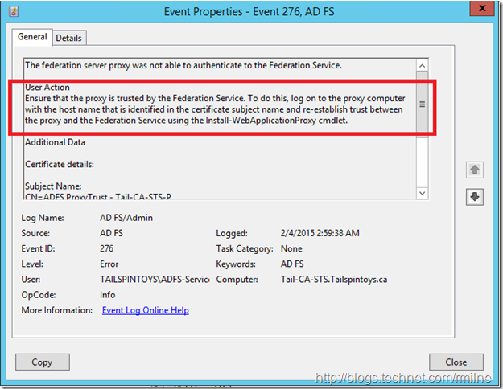


---

## Fix #1: Old-School GUI

1. **Reg tweak**  
   ```
   HKLM\Software\Microsoft\ADFS\ProxyConfigurationStatus
   ```
   Flip the DWORD from `2` → `1`.

2. **Re-open** Remote Access Management (no reboot required).

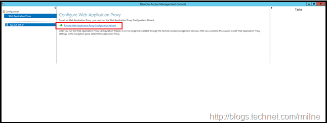

3. **Run the wizard** again:  
   - Federation Service name: `adfs.tailspintoys.ca` (or yours).  
   - Pick the right SSL cert (thumbprint check!).  
   - Click through the screens—peek at the PowerShell if you’re curious.

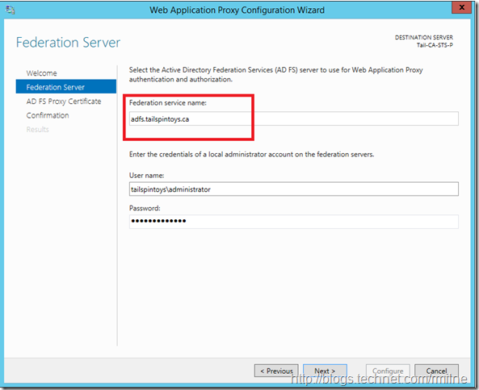

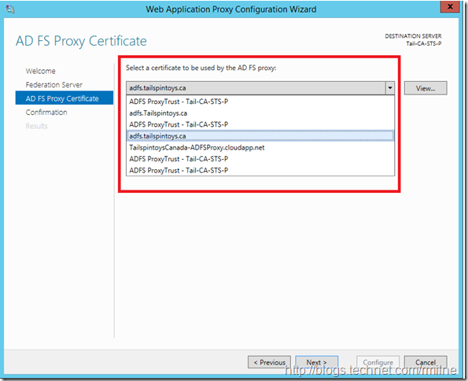

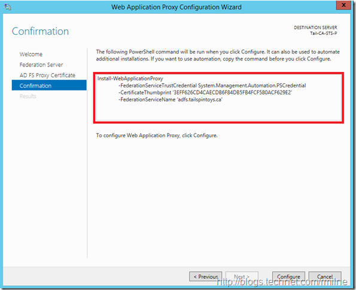

4. **Restart ADFS** on the proxy:
   ```powershell
   Restart-Service adfssrv
   ```

Trust is now re-established.

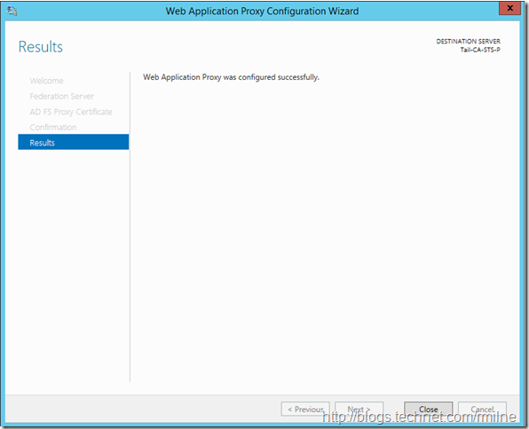

---

## Fix #2: PowerShell Magic

For CLI aficionados:

```powershell
$thumb = "YOUR_CERT_THUMBPRINT"
$fsn   = "adfs.tailspintoys.ca"

Install-WebApplicationProxy `
  -CertificateThumbprint $thumb `
  -FederationServiceName $fsn
```

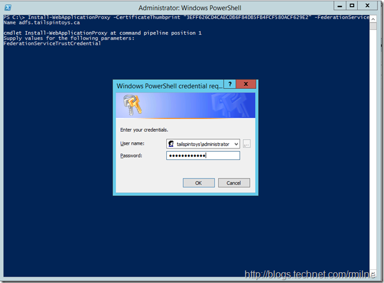

Enter your AD FS admin credentials when prompted and wait for completion. Expected result: **Deployment Succeeded**.


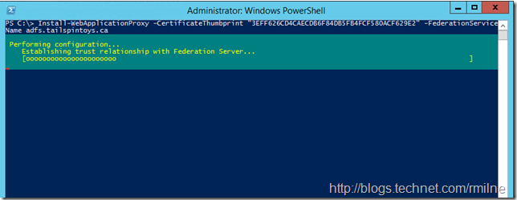

---

## Did It Work?

- **Proxy logs**: Event ID 245 confirms configuration retrieval.  
- **ADFS logs**: Event ID 396 confirms trust renewal.

Users can now authenticate from the Internet again.

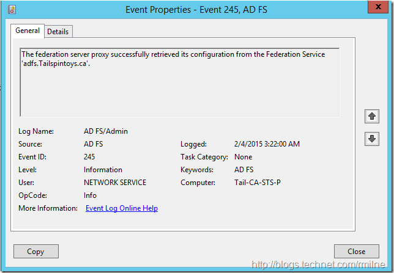

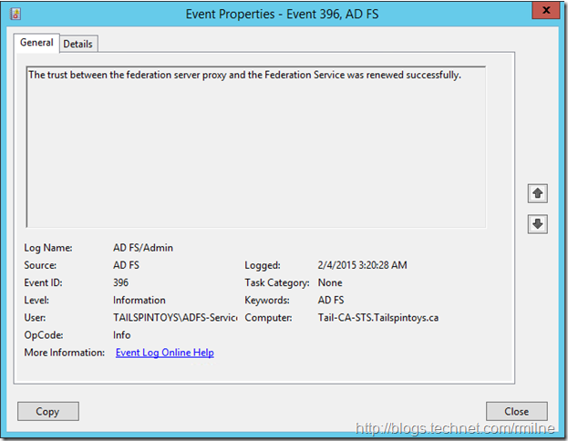
---

## Sources

- https://blogs.technet.microsoft.com/rmilne/2015/04/20/adfs-2012-r2-web-application-proxy-re-establish-proxy-trust/
