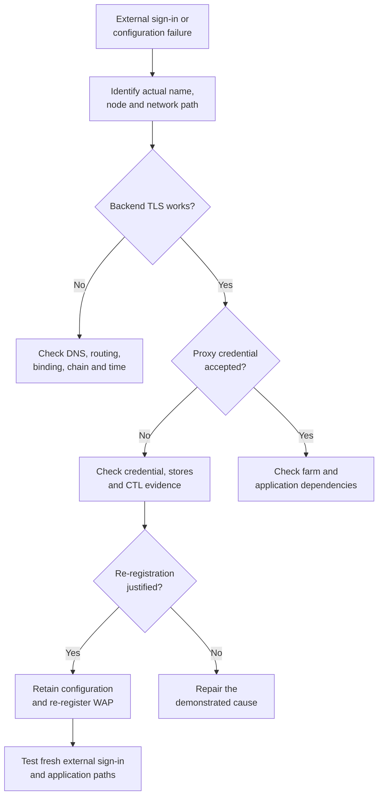

# Troubleshooting WAP Trust to AD FS: TLS, Proxy Certificates, CTLs and Farm Nodes

**A proxy-trust error describes a failed relationship, not automatically the certificate or command that will repair it.**

The original case in this article involved an expired WAP proxy-authentication certificate on Windows Server 2012 R2. Re-registration repaired that case. The diagnostic method below also separates backend TLS failures, certificate trust-list issues and farm-node dependencies, so that the historical recovery does not become a default response to every external sign-in failure.

> **TL;DR**
> - The WAP TLS certificate and its generated proxy-trust certificate are different credentials.
> - Establish DNS, time, TLS and the actual node reached before changing registration.
> - A CTL/store/binding issue is not fixed by indiscriminately trusting more certificates.
> - In a WID farm, compare the primary/secondary configuration roles and the failing inter-node authentication path; a successful test against one node does not validate all nodes.
> - Re-register only after retaining the configuration and identifying a recovery need. Verify external authentication and the published applications afterward.

## 1. Identify the failed boundary


```mermaid
flowchart TD
  Failure[External sign-in or<br/>configuration failure] --> Route[Identify actual name,<br/>node and network path]
  Route --> TLS{Backend TLS works?}
  TLS -->|No| Transport[Check DNS, routing,<br/>binding, chain and time]
  TLS -->|Yes| Trust{Proxy credential<br/>accepted?}
  Trust -->|No| Credential[Check credential, stores<br/>and CTL evidence]
  Trust -->|Yes| Farm[Check farm and<br/>application dependencies]
  Credential --> Decision{Re-registration<br/>justified?}
  Decision -->|Yes| Repair[Retain configuration<br/>and re-register WAP]
  Decision -->|No| Diagnose[Repair the<br/>demonstrated cause]
  Repair --> Verify[Test fresh external sign-in<br/>and application paths]
```

| Evidence | What it suggests | What it does not prove |
|---|---|---|
| TLS chain/name/handshake failure | Transport authentication is failing | The proxy-trust credential is expired |
| Configuration retrieval returns 401 | The request is not accepted at that point | Every 401 has the same cause; an initial challenge can be part of registration |
| Event explicitly identifies an expired proxy-trust certificate | A concrete credential validity problem | Renewal will remain healthy after the underlying connectivity issue is ignored |
| One AD FS node works and another does not | A node/path-specific difference | Permanently targeting the working node is a complete repair |
| Only one published application fails | Application publication, backend or policy problem | The entire WAP registration must be reset |

For the architecture, use [Web Application Proxy explained](../Concepts/Web%20Application%20Proxy%20Explained%20-%20AD%20FS%20Proxy,%20Preauthentication%20and%20Application%20Publishing.md). For user certificates, use the [separate certificate-authentication guide](AD%20FS%20User%20Certificate%20Authentication%20through%20WAP%20-%20Flow,%20Prerequisites%20and%20Troubleshooting.md). A user certificate not appearing in a browser picker is not, by itself, a proxy-trust fault.

## 2. Preserve the evidence and existing configuration

Record the WAP and AD FS versions, affected nodes, federation-service hostname, load-balancer path, time of the failure and relevant event messages. Include any recent TLS renewal, account/SPN change, patching or network/proxy change.

On the affected WAP, use an elevated Windows PowerShell 5.1 session. Keep the resulting objects in the administration record, not in a public ticket or screenshot:

```powershell
Import-Module WebApplicationProxy -ErrorAction Stop

$wapConfiguration = Get-WebApplicationProxyConfiguration -ErrorAction Stop
$publishedApplications = @(Get-WebApplicationProxyApplication -ErrorAction Stop)
$wapTlsBindings = Get-WebApplicationProxySslCertificate -ErrorAction Stop

$publishedApplications |
  Select-Object Name, ID, ExternalUrl, BackendServerUrl, ExternalPreauthentication
$wapTlsBindings
```

Retain those configuration objects and the complete publication definitions using the organization's backup/export process before a change. A displayed five-column inventory is a comparison aid, not a complete restorable backup. If configuration retrieval is broken, recover the last known-good record or obtain the available evidence from a healthy management path; do not substitute an empty array and call the configuration preserved.

The registration TLS thumbprint is the certificate WAP presents to clients for the federation service. It is not the generated `ADFS ProxyTrust` credential, the token-signing certificate or whichever certificate has the latest expiration date.

## 3. Establish the real DNS, TLS and time path

On WAP, confirm that the federation-service name resolves to the intended internal AD FS path, not back to the public WAP endpoint or an unrelated proxy. Examine load-balancer routing and any configured forward proxy. An administrator's browser connection can differ from the service's connection.

```powershell
$federationServiceName = 'fs.corp.example'
Resolve-DnsName -Name $federationServiceName -ErrorAction Stop
Test-NetConnection -ComputerName $federationServiceName -Port 443 -InformationLevel Detailed

netsh winhttp show proxy
if ($LASTEXITCODE -ne 0) {
  throw 'Unable to inspect WinHTTP proxy settings.'
}
```

This is not a complete TLS or proxy-configuration test. `Install-WebApplicationProxy` also exposes a federation-specific `ForwardProxy` setting, and the documented setting does not apply to application publishing. Record the relevant settings and actual connection path rather than assuming one successful browser request covers all of them.

On the relevant TLS-serving node, inspect the actual bindings:

```powershell
netsh http show sslcert
if ($LASTEXITCODE -ne 0) {
  throw 'Unable to inspect HTTP.sys TLS bindings.'
}
```

Compare the hostname/port, certificate hash and store against the intended configuration. On AD FS, the **Service Communications** record is not the source of truth for HTTP.sys bindings. If it was deliberately configured with the same certificate, matching thumbprints may be expected; that is not a universal equivalence to enforce across every role and node.

Check the requested TLS name, chain, private-key access, negotiated protocol and clock accuracy. Inspect every relevant farm member. Do not replace HTTPS names with IP URLs, ignore certificate validation or install an interception root to make the failure disappear. Use the [TLS replacement procedure](../How-to/ADFS%20and%20WAP%20-%20Replace%20SSL%20Certificate.md) when the demonstrated problem is a TLS renewal/binding mismatch.

## 4. Distinguish CTL filtering from chain trust

Historical Windows Server 2012 R2 investigations describe proxy-trust failures involving the HTTP.sys client-certificate configuration and the `AdfsTrustedDevices` store. A certificate trust list (CTL) and acceptable-issuer information help determine which client certificates are offered or accepted along a particular path. They are not interchangeable with the HTTPS server certificate.


*Historical store view, cropped to the relevant console area. It illustrates a named store, not a universal store layout, required number of entries or instruction to delete similarly named certificates.*

The useful diagnostic questions are:

1. Which listener and node actually receive the failing request?
2. Which certificate does that WAP present in its runtime security context?
3. Does the server recognize the registered proxy credential, and is it still valid?
4. Are the relevant store and binding settings consistent with the installed version and a known-good equivalent node?
5. Are the actual chain, revocation and client-certificate errors consistent with the proposed cause?

```text
HTTPS server identity       -> WAP trusts the AD FS TLS endpoint
Registered proxy identity   -> AD FS accepts this WAP's proxy credential
Certificate-list filtering  -> influences the applicable client-cert path
Application/user identity   -> evaluated later for the requested operation
```

A missing issuer list in a trace is not automatically a corrupt CTL: Schannel does not send its trusted issuer list by default on modern Windows. Compare the effective endpoint behavior and certificate-validation result. Do not create a store or force `SendTrustedIssuerList`/`ClientAuthTrustMode` values solely because a 2012 R2 example contains them.

Check for misplaced intermediate certificates and unintended trust anchors. However, **`Subject` equal to `Issuer` does not cryptographically prove self-signature**, and the reverse comparison is not a deletion rule. Do not automate certificate removal based on that text comparison, or insert an unverified certificate into Trusted Root to suppress a chain error.

There is no generic `netsh delete sslcert`, root-store cleanup or CTL-rebuild command in this guide. A proven inconsistency should be repaired through the version-appropriate supported configuration, with the before-state retained and the same test repeated afterward.

## 5. If behavior differs by AD FS farm node

In a WID farm, the primary holds the read/write configuration database and secondary servers maintain read-only replicas. Those are configuration-store roles, not a rule that all user sign-ins must always use the primary. SQL farms use a different configuration-store topology; do not invent a WID primary for them.

On the AD FS nodes in a confirmed WID deployment:

```powershell
Import-Module ADFS -ErrorAction Stop
Get-AdfsSyncProperties -ErrorAction Stop

Get-CimInstance -ClassName Win32_Service -Filter "Name = 'adfssrv'" -ErrorAction Stop |
  Select-Object Name, StartName, State
```

If establishing or renewing trust works via one node but fails via a secondary, compare the actual management/configuration path, synchronization health, service identity, TLS configuration and inter-node authentication events. A request can introduce a second authentication hop that the successful single-node test did not exercise.

Keep these relationships separate:

- WAP authenticating to the federation service using its proxy credential.
- AD FS nodes reaching configuration or directory services using their own service context.
- A user authenticating to AD FS.
- WAP using KCD for a separately published application.

A workgroup WAP does not mean that Kerberos can never be involved anywhere behind it. Equally, a secondary-node failure is not proof that Kerberos or an SPN is the cause. Require the corresponding AD FS/DC evidence.

Where Kerberos evidence points to the federation-service identity, query the relevant SPNs from an AD administration host in the appropriate forest:

```powershell
$federationServiceName = 'fs.corp.example'
foreach ($servicePrincipalName in @(
  "HOST/$federationServiceName",
  "HTTP/$federationServiceName"
)) {
  & setspn.exe -F -Q $servicePrincipalName
  [pscustomobject]@{
    QueriedSPN = $servicePrincipalName
    QueryExitCode = $LASTEXITCODE
  }
}
```

Read the output and exit code together; distinguish an absent explicit registration from a failed query. Confirm the correct forest and actual account owner. An explicit HTTP SPN assigned to an unrelated account can interfere with the expected service identity, even where a HOST mapping would otherwise apply. Do not blindly delete HTTP SPNs or register duplicates: determine who serves the name and which other consumers depend on it first.

A temporary node-specific routing test can discriminate a node problem, but preserve the federation hostname, SNI and TLS validation. Restore the normal route after the test. Permanently pinning WAP to the primary can conceal the fault and create a new availability dependency.

## 6. Re-register only after the cause and before-state are understood

Re-registration is a configuration change on the affected WAP. It can be appropriate when the proxy credential has expired or the trust really must be re-established; it does not repair a failed backend TLS handshake, an unhealthy farm or an incorrect client-certificate mapping.

Before proceeding, retain the actual configuration/publication definitions and confirm:

- The correct federation service name and reachable farm.
- A suitable local-computer Personal-store TLS certificate, with private key, names/SANs, validity and chain reviewed.
- Local administrative rights on WAP and an identity with the required AD FS proxy-registration rights.
- The current listener ports and forward-proxy requirements. Do not substitute the example defaults for an alternate/custom configuration.
- A recovery path using the retained configuration. Re-registration is not a reversible toggle with a universal undo command.

`Install-WebApplicationProxy` does not document native `-WhatIf` support. This wrapper adds a **no-change preview and confirmation boundary** around that cmdlet. It checks only the local certificate's identity, key flag and dates; it does not certify its SANs, chain, service-key access or network compatibility.

```powershell
function Register-ReviewedWapTrust {
  [CmdletBinding(SupportsShouldProcess, ConfirmImpact = 'High')]
  param(
    [Parameter(Mandatory)][string]$FederationServiceName,
    [Parameter(Mandatory)][string]$CertificateThumbprint,
    [Parameter(Mandatory)][ValidateRange(1, 65535)][int]$HttpsPort,
    [Parameter(Mandatory)][ValidateRange(1, 65535)][int]$TlsClientPort,
    [Parameter(Mandatory)][AllowEmptyString()][string]$ForwardProxy,
    [switch]$ConfigurationRetained
  )

  if (-not $ConfigurationRetained) {
    throw 'Retain and review the existing configuration before registration.'
  }
  if ([uri]::CheckHostName($FederationServiceName) -ne [UriHostNameType]::Dns) {
    throw 'Use the reviewed federation-service DNS name, not a URL or IP address.'
  }

  $thumbprint = ($CertificateThumbprint -replace '\s', '').ToUpperInvariant()
  if ($thumbprint -notmatch '^[0-9A-F]{40}$') {
    throw 'The certificate thumbprint must contain 40 hexadecimal characters.'
  }

  $certificate = Get-Item -LiteralPath "Cert:\LocalMachine\My\$thumbprint" -ErrorAction Stop
  if ($certificate.Thumbprint -ne $thumbprint -or
    $certificate.HasPrivateKey -isnot [bool] -or -not $certificate.HasPrivateKey) {
    throw 'The reviewed local TLS certificate and its private key are required.'
  }
  if ($certificate.NotBefore -isnot [datetime] -or $certificate.NotAfter -isnot [datetime]) {
    throw 'Certificate validity dates are unavailable.'
  }
  $nowUtc = [datetime]::UtcNow
  if ($nowUtc -lt $certificate.NotBefore.ToUniversalTime() -or
    $nowUtc -ge $certificate.NotAfter.ToUniversalTime()) {
    throw 'The reviewed TLS certificate is outside its validity period.'
  }

  $parameters = @{
    FederationServiceName = $FederationServiceName
    CertificateThumbprint = $thumbprint
    HttpsPort = $HttpsPort
    TlsClientPort = $TlsClientPort
    ErrorAction = 'Stop'
  }
  if (-not [string]::IsNullOrWhiteSpace($ForwardProxy)) {
    $parameters.ForwardProxy = $ForwardProxy
  }

  if ($PSCmdlet.ShouldProcess($FederationServiceName, 'Re-register this local WAP using the reviewed configuration')) {
    $credential = Get-Credential -Message 'Identity authorized to register this WAP with AD FS'
    if ($null -eq $credential) {
      throw 'No registration credential was supplied.'
    }
    $parameters.FederationServiceTrustCredential = $credential
    Install-WebApplicationProxy @parameters
  }
}
```

Use the recorded values. The following example explicitly represents default listener ports and no forward proxy; it is not the correct input for every installation:

```powershell
$reviewedRegistration = @{
  FederationServiceName = 'fs.corp.example'
  CertificateThumbprint = Read-Host 'Reviewed local WAP TLS certificate thumbprint'
  HttpsPort = 443
  TlsClientPort = 49443
  ForwardProxy = ''
  ConfigurationRetained = $true
}

Register-ReviewedWapTrust @reviewedRegistration -WhatIf
```

The preview still reads the local certificate, but does not prompt for registration credentials or call `Install-WebApplicationProxy`. It is **not** a simulation of successful remote registration. After reviewing the intended operation and prerequisites, invoke the same wrapper without `-WhatIf` and respond to its confirmation to perform the actual change. Keep credentials out of scripts, transcripts and screenshots.

## 7. Verify recovery beyond the command result

Compare the published application inventory to the retained before-state. Confirm that WAP retrieves configuration from the intended federation service, that new trust-renewal errors stop, and that normal load-balanced paths work.

```powershell
Get-WebApplicationProxyApplication -ErrorAction Stop |
  Sort-Object Name |
  Select-Object Name, ID, ExternalUrl, BackendServerUrl, ExternalPreauthentication
```

Require a fresh external authentication and the relevant application tests: claims-based publication, KCD and user certificate authentication where deployed. A previous browser session, an anonymous metadata response or a successful registration return value cannot establish all of those results.

If recovery fails, preserve the new evidence and compare it with the retained state. Correct the demonstrated TLS/credential/farm issue rather than repeatedly registering against different nodes or broadening trust. Restoring TLS bindings or publication definitions is a separate operation, not an automatic reversal of proxy registration.

## 8. Historical 2012 R2 case and captures

The following images are retained from the original public lab described by Rhoderick Milne. Names, dates and thumbprints belong to that historical example. They illustrate the evidence and wizard surfaces, not values to reuse or a required workflow on every Windows Server version.

### Failure evidence

The console reported `0x8007520C`, and event 422 recorded failure to retrieve proxy configuration. The detailed message matters; that event alone does not identify certificate expiry.


The expiry message in event 394 and the authentication/trust failure in event 276 supplied the stronger evidence in this case. Correlate each event's actual machine, provider and time; the provider name alone does not tell you which role the computer performs.


### Wizard surfaces, not a universal registry repair

The original 2012 R2 lab used `HKLM\Software\Microsoft\ADFS\ProxyConfigurationStatus` to make the old wizard available again. That changed a setup-state flag; it was not the underlying certificate diagnosis. This revised guide does not prescribe editing it or blindly restarting a service as the current repair method.


### Command completion and subsequent evidence

The original unwrapped command prompted for the required credential, then completed registration. The guarded example above deliberately delays that prompt until after confirmation. No password is included in either the current example or the retained masked historical credential dialog.


Events 245 and 396 then recorded successful configuration retrieval and trust renewal in that lab. Use the messages as evidence for those operations, and separately verify the user's external authentication and application access.


The [existing WAP registration deep dive](Deep%20dive%20into%20ADFS%20and%20WAP%20during%20registration.md) provides historical protocol context. Its interception setup is not required to run the diagnostic sequence here.

## References

- [Microsoft Learn: Install-WebApplicationProxy](https://learn.microsoft.com/en-us/powershell/module/webapplicationproxy/install-webapplicationproxy?view=windowsserver2025-ps)
- [Microsoft Learn: Get-AdfsSyncProperties](https://learn.microsoft.com/en-us/powershell/module/adfs/get-adfssyncproperties?view=windowsserver2025-ps)
- [Microsoft Learn: AD FS certificate troubleshooting](https://learn.microsoft.com/en-us/windows-server/identity/ad-fs/troubleshooting/ad-fs-tshoot-certs)
- [Microsoft Learn: Schannel TLS settings and trusted issuer lists](https://learn.microsoft.com/en-us/windows-server/security/tls/tls-registry-settings)
- [Microsoft Learn: AD FS requirements for proxy TLS, service identity and network paths](https://learn.microsoft.com/en-us/windows-server/identity/ad-fs/overview/ad-fs-requirements)
- [Microsoft Learn: Federation server farm using WID](https://learn.microsoft.com/en-us/windows-server/identity/ad-fs/design/federation-server-farm-using-wid), including the historical primary/secondary configuration roles.
- [Microsoft Learn: AD FS requirements](https://learn.microsoft.com/en-us/windows-server/identity/ad-fs/design/ad-fs-requirements), legacy baseline for the service identity and network model; not a current browser/OS support matrix.
- [Rhoderick Milne: AD FS 2012 R2 proxy trust recovery](https://blog.rmilne.ca/2015/04/20/adfs-2012-r2-web-application-proxy-re-establish-proxy-trust/), original historical case and screenshots.
