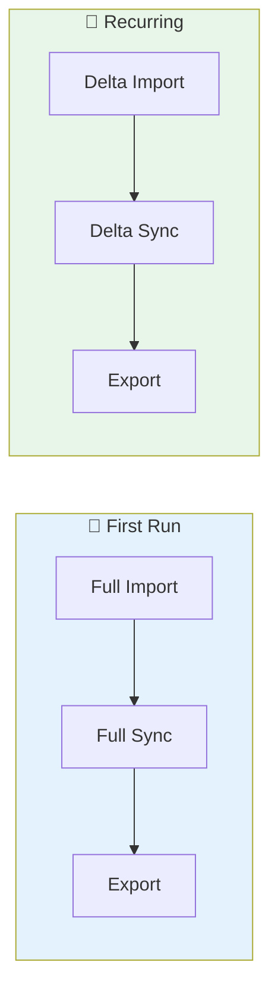

# Configure an Active Directory Management Agent in MIM Sync

The **Active Directory Domain Services (AD DS) Management Agent** is the most common connector you'll configure in MIM Sync. It connects MIM to your Active Directory forest to import, synchronize, and export identity data (users, groups, contacts, etc.).

This guide walks you through every step — from creating the service account to running your first sync. 🚀

---

## 🗺️ Overview


---

## 🔑 Step 1 — Prepare the Service Account

The AD MA needs an Active Directory account to connect to the forest. **Do not use the MIM Sync service account** — create a dedicated one.

### Create the Account

```powershell
Import-Module ActiveDirectory
$sp = ConvertTo-SecureString "YourStrongPassword!" -AsPlainText -Force

New-ADUser -SamAccountName "svc-MIM-AD" `
    -Name "svc-MIM-AD" `
    -Description "MIM Sync - AD Management Agent connector account" `
    -Enabled $true `
    -PasswordNeverExpires $true

Set-ADAccountPassword -Identity "svc-MIM-AD" -NewPassword $sp
```

### Grant AD Permissions

The permissions you need depend on what MIM will do:

| Scenario | Permissions Required |
|---|---|
| **Read-only import** (most common start) | Read access on target OUs |
| **Full Import + Delta Import** | Read + `Replicate Directory Changes` (on the domain root) |
| **Export (create/modify/delete objects)** | Write access on target OUs |
| **Password management (PCNS/SSPR)** | `Reset Password` + `Write lockoutTime` on target OUs |

#### Grant Replicate Directory Changes (for Delta Import)

Delta Import uses the AD DirSync control, which requires `Replicate Directory Changes` at the **domain** level:

```powershell
# Grant Replicate Directory Changes on the domain root
$domain = Get-ADDomain
$acl = Get-Acl "AD:\$($domain.DistinguishedName)"

$sid = (Get-ADUser "svc-MIM-AD").SID
$guid = [GUID]::Empty  # All properties

# Replicate Directory Changes = 1131f6aa-9c07-11d1-f79f-00c04fc2dcd2
$ace = New-Object System.DirectoryServices.ActiveDirectoryAccessRule(
    $sid,
    [System.DirectoryServices.ActiveDirectoryRights]::ExtendedRight,
    [System.Security.AccessControl.AccessControlType]::Allow,
    [GUID]"1131f6aa-9c07-11d1-f79f-00c04fc2dcd2"
)
$acl.AddAccessRule($ace)
Set-Acl "AD:\$($domain.DistinguishedName)" $acl
```

> ⚠️ `Replicate Directory Changes` is **not** the same as `Replicate Directory Changes All` (which lets you read passwords/secrets). You only need the basic one.

#### Grant Read/Write on Target OUs (GUI Method)

1. Open **Active Directory Users and Computers** → View → **Advanced Features**
2. Right-click the target OU → **Properties** → **Security** tab
3. Add `svc-MIM-AD` and grant:
   - ✅ Read (for Import)
   - ✅ Write (for Export — create/modify objects)
   - ✅ Create/Delete User objects (if provisioning)
   - ✅ Create/Delete Group objects (if provisioning groups)

---

## 🔧 Step 2 — Create the Management Agent

1. Open **Synchronization Service Manager** (`miisclient.exe`)
2. Go to the **Management Agents** tab
3. Click **Actions** → **Create**

The **Management Agent Designer** wizard opens.

### Select the MA Type

| Field | Value |
|---|---|
| Management agent for | **Active Directory Domain Services** |
| Name | Something descriptive, e.g., `MA-AD-CONTOSO` |

> 💡 **Naming convention tip:** Use a prefix like `MA-AD-` or `MA-LDAP-` to quickly identify the MA type in your console. Include the domain/forest name if you manage multiple forests.

---

## 🌐 Step 3 — Configure Connectivity

This is where you tell MIM how to connect to your AD forest.

| Field | Value | Notes |
|---|---|---|
| **Forest name** | `contoso.com` | FQDN of the AD forest |
| **User name** | `svc-MIM-AD` | The connector account |
| **Password** | `••••••••` | |
| **Domain** | `CONTOSO` | NetBIOS domain name |

### Sign and Encrypt Options

| Option | When to use |
|---|---|
| **Sign** | Default — validates data integrity |
| **Sign and Encrypt** | Recommended in production — encrypts LDAP traffic |
| **SSL** | Use if the domain controllers have LDAPS certificates (port 636) |

> 🔒 In a production environment, prefer **Sign and Encrypt** or **SSL (LDAPS)** to avoid sending credentials and data in clear text over the network.

---

## 📂 Step 4 — Configure Partitions and Containers

### Select Partitions

MIM shows all directory partitions in the forest:

| Partition | Include? |
|---|---|
| `DC=contoso,DC=com` | ✅ Yes — this is your main domain partition |
| `CN=Configuration,DC=contoso,DC=com` | ❌ Usually no (unless you sync site info) |
| `CN=Schema,DC=contoso,DC=com` | ❌ No |
| `DC=DomainDnsZones,...` | ❌ No |
| `DC=ForestDnsZones,...` | ❌ No |

### Select Containers (OUs)

Click **Containers...** on the selected partition to choose which OUs to include:

```
☑ DC=contoso,DC=com
  ☑ OU=Users
  ☑ OU=Groups
  ☑ OU=Service Accounts
  ☐ OU=Workstations        ← exclude if not needed
  ☐ OU=Servers              ← exclude if not needed
  ☐ CN=Builtin              ← always exclude
  ☐ CN=ForeignSecurityPrincipals
```

> 💡 **Less is more.** Only select the OUs you actually need. Importing the entire domain including `CN=Builtin`, computer accounts, and system containers will bloat your connector space with objects you'll never sync.

### Preferred Domain Controllers

| Option | Description |
|---|---|
| **Any domain controller** | MIM auto-discovers via DNS (default) |
| **Only use the following...** | Pin to specific DCs — useful for network segmentation or to avoid WAN replication delays |

> ⚠️ If you pin to a specific DC, make sure it's reachable and you have a fallback plan if it goes down.

---

## 📦 Step 5 — Select Object Types

Choose which AD object types to import:

| Object Type | Typical Use |
|---|---|
| ✅ `user` | Always — your main identity objects |
| ✅ `group` | If you manage group memberships |
| ✅ `contact` | If you sync mail contacts |
| ☐ `computer` | Usually not needed for identity management |
| ☐ `inetOrgPerson` | Only if your AD uses inetOrgPerson instead of user |
| ☐ `organizationalUnit` | Rarely needed |
| ✅ `container` | Needed if you reference containers in sync rules |

> 💡 You can always come back and add more object types later. Start with what you need.

---

## 📋 Step 6 — Select Attributes

Select the attributes you want to import into the connector space. Common selections:

### For Users

| Attribute | Purpose |
|---|---|
| `sAMAccountName` | Logon name |
| `userPrincipalName` | UPN |
| `displayName` | Display name |
| `givenName`, `sn` | First/Last name |
| `mail` | Email address |
| `manager` | Manager reference (DN) |
| `memberOf` | Group membership (back-link) |
| `objectSid` | SID — often used as anchor |
| `objectGUID` | GUID — can be used as anchor |
| `employeeID` | HR identifier (if populated) |
| `userAccountControl` | Account status (enabled/disabled) |
| `pwdLastSet` | Password age |
| `accountExpires` | Expiration date |
| `distinguishedName` | Full DN |
| `cn` | Common name |

### For Groups

| Attribute | Purpose |
|---|---|
| `sAMAccountName` | Group name |
| `displayName` | Display name |
| `member` | Group members (multi-valued DN) |
| `groupType` | Security/Distribution, scope |
| `mail` | If mail-enabled |
| `description` | Group description |
| `managedBy` | Group owner |

> ⚠️ **Select only what you need.** Every attribute you import takes space in the connector space and SQL database. Importing all 400+ AD attributes "just in case" is a bad idea.

> 💡 You can always add attributes later by editing the MA properties. MIM will import them on the next Full Import.

---

## 🔗 Step 7 — Configure Anchor

The anchor uniquely identifies each object in the connector space. For AD, the default is:

| Object Type | Default Anchor | Recommended |
|---|---|---|
| `user` | `objectGUID` | ✅ Keep it — GUIDs are immutable |
| `group` | `objectGUID` | ✅ Keep it |
| `contact` | `objectGUID` | ✅ Keep it |

> 🚨 **Never change the anchor after the first Full Import.** Changing it forces you to drop and recreate the connector space — losing all pending exports and connector space state.

---

## 🔍 Step 8 — Connector Filter (Optional)

Connector filters let you **exclude** specific objects from the connector space based on attribute values. Objects matching a filter are "filtered" and won't participate in synchronization.

### Common Filter Examples

**Exclude disabled user accounts:**

| Attribute | Operator | Value |
|---|---|---|
| `userAccountControl` | Bit on equals | `2` |

**Exclude service accounts by naming convention:**

| Attribute | Operator | Value |
|---|---|---|
| `sAMAccountName` | Starts with | `svc-` |

> 💡 Connector filters are evaluated **after** import. The objects are still imported into the connector space but marked as "filtered disconnectors." If you want to avoid importing them entirely, use **container selection** (Step 4) instead.

---

## 🔗 Step 9 — Join and Projection Rules

These rules define how connector space objects relate to the metaverse.

### Projection Rules

Projection creates a **new** metaverse object when no match is found:

| Data Source Object Type | Metaverse Object Type |
|---|---|
| `user` | `person` |
| `group` | `group` |
| `contact` | `person` or `contact` |

> ⚠️ If this is your **first MA** (no metaverse objects exist yet), you'll typically configure projection so the first Full Sync creates metaverse objects. Subsequent MAs will use **join rules** to connect to these existing objects.

### Join Rules

Join rules match connector space objects to **existing** metaverse objects:

| CS Attribute | Direction | MV Attribute | Example |
|---|---|---|---|
| `employeeID` | → | `employeeID` | Match by HR ID |
| `sAMAccountName` | → | `accountName` | Match by login |
| `mail` | → | `mail` | Match by email |

> 💡 Join rules are evaluated in order. Put the most specific/reliable rule first (e.g., `employeeID` before `mail`).

---

## 📊 Step 10 — Attribute Flow (Import/Export)

Attribute flow defines how data moves between the connector space (CS) and the metaverse (MV).

### Import Attribute Flow (CS → MV)

| CS Attribute | Flow Type | MV Attribute | Notes |
|---|---|---|---|
| `sAMAccountName` | Direct | `accountName` | |
| `displayName` | Direct | `displayName` | |
| `givenName` | Direct | `firstName` | |
| `sn` | Direct | `lastName` | |
| `mail` | Direct | `mail` | |
| `userPrincipalName` | Direct | `userPrincipalName` | |
| `manager` | Direct (Reference) | `manager` | Use Reference mapping type! |
| `member` | Direct (Reference) | `member` | Multi-valued reference |

### Export Attribute Flow (MV → CS)

Only configure export flows if MIM needs to **write back** to AD:

| MV Attribute | Flow Type | CS Attribute | Example Use Case |
|---|---|---|---|
| `displayName` | Direct | `displayName` | HR system is authoritative |
| `mail` | Direct | `mail` | Provisioning email from HR |
| `accountName` | Expression | `sAMAccountName` | Auto-generate from name |

### Flow Types

| Type | Description |
|---|---|
| **Direct** | 1:1 mapping — CS attribute maps directly to MV attribute |
| **Expression** | Use a rules extension (C#/VB.NET) or advanced expression |
| **Constant** | Always set a fixed value |
| **DN Reference** | For attributes that contain Distinguished Names (manager, member) |

> ⚠️ **Precedence matters!** If multiple MAs flow the same attribute to the metaverse, MIM uses precedence rules. The MA with the **lowest rank number** wins. Set your authoritative source (e.g., HR) to the lowest rank.

---

## 🚫 Step 11 — Deprovisioning

What happens when an object is deleted from AD (disconnected from the metaverse)?

| Option | Behavior |
|---|---|
| **Make them disconnectors** | Object stays in metaverse, just disconnected from this MA |
| **Make them explicit disconnectors** | Same, but won't auto-rejoin |
| **Stage a delete on the object** | Deletes the metaverse object (use with caution!) |

> 💡 For most deployments, **"Make them disconnectors"** is the safe default. Only use "Stage a delete" if this MA is the **sole authority** for those objects.

---

## ▶️ Step 12 — Configure Run Profiles

Run profiles define the operations you can execute on the MA. You need to create them after the MA wizard finishes.

1. Right-click the MA → **Configure Run Profiles...**
2. Click **New Profile** for each:

### Essential Run Profiles

| Profile Name | Step Type | Description |
|---|---|---|
| `Full Import` | Full Import (Stage Only) | Reads ALL objects from AD into the connector space |
| `Delta Import` | Delta Import (Stage Only) | Reads only changes since last import (uses DirSync cookie) |
| `Full Sync` | Full Synchronization | Applies sync rules to ALL connector space objects |
| `Delta Sync` | Delta Synchronization | Applies sync rules only to changed objects |
| `Export` | Export | Pushes pending changes from connector space to AD |



### Configure Each Profile

For each profile:
1. Click **New Profile** → enter the name
2. Click **Add Step** → select the step type
3. Select the **partition** (e.g., `DC=contoso,DC=com`)
4. Leave drop file/log options as default
5. Click **Finish**

---

## ✅ Step 13 — First Run & Validation

### Recommended First Run Sequence

```
1. Full Import    → imports all objects from AD into the connector space
2. Full Sync      → evaluates sync rules, creates metaverse objects (via projection)
3. Export          → only if you have export flows configured
```

### Run the Full Import

1. Select the MA in the Management Agents tab
2. Click **Actions** → **Run**
3. Select **Full Import** → click **OK**

### Validate the Import

After the run completes, check the **Operations** tab:

| What to check | Where | Expected |
|---|---|---|
| Run status | Operations tab | `success` |
| Adds | Run statistics | Should match the number of objects in your selected OUs |
| Errors | Run statistics | Should be `0` |

Click the run to see detailed statistics:

| Counter | Meaning |
|---|---|
| **Adds** | New objects imported |
| **Updates** | Modified objects (0 on first run) |
| **Deletes** | Deleted objects (0 on first run) |
| **Filtered** | Objects matching connector filters |
| **No Change** | Already up-to-date (0 on first run) |

### Inspect the Connector Space

1. Right-click the MA → **Search Connector Space...**
2. Set scope to **Subtree** and search
3. Verify objects are there with correct attributes

### Run the Full Sync

1. Run **Full Sync** on the MA
2. Check the Operations tab for:
   - **Projections** — new metaverse objects created
   - **Joins** — connector space objects matched to existing MV objects
   - **Attribute flow updates** — values flowed to the metaverse

### Verify in Metaverse Search

1. Go to the **Metaverse Search** tab
2. Search for `person` objects
3. Open a few and verify the attributes look correct

---

## 🐛 Common Issues

| Problem | Cause | Fix |
|---|---|---|
| `stopped-server-down` | Can't reach a domain controller | Check DNS, network, firewall (port 389/636) |
| `stopped-credentials` | Wrong password or locked account | Reset password, unlock `svc-MIM-AD` |
| `no-start-ma` | Missing run profile | Create run profiles (Step 12) |
| Delta Import returns everything | Missing `Replicate Directory Changes` permission | Grant it on the domain root (Step 1) |
| Objects missing from import | Wrong OU selection | Edit MA → Partitions → check container selection |
| `extension-dll-exception` | Bug in your rules extension code | Check the extension DLL logs |
| Reference attributes not resolving | Forgot to use DN Reference flow type | Edit attribute flow, change mapping type to Reference |

---

## 💡 Best Practices

- 🔰 **Start with Full Import + Full Sync only** — don't configure export flows until you've validated the import data looks correct
- 📂 **Scope your OUs tightly** — don't import the entire domain if you only need 3 OUs
- 🔐 **One service account per MA** — never share accounts between MAs
- 📋 **Select only needed attributes** — less is more for performance and SQL storage
- 🔄 **Delta over Full** — after initial setup, always use Delta Import + Delta Sync for regular operations (much faster)
- 📊 **Monitor run history** — set up alerts for `stopped-*` errors in the Operations tab
- 📝 **Document your attribute flows** — export the MA config (`File → Export Management Agent`) and store it in version control
- 🔒 **Test export in a lab first** — never enable Export flows in production without testing in a lab environment

---

## 📚 References

- [Installing MIM Sync Service](Installing%20MIM%20Sync%20Service.md)
- [Deploying PCNS with MIM](Deploying%20PCNS%20with%20MIM.md) — if you need password synchronization
- [Change Passwords in MIM](Change%20Passwords%20in%20MIM.md)
- [MIM Sync Technical Reference](https://learn.microsoft.com/en-us/microsoft-identity-manager/reference/microsoft-identity-manager-2016-developer-reference)
