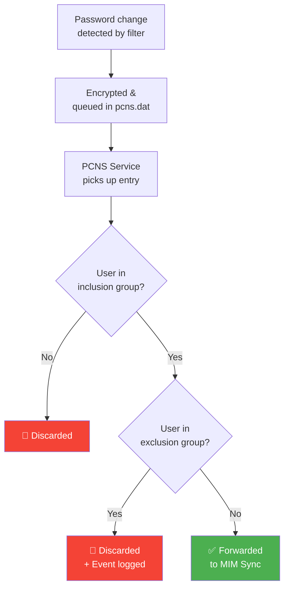
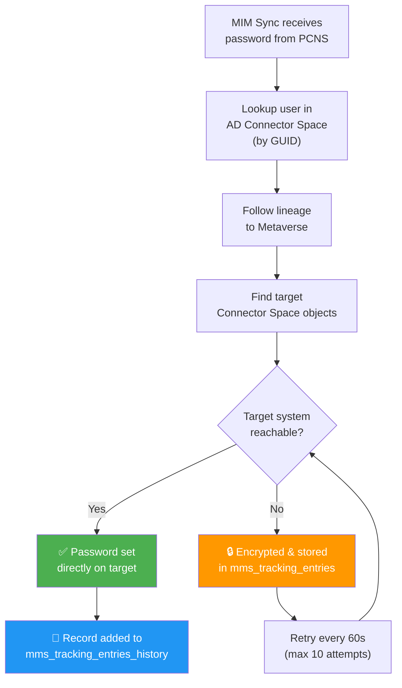

# Deploying Password Change Notification Service (PCNS) with MIM

Password synchronization is one of the most valuable features of Microsoft Identity Manager (MIM). At the heart of it sits **PCNS** — the Password Change Notification Service — a small but critical component that captures password changes on Active Directory domain controllers and forwards them to MIM for distribution to target systems.

This article covers everything you need to know: how it works under the hood, how to deploy it step by step, how to configure it, and how to troubleshoot it when things go sideways. 🔧

> **TL;DR** — PCNS is a password filter DLL + Windows service installed on every DC. It intercepts password changes, encrypts them, queues them locally, and sends them to MIM Sync over Kerberos-authenticated RPC. MIM then flows the password to target systems (AD forests, SQL, LDAP, etc.).

---

## 🔍 How PCNS Works — The Full Picture

Understanding the end-to-end flow is essential before diving into the deployment. Here's the big picture:

```mermaid
flowchart LR
    A["👤 User changes\npassword"] --> B["🛡️ Domain\nController"]
    B --> C["pcnsflt.dll\n(Password Filter)"]
    C --> D["pcns.dat\n(Encrypted Queue)"]
    D --> E["PCNSSVC\n(PCNS Service)"]
    E -->|"Kerberos RPC\n(TCP 135 + dynamic)"| F["🔄 MIM Sync\nServer"]
    F --> G["🎯 Target Systems\n(AD, SQL, LDAP...)"]

    style A fill:#4CAF50,color:#fff
    style B fill:#2196F3,color:#fff
    style C fill:#FF9800,color:#fff
    style D fill:#FF9800,color:#fff
    style E fill:#FF9800,color:#fff
    style F fill:#9C27B0,color:#fff
    style G fill:#f44336,color:#fff
```



Here's what happens when a user changes their password:

### Step 1 — Password Change in Active Directory

A password change can be initiated through multiple channels:

- 🖥️ The Windows `CTRL+ALT+DEL` interface
- 🌐 The MIM Portal (Self-Service Password Reset)
- 🛠️ Active Directory Users and Computers (ADUC)
- 📡 Any application using LDAP (via `System.DirectoryServices`, ADSI, etc.)

> **Note:** Active Directory only allows password changes over LDAP if the traffic is secured via **SSL/TLS** (requires X.509 certificates) or **Signed and Encrypted** (Kerberos/NTLM).

### Step 2 — Password Filter Intercepts the Password

On each domain controller running PCNS, a password filter DLL called `pcnsflt.dll` is registered. Here's what happens:

1. The DLL is installed under `%systemroot%\system32`
2. It's registered via the registry key: `HKLM\SYSTEM\CurrentControlSet\Control\LSA`
3. The **Local Security Authority (LSA)** calls this DLL when a password change is intercepted — **before** the password is hashed and written to the AD database

The DLL does three things — and only three things (by design, to minimize impact on the DC):

| Step | Action |
|---|---|
| 1️⃣ | Intercept the password change **before** it's hashed in AD |
| 2️⃣ | Encrypt the clear-text password using `CryptProtectData()` (DPAPI) — only the LSA process can decrypt it |
| 3️⃣ | Store the encrypted password + user GUID in a local queue file: `%systemroot%\system32\pcns\pcns.dat` |

> 🔒 The `pcns` folder ACLs only allow the **Local System** account to see the folder and read/write its contents. No one else can even see it.

### Step 3 — PCNS Service Reads the Queue

The **PCNS Windows service** (`PCNSSVC`) monitors the queue file using the OS file notification service. As soon as a new entry appears:

1. A thread starts in the **Local System** security context (same as LSA)
2. The password is decrypted using `CryptUnprotectData()` (DPAPI)
3. PCNS checks the **inclusion** and **exclusion** groups before forwarding:

| Check | Result |
|---|---|
| User is in the **inclusion group** | ✅ Password is forwarded |
| User is in the **exclusion group** | 🚫 Password is discarded from queue, event logged |
| User is not in inclusion group | 🚫 Password is not forwarded |

> ⚠️ **Security best practice:** Always add high-privileged accounts (Enterprise Admins, Domain Admins) to the exclusion group!

Here's the decision logic on each DC:



### Step 4 — PCNS Sends the Password to MIM

PCNS connects to MIM Sync using **Kerberos-authenticated RPC**:

1. PCNS presents the **SPN** (Service Principal Name) to Kerberos
2. Mutual authentication between PCNS and MIM is established
3. All subsequent RPC traffic is encrypted with the Kerberos session key
4. PCNS invokes a remote method on MIM to deliver the password

**If MIM is down:**
- An error is logged in the event log
- PCNS retries every **60 seconds** (configurable)
- All password changes are **queued** on the DC until MIM comes back
- A warning can be logged when the queue reaches a configured threshold

> 💡 The AD MA "Connect to Active Directory Forest" settings are **not used** for PCNS → MIM communication. PCNS initiates the connection itself.

### Step 5 — MIM Sync Processes the Password

When MIM receives the password notification:

1. Uses the **user GUID** to find the object in the AD connector space
2. Follows the **lineage** to the metaverse object
3. Follows the lineage again to find connector space objects for **all target MAs**
4. Flows the password to each target system

> ⚠️ Passwords are **never staged** in the connector space. If the target is reachable, the password goes directly. If not, it's encrypted and stored in the `mms_tracking_entries` table in the MIM Sync database for retry.

**Retry behavior:**
- **Maximum retry count**: 10 (default) — after which the entry is deleted
- **Retry interval**: 60 seconds (default)
- Encryption uses `CryptEncrypt()` with MIM's encryption key (tied to the MIM service account)

### Step 6 — MIM Flows the Password to Target Systems

On successful delivery, a record is added to `mms_tracking_entries_history` for audit purposes (user, target system, timestamp).



### 💡 What If MIM Fails Completely?

If the primary MIM server goes down permanently, you can configure a **warm standby server** and activate it using the `MIISactivate` tool — with **no loss of password changes**. The passwords remain queued on each DC until the standby server is activated.

For details, see: [MIISactivate: Server Activation Tool](https://learn.microsoft.com/en-us/previous-versions/mim/jj590194(v=ws.10))

---

## 📋 Prerequisites

Before starting the deployment, make sure you have:

| Requirement | Details |
|---|---|
| 🔑 Schema Admin permissions | Required to extend the AD schema (PCNS adds custom classes and attributes) |
| 🖥️ Access to all DCs | PCNS must be installed on **every** DC in the domain |
| 🔗 Network connectivity | DCs must reach the MIM Sync server (see port requirements below) |
| 👤 MIM Sync service account | Needed for SPN registration |
| 📦 PCNS MSI installer | `Password Change Notification Service.msi` (x64) |
| 🔄 Existing MAs synced | MAs for target data sources must be created and objects must be successfully joined/synced before enabling password sync |
| 👥 MIM security groups | `FIMSyncBrowse` and `FIMSyncPasswordSet` groups are created during MIM installation for password management operations |

### 🔌 Port Requirements

These ports must be open **FROM domain controllers TO the MIM Sync server**:

| Service | Protocol | Port |
|---|---|---|
| RPC Endpoint Mapper | TCP | 135 |
| Dynamic RPC Ports (PCNS) | TCP | 1024 – 5100 |
| Dynamic RPC Ports (AD MA) | TCP | 49152 – 65535 |

> ⚠️ **Documentation gap warning!** The older Microsoft docs mention ports 5000-5100 and 57500-57520. These are **outdated**. The correct ranges above were confirmed by Microsoft Consulting Services. Always verify with your firewall team.

---

## 🚀 Step-by-Step Deployment

### Step 1 — Extend the Active Directory Schema

This only needs to be done **once per forest**. Run the MSI with the `SCHEMAONLY=TRUE` flag from a machine with **Schema Admin** permissions:

```cmd
msiexec.exe /i "C:\PCNS\x64\Password Change Notification Service.msi" SCHEMAONLY=TRUE
```

This adds the following to the AD schema:

**Object Classes:**

| CN | OID |
|---|---|
| MS-MIIS-PCNS-Target | 1.2.840.113556.1.5.249 |
| MS-MIIS-PCNS-Service | 1.2.840.113556.1.5.250 |

**Attributes (selection):**

| CN | OID | Purpose |
|---|---|---|
| MS-MIIS-PCNS-TargetGUID | 1.2.840.113556.1.4.1895 | Target GUID |
| MS-MIIS-PCNS-TargetSPN | 1.2.840.113556.1.4.1896 | Target SPN |
| MS-MIIS-PCNS-TargetServer | 1.2.840.113556.1.4.1897 | Target server FQDN |
| MS-MIIS-PCNS-TargetDisabled | 1.2.840.113556.1.4.1901 | Target disabled flag |
| MS-MIIS-PCNS-TargetInclusionSID | 1.2.840.113556.1.4.1909 | Inclusion group SID |
| MS-MIIS-PCNS-TargetExclusionSID | 1.2.840.113556.1.4.1908 | Exclusion group SID |

### Step 2 — Install PCNS on Each Domain Controller

Run the MSI again on each DC (without the `SCHEMAONLY` flag this time):

```cmd
msiexec.exe /i "C:\PCNS\x64\Password Change Notification Service.msi"
```

> 🔄 A **reboot is required** after installation to load the password filter DLL.

> 💡 For large environments, you can use **SCCM/SMS** to deploy the MSI remotely to all DCs.

After installation, two components are deployed on the DC:

| Component | What it is | Location |
|---|---|---|
| `pcnsflt.dll` | Password filter DLL loaded by `lsass.exe` — intercepts password changes | `C:\Windows\System32\pcnsflt.dll` |
| `PCNSSVC` | Windows service (`pcnssvc.exe`) — sends queued passwords to MIM Sync via RPC | `C:\Program Files\Microsoft Password Change Notification\pcnssvc.exe` |

You'll also find a PCNS service object created in the **domain partition** of Active Directory.

> 💡 Despite its name ("Password Change Notification **Service**"), PCNS is actually **two things**: a password filter DLL (loaded by LSA at boot) AND a Windows service. Both are required.

#### 🚨 Error 25011 — "SetInfo() Access Denied" on older DCs

If you get this error during installation:

```
Error 25011. The Microsoft Identity Manager Password Change Notification Service
Setup Wizard failed calling SetInfo() on the Active Directory object
LDAP://CN=System,DC=contoso,DC=com. Access is denied.
```

This typically happens on **Windows Server 2008 R2** DCs where the MIM 2016 PCNS MSI isn't fully compatible. The first DC (running a newer OS) creates the config in `CN=System` just fine, but the MSI fails on older DCs when it tries to update that same config.

**Workaround — Manual installation on the legacy DC:**

Since the config in `CN=System` is already replicated from the first DC, you only need the filter DLL and the service:

```cmd
:: 1. Copy files from a DC where PCNS is already installed
copy "\\DC-OK\C$\Windows\System32\pcnsflt.dll" "C:\Windows\System32\pcnsflt.dll"
mkdir "C:\Program Files\Microsoft Password Change Notification"
copy "\\DC-OK\C$\Program Files\Microsoft Password Change Notification\*" "C:\Program Files\Microsoft Password Change Notification\"
```

```powershell
# 2. Register the password filter
$key = "HKLM:\SYSTEM\CurrentControlSet\Control\Lsa"
$current = [string[]](Get-ItemProperty $key)."Notification Packages"
$current += "PCNSFLT"
Set-ItemProperty $key -Name "Notification Packages" -Value $current
```

```cmd
:: 3. Create the Windows service
sc create PCNSSVC binPath= "C:\Program Files\Microsoft Password Change Notification\pcnssvc.exe" start= auto DisplayName= "Password Change Notification Service"
sc description PCNSSVC "Enables notification of Active Directory password changes to target systems."
```

```powershell
# 4. Reboot the DC
Restart-Computer -Force

# 5. After reboot — verify
Get-Service PCNSSVC | Select-Object Name, Status, StartType
(Get-ItemProperty "HKLM:\SYSTEM\CurrentControlSet\Control\Lsa")."Notification Packages"
```

> ⚠️ Windows Server 2008 R2 is out of support. Plan to migrate these DCs to 2019/2022.

### Step 3 — Register the SPN for the MIM Sync Account

The SPN allows PCNS to authenticate to MIM Sync via Kerberos:

```cmd
setspn.exe -A PCNSCLNT/<MIM_SERVER_FQDN> DOMAIN\MIMSyncAccount
```

**Example:**

```cmd
setspn.exe -A PCNSCLNT/MM-MIMSP1.contoso.com CONTOSO\svc.mimsync
```

### Step 4 — Configure the PCNS Target

On a DC (or remotely), run `pcnscfg.exe` from `C:\Program Files\Microsoft Password Change Notification`:

```cmd
pcnscfg ADDTARGET /N:<FriendlyName> /A:<MIM_FQDN> /S:<SPN> /FI:<InclusionGroup> /FE:<ExclusionGroup> /F:1 /I:600 /D:False /WL:20 /WI:60
```

**Example:**

```cmd
pcnscfg ADDTARGET /N:MIM-SERVER /A:MM-MIMSP1.contoso.com /S:PCNSCLNT/MM-MIMSP1.contoso.com /FI:"Domain Users" /FE:"Domain Admins" /F:1 /I:600 /D:False /WL:20 /WI:60
```

> 💡 **Good news:** PCNS configuration is stored **in Active Directory**. You only need to run `pcnscfg` on **one DC** — Active Directory replicates the configuration to all other domain controllers automatically.

**Parameter reference:**

| Parameter | Description |
|---|---|
| `/N` | Unique friendly name for the target |
| `/A` | FQDN of the MIM Sync server |
| `/S` | SPN registered in Step 3 |
| `/FI` | Inclusion group — only these users' passwords are synced |
| `/FE` | Exclusion group — these users' passwords are never synced |
| `/F` | Username format: `1` = FQDN, `3` = NT4 (DOMAIN\user) |
| `/I` | Keep-alive/heartbeat interval in seconds |
| `/D` | Disabled: `True` or `False` |
| `/WL` | Queue warning level (log warning when queue reaches this size) |
| `/WI` | Queue warning interval in minutes |

### Step 5 — Configure the Source AD Management Agent

On the MIM Sync server:

1. Open **Synchronization Service Manager** (`miisclient.exe`)
2. Right-click the **source AD MA** → **Properties**
3. Navigate to **Configure Directory Partitions**
4. Check **Enable this partition as a password synchronization source**

### Step 6 — Configure Target Management Agents

#### For an AD Target MA (another forest):

1. Right-click the target AD MA → **Properties**
2. Navigate to **Configure Directory Partitions**
3. Check **Enable this partition as a password synchronization target**

#### For a SQL / Database Target MA:

You need a **Password Extension DLL**. Password management is **not** built-in for database/file MAs — you must code it.

The extension works by creating an export-only, encrypted attribute named `export_password`. This attribute doesn't exist in the target directory — it's a virtual attribute that can be accessed in provisioning rules extensions or during export attribute flow.

**MAs with built-in password support:**

| Built-in | Requires Password Extension |
|---|---|
| Active Directory | SQL Server |
| AD LDS (ADLDS) | Oracle Database |
| IBM Directory Server | IBM DB2 |
| Lotus Notes | LDIF |
| Novell eDirectory | Delimited/Fixed-width text files |
| Sun/Netscape directory servers | DSML, Extensible Connectivity |

### Step 7 — Enable Password Synchronization Globally

1. In Synchronization Service Manager, go to **Tools** → **Options**
2. Check **Enable Password Synchronization**

> ⚠️ Each target MA has a **"Require secure connection"** option for password sync operations. If enabled and the connection isn't secure, sync will fail. Only disable this after understanding the security implications (see the Lotus Notes troubleshooting tip below).

---

## 🔧 pcnscfg.exe — Complete Reference

`pcnscfg.exe` is the configuration utility for PCNS. It's located at `C:\Program Files\Microsoft Password Change Notification` on each DC. You need **Domain Admins** or **Enterprise Admins** membership.

### `pcnscfg list`

Displays the current configuration:

```
MaxQueueLength........: 0
MaxQueueAge...........: 0 seconds
MaxNotificationRetries: 0
RetryInterval.........: 90 seconds
Targets
  Target Name...........: MIM-SERVER
  Server FQDN or Address: mim-server.contoso.com
  Service Principal Name: PCNSCLNT/mim-server.contoso.com
  Authentication Service: Kerberos
  Inclusion Group Name..: CONTOSO\Domain Users
  Exclusion Group Name..: CONTOSO\Domain Admins
  Keep Alive Interval...: 600 seconds
  Disabled..............: False
Total targets: 1
```

### `pcnscfg service`

Configures **global** PCNS settings (not per-target):

```cmd
pcnscfg service [/L:MaxQueueLength] [/A:MaxQueueAge] [/R:MaxRetries] [/I:RetryInterval]
```

| Parameter | Default | Description |
|---|---|---|
| `/L` | 0 (unlimited) | Max password changes in queue. Oldest discarded when full |
| `/A` | 259200 sec (72h) | Max age before a queued entry is discarded |
| `/R` | 0 (unlimited) | Max notification retry attempts |
| `/I` | 60 sec | Seconds between retries |

> ⏱️ **In practice:** By default, MIM can be offline for up to **72 hours** before passwords start being discarded from the DC queues. The queue itself (`%systemroot%\system32\pcns\pcns.dat`) has no size limit — it grows until disk space runs out. Before a planned extended downtime, consider setting `/A:0` (unlimited age) to prevent any loss, but monitor disk space on DCs.

**Example:**

```cmd
pcnscfg service /L:0 /A:0 /R:500 /I:15
```

### `pcnscfg modifytarget`

Modify settings for an existing target (same parameters as `addtarget`, but only `/N` is required):

```cmd
pcnscfg MODIFYTARGET /N:MIM-SERVER /I:1800
```

### `pcnscfg securetarget`

Update inclusion/exclusion groups:

```cmd
pcnscfg securetarget /N:MIM-SERVER /FI:"NewInclusionGroup" /FE:"NewExclusionGroup"
```

> 💡 To **remove** an exclusion group, specify `/FE:` with no value. PCNS will display a warning.

### `pcnscfg deletetarget / disabletarget / enabletarget`

```cmd
pcnscfg deletetarget /N:MIM-SERVER     # Deletes target + flushes queue
pcnscfg disabletarget /N:MIM-SERVER    # Stops queuing, discards pending
pcnscfg enabletarget /N:MIM-SERVER     # Restarts a disabled target
```

> 🔄 To **purge** the queue: delete the target, then re-add it with the same name.

### Remote Operation

All `pcnscfg` commands can be run remotely:

```cmd
pcnscfg list /Server:dc01.contoso.com /User:CONTOSO\admin /Password:*
```

> ⚠️ Maximum number of configured targets: **50**.

---

## 🔄 Bidirectional Password Sync Between Forests

PCNS supports bidirectional password synchronization between forests, **with a critical constraint**:

> Password flow must be **unidirectional per user**. You can sync `user1` from Forest A → Forest B and `user2` from Forest B → Forest A, but you **cannot** sync the same user from both directions.

To set this up:
- Install PCNS on DCs in **both** forests
- Configure separate inclusion groups in each forest so user sets **don't overlap**
- Each PCNS instance points to the same MIM Sync server (or different ones if you have multiple)

For a detailed walkthrough, see: [A Tale of Two Forests](https://identitydude.com/2019/04/20/a-tale-of-two-forests/)

---

## 🔍 Diagnostics and Troubleshooting

### Logging Levels

Both MIM Sync and PCNS support 4 logging levels. Increase them during initial deployment and troubleshooting.

**MIM Sync — Password Sync logging:**

Registry key: `HKLM\SYSTEM\CurrentControlSet\Services\FIMSynchronizationServices\Logging`
Value: `FeaturePwdSyncLogLevel` (REG_DWORD)

| Value | Level |
|---|---|
| 0 | Minimal |
| 1 | Normal (default) |
| 2 | High |
| 3 | Verbose |

**PCNS logging (on each DC):**

Registry key: `HKLM\SYSTEM\CurrentControlSet\Services\PCNSSVC\Parameters`
Value: `EventLogLevel` (REG_DWORD)

| Value | Level |
|---|---|
| 0 | Minimal |
| 1 | Normal (default) |
| 2 | High |
| 3 | Verbose |

> 💡 During initial rollout, set both to **2 (High)** or **3 (Verbose)** and monitor the Application event log closely.

### AD MA — Enforce Password Policy

To make the AD MA enforce the **full password policy** of the target domain when setting passwords:

Registry key: `HKLM\SYSTEM\CurrentControlSet\Services\FIMSynchronizationService\Parameters\PerMAInstance\<MA name>`
Value: `ADMAEnforcePasswordPolicy` (REG_DWORD)

| Value | API Used | Behavior |
|---|---|---|
| 0 (or absent) | `NetUserSetPassword` | **Admin reset** — bypasses all policy checks (default) |
| 1 | `NetUserChangePassword` | **User change** — the target DC enforces the full password policy ✅ |

When set to **1**, the target domain controller will check:

| Check | Enforced? |
|---|---|
| ✅ Password history | Yes |
| ✅ Minimum length | Yes |
| ✅ Complexity requirements | Yes |
| ✅ Minimum password age | Yes |
| ✅ Fine-Grained Password Policy (FGPP) | Yes |

> 🚨 **Cross-domain scenario:** If the target domain has **stricter** password requirements than the source, users may unknowingly end up with desynchronized passwords. Their password change succeeds on the source but gets **rejected** on the target — and they won't know about it.
>
> **Best practice:** Align the source domain's password policy to be **at least as strict** as the most restrictive target. Use Fine-Grained Password Policies (FGPP) on the source to enforce stronger rules on synchronized users without impacting everyone.

> ⚠️ **Side effect of minimum password age:** If the target enforces a minimum age (e.g., 1 day), a user who changes their password twice in quick succession will see the second change **rejected** on the target. This is rarely an issue in practice but worth knowing.

### PCNS Service Startup Timeout

If PCNS is running on a VM with slow boot:

Registry key: `HKLM\SYSTEM\CurrentControlSet\Services\PCNSSVC\Parameters`
Value: `ServiceStopWaitTime` (REG_DWORD)

| Setting | Range | Default |
|---|---|---|
| Startup timeout (seconds) | 20 – 600 | 180 |

### Password History Maintenance

Password change history is saved in the MIM Sync SQL database. Over time this can grow significantly.

> 🧹 **Recommendation:** Regularly save and clear password change history to prevent database bloat and performance degradation.

---

## 🔑 Key Event IDs to Monitor

### MIM Sync Events — Most Important

| Event | Severity | What it means |
|---|---|---|
| 6902 | ✅ Info | Password successfully sent to target MA |
| 6903 | ✅ Info | Password notification received from PCNS |
| 6907 | ✅ Info | Password successfully staged for sync |
| 6901 | ⚠️ Warning | Password failed to reach target MA (will retry) |
| 6908 | ❌ Error | Retry limit exceeded — password sync failed |
| 6912 | ❌ Error | Password change was for the MIM Sync service account (ignored) |
| 6914 | ❌ Error | Connection from PCNS failed — caller is not a DC service account |
| 6921 | ❌ Error | Password mgmt not enabled on target MA |
| 6926 | ❌ Error | Source MA not configured as password sync source |
| 6927 | ❌ Error | Password doesn't meet target system's password policy |

### PCNS Events — Most Important

| Event | Severity | What it means |
|---|---|---|
| 2001 | ✅ Info | PCNS service started |
| 2002 | ✅ Info | PCNS service stopped |
| 2100 | ✅ Info | Password delivered to all targets |
| 2201 | ✅ Info | Password notification received from filter |
| 2303 | ✅ Info | Password blocked by security filter (exclusion group) |
| 4003 | ⚠️ Warning | Target server not responding (MIM may be down) |
| 4005 | ⚠️ Warning | Queue size reached warning level |
| 4100 | ⚠️ Warning | Password could not be delivered to all targets |
| 6000 | ❌ Error | No PCNS config in AD — service will stop |
| 6002 | ❌ Error | Handshake between filter and service failed |
| 6027 | ❌ Error | Failed to create RPC binding for target — target disabled |

---

## 🐛 Known Issues and Tips

### Lotus Notes / Domino — `System.NotImplementedException`

When syncing passwords to IBM Lotus Notes via the Domino MA, you may encounter:

```
System.NotImplementedException: The method or operation is not implemented.
at Microsoft.IdentityManagement.MA.LotusDomino.LotusDominoMA.GetConnectionSecurityLevel()
```

**Fix:** In the Domino MA properties, **uncheck** "Require secure connection for password synchronization operations." This is likely related to the Domino environment's security configuration.

### Queue Purge

If you need to flush all pending passwords: **delete** the target and re-add it. This is the recommended way to purge the queue.

```cmd
pcnscfg deletetarget /N:MIM-SERVER
pcnscfg ADDTARGET /N:MIM-SERVER /A:mim.contoso.com /S:PCNSCLNT/mim.contoso.com /FI:"Domain Users" /FE:"Domain Admins" /F:1 /I:600 /D:False /WL:20 /WI:60
```

### MIM Sync is Down for a Long Period

No data loss — passwords keep queuing on each DC. When MIM comes back up, PCNS will drain the queue. Monitor queue size via event 4005 and the `/WL` parameter.

### Password Filter Coexistence

`pcnsflt.dll` can coexist with other password filters on the DC (e.g., third-party password policy enforcers). Just make sure all filters are properly registered in the LSA registry key.

### 0x80004005 with "Unlock Locked Accounts" Enabled

If password sync works fine but fails with `0x80004005` (E_FAIL) when **"Unlock locked accounts when resetting passwords"** is checked in Target Settings, the MA connector account is missing the **Write `lockoutTime`** permission on the target OUs.

**Fix — Grant Write lockoutTime:**

```cmd
dsacls "OU=Users,DC=contoso,DC=com" /I:S /G "CONTOSO\svc-MIM-AD:WP;lockoutTime;user"
```

Or via GUI: ADUC → target OU → Security → Advanced → add the MA account with **Write `lockoutTime`** on Descendant User objects.

> 💡 This is easy to miss — everyone remembers to grant **Reset Password**, but forgets about `lockoutTime`. Without it, MIM can change the password but can't unlock the account, which throws `0x80004005`.

---

## ✅ Best Practices

- 🧪 **Test in a lab first** — deploy PCNS on a test DC and validate the full flow before production
- 🛡️ **Exclude privileged accounts** — always add Enterprise Admins, Domain Admins, etc. to the exclusion group
- 📊 **Enable high logging** during initial rollout (`EventLogLevel = 2` on DCs, `FeaturePwdSyncLogLevel = 2` on MIM)
- 🔄 **Install on ALL DCs** — password changes can happen on any DC, a missed DC means missed passwords
- 🔌 **Verify firewall rules** — TCP 135 + dynamic RPC ports from DCs to MIM
- 🧹 **Clear password history regularly** — the MIM Sync database grows with every password change
- ⏱️ **Monitor queue warnings** — set `/WL` and `/WI` to detect when MIM is unreachable
- 🔐 **Use Kerberos** — PCNS relies on SPN-based Kerberos auth; make sure DNS and SPN registration are correct

---

## 📚 References

- [Deploy PCNS on a Domain Controller](https://learn.microsoft.com/en-us/microsoft-identity-manager/deploying-mim-password-change-notification-service-on-domain-controller)
- [Password Synchronization Overview](https://learn.microsoft.com/en-us/previous-versions/mim/jj590203(v=ws.10))
- [pcnscfg.exe Reference](https://learn.microsoft.com/en-us/previous-versions/mim/jj590227(v=ws.10))
- [Install PCNS Schema Extension](https://learn.microsoft.com/en-us/previous-versions/mim/jj590288(v=ws.10))
- [MIM Password Management](https://learn.microsoft.com/en-us/microsoft-identity-manager/infrastructure/mim2016-password-management)
- [FIM/MIM Troubleshooting Tracing](https://blogs.technet.microsoft.com/aho/2010/09/29/troubleshooting-fimservice-fimportal-password-reset-client/)
- [A Tale of Two Forests (Bidirectional Password Sync)](https://identitydude.com/2019/04/20/a-tale-of-two-forests/)
- [Firewall Ports Reference for FIM/MIM](https://projectkbblog.wordpress.com/2017/01/06/firewall-ports-reference-fimmim-active-directory/)
