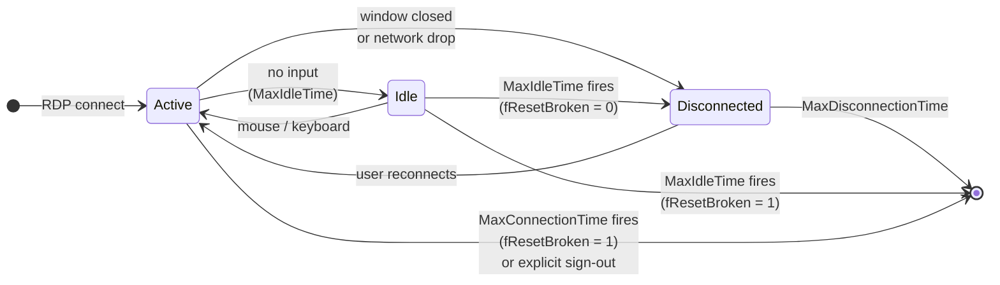

# Basics of Remote Desktop Session Time Limits on Windows Server

## Introduction

Welcome! When users connect to a Windows Server through Remote Desktop (RDP) — whether to a Domain Controller, a jump server, an RDS Session Host or a VDI desktop — their sessions don't necessarily go away when they close the window. By default, **Windows keeps disconnected sessions alive forever**: applications stay open, memory stays allocated, and the user can reconnect later and resume work where they left off.

That behavior is convenient, but it comes with a cost: stale sessions accumulate, they consume resources, and from a security standpoint they leave interactive logons hanging on a server long after the human is gone.

To control this, Windows exposes a small family of policies grouped under **Remote Desktop Services Session Time Limits**. They answer two distinct questions:

1. **When** should a session be considered "expired"? (idle too long, active too long, disconnected too long)
2. **What** should happen when expiration is reached? Just disconnect, or fully log the user off?

The most misunderstood of all of these is the registry value `fResetBroken`, which is what this article will demystify.

---

## Session States: the Lifecycle You Need to Picture

Before diving into the policies, you need a clear mental model of an RDS session lifecycle. A session moves through three states:

| State | What it means | Server resources |
|-------|--------------|------------------|
| **Active** | The user has an RDP client connected and is interacting (or could be). | Full: CPU, memory, profile loaded, processes running. |
| **Idle** (sub-state of Active) | The session is still active, but no keyboard or mouse input has been received for a while. | Same as Active. |
| **Disconnected** | The RDP client closed (window closed, network dropped, laptop lid closed) but the session **still exists on the server**. Apps stay open. | Almost full: profile is still loaded, processes still running, only the graphical pipe to the client is gone. |
| **Logged off** | The session is destroyed. Profile unloaded, processes terminated, memory freed. | None. |



Reading the diagram:

- The **soft path** (left side) is what happens by default: timeouts push the session into *Disconnected*, where it waits.
- The **hard path** (right side) is the shortcut that `fResetBroken = 1` opens: idle/active timeouts go straight to logoff.
- *Disconnected → logged off* is unconditional once `MaxDisconnectionTime` is reached, regardless of `fResetBroken`.

> The key insight: **Disconnected is not the same as Logged off**. By default, when an idle/active timeout fires, Windows only moves the session into the *Disconnected* state. To actually destroy the session, you need to tell Windows to do so — that is exactly the job of `fResetBroken`.

---

## The Four Policies That Govern Session Time Limits

All four live in the same GPO node:

> **Computer Configuration → Policies → Administrative Templates → Windows Components → Remote Desktop Services → Remote Desktop Session Host → Session Time Limits**

(They also exist under **User Configuration**, with the same names; user-side wins over computer-side when both are configured.)

| GPO setting | Registry value (REG_DWORD) | Question it answers |
|-------------|----------------------------|---------------------|
| Set time limit for active but **idle** Remote Desktop Services sessions | `MaxIdleTime` | After how long without keyboard/mouse input do we consider the session expired? |
| Set time limit for **active** Remote Desktop Services sessions | `MaxConnectionTime` | What is the maximum total duration of an active session, regardless of activity? |
| Set time limit for **disconnected** sessions | `MaxDisconnectionTime` | How long do we keep a disconnected session alive before logging it off automatically? |
| **End session when time limits are reached** | **`fResetBroken`** | When `MaxIdleTime` or `MaxConnectionTime` expires, do we just disconnect (`0`) or fully log off (`1`)? |

All four sit under the same registry key when applied by GPO:

`HKLM\SOFTWARE\Policies\Microsoft\Windows NT\Terminal Services`

The local (non-policy) equivalents live under the per-listener key:

`HKLM\SYSTEM\CurrentControlSet\Control\Terminal Server\WinStations\RDP-Tcp`

When both exist, the **Policies branch wins**.

> Time values in the registry are stored in **milliseconds** (`MaxIdleTime` of `1800000` = 30 minutes). The GPO UI exposes them in human-readable units, which is much easier to reason about — set them in GPO, never by hand.

---

## Zoom on `fResetBroken`: the Setting You Were Asking About

The name is historical: think of it as **"force a *reset* (logoff) of a *broken* (timed-out) session"**. It's a binary switch:

| GPO state | `fResetBroken` value | What happens when `MaxIdleTime` or `MaxConnectionTime` fires |
|-----------|---------------------|--------------------------------------------------------------|
| **Disabled** or **Not configured** | `0` (or absent) | The session goes from Active/Idle to **Disconnected**. The user can reconnect and find everything as they left it. |
| **Enabled** | `1` | The session is **logged off** immediately when the limit is reached. Unsaved work is lost. |

Two important subtleties:

- **`fResetBroken` does nothing on its own.** If `MaxIdleTime` and `MaxConnectionTime` are both unset, no timeout ever fires, so there is nothing to react to. You must pair `fResetBroken` with at least one of the time-limit policies.
- **`fResetBroken` does not control `MaxDisconnectionTime`.** When a *disconnected* session reaches its `MaxDisconnectionTime` limit, it is **always logged off** — that's the whole point of that timer. `fResetBroken` is only consulted at the *idle/active* expiration moment.

In short: `fResetBroken` decides whether **idle/active timeouts** translate into a soft *disconnect* or a hard *logoff*.

---

## Concrete Walk-Through: Same Timeout, Different Outcomes

Let's say you configure:

- **MaxIdleTime** = 30 minutes
- **MaxDisconnectionTime** = 2 hours

A user opens Excel on the server, edits a spreadsheet, then leaves for a meeting without saving.

### Scenario A — `fResetBroken = 0` (Disabled)

1. T+0 min: user is Active, editing.
2. T+5 min: user walks away. Session becomes Idle.
3. T+30 min: `MaxIdleTime` fires → session moves to **Disconnected**. Excel stays open with unsaved changes.
4. T+45 min: user comes back, reconnects → Excel is still there, work preserved.

If the user never comes back:

5. T+30 min + 2 h = T+2 h 30 min: `MaxDisconnectionTime` fires → session is logged off. Excel closes. Unsaved changes are lost (no one to click Save).

### Scenario B — `fResetBroken = 1` (Enabled)

1. T+0 min: user is Active, editing.
2. T+5 min: user walks away. Session becomes Idle.
3. T+30 min: `MaxIdleTime` fires → session is **logged off immediately**. Excel closes, unsaved changes are lost.

Same `MaxIdleTime`, very different user experience. That is the whole purpose of `fResetBroken`.

---

## Recommendations by Server Role

There is no universal "right" value — it depends on the workload and the population of users hitting the box.

| Server role | MaxIdleTime | MaxConnectionTime | MaxDisconnectionTime | fResetBroken | Rationale |
|-------------|-------------|-------------------|----------------------|--------------|-----------|
| **Domain Controller** | 15 min | Not set | 0 (immediate) | **Enabled (1)** | DCs should never carry interactive sessions. Admins must log off cleanly; no zombies allowed. |
| **Jump server / PAW / Bastion** | 15 min | 8 h | 5 min | **Enabled (1)** | Privileged work should not linger. Forced logoff prevents ticket caches and credentials from sitting on disk indefinitely. |
| **RDS Session Host (multi-user productivity)** | 2 h | Not set | 1 h | Disabled (0) on idle; Enabled (1) only on disconnect timeout (which is automatic) | Users expect to come back to their work. Forced idle logoff would generate help-desk tickets. |
| **VDI personal desktop** | 30 min – 1 h | Not set | 15 min | Disabled (0) | The desktop is dedicated; reconnecting fast is the priority. |
| **Application server (rarely interactive)** | 30 min | Not set | 0 (immediate) | **Enabled (1)** | Operators should not leave RDP sessions parked on production app servers. |

> Whichever values you choose, **document them** and surface them to users with a logoff warning. The companion policy *"Set time limit for logoff of RemoteApp sessions"* and Windows' built-in 2-minute warning dialog help make forced logoffs predictable.

---

## How to Verify the Effective Configuration

Three layers to inspect, from highest priority to lowest:

### 1. The Policies branch (what GPO has applied)

```powershell
$path = 'HKLM:\SOFTWARE\Policies\Microsoft\Windows NT\Terminal Services'
Get-ItemProperty -Path $path -ErrorAction SilentlyContinue |
    Select-Object MaxIdleTime, MaxConnectionTime, MaxDisconnectionTime, fResetBroken
```

If `fResetBroken` is missing, the GPO **End session when time limits are reached** is *Not configured*.

### 2. The local listener (what the OS would do without GPO)

```powershell
$path = 'HKLM:\SYSTEM\CurrentControlSet\Control\Terminal Server\WinStations\RDP-Tcp'
Get-ItemProperty -Path $path |
    Select-Object MaxIdleTime, MaxConnectionTime, MaxDisconnectionTime, fResetBroken
```

This is what the RDP listener was configured with before any GPO override.

### 3. Live sessions

```powershell
quser           # currently connected sessions, with IDLE column
qwinsta         # session states (Active / Disc)
```

For a per-DC inventory of the GPO-applied values:

```powershell
$dcs = (Get-ADDomainController -Filter *).HostName
Invoke-Command -ComputerName $dcs -ScriptBlock {
    $p = 'HKLM:\SOFTWARE\Policies\Microsoft\Windows NT\Terminal Services'
    $v = Get-ItemProperty -Path $p -ErrorAction SilentlyContinue
    [pscustomobject]@{
        Server               = $env:COMPUTERNAME
        MaxIdleTime_min      = if ($v.MaxIdleTime)         { $v.MaxIdleTime         / 60000 } else { $null }
        MaxConnectionTime_min= if ($v.MaxConnectionTime)   { $v.MaxConnectionTime   / 60000 } else { $null }
        MaxDisconnectTime_min= if ($v.MaxDisconnectionTime){ $v.MaxDisconnectionTime/ 60000 } else { $null }
        fResetBroken         = $v.fResetBroken
    }
} | Sort-Object Server | Format-Table -AutoSize
```

To trace **which GPO** is responsible, run `gpresult /h gpo-report.html` on the target machine and search for *"End session when time limits are reached"*.

---

## Common Pitfalls

- **"I set `fResetBroken = 1` but sessions are not getting logged off."**
  You also need at least one of `MaxIdleTime` or `MaxConnectionTime`. Without a timeout, there is no event for `fResetBroken` to react to.

- **"I want disconnected sessions to be killed quickly. Should I set `fResetBroken = 1`?"**
  No. That setting only governs *idle/active* expiration. For disconnected sessions, set `MaxDisconnectionTime` to a small value (or `1` minute, which is the lowest meaningful value). Disconnected sessions are *always* logged off when their disconnection timer fires.

- **"I configured the policy under User Configuration and Computer Configuration with different values."**
  User configuration takes precedence over computer configuration for these settings. Pick one scope and stick to it.

- **Confusion with another setting that sounds similar:**
  *"Network security: Force logoff when logon hours expire"* (`EnableForcedLogoff` under `LanmanServer\Parameters`) is **unrelated** to RDS timeouts. It governs SMB sessions when an AD user's `logonHours` window closes — it does not log off interactive RDP sessions.

- **Time units.** GPO UI uses minutes/hours; registry stores **milliseconds**. Edit through GPO, not by hand.

---

## TL;DR

- Sessions don't die on their own. By default, closing your RDP client just makes the session **Disconnected**, not gone.
- `MaxIdleTime`, `MaxConnectionTime`, `MaxDisconnectionTime` decide **when** a session expires.
- `fResetBroken` decides **what happens** when an idle/active timeout fires: stay disconnected (`0`) or fully log off (`1`).
- For DCs and privileged servers: set timeouts **and** enable `fResetBroken`. For productivity RDS hosts: set timeouts but leave `fResetBroken` disabled to preserve user work.
- Verify with PowerShell against `HKLM\SOFTWARE\Policies\Microsoft\Windows NT\Terminal Services`. Trace the responsible GPO with `gpresult /h`.

---

## References

| Topic | Link |
|-------|------|
| Configure timeouts for Remote Desktop sessions | [learn.microsoft.com/en-us/windows-server/remote/remote-desktop-services/clients/remote-desktop-session-time-limits](https://learn.microsoft.com/en-us/windows-server/remote/remote-desktop-services/clients/remote-desktop-allow-log-on) |
| Remote Desktop Services Session Time Limits ADMX policies | [learn.microsoft.com/en-us/previous-versions/windows/it-pro/windows-server-2012-r2-and-2012/ee791906(v=ws.11)](https://learn.microsoft.com/en-us/previous-versions/windows/it-pro/windows-server-2012-r2-and-2012/ee791906(v=ws.11)) |
| `Win32_TSSessionSetting` (programmatic equivalent of these settings) | [learn.microsoft.com/en-us/windows/win32/termserv/win32-tssessionsetting](https://learn.microsoft.com/en-us/windows/win32/termserv/win32-tssessionsetting) |
| Network security: Force logoff when logon hours expire (the SMB cousin, *not* RDS) | [learn.microsoft.com/en-us/previous-versions/windows/it-pro/windows-10/security/threat-protection/security-policy-settings/network-security-force-logoff-when-logon-hours-expire](https://learn.microsoft.com/en-us/previous-versions/windows/it-pro/windows-10/security/threat-protection/security-policy-settings/network-security-force-logoff-when-logon-hours-expire) |
| `quser` / `qwinsta` reference | [learn.microsoft.com/en-us/windows-server/administration/windows-commands/quser](https://learn.microsoft.com/en-us/windows-server/administration/windows-commands/quser) |
