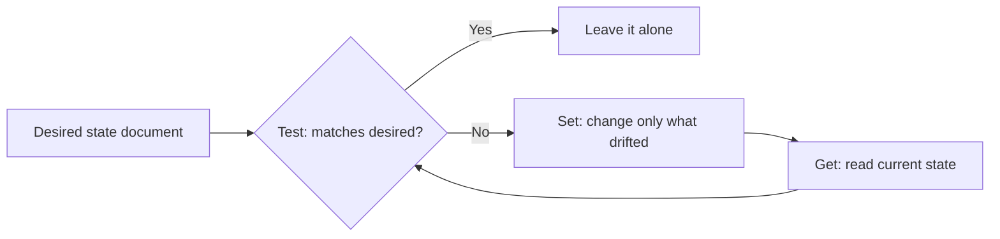
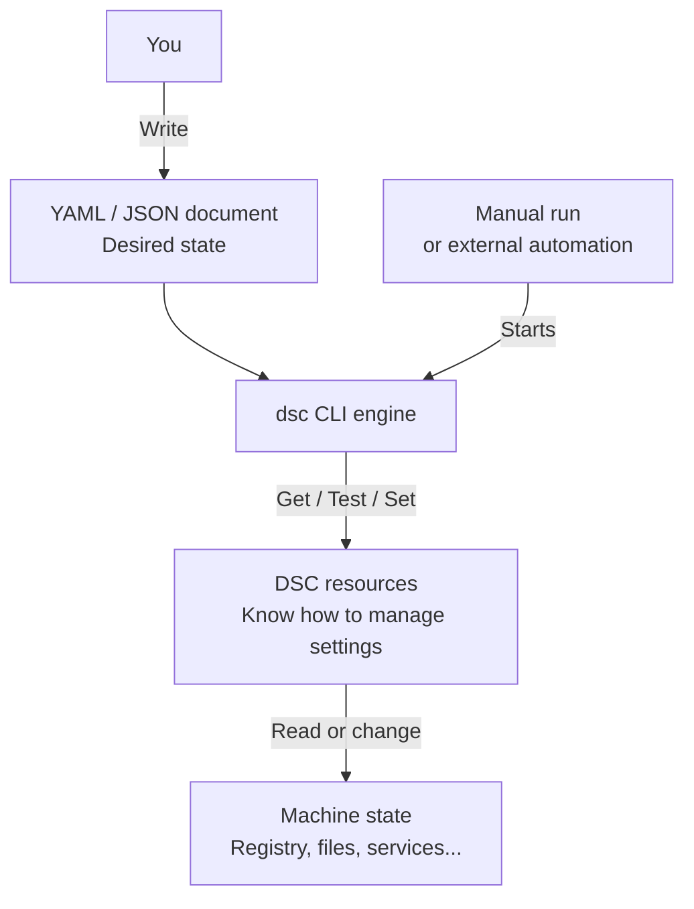
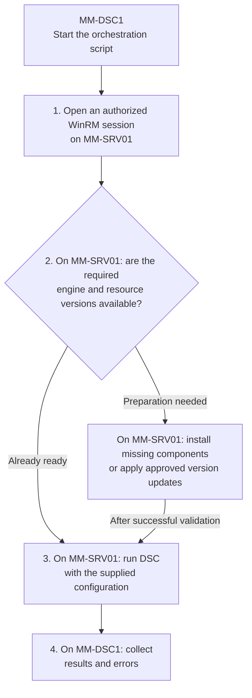

# ⚙️ Desired State Configuration in 2026: What It Actually Is, and How to Use It

**Your servers drift the moment you stop looking. Desired State Configuration is how you declare what "correct" means once, then let the machine keep itself honest.**

> 🎯 **TL;DR** — DSC is a **declarative**, **idempotent** way to describe the state a machine should be in, and then enforce it. The catch in 2026 is that *three different DSCs* live in the wild, and picking the wrong one burns months:
>
> - **Classic PSDSC** — Windows PowerShell 5.1, compiles to **MOF**, applied by the **LCM**, push/pull. Everywhere, but **frozen/legacy**.
> - **DSC v3** — the `dsc` command-line engine, **cross-platform**, **YAML/JSON** documents, **no MOF, no LCM**. The **current** engine.
> - **Azure Machine Configuration** — Azure Policy + Arc, audit/apply/autocorrect at fleet scale. Built on DSC.
>
> The hands-on lab at the bottom is **pure DSC v3**.

---

## The Problem DSC Solves

Imagine a simple task: make sure a folder exists and an SMB share is published. In PowerShell you'd write:

```powershell
New-SmbShare -Name MyShare -Path C:\Data\Share -FullAccess Alice -ReadAccess Bob
```

Clean, readable, and it works beautifully — *the first time*. Run it twice and it throws because the share already exists. Someone gave Bob Full Access last month? The script neither knows nor cares. To make it safe you end up writing this:

```powershell
$share = Get-SmbShare -Name MyShare -ErrorAction SilentlyContinue
if (-not $share) {
    New-SmbShare -Name MyShare -Path C:\Data\Share -FullAccess Alice -ReadAccess Bob
}
else {
    # now reconcile path, permissions, description, everyone you forgot about...
}
```

You are no longer describing **what you want**. You are hand-coding **how to get there**, plus every branch of "what if it's already half-done". Multiply that by a few hundred settings across a few hundred servers and you get **snowflake servers**: each one subtly unique, none reproducible, all quietly drifting.

DSC flips it around. You declare the **desired state** and let a **resource** own the messy reconciliation logic:

- **Declarative** — you state the target, not the procedure.
- **Idempotent** — applying the same configuration repeatedly has the same effect as applying it once. For example, ensuring a folder exists creates it if missing and leaves it alone if already present.
- **Convergent** — every run drags the machine back toward the declared state.

That's the whole pitch: describe the destination once, stop babysitting the journey.

---

## The Mental Model: Get / Test / Set

Every DSC resource — no matter the version, language, or platform — speaks three verbs:

| Verb | Question it answers | Changes the system? |
| --- | --- | --- |
| **Get** | What is the current state of this thing? | No |
| **Test** | Does the current state match what I declared? | No |
| **Set** | Make reality match the declaration. | Only the drift |

That's the entire loop:



The important nuance most people miss: **Set only touches what's wrong**. If 199 settings are correct and 1 has drifted, DSC fixes the 1. That's what makes it safe to run on a schedule instead of praying before every deployment.

---

## The 2026 Landscape (Read This Before You Build Anything)

Here's the part the old tutorials won't tell you, because most of them were written for the 2014 engine. There isn't "a DSC". There are three, and they are **not** the same product with a bigger version number.

### 1. Classic PSDSC — the one in every screenshot

This is what you'll find in 90% of blog posts and in your colleague's demo script. It lives inside **Windows PowerShell 5.1**:

```powershell
Configuration LabDir {
    Node localhost {
        File CreateFolder {
            DestinationPath = 'C:\temp\DSCdir1'
            Ensure          = 'Present'
            Type            = 'Directory'
        }
    }
}
LabDir                                          # compiles to .\LabDir\localhost.mof
Start-DscConfiguration -Path .\LabDir -Wait -Verbose
```

- You author with the `Configuration` / `Node` keywords.
- It **compiles to a MOF file** — the machine-readable format you never asked to read.
- The **Local Configuration Manager (LCM)** — a service baked into the OS — applies it and can re-check on a timer.
- Delivery is **Push** (`Start-DscConfiguration`) or **Pull** (a pull server hands out MOFs and modules).

It still works on every Windows Server. But it is **Windows-only, tied to WMF 5.1, and effectively frozen** — the docs sit on a multi-year "we're not really touching this" cycle. Great to *understand*. A poor thing to *start* a new project on.

### 2. DSC v3 — the current engine

DSC v3 is a rewrite, not a facelift. It ships as a single command-line tool, **`dsc`**:

- **Cross-platform** (Windows, Linux, macOS). The DSC engine itself does not require PowerShell. Resources can be written in **PowerShell**, Bash, Python, C#, Rust, or other languages that implement DSC's resource interface. Each resource may have its own dependencies: a PowerShell resource still needs PowerShell installed.
- **No MOF.** Configuration documents are **YAML or JSON**, with an ARM-template-like feature set (parameters, variables, expression functions).
- **No LCM.** `dsc` is *a command you run*, not a service that runs in the background judging your machine every 15 minutes. If you want it on a schedule, something else has to invoke it (more on that below).
- Same **Get / Test / Set** model.
- **Backward compatible** with classic resources through *adapter* resources (`Microsoft.DSC/PowerShell`, `Microsoft.Windows/WindowsPowerShell`), so your existing PSDSC class resources aren't landfill.

To understand the diagram, start with a local run. Three parts have distinct responsibilities:

1. **The document describes what you want.** You write YAML or JSON that names the resources to use and supplies their desired properties. For example: the registry value `Owner`, under `HKCU\Software\TechBlogLab`, should contain `LabUser`. The document does not contain the code that edits the registry.
2. **The engine coordinates execution.** The `dsc` command reads the document, finds the required resources, and uses them to read state (**Get**), check compliance (**Test**), or enforce the declared state (**Set**, where supported). The engine does not need to know how every registry setting, service, or application works.
3. **The resources know how to manage each setting.** In this example, `Microsoft.Windows/Registry` knows how to read and update the registry. You normally use existing resources; you do not have to write them yourself. Their implementation language is separate from the YAML or JSON configuration document.



**What starts the engine?** In this lab, you run `dsc config get`, `dsc config test`, or `dsc config set` yourself. DSC v3 does not keep monitoring or reapplying the configuration after the command exits. A scheduled task or another automation system must invoke it again for recurring checks or enforcement.

**WinGet**, **Microsoft Dev Box**, and **Azure Machine Configuration** illustrate the higher-level orchestration layer discussed in the [DSC integration overview](https://learn.microsoft.com/en-us/powershell/dsc/overview?view=dsc-3.0#integrating-with-dsc). They are not three consecutive steps or prerequisites for this local lab; their integration details depend on the product and version. The `dsc` CLI itself is not a remote deployment service.

**Remember: the document defines what you want, the resource implements how to manage it, the engine coordinates execution, and external automation decides when to run it.**

### 3. Azure Machine Configuration — DSC at fleet scale

When you need to **audit and enforce** across hundreds of machines — in Azure *and* on-prem via **Arc** — you don't hand-run `dsc` on each box. You use **Azure Machine Configuration** (the feature formerly known as Guest Configuration), driven by **Azure Policy**. It offers three enforcement modes:

| Mode | What it does |
| --- | --- |
| **Audit** | Report compliance only. Touches nothing. |
| **Apply and Monitor** | Apply once, then watch for drift. |
| **Apply and Autocorrect** | Apply and **automatically re-converge** when it drifts. |

It covers Windows Server 2012–2025, Windows 10/11, and a long list of Linux distros, on Azure or Arc-enabled hybrid machines.

### And one thing that's on the clock

> ⚠️ **Azure Automation State Configuration is retiring on 30 September 2027.** If you're still pulling MOFs from Azure Automation DSC, your migration target is **Azure Machine Configuration**. (The Linux DSC extension already retired back in 2023.) Don't start anything new here.

### The one table to remember

| | Classic PSDSC | DSC v3 | Azure Machine Configuration |
| --- | --- | --- | --- |
| **Engine** | Windows PowerShell 5.1 (LCM) | `dsc` CLI | Azure Policy guest agent (uses DSC) |
| **Config format** | PowerShell → **MOF** | **YAML / JSON** | DSC-based guest assignment |
| **Platform** | Windows only | Windows, Linux, macOS | Windows + Linux, Azure + Arc |
| **Runs as** | LCM **service** (scheduled) | A **command** (no service) | Managed by Azure Policy |
| **Delivery** | Push / Pull server | You orchestrate it | Azure Policy, at scale |
| **State model** | Get / Test / Set | Get / Test / Set | Audit / Apply&Monitor / Apply&Autocorrect |
| **Status in 2026** | 🟠 Legacy / frozen | 🟢 **Current** | 🟢 Current (cloud scale) |

---

## Hands-On Lab: DSC v3 in ~10 Minutes

We'll install DSC v3, poke at a couple of resources, then author a real configuration document and watch it detect and fix drift. Everything here is **local and reversible** — the only thing we touch is a throwaway registry key under `HKCU`.

The selected lab uses **Windows Server 2025 on both machines**:

| Machine | Operating system | Purpose |
| --- | --- | --- |
| `MM-DSC1` | Windows Server 2025 | Prepare configurations and installation packages, then trigger preparation and DSC runs on the target. |
| `MM-SRV01` | Windows Server 2025 | Run DSC and the resources that manage its local configuration. |

Use a disposable target for the demonstrations. DSC v3 also runs on other supported platforms, but the Windows Server role example discussed below requires a server OS. Step 1 offers a package archive alternative when WinGet or its configured source is unavailable.

The walkthrough has two phases. **Steps 1 to 6 are a local validation on `MM-SRV01`**, using an interactive PowerShell session on that server. This checks the engine, resources, and configuration before adding remoting and its authentication requirements. `MM-DSC1` is not used in this first phase.

**The following two-server extension moves authoring and triggering to `MM-DSC1`; DSC still executes on `MM-SRV01`.** That is the administration model for the full lab. Keep the same execution account throughout the local validation: `HKCU` refers to that account's registry, not a machine-wide location.

### Before You Start: Prerequisites

Installing the engine and installing the resources are separate operations. **`dsc` executes resources; naming a resource in YAML does not install it.** `PSDscResources` is a PowerShell module containing resources, not another DSC engine and not a mandatory dependency of every DSC v3 configuration.

**A prerequisite is something that must be available, not necessarily something you must install.** Windows Server 2025 already provides Windows PowerShell 5.1, WinRM, and the `ServerManager` and `Dism` modules. We check that they are usable; we do not install all of them again. In particular, WinRM being present does not prove that a connection from the administration server is authorized or allowed through the firewall.

For the registry and IIS scenarios discussed here, the additions are the **complete DSC v3 package**, including its bundled resources and adapters, and **`PSDscResources` if using `WindowsFeature`**. There is no separate adapter installation for this example. Other configurations may need other resource modules, but we only prepare the ones the configuration actually uses.

| Component | Where? | Why and when is it required? |
| --- | --- | --- |
| DSC v3 engine and its bundled resources | `MM-SRV01` | Required for the local execution in this walkthrough. Install it in step 1. The registry and OS information resources used below are included in the Windows DSC distribution. |
| Windows PowerShell 5.1 | `MM-SRV01` | Already present in a standard Windows Server 2025 installation. Required by the `Microsoft.Windows/WindowsPowerShell` adapter, which uses the built-in `PSDesiredStateConfiguration` module. PowerShell 7 (`pwsh`) is a different runtime, not an extra requirement for this adapter. |
| `PSDscResources` module | `MM-SRV01`, in a Windows PowerShell module directory | An additional prerequisite for a Windows Server role/feature example using `PSDscResources/WindowsFeature`. It is not required for the registry-only configuration currently shown below. |
| `ServerManager` and `Dism` modules | `MM-SRV01` | Windows Server 2025 provides these role/feature management tools. Verify their availability for `WindowsFeature`; they are not separate DSC products to install. |
| Appropriate execution permissions | `MM-SRV01` | The current registry example writes to the execution account's `HKCU`. Installing modules for all users or installing/removing server roles requires administrator permissions. |
| PowerShell, an editor, and authorized WinRM access to the target | `MM-DSC1` | Windows PowerShell and WinRM are already provided by Windows Server 2025. Secure connectivity and endpoint permissions must still be checked. DSC v3 and `PSDscResources` do not need to be installed here merely to author and send the document. |

Prepare installation packages from trusted sources. Online module installation requires access to the PowerShell repository and may prompt to install a package provider or confirm repository trust. In an isolated lab, stage the reviewed module and its dependencies offline instead. Installing a module only on `MM-DSC1` does not make it available to DSC on `MM-SRV01`.

#### Can We Start with Freshly Installed Servers?

**Yes, without manually visiting every target, but not by sending YAML to a machine that has no DSC v3 engine.** Windows PowerShell's built-in classic DSC is not the separate `dsc` v3 executable. There are two distinct operations:

1. **Initial preparation, often called bootstrapping:** make the engine and the required resources available on the target. Check what is already installed; add only missing components or deliberately update their versions.
2. **Configuration with DSC:** use those resources to inspect and enforce the declared settings. Repeat these runs to detect or correct drift without reinstalling the tooling every time.

A script running on **MM-DSC1** can coordinate both operations. It starts on the administration server, but the commands it sends through WinRM execute on **MM-SRV01**. The expected workflow is:

1. **Connect to `MM-SRV01` through WinRM.** Confirm network connectivity, name resolution, authentication, and the account's permissions. This is what gives the administration script a way to prepare the target before DSC v3 is installed there.
2. **Check the engine and required resources on `MM-SRV01`.** If an approved component is missing, transfer and install it; if the expected version is already available to the execution account, reuse it. Check versions and resource discovery after any installation. This conditional preparation is the bootstrap part of the script, not work performed automatically by `dsc config set`.
3. **Supply the configuration and invoke DSC on `MM-SRV01`.** For the content-through-WinRM option described later, `MM-DSC1` reads its local document and sends the text through the session. The target's engine then runs `test` to check compliance or `set` to apply the declared state. Copying the document or reading it through UNC are alternative delivery options.
4. **Collect the results on `MM-DSC1`.** Record which target and configuration were used, the command's exit code, and the per-resource results and errors. Verify the actual target state as well; a successful connection is not proof of a successful configuration.



If connection, installation, or readiness checks fail, the script must stop and report the failure before attempting to apply the configuration. It must not silently continue with missing resources or an unintended version.

**First run on a fresh target:** prepare the missing tooling, then execute DSC. **Subsequent runs:** reuse that tooling and check or apply the current configuration. Do not reinstall the engine and modules on every scheduled run. A later configuration that introduces a new resource, or a planned version update, can require additional preparation.

The target does not need direct access to the PowerShell Gallery if the administration server stages the packages and transfers them through the session. Another option is to include the approved DSC runtime and resources in the VM template; version and maintain those components as part of that image.

**The limit to understand:** DSC v3 alone cannot interpret the document on a target where its engine is not yet available. PowerShell Remoting can run the preparation commands first because it is a separate management mechanism already provided by Windows. This is why bootstrapping can be automated without already having DSC v3 installed.

**The starting requirement is a secure way to administer the target.** [PowerShell remoting is enabled by default on modern Windows Server](https://learn.microsoft.com/en-us/powershell/module/microsoft.powershell.core/about/about_remote_requirements?view=powershell-5.1#how-to-configure-your-computer-for-remoting), but network profiles, firewall rules, endpoint permissions, and policies can change whether a connection succeeds. A domain lab can use Kerberos; do not assume that a fresh OS installation alone establishes authentication and authorization between the machines. If that initial administration access is not working, fix it before attempting a remote bootstrap; DSC cannot bypass it.

The manual commands below expose these mechanisms for learning. They are not a requirement to log on interactively to every server in an automated deployment. The bootstrap sequence above describes the approach; a bootstrap script is not yet provided or tested in this walkthrough.

### 1. Install the `dsc` engine

**Machine:** `MM-SRV01`, in its local PowerShell session.

**Why:** this is the server whose configuration DSC will manage. Install DSC v3 here so its engine can execute on the target. Installing it only on `MM-DSC1` would not make it available on `MM-SRV01`.

```powershell
# Find the published package in the Microsoft Store source
winget search DesiredStateConfiguration --source msstore

# Install the latest stable DSC v3
winget install --id 9NVTPZWRC6KQ --source msstore

# Sanity check
dsc --version
```

No `winget`? Grab the Windows archive from the [DSC releases page](https://github.com/PowerShell/DSC/releases/latest), extract the complete package, and add its directory to your `PATH`. Keep the bundled resources and adapters alongside the engine; copying only `dsc.exe` is not equivalent to installing the full package. Check visibility under the account that will run DSC, including remote or scheduled runs.

#### Additional Setup for Windows Server Roles

**Machine:** `MM-SRV01`, in an elevated **Windows PowerShell 5.1** session. This setup is for the role/feature extension; skip it if you are only running the registry example below.

**Why:** the [WindowsFeature resource](https://learn.microsoft.com/en-us/powershell/dsc/reference/psdscresources/resources/windowsfeature/windowsfeature?view=dsc-2.0) comes from the `PSDscResources` module. The [Windows PowerShell adapter](https://learn.microsoft.com/en-us/powershell/dsc/reference/resources/microsoft/windows/windowspowershell?view=dsc-3.0), supplied with DSC v3 on Windows, lets the v3 engine invoke that resource. The module itself must be installed separately:

```powershell
$PSVersionTable.PSVersion
Install-Module -Name PSDscResources -Repository PSGallery -Scope AllUsers
Get-Module -ListAvailable -Name PSDscResources | Select-Object Name, Version, ModuleBase
Get-DscResource -Name WindowsFeature -Module PSDscResources
```

`Install-Module` is a PowerShell command, not a DSC command. Running it in Windows PowerShell 5.1 with `-Scope AllUsers` places the module in the Windows PowerShell module location for all users, rather than only the interactive user's profile. The first command should report version 5.1. The last command should identify `WindowsFeature` from `PSDscResources`; stop and resolve any installation or discovery error before using it in YAML. Record the module version used for a repeatable lab.

**Installing the resource module does not install IIS.** It makes the code that knows how to manage Windows roles available. A later configuration must declare which role is wanted, and a DSC `set` operation must apply it. Plan for any restart reported by a role installation; the v3 engine is not a background reboot-and-resume service.

### 2. See what resources DSC can find

**Machine:** `MM-SRV01`, in its local PowerShell session.

**Why:** resource discovery reflects the environment where DSC runs. We need to confirm that the target can find the registry and OS information resources; a resource installed only on the administration server would not be available here. Listing resources does not install missing ones.

```powershell
# Every resource DSC currently discovers
dsc resource list

# Filter to the two we'll use
dsc resource list | Select-String -Pattern 'Registry|OSInfo'
```

For the Windows Server role extension, also run this on **MM-SRV01** after installing `PSDscResources`:

```powershell
dsc resource list --adapter Microsoft.Windows/WindowsPowerShell PSDscResources/WindowsFeature
```

**Expected result:** an entry for `PSDscResources/WindowsFeature`. The `--adapter` option asks DSC to enumerate the resources exposed through that adapter; a plain `dsc resource list` does not enumerate those adapted resources. This check confirms discovery, not permission to install a role or successful role installation.

### 3. Read state with a single resource (Get)

**Machine:** `MM-SRV01`, in its local PowerShell session.

**Why:** these resources read the operating system and registry of the machine executing DSC. Running the same commands on `MM-DSC1` would inspect the administration server instead. This step only reads state; it does not apply a configuration.

Some resources are **Get/Test-only** — they report reality but there's nothing to "enforce". `Microsoft/OSInfo` is the classic example, and it needs no input:

```powershell
dsc resource get --resource Microsoft/OSInfo --output-format yaml
```

```yaml
actualState:
  family: Windows
  version: 10.0.22631
  edition: Windows 11 Enterprise
  bitness: '64'
```

Resources that identify a specific instance need input. Here's a read-only peek at a registry value:

```powershell
dsc resource get --resource Microsoft.Windows/Registry --input '{
  "keyPath": "HKLM\\Software\\Microsoft\\Windows NT\\CurrentVersion",
  "valueName": "SystemRoot"
}'
```

### 4. Author a configuration document

**Machine:** `MM-SRV01` for this initial local validation, using a text editor on that server.

**Why:** keeping this first document beside the local test session lets us learn DSC without introducing file transfer yet. This is a teaching choice, not a DSC requirement. In the two-server extension, you will author and keep the document on `MM-DSC1` instead; writing YAML does not require the DSC engine.

This is where DSC v3 stops looking like classic DSC. No `Configuration` keyword, no MOF — just a YAML document. Save this as `lab.dsc.config.yaml`:

Use a working folder on `MM-SRV01` and set that same folder as the current location of your PowerShell session. Step 5 uses `./lab.dsc.config.yaml`, which resolves relative to that session's current directory, not to a folder on `MM-DSC1`.

```yaml
# lab.dsc.config.yaml
$schema: https://aka.ms/dsc/schemas/v3/bundled/config/document.json
resources:
  # Guard clause: only proceed if we're actually on Windows
  - name: Windows only
    type: Microsoft.DSC/Assertion
    properties:
      $schema: https://aka.ms/dsc/schemas/v3/bundled/config/document.json
      resources:
        - name: os
          type: Microsoft/OSInfo
          properties:
            family: Windows

  # The state we actually want to enforce
  - name: Tech-Blog lab marker
    type: Microsoft.Windows/Registry
    properties:
      keyPath: HKCU\Software\TechBlogLab
      valueName: Owner
      valueData:
        String: LabUser
      _exist: true
    dependsOn:
      - "[resourceId('Microsoft.DSC/Assertion', 'Windows only')]"
```

Two ideas worth noticing:

- **`Microsoft.DSC/Assertion`** wraps a Get/Test-only resource (`OSInfo`) into a **guard** — if the assertion fails, the dependent resource never runs. This is how you say *"only do this on Windows"* without a single `if`.
- **`dependsOn`** uses an ARM-style `resourceId()` expression to order things. Same mental model as an ARM/Bicep template, on purpose.

### 5. Get → Test → Set → prove drift is fixed

**Machine:** `MM-SRV01`, in the same PowerShell session and working folder as step 4.

**Why:** DSC must inspect and modify the target's state, using the document we just created. All commands below, including the deliberate deletion and the final registry check, belong on `MM-SRV01` under the same account. Running them directly on `MM-DSC1` would inspect or change the wrong server.

```powershell
# What does the machine look like right now? (the key doesn't exist yet)
dsc config get --file ./lab.dsc.config.yaml

# Are we already in the desired state? Expect: no.
dsc config test --file ./lab.dsc.config.yaml

# Preview the change without touching anything (ExecutionType = WhatIf)
dsc config set --file ./lab.dsc.config.yaml --what-if

# Enforce it. This creates the key and the value.
dsc config set --file ./lab.dsc.config.yaml

# Test again. Expect: in the desired state.
dsc config test --file ./lab.dsc.config.yaml
```

Now the fun part — break it on purpose and watch DSC converge it back:

```powershell
# Introduce drift
Remove-Item 'HKCU:\Software\TechBlogLab' -Recurse -Force

# DSC notices immediately
dsc config test --file ./lab.dsc.config.yaml

# DSC fixes only what drifted
dsc config set --file ./lab.dsc.config.yaml
```

That last loop — *test says no, set makes it yes, and a second set does nothing* — is idempotency and convergence in three commands. That's the entire point of DSC, minus 900 pages of theory.

> **Verify:** run `dsc config test` and read the **per-instance** result — the registry instance should report it is in the desired state. Then confirm reality with `Get-ItemProperty 'HKCU:\Software\TechBlogLab'` and check `Owner = LabUser` actually exists. A green test with no registry key means you tested the wrong thing.

### 6. Clean up

**Machine:** `MM-SRV01`, under the same account that applied the configuration.

**Why:** the test key was created in that account's `HKCU` on the target. Cleaning up on `MM-DSC1`, or as another user on `MM-SRV01`, would not remove the marker created by this test. This removes only the registry marker; keep the document for the next phase.

```powershell
Remove-Item 'HKCU:\Software\TechBlogLab' -Recurse -Force -ErrorAction SilentlyContinue
```

---

## Extend the Lab: Administration Server and Target

**Preparation machine: `MM-DSC1`.** The local validation on `MM-SRV01` is complete. Now create a working folder `C:\DSC` on `MM-DSC1` and place the YAML document from step 4 there as `lab.dsc.config.yaml`. This becomes the document you maintain for the centralized workflow. Leave DSC v3 and its resources installed on `MM-SRV01`.

**Why switch machines?** The administration server now owns the document and triggers runs; the target remains the execution location. The original local test copy is not required by every delivery option: option 1 writes a target copy, option 2 reads a share, and option 3 sends the document's contents without creating a target file.

The location of the configuration document and the location of DSC execution are two separate choices:

| Server | Responsibility | Requirements |
| --- | --- | --- |
| `MM-DSC1` | Author and store the configuration, then trigger remote runs | PowerShell and permission to connect to the target. DSC v3 is optional for simply editing and sending the document. |
| `MM-SRV01` | Execute DSC against its own registry and other local settings | DSC v3, the resources referenced by the document, and their dependencies, available to the execution account. |

**DSC runs on the target in all three options below.** Running `dsc config set` directly on `MM-DSC1` with our registry resource would configure `MM-DSC1`, even if the document were stored on another server. A remote file path does not select the machine to configure. Windows PowerShell 5.1's built-in DSC is not the DSC v3 engine used here.

The remote examples assume PowerShell Remoting/WinRM is already configured securely, preferably using Kerberos in a domain lab. The account must be authorized to use the remote endpoint and perform the requested operations. Check that `dsc` and its resources are discoverable in that remote account's environment, not just in an interactive administrator session. None of these examples configures remoting or relaxes authentication settings.

| Delivery option | How the target receives the document | Main trade-off |
| --- | --- | --- |
| Local copy | `MM-DSC1` transfers a file into `MM-SRV01` | Simple and reusable offline, but copies must be updated when the desired state changes. |
| UNC share | `MM-SRV01` opens a file such as `\\MM-DSC1\DSC\lab.dsc.config.yaml` | Central storage, but each run depends on SMB access and authentication. |
| Content through WinRM | `MM-DSC1` reads the file and sends its text to the remote process | No configuration file needs to be created on the target, and no separate SMB read is needed for that document. |

The examples preview with `--what-if`; they do not apply the declared registry settings. Option 1 still creates a directory and transfers a file. After reviewing the preview, remove `--what-if` to apply, or use `dsc config test` to check compliance without applying changes.

### Option 1: Copy the Document to the Target

Run this on **MM-DSC1**, where the document from the local lab is stored at `C:\DSC\lab.dsc.config.yaml`:

```powershell
$session = New-PSSession -ComputerName 'MM-SRV01' -ErrorAction Stop
try {
  Invoke-Command -Session $session -ErrorAction Stop -ScriptBlock {
    New-Item -ItemType Directory -Path 'C:\DSC' -Force -ErrorAction Stop | Out-Null
  }
  Copy-Item -LiteralPath 'C:\DSC\lab.dsc.config.yaml' -Destination 'C:\DSC\lab.dsc.config.yaml' -ToSession $session -ErrorAction Stop
  Invoke-Command -Session $session -ErrorAction Stop -ScriptBlock {
    dsc config set --file 'C:\DSC\lab.dsc.config.yaml' --what-if
    if ($LASTEXITCODE -ne 0) {
      throw "DSC preview failed with exit code $LASTEXITCODE."
    }
  }
}
finally {
  Remove-PSSession -Session $session
}
```

`Copy-Item -ToSession` transfers the file through the existing remoting session; it does not require a separate SMB share. The target reads its local copy. A local task on `MM-SRV01` can reuse that copy when `MM-DSC1` is unavailable, provided the resources do not need other network services.

### Option 2: Read the Document from a UNC Share

Assume the document is published on a share named `DSC` on `MM-DSC1`. The following command runs on **MM-SRV01**, under an identity that can read that share:

```powershell
dsc config set --file '\\MM-DSC1\DSC\lab.dsc.config.yaml' --what-if
if ($LASTEXITCODE -ne 0) {
  throw "DSC preview failed with exit code $LASTEXITCODE."
}
```

The target needs SMB connectivity and the execution identity needs both share and NTFS read permissions. The document stays centrally stored, but the target cannot read it when the share is unavailable.

**Watch the authentication path.** If `MM-DSC1` starts a WinRM session on `MM-SRV01`, and that session then reads the share on `MM-DSC1` or another file server, this introduces a second network access. Credentials used for the first connection are not automatically forwarded for the second. This is the [PowerShell Remoting second-hop problem](https://learn.microsoft.com/en-us/powershell/scripting/security/remoting/ps-remoting-second-hop). A command that works in an interactive target session can therefore fail in a remotely triggered run. Use an explicitly designed execution identity and authentication setup, or avoid that second access with option 1 or 3; do not enable credential delegation just to make this lab example work.

### Option 3: Send the Content Through WinRM

Run this on **MM-DSC1**. It reads the document locally, passes its text into the remote session, and feeds that text to DSC's standard input on **MM-SRV01**:

```powershell
$configurationText = Get-Content -LiteralPath 'C:\DSC\lab.dsc.config.yaml' -Raw -Encoding UTF8 -ErrorAction Stop

Invoke-Command -ComputerName 'MM-SRV01' -ArgumentList $configurationText -ErrorAction Stop -ScriptBlock {
  param([string]$ConfigurationText)

  $OutputEncoding = [System.Text.UTF8Encoding]::new($false)
  $ConfigurationText | dsc config set --file - --what-if
  if ($LASTEXITCODE -ne 0) {
    throw "DSC preview failed with exit code $LASTEXITCODE."
  }
}
```

`--file -` means "read the configuration from standard input", not "open a file named `-`". The text is still transferred over the network, but this method does not create a configuration file on the target. UTF-8 output encoding preserves non-ASCII configuration values when PowerShell pipes text to the native `dsc` executable.

This avoids the separate SMB access for the configuration document. It does **not** send resources, included documents, or other referenced files automatically: those must still be available where DSC runs. Resource operations that access network shares can have their own authentication requirements. Do not assume relative paths from `MM-DSC1` will resolve the same way on `MM-SRV01`.

**For this two-server lab, start with option 3:** keep the document on `MM-DSC1`, send its contents through WinRM, and execute DSC on `MM-SRV01`. No configuration share is required.

### Where Should the Scheduled Task Run?

Both locations are valid. The task schedules your script; DSC v3 does not add its own background monitoring service.

| Task location | What it does | Availability requirement |
| --- | --- | --- |
| `MM-DSC1` | Runs a script that connects to `MM-SRV01` and invokes DSC there | The administration server, network, target, and remoting authentication must be available at each run. |
| `MM-SRV01` | Invokes its local DSC engine against a local document or accessible UNC path | A local copy can be used independently of `MM-DSC1`; a UNC document still requires the share. |

For our lab, a task on **MM-DSC1** can run the option 3 script. Validate it manually first, then under the task's actual execution account. The task identity must be able to read the document and authenticate to the remote endpoint; a task configured without network credentials may work locally but fail when connecting to the target. Keep credentials out of the configuration and script, use only the permissions required, and restrict who can modify the configuration and resources.

Decide explicitly whether the recurring job should **audit** with `dsc config test` or **apply** with `dsc config set`. A task that retains `--what-if` only previews; it never corrects drift. Record the target, configuration version, command exit code, and DSC per-resource results, and prevent overlapping runs. A successful command exit does not by itself prove every resource is compliant: inspect the test results.

> **Verify the execution identity:** the lab uses `HKCU`, so the marker belongs to the account running DSC on `MM-SRV01`, not necessarily your RDP user. Read it back and clean it up on the target under that same identity. For machine-wide settings, use an appropriate machine-scoped resource and the required permissions instead.

---

## When to Use What

| Situation | Reach for |
| --- | --- |
| New config-as-code, local or in CI, possibly cross-platform | **DSC v3** |
| Enforce **and** audit across Azure / Arc fleets, with autocorrect | **Azure Machine Configuration** (built on DSC) |
| An existing MOF / LCM estate that still works | Keep it running; wrap PSDSC resources with the **v3 adapters**; plan migration |
| Still on **Azure Automation State Configuration** | Migrate to Machine Configuration **before 2027-09-30** |
| Tempted to stand up a brand-new **Pull Server** in 2026 | Don't. |

---

## Gotchas Worth Knowing

- **Classic DSC is frozen.** It's fine to run, fine to learn from, wrong to *start* on. WMF 5.1 only, Windows only, no future features.
- **DSC v3 has no LCM.** This surprises everyone. There's no background agent re-applying every 15 minutes — `dsc` runs when *something* runs it. On a fleet, that "something" is Azure Machine Configuration; locally it's you, a scheduled task, or a CI pipeline. It's a command, not a daemon.
- **MOF is gone in v3.** Documents are YAML/JSON. If a tutorial tells you to `notepad localhost.mof`, it's teaching the legacy engine.
- **Your old resources aren't wasted.** PSDSC class-based resources still work in v3 through `Microsoft.DSC/PowerShell` and `Microsoft.Windows/WindowsPowerShell` adapters.
- **Test before you Set.** `dsc config set --what-if` previews changes without making them. Use it before you enforce anything you'd regret.
- **Get/Test-only resources are features, not bugs.** Things like `OSInfo` exist to be *asserted on* (guards, prerequisites), not enforced.

---

## Sources

- [Microsoft Desired State Configuration overview (DSC v3)](https://learn.microsoft.com/en-us/powershell/dsc/overview)
- [Desired State Configuration Overview for Engineers (declarative vs imperative, idempotency)](https://learn.microsoft.com/en-us/powershell/dsc/overview/dscforengineers)
- [`dsc resource get` — CLI reference](https://learn.microsoft.com/en-us/powershell/dsc/reference/cli/resource/get)
- [`dsc config set` — CLI reference](https://learn.microsoft.com/en-us/powershell/dsc/reference/cli/config/set)
- [What is Azure Machine Configuration?](https://learn.microsoft.com/en-us/azure/governance/machine-configuration/overview)
- [Azure Automation State Configuration overview (retirement notice)](https://learn.microsoft.com/en-us/azure/automation/automation-dsc-overview)
- [PowerShell/DSC releases (GitHub)](https://github.com/PowerShell/DSC/releases/latest)
