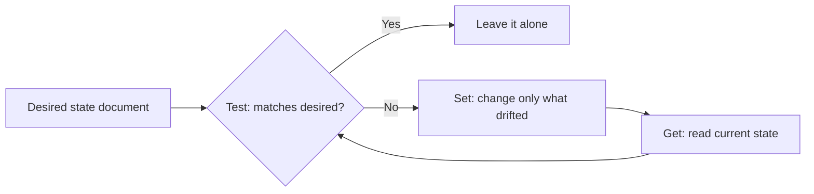
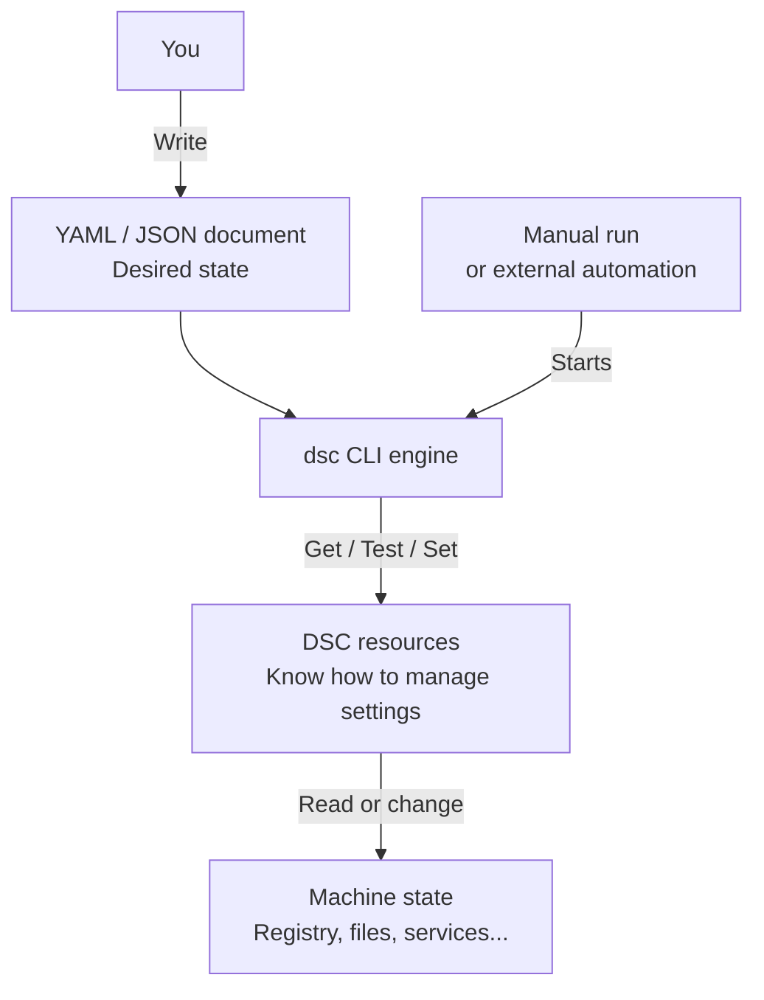

# ⚙️ Desired State Configuration in 2026: What It Actually Is, and How to Use It

**Your servers drift the moment you stop looking. Desired State Configuration is how you declare what "correct" means once, then let the machine keep itself honest.**

> 🎯 **TL;DR** — DSC is a **declarative**, **idempotent** way to describe the state a machine should be in, and then enforce it. The catch in 2026 is that *three different DSCs* live in the wild, and picking the wrong one burns months:
>
> - **Classic PSDSC** — Windows PowerShell 5.1, compiles to **MOF**, applied by the **LCM**, push/pull. Everywhere, but **frozen/legacy**.
> - **DSC v3** — the `dsc` command-line engine, **cross-platform**, **YAML/JSON** documents, **no MOF, no LCM**. The **current** engine.
> - **Azure Machine Configuration** — Azure Policy + Arc, audit/apply/autocorrect at fleet scale. Built on DSC.
>
> The hands-on lab at the bottom is **pure DSC v3**.

---

## The Problem DSC Solves

Imagine a simple task: make sure a folder exists and an SMB share is published. In PowerShell you'd write:

```powershell
New-SmbShare -Name MyShare -Path C:\Data\Share -FullAccess Alice -ReadAccess Bob
```

Clean, readable, and it works beautifully — *the first time*. Run it twice and it throws because the share already exists. Someone gave Bob Full Access last month? The script neither knows nor cares. To make it safe you end up writing this:

```powershell
$share = Get-SmbShare -Name MyShare -ErrorAction SilentlyContinue
if (-not $share) {
    New-SmbShare -Name MyShare -Path C:\Data\Share -FullAccess Alice -ReadAccess Bob
}
else {
    # now reconcile path, permissions, description, everyone you forgot about...
}
```

You are no longer describing **what you want**. You are hand-coding **how to get there**, plus every branch of "what if it's already half-done". Multiply that by a few hundred settings across a few hundred servers and you get **snowflake servers**: each one subtly unique, none reproducible, all quietly drifting.

DSC flips it around. You declare the **desired state** and let a **resource** own the messy reconciliation logic:

- **Declarative** — you state the target, not the procedure.
- **Idempotent** — applying the same configuration repeatedly has the same effect as applying it once. For example, ensuring a folder exists creates it if missing and leaves it alone if already present.
- **Convergent** — every run drags the machine back toward the declared state.

That's the whole pitch: describe the destination once, stop babysitting the journey.

---

## The Mental Model: Get / Test / Set

Every DSC resource — no matter the version, language, or platform — speaks three verbs:

| Verb | Question it answers | Changes the system? |
| --- | --- | --- |
| **Get** | What is the current state of this thing? | No |
| **Test** | Does the current state match what I declared? | No |
| **Set** | Make reality match the declaration. | Only the drift |

That's the entire loop:



The important nuance most people miss: **Set only touches what's wrong**. If 199 settings are correct and 1 has drifted, DSC fixes the 1. That's what makes it safe to run on a schedule instead of praying before every deployment.

---

## The 2026 Landscape (Read This Before You Build Anything)

Here's the part the old tutorials won't tell you, because most of them were written for the 2014 engine. There isn't "a DSC". There are three, and they are **not** the same product with a bigger version number.

### 1. Classic PSDSC — the one in every screenshot

This is what you'll find in 90% of blog posts and in your colleague's demo script. It lives inside **Windows PowerShell 5.1**:

```powershell
Configuration LabDir {
    Node localhost {
        File CreateFolder {
            DestinationPath = 'C:\temp\DSCdir1'
            Ensure          = 'Present'
            Type            = 'Directory'
        }
    }
}
LabDir                                          # compiles to .\LabDir\localhost.mof
Start-DscConfiguration -Path .\LabDir -Wait -Verbose
```

- You author with the `Configuration` / `Node` keywords.
- It **compiles to a MOF file** — the machine-readable format you never asked to read.
- The **Local Configuration Manager (LCM)** — a service baked into the OS — applies it and can re-check on a timer.
- Delivery is **Push** (`Start-DscConfiguration`) or **Pull** (a pull server hands out MOFs and modules).

It still works on every Windows Server. But it is **Windows-only, tied to WMF 5.1, and effectively frozen** — the docs sit on a multi-year "we're not really touching this" cycle. Great to *understand*. A poor thing to *start* a new project on.

### 2. DSC v3 — the current engine

DSC v3 is a rewrite, not a facelift. It ships as a single command-line tool, **`dsc`**:

- **Cross-platform** (Windows, Linux, macOS). The DSC engine itself does not require PowerShell. Resources can be written in **PowerShell**, Bash, Python, C#, Rust, or other languages that implement DSC's resource interface. Each resource may have its own dependencies: a PowerShell resource still needs PowerShell installed.
- **No MOF.** Configuration documents are **YAML or JSON**, with an ARM-template-like feature set (parameters, variables, expression functions).
- **No LCM.** `dsc` is *a command you run*, not a service that runs in the background judging your machine every 15 minutes. If you want it on a schedule, something else has to invoke it (more on that below).
- Same **Get / Test / Set** model.
- **Backward compatible** with classic resources through *adapter* resources (`Microsoft.DSC/PowerShell`, `Microsoft.Windows/WindowsPowerShell`), so your existing PSDSC class resources aren't landfill.

To understand the diagram, start with a local run. Three parts have distinct responsibilities:

1. **The document describes what you want.** You write YAML or JSON that names the resources to use and supplies their desired properties. For example: the registry value `Owner`, under `HKCU\Software\TechBlogLab`, should contain `LabUser`. The document does not contain the code that edits the registry.
2. **The engine coordinates execution.** The `dsc` command reads the document, finds the required resources, and uses them to read state (**Get**), check compliance (**Test**), or enforce the declared state (**Set**, where supported). The engine does not need to know how every registry setting, service, or application works.
3. **The resources know how to manage each setting.** In this example, `Microsoft.Windows/Registry` knows how to read and update the registry. You normally use existing resources; you do not have to write them yourself. Their implementation language is separate from the YAML or JSON configuration document.



**What starts the engine?** In this lab, you run `dsc config get`, `dsc config test`, or `dsc config set` yourself. DSC v3 does not keep monitoring or reapplying the configuration after the command exits. A scheduled task or another automation system must invoke it again for recurring checks or enforcement.

**WinGet**, **Microsoft Dev Box**, and **Azure Machine Configuration** illustrate the higher-level orchestration layer discussed in the [DSC integration overview](https://learn.microsoft.com/en-us/powershell/dsc/overview?view=dsc-3.0#integrating-with-dsc). They are not three consecutive steps or prerequisites for this local lab; their integration details depend on the product and version. The `dsc` CLI itself is not a remote deployment service.

**Remember: the document defines what you want, the resource implements how to manage it, the engine coordinates execution, and external automation decides when to run it.**

### 3. Azure Machine Configuration — DSC at fleet scale

When you need to **audit and enforce** across hundreds of machines — in Azure *and* on-prem via **Arc** — you don't hand-run `dsc` on each box. You use **Azure Machine Configuration** (the feature formerly known as Guest Configuration), driven by **Azure Policy**. It offers three enforcement modes:

| Mode | What it does |
| --- | --- |
| **Audit** | Report compliance only. Touches nothing. |
| **Apply and Monitor** | Apply once, then watch for drift. |
| **Apply and Autocorrect** | Apply and **automatically re-converge** when it drifts. |

It covers Windows Server 2012–2025, Windows 10/11, and a long list of Linux distros, on Azure or Arc-enabled hybrid machines.

### And one thing that's on the clock

> ⚠️ **Azure Automation State Configuration is retiring on 30 September 2027.** If you're still pulling MOFs from Azure Automation DSC, your migration target is **Azure Machine Configuration**. (The Linux DSC extension already retired back in 2023.) Don't start anything new here.

### The one table to remember

| | Classic PSDSC | DSC v3 | Azure Machine Configuration |
| --- | --- | --- | --- |
| **Engine** | Windows PowerShell 5.1 (LCM) | `dsc` CLI | Azure Policy guest agent (uses DSC) |
| **Config format** | PowerShell → **MOF** | **YAML / JSON** | DSC-based guest assignment |
| **Platform** | Windows only | Windows, Linux, macOS | Windows + Linux, Azure + Arc |
| **Runs as** | LCM **service** (scheduled) | A **command** (no service) | Managed by Azure Policy |
| **Delivery** | Push / Pull server | You orchestrate it | Azure Policy, at scale |
| **State model** | Get / Test / Set | Get / Test / Set | Audit / Apply&Monitor / Apply&Autocorrect |
| **Status in 2026** | 🟠 Legacy / frozen | 🟢 **Current** | 🟢 Current (cloud scale) |

---

## Hands-On Lab: DSC v3 in ~10 Minutes

We'll install DSC v3, poke at a couple of resources, then author a real configuration document and watch it detect and fix drift. Everything here is **local and reversible** — the only thing we touch is a throwaway registry key under `HKCU`.

> This lab runs on a Windows 10/11 or Windows Server box with `winget` available. DSC v3 also runs on Linux/macOS; the registry resource is the only Windows-specific bit.

### 1. Install the `dsc` engine

```powershell
# Find the published package in the Microsoft Store source
winget search DesiredStateConfiguration --source msstore

# Install the latest stable DSC v3
winget install --id 9NVTPZWRC6KQ --source msstore

# Sanity check
dsc --version
```

No `winget`? Grab the archive from the [DSC releases page](https://github.com/PowerShell/DSC/releases/latest), extract it, and add the folder to your `PATH`. No installer, no service, no reboot — it's one binary.

### 2. See what resources DSC can find

```powershell
# Every resource DSC currently discovers
dsc resource list

# Filter to the two we'll use
dsc resource list | Select-String -Pattern 'Registry|OSInfo'
```

### 3. Read state with a single resource (Get)

Some resources are **Get/Test-only** — they report reality but there's nothing to "enforce". `Microsoft/OSInfo` is the classic example, and it needs no input:

```powershell
dsc resource get --resource Microsoft/OSInfo --output-format yaml
```

```yaml
actualState:
  family: Windows
  version: 10.0.22631
  edition: Windows 11 Enterprise
  bitness: '64'
```

Resources that identify a specific instance need input. Here's a read-only peek at a registry value:

```powershell
dsc resource get --resource Microsoft.Windows/Registry --input '{
  "keyPath": "HKLM\\Software\\Microsoft\\Windows NT\\CurrentVersion",
  "valueName": "SystemRoot"
}'
```

### 4. Author a configuration document

This is where DSC v3 stops looking like classic DSC. No `Configuration` keyword, no MOF — just a YAML document. Save this as `lab.dsc.config.yaml`:

```yaml
# lab.dsc.config.yaml
$schema: https://aka.ms/dsc/schemas/v3/bundled/config/document.json
resources:
  # Guard clause: only proceed if we're actually on Windows
  - name: Windows only
    type: Microsoft.DSC/Assertion
    properties:
      $schema: https://aka.ms/dsc/schemas/v3/bundled/config/document.json
      resources:
        - name: os
          type: Microsoft/OSInfo
          properties:
            family: Windows

  # The state we actually want to enforce
  - name: Tech-Blog lab marker
    type: Microsoft.Windows/Registry
    properties:
      keyPath: HKCU\Software\TechBlogLab
      valueName: Owner
      valueData:
        String: LabUser
      _exist: true
    dependsOn:
      - "[resourceId('Microsoft.DSC/Assertion', 'Windows only')]"
```

Two ideas worth noticing:

- **`Microsoft.DSC/Assertion`** wraps a Get/Test-only resource (`OSInfo`) into a **guard** — if the assertion fails, the dependent resource never runs. This is how you say *"only do this on Windows"* without a single `if`.
- **`dependsOn`** uses an ARM-style `resourceId()` expression to order things. Same mental model as an ARM/Bicep template, on purpose.

### 5. Get → Test → Set → prove drift is fixed

```powershell
# What does the machine look like right now? (the key doesn't exist yet)
dsc config get --file ./lab.dsc.config.yaml

# Are we already in the desired state? Expect: no.
dsc config test --file ./lab.dsc.config.yaml

# Preview the change without touching anything (ExecutionType = WhatIf)
dsc config set --file ./lab.dsc.config.yaml --what-if

# Enforce it. This creates the key and the value.
dsc config set --file ./lab.dsc.config.yaml

# Test again. Expect: in the desired state.
dsc config test --file ./lab.dsc.config.yaml
```

Now the fun part — break it on purpose and watch DSC converge it back:

```powershell
# Introduce drift
Remove-Item 'HKCU:\Software\TechBlogLab' -Recurse -Force

# DSC notices immediately
dsc config test --file ./lab.dsc.config.yaml

# DSC fixes only what drifted
dsc config set --file ./lab.dsc.config.yaml
```

That last loop — *test says no, set makes it yes, and a second set does nothing* — is idempotency and convergence in three commands. That's the entire point of DSC, minus 900 pages of theory.

> **Verify:** run `dsc config test` and read the **per-instance** result — the registry instance should report it is in the desired state. Then confirm reality with `Get-ItemProperty 'HKCU:\Software\TechBlogLab'` and check `Owner = LabUser` actually exists. A green test with no registry key means you tested the wrong thing.

### 6. Clean up

```powershell
Remove-Item 'HKCU:\Software\TechBlogLab' -Recurse -Force -ErrorAction SilentlyContinue
```

---

## When to Use What

| Situation | Reach for |
| --- | --- |
| New config-as-code, local or in CI, possibly cross-platform | **DSC v3** |
| Enforce **and** audit across Azure / Arc fleets, with autocorrect | **Azure Machine Configuration** (built on DSC) |
| An existing MOF / LCM estate that still works | Keep it running; wrap PSDSC resources with the **v3 adapters**; plan migration |
| Still on **Azure Automation State Configuration** | Migrate to Machine Configuration **before 2027-09-30** |
| Tempted to stand up a brand-new **Pull Server** in 2026 | Don't. |

---

## Gotchas Worth Knowing

- **Classic DSC is frozen.** It's fine to run, fine to learn from, wrong to *start* on. WMF 5.1 only, Windows only, no future features.
- **DSC v3 has no LCM.** This surprises everyone. There's no background agent re-applying every 15 minutes — `dsc` runs when *something* runs it. On a fleet, that "something" is Azure Machine Configuration; locally it's you, a scheduled task, or a CI pipeline. It's a command, not a daemon.
- **MOF is gone in v3.** Documents are YAML/JSON. If a tutorial tells you to `notepad localhost.mof`, it's teaching the legacy engine.
- **Your old resources aren't wasted.** PSDSC class-based resources still work in v3 through `Microsoft.DSC/PowerShell` and `Microsoft.Windows/WindowsPowerShell` adapters.
- **Test before you Set.** `dsc config set --what-if` previews changes without making them. Use it before you enforce anything you'd regret.
- **Get/Test-only resources are features, not bugs.** Things like `OSInfo` exist to be *asserted on* (guards, prerequisites), not enforced.

---

## Sources

- [Microsoft Desired State Configuration overview (DSC v3)](https://learn.microsoft.com/en-us/powershell/dsc/overview)
- [Desired State Configuration Overview for Engineers (declarative vs imperative, idempotency)](https://learn.microsoft.com/en-us/powershell/dsc/overview/dscforengineers)
- [`dsc resource get` — CLI reference](https://learn.microsoft.com/en-us/powershell/dsc/reference/cli/resource/get)
- [`dsc config set` — CLI reference](https://learn.microsoft.com/en-us/powershell/dsc/reference/cli/config/set)
- [What is Azure Machine Configuration?](https://learn.microsoft.com/en-us/azure/governance/machine-configuration/overview)
- [Azure Automation State Configuration overview (retirement notice)](https://learn.microsoft.com/en-us/azure/automation/automation-dsc-overview)
- [PowerShell/DSC releases (GitHub)](https://github.com/PowerShell/DSC/releases/latest)
