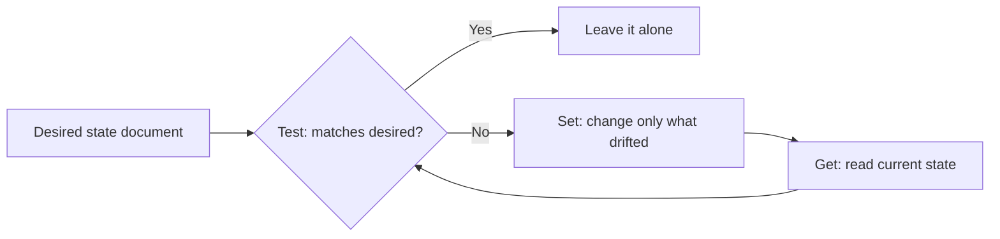
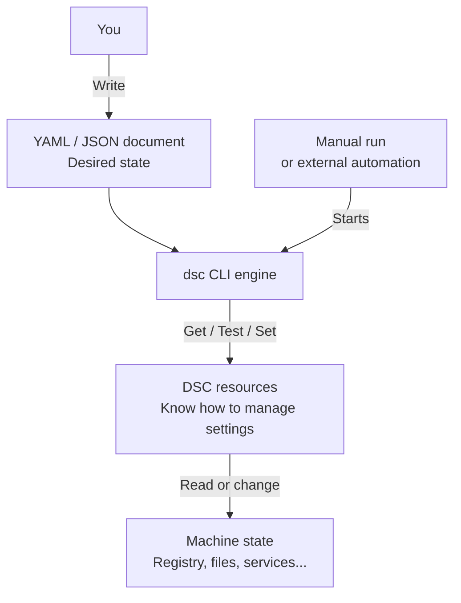
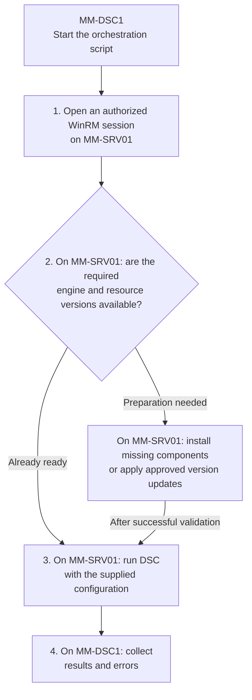

# ⚙️ Desired State Configuration in 2026: What It Actually Is, and How to Use It

**Your servers drift the moment you stop looking. Desired State Configuration is how you declare what "correct" means once, then let the machine keep itself honest.**

> 🎯 **TL;DR** — DSC is a **declarative**, **idempotent** way to describe the state a machine should be in, and then enforce it. The catch in 2026 is that *three different DSCs* live in the wild, and picking the wrong one burns months:
>
> - **Classic PSDSC** — Windows PowerShell 5.1, compiles to **MOF**, applied by the **LCM**, push/pull. Everywhere, but **frozen/legacy**.
> - **DSC v3** — the `dsc` command-line engine, **cross-platform**, **YAML/JSON** documents, **no MOF, no LCM**. The **current** engine.
> - **Azure Machine Configuration** — Azure Policy + Arc, audit/apply/autocorrect at fleet scale. Built on DSC.
>
> The hands-on lab at the bottom is **pure DSC v3**.

---

## Contents

- [The Problem DSC Solves](#the-problem-dsc-solves)
- [The Mental Model: Get / Test / Set](#the-mental-model-get--test--set)
- [The 2026 Landscape](#the-2026-landscape-read-this-before-you-build-anything)
- [Hands-On Labs: Start Small](#hands-on-labs-start-small)
- [Lab 1: Manage One Registry Value](#lab-1-manage-one-registry-value)
- [Lab 2: Run the Same Configuration Remotely](#lab-2-run-the-same-configuration-remotely)
- [Lab 3: Add a Resource for a Windows Server Role](#lab-3-add-a-resource-for-a-windows-server-role)
- [Automate the Initial Preparation](#later-automate-the-initial-preparation)
- [When to Use What](#when-to-use-what)
- [Gotchas Worth Knowing](#gotchas-worth-knowing)
- [Sources](#sources)

---

## The Problem DSC Solves

Imagine a simple task: make sure a folder exists and an SMB share is published. In PowerShell you'd write:

```powershell
New-SmbShare -Name MyShare -Path C:\Data\Share -FullAccess Alice -ReadAccess Bob
```

Clean, readable, and it works beautifully — *the first time*. Run it twice and it throws because the share already exists. Someone gave Bob Full Access last month? The script neither knows nor cares. To make it safe you end up writing this:

```powershell
$share = Get-SmbShare -Name MyShare -ErrorAction SilentlyContinue
if (-not $share) {
    New-SmbShare -Name MyShare -Path C:\Data\Share -FullAccess Alice -ReadAccess Bob
}
else {
    # now reconcile path, permissions, description, everyone you forgot about...
}
```

You are no longer describing **what you want**. You are hand-coding **how to get there**, plus every branch of "what if it's already half-done". Multiply that by a few hundred settings across a few hundred servers and you get **snowflake servers**: each one subtly unique, none reproducible, all quietly drifting.

DSC flips it around. You declare the **desired state** and let a **resource** own the messy reconciliation logic:

- **Declarative** — you state the target, not the procedure.
- **Idempotent** — applying the same configuration repeatedly has the same effect as applying it once. For example, ensuring a folder exists creates it if missing and leaves it alone if already present.
- **Convergent** — every run drags the machine back toward the declared state.

That's the whole pitch: describe the destination once, stop babysitting the journey.

---

## The Mental Model: Get / Test / Set

Every DSC resource — no matter the version, language, or platform — speaks three verbs:

| Verb | Question it answers | Changes the system? |
| --- | --- | --- |
| **Get** | What is the current state of this thing? | No |
| **Test** | Does the current state match what I declared? | No |
| **Set** | Make reality match the declaration. | Only the drift |

That's the entire loop:



The important nuance most people miss: **Set only touches what's wrong**. If 199 settings are correct and 1 has drifted, DSC fixes the 1. That's what makes it safe to run on a schedule instead of praying before every deployment.

---

## The 2026 Landscape (Read This Before You Build Anything)

Here's the part the old tutorials won't tell you, because most of them were written for the 2014 engine. There isn't "a DSC". There are three, and they are **not** the same product with a bigger version number.

### 1. Classic PSDSC — the one in every screenshot

This is what you'll find in 90% of blog posts and in your colleague's demo script. It lives inside **Windows PowerShell 5.1**:

```powershell
Configuration LabDir {
    Node localhost {
        File CreateFolder {
            DestinationPath = 'C:\temp\DSCdir1'
            Ensure          = 'Present'
            Type            = 'Directory'
        }
    }
}
LabDir                                          # compiles to .\LabDir\localhost.mof
Start-DscConfiguration -Path .\LabDir -Wait -Verbose
```

- You author with the `Configuration` / `Node` keywords.
- It **compiles to a MOF file** — the machine-readable format you never asked to read.
- The **Local Configuration Manager (LCM)** — a service baked into the OS — applies it and can re-check on a timer.
- Delivery is **Push** (`Start-DscConfiguration`) or **Pull** (a pull server hands out MOFs and modules).

It still works on every Windows Server. But it is **Windows-only, tied to WMF 5.1, and effectively frozen** — the docs sit on a multi-year "we're not really touching this" cycle. Great to *understand*. A poor thing to *start* a new project on.

### 2. DSC v3 — the current engine

DSC v3 is a rewrite, not a facelift. It ships as a single command-line tool, **`dsc`**:

- **Cross-platform** (Windows, Linux, macOS). The DSC engine itself does not require PowerShell. Resources can be written in **PowerShell**, Bash, Python, C#, Rust, or other languages that implement DSC's resource interface. Each resource may have its own dependencies: a PowerShell resource still needs PowerShell installed.
- **No MOF.** Configuration documents are **YAML or JSON**, with an ARM-template-like feature set (parameters, variables, expression functions).
- **No LCM.** `dsc` is *a command you run*, not a service that runs in the background judging your machine every 15 minutes. If you want it on a schedule, something else has to invoke it (more on that below).
- Same **Get / Test / Set** model.
- **Backward compatible** with classic resources through *adapter* resources (`Microsoft.DSC/PowerShell`, `Microsoft.Windows/WindowsPowerShell`), so your existing PSDSC class resources aren't landfill.

To understand the diagram, start with a local run. Three parts have distinct responsibilities:

1. **The document describes what you want.** You write YAML or JSON that names the resources to use and supplies their desired properties. For example: the registry value `Owner`, under `HKCU\Software\TechBlogLab`, should contain `LabUser`. The document does not contain the code that edits the registry.
2. **The engine coordinates execution.** The `dsc` command reads the document, finds the required resources, and uses them to read state (**Get**), check compliance (**Test**), or enforce the declared state (**Set**, where supported). The engine does not need to know how every registry setting, service, or application works.
3. **The resources know how to manage each setting.** In this example, `Microsoft.Windows/Registry` knows how to read and update the registry. You normally use existing resources; you do not have to write them yourself. Their implementation language is separate from the YAML or JSON configuration document.



**What starts the engine?** In this lab, you run `dsc config get`, `dsc config test`, or `dsc config set` yourself. DSC v3 does not keep monitoring or reapplying the configuration after the command exits. A scheduled task or another automation system must invoke it again for recurring checks or enforcement.

**WinGet**, **Microsoft Dev Box**, and **Azure Machine Configuration** illustrate the higher-level orchestration layer discussed in the [DSC integration overview](https://learn.microsoft.com/en-us/powershell/dsc/overview?view=dsc-3.0#integrating-with-dsc). They are not three consecutive steps or prerequisites for this local lab; their integration details depend on the product and version. The `dsc` CLI itself is not a remote deployment service.

**Remember: the document defines what you want, the resource implements how to manage it, the engine coordinates execution, and external automation decides when to run it.**

### 3. Azure Machine Configuration — DSC at fleet scale

When you need to **audit and enforce** across hundreds of machines — in Azure *and* on-prem via **Arc** — you don't hand-run `dsc` on each box. You use **Azure Machine Configuration** (the feature formerly known as Guest Configuration), driven by **Azure Policy**. It offers three enforcement modes:

| Mode | What it does |
| --- | --- |
| **Audit** | Report compliance only. Touches nothing. |
| **Apply and Monitor** | Apply once, then watch for drift. |
| **Apply and Autocorrect** | Apply and **automatically re-converge** when it drifts. |

It covers Windows Server 2012–2025, Windows 10/11, and a long list of Linux distros, on Azure or Arc-enabled hybrid machines.

### And one thing that's on the clock

> ⚠️ **Azure Automation State Configuration is retiring on 30 September 2027.** If you're still pulling MOFs from Azure Automation DSC, your migration target is **Azure Machine Configuration**. (The Linux DSC extension already retired back in 2023.) Don't start anything new here.

### The one table to remember

| | Classic PSDSC | DSC v3 | Azure Machine Configuration |
| --- | --- | --- | --- |
| **Engine** | Windows PowerShell 5.1 (LCM) | `dsc` CLI | Azure Policy guest agent (uses DSC) |
| **Config format** | PowerShell → **MOF** | **YAML / JSON** | DSC-based guest assignment |
| **Platform** | Windows only | Windows, Linux, macOS | Windows + Linux, Azure + Arc |
| **Runs as** | LCM **service** (scheduled) | A **command** (no service) | Managed by Azure Policy |
| **Delivery** | Push / Pull server | You orchestrate it | Azure Policy, at scale |
| **State model** | Get / Test / Set | Get / Test / Set | Audit / Apply&Monitor / Apply&Autocorrect |
| **Status in 2026** | 🟠 Legacy / frozen | 🟢 **Current** | 🟢 Current (cloud scale) |

---

## Hands-On Labs: Start Small

Each lab adds one concept. **Start with Lab 1; nothing from the later labs is needed to complete it.**

| Machine | Operating system | Role in the labs |
| --- | --- | --- |
| `MM-SRV01` | Windows Server 2025 | The disposable target we configure. Used from Lab 1 onward. |
| `MM-DSC1` | Windows Server 2025 | The administration server. Used from Lab 2 onward. |

| Lab | What you learn | What you add |
| --- | --- | --- |
| 1. Registry | Declare a value, detect a change, restore it | DSC v3 on `MM-SRV01`. The registry resource comes with it. |
| 2. Remote execution | Run the same configuration from `MM-DSC1` | Working, authorized PowerShell Remoting. No new DSC module. |
| 3. Windows Server role | Manage IIS with a PowerShell resource | The `PSDscResources` module on `MM-SRV01`. |

**A prerequisite means "must be available", not "must be installed again".** Windows Server 2025 already includes Windows PowerShell 5.1. DSC v3 is a separate package we install below.

---

## Lab 1: Manage One Registry Value

**Goal:** make `Owner = LabUser` exist under `HKCU\Software\TechBlogLab`, then prove that DSC can restore it after a change.

### What You Need

- **Machine:** `MM-SRV01` only. Open Windows PowerShell as administrator for the setup and keep the same account throughout this lab.
- **Install:** the complete DSC v3 Windows package, in step 1.
- **Already included:** the registry resource in that package; Windows PowerShell in Windows Server.
- **Not needed yet:** extra resource modules, PowerShell 7, IIS, WinRM, a share, or a scheduled task. Leave `MM-DSC1` aside.

`HKCU` means **the current user's registry**. The example changes a lab-only key, not a machine-wide Windows setting. Use a new `TechBlogLab` key so cleanup cannot remove existing data.

### 1. Install DSC

**On `MM-SRV01`.** We install the engine here because this is where the configuration will run.

**Choose one installation method, not both.** Use WinGet when it is available and its Microsoft Store source is accessible. Otherwise, use the ZIP package.

#### Option A: Install Directly with WinGet

WinGet downloads and installs the package for you. First check that the command is available:

```powershell
winget --version
```

**Expected:** a WinGet version number. If the command works, install the stable DSC package:

```powershell
winget install --id 9NVTPZWRC6KQ --source msstore
```

`9NVTPZWRC6KQ` identifies the stable DSC package in the Microsoft Store source. The server needs access to that source, and local policies must allow the installation. Review any source or package agreement prompts before accepting them.


After installation succeeds, check the engine:

```powershell
dsc --version
```

**Expected:** a DSC version starting with `3.`. If `dsc` is not recognized, close and reopen PowerShell under the same account, then try again.


**You can now continue to step 2.** No manual download, extraction, or additional PowerShell resource module is required for this registry lab. This is an [official DSC installation method](https://learn.microsoft.com/en-us/powershell/dsc/install?view=dsc-3.0#install-dsc-using-winget).

#### Option B: Use the ZIP Package

Use this alternative if WinGet is unavailable or its package source is blocked. For an isolated server, transfer the reviewed archive from a machine that can download it.

Download the **stable Windows x64 ZIP** from the [official DSC releases](https://github.com/PowerShell/DSC/releases/latest). For the commands below, place the archive at `C:\Temp\dsc-windows.zip`. Extract the whole package into a new directory, not just the executable:

```powershell
Expand-Archive -LiteralPath 'C:\Temp\dsc-windows.zip' -DestinationPath 'C:\Tools\DSC'
$env:PATH = "C:\Tools\DSC;$env:PATH"
dsc --version
```

**Expected:** a DSC version starting with `3.`. Stop here if the command is not found or fails.

For the ZIP method, the `PATH` line makes the engine and bundled tools discoverable in this PowerShell session. Repeat it when opening another session, adjusting the directory if necessary. If DSC v3 is already installed, reuse it rather than installing another copy.

**For the later labs:** lines that add `C:\Tools\DSC` to `PATH` apply to the ZIP method. With WinGet, omit those lines if `dsc` is already discoverable. Always verify the engine and resource discovery under the account that actually runs DSC; an interactive installation does not prove availability to a different remote or scheduled-task account.

### 2. Discover a Resource and Read State

**On `MM-SRV01`.** A resource is the component that implements an operation. Listing resources only discovers what is available; it does not install anything.

```powershell
dsc resource list Microsoft.Windows/Registry
dsc resource get --resource Microsoft/OSInfo --output-format yaml
```


**Expected:** the first command finds the registry resource. The second describes the operating system of **this server**. It does not change anything.

This is **Get**: asking a resource to report actual state.

### 3. Describe the Desired Value

**On `MM-SRV01`.** Create a working directory for the configuration:

```powershell
New-Item -ItemType Directory -Path 'C:\DSC' -Force | Out-Null
```

Create `C:\DSC\lab.dsc.config.yaml` with the following content. This file describes the result you want; it does not contain registry-editing commands.

```yaml
$schema: https://aka.ms/dsc/schemas/v3/bundled/config/document.json
resources:
  - name: Lab owner
    type: Microsoft.Windows/Registry
    properties:
      keyPath: HKCU\Software\TechBlogLab
      valueName: Owner
      valueData:
        String: LabUser
      _exist: true
```

Read it as: **"Use the Registry resource to ensure that Owner exists and contains the string LabUser."**

- `name` is your label for this instance in the results.
- `type` identifies the installed resource DSC must call.
- `properties` describes the key, value name, data type and desired value.
- `_exist: true` means the declared item must exist.
- `$schema` identifies the document format for validation.

### 4. Check, Preview, Then Apply

**On `MM-SRV01`, under the same account.** Check whether the requested value already exists:

```powershell
dsc config test --file 'C:\DSC\lab.dsc.config.yaml'
```


**Expected on a fresh lab:** the `Lab owner` instance reports `inDesiredState: false`. This means "not configured as requested", not "DSC is broken". A resource-discovery or syntax error is different: resolve it before continuing.

Preview the proposed change, then apply it:

```powershell
dsc config set --file 'C:\DSC\lab.dsc.config.yaml' --what-if
```


`--what-if` previews; it does not create our registry value. After reviewing the output:

```powershell
dsc config set --file 'C:\DSC\lab.dsc.config.yaml'
dsc config test --file 'C:\DSC\lab.dsc.config.yaml'
Get-ItemPropertyValue -LiteralPath 'HKCU:\Software\TechBlogLab' -Name Owner
```


**Expected:** `inDesiredState: true` for the instance and `LabUser` from the registry read. Applying the same document again should leave the value unchanged. That is idempotence.

### 5. Change the Value and Let DSC Restore It

**On `MM-SRV01`.** Simulate someone changing the setting outside DSC:

```powershell
Set-ItemProperty -LiteralPath 'HKCU:\Software\TechBlogLab' -Name Owner -Value 'ChangedOutsideDSC'
dsc config test --file 'C:\DSC\lab.dsc.config.yaml'
```


**Expected:** the instance is no longer in the desired state. DSC detected the difference when you ran `test`; it was not monitoring in the background.

```powershell
dsc config set --file 'C:\DSC\lab.dsc.config.yaml'
dsc config test --file 'C:\DSC\lab.dsc.config.yaml'
Get-ItemPropertyValue -LiteralPath 'HKCU:\Software\TechBlogLab' -Name Owner
```


**Expected:** the value is back to `LabUser`, and the test reports compliance.

### 6. Clean Up

**On `MM-SRV01`, under the same account.** Remove only the disposable key created for this exercise:

```powershell
Remove-Item -LiteralPath 'HKCU:\Software\TechBlogLab' -Recurse -Force
Test-Path -LiteralPath 'HKCU:\Software\TechBlogLab'
```

**Expected:** `False`. Keep DSC installed and keep the YAML document for Lab 2.

**You have now completed a full DSC cycle:** describe, test, apply, introduce drift, and restore. No extra PowerShell resource module was needed.

---

## Lab 2: Run the Same Configuration Remotely

**Goal:** keep the YAML document on `MM-DSC1`, but execute DSC on `MM-SRV01`.

### What You Need

- **Reuse:** DSC and its registry resource on `MM-SRV01`, prepared in Lab 1.
- **New requirement:** network access, name resolution, and an account authorized to open a PowerShell Remoting session on the target.
- **No new DSC installation:** `MM-DSC1` needs PowerShell to send the command, not a local DSC engine.

WinRM is Windows' remote management mechanism. Windows Server already provides it, but firewall rules, authentication, and endpoint permissions must allow your connection. The examples use your current account; a domain lab normally uses Kerberos. Resolve remoting errors before continuing, without weakening authentication to bypass them.

### 1. Check the Remote Execution Context

**Run on `MM-DSC1`.** `Invoke-Command` runs the code inside its script block on `MM-SRV01`:

```powershell
Invoke-Command -ComputerName 'MM-SRV01' -ErrorAction Stop -ScriptBlock {
  $env:PATH = "C:\Tools\DSC;$env:PATH"
  Write-Output "Server      : $env:COMPUTERNAME"
  Write-Output "Account     : $([System.Security.Principal.WindowsIdentity]::GetCurrent().Name)"

  $dscVersion = dsc --version
  if ($LASTEXITCODE -ne 0) {
    throw "DSC version check failed with exit code $LASTEXITCODE."
  }
  Write-Output "DSC version : $dscVersion"
  Write-Output ''
  Write-Output 'Registry resource:'

  dsc resource list Microsoft.Windows/Registry --output-format yaml
  if ($LASTEXITCODE -ne 0) {
    throw "DSC resource discovery failed with exit code $LASTEXITCODE."
  }
}
```


**Expected:** labeled lines for the server (`MM-SRV01`), execution account, and DSC 3.x version, followed by the registry resource details. `--output-format yaml` displays those details on indented lines instead of compact JSON. The screenshot above shows the earlier, unformatted output; the checks are the same. If DSC was installed in another directory, adjust the `PATH` line in these examples.

Notice the distinction: **you start the command on the administration server; DSC runs on the target.** A `dsc config set` run directly on `MM-DSC1` would configure the administration server instead.

### 2. Prepare the Document on the Administration Server

**On `MM-DSC1`.** Create `C:\DSC` and place the unchanged YAML from Lab 1 at `C:\DSC\lab.dsc.config.yaml`.

We will send its **contents** through WinRM. There is no SMB share to create and no configuration file to write on the target for this method.

### 3. Preview, Then Apply on the Target

#### A. Preview: No Changes Applied

**Run on `MM-DSC1`:**

```powershell
$configurationText = Get-Content -LiteralPath 'C:\DSC\lab.dsc.config.yaml' -Raw -Encoding UTF8 -ErrorAction Stop

Invoke-Command -ComputerName 'MM-SRV01' -ArgumentList $configurationText -ErrorAction Stop -ScriptBlock {
  param([string]$ConfigurationText)

  $env:PATH = "C:\Tools\DSC;$env:PATH"
  $OutputEncoding = [System.Text.UTF8Encoding]::new($false)
  $ConfigurationText | dsc config set --file - --what-if --output-format yaml
  if ($LASTEXITCODE -ne 0) {
    throw "DSC operation failed with exit code $LASTEXITCODE."
  }
}
```


`--file -` tells DSC to read the document from **standard input**, the text passed through the pipeline. `$OutputEncoding` keeps that text in UTF-8. The resources themselves must still be installed on the target.

**Readable output:** DSC defaults to compact JSON when its output is captured, as in this remote session. `--output-format yaml` keeps the response on multiple indented lines. Use `--output-format pretty-json` instead if you prefer indented JSON. Neither option changes what DSC does.

**Expected:** a preview returned from `MM-SRV01`. Because this command includes `--what-if`, it has not applied any changes. Review the result before continuing to part B.

To read the preview, look for:

- `hadErrors: false`: DSC reported no operation errors.
- `beforeState` and `afterState`: the current state and the projected state for each resource. With `--what-if`, the projected state has not been applied.
- `changedProperties: []`: no property changes are proposed. For example, `Owner` may already contain `LabUser` from an earlier run.

#### B. Apply: Enforce the Configuration

**Run on `MM-DSC1`, in the same PowerShell session and under the same account.** Reuse `$configurationText` from the preview so you apply the document you just reviewed. If you reopened PowerShell or changed the document, repeat part A first.

The command below deliberately omits **`--what-if`**. DSC can now create or update the registry value on **MM-SRV01**:

```powershell
Invoke-Command -ComputerName 'MM-SRV01' -ArgumentList $configurationText -ErrorAction Stop -ScriptBlock {
  param([string]$ConfigurationText)

  $env:PATH = "C:\Tools\DSC;$env:PATH"
  $OutputEncoding = [System.Text.UTF8Encoding]::new($false)
  $ConfigurationText | dsc config set --file - --output-format yaml
  if ($LASTEXITCODE -ne 0) {
    throw "DSC apply failed with exit code $LASTEXITCODE."
  }
}
```


**Expected:** no reported errors and `Owner = LabUser` in the resource's `afterState`. If the value was already correct, this real run can still report `changedProperties: []`: there was nothing to change. Continue to step 4 to confirm compliance and read the registry value back.

### 4. Verify and Clean Up in the Same Context

**Run on `MM-DSC1`, using the same account and `$configurationText`:**

```powershell
Invoke-Command -ComputerName 'MM-SRV01' -ArgumentList $configurationText -ErrorAction Stop -ScriptBlock {
  param([string]$ConfigurationText)

  $env:PATH = "C:\Tools\DSC;$env:PATH"
  $OutputEncoding = [System.Text.UTF8Encoding]::new($false)
  $ConfigurationText | dsc config test --file - --output-format yaml
  if ($LASTEXITCODE -ne 0) {
    throw "DSC test failed with exit code $LASTEXITCODE."
  }
  Get-ItemPropertyValue -LiteralPath 'HKCU:\Software\TechBlogLab' -Name Owner -ErrorAction Stop
}
```


**Expected:** a compliant resource instance and `LabUser`. Check both: a successful command exit alone is not proof of compliance.

`HKCU` belongs to the **account running DSC on the target**. It may not be the account used for the local lab or an RDP session. That is why verification also runs remotely under the same identity.

When finished, remove the lab-only key through that same connection:

```powershell
Invoke-Command -ComputerName 'MM-SRV01' -ErrorAction Stop -ScriptBlock {
  Remove-Item -LiteralPath 'HKCU:\Software\TechBlogLab' -Recurse -Force -ErrorAction Stop
  Test-Path -LiteralPath 'HKCU:\Software\TechBlogLab'
}
```

**Expected:** `False` from the target. Keep the document and tooling for later runs.

### Optional: Two Other Ways to Supply the Document

The main path above is enough for this lab. These alternatives change **where DSC reads the document**, not which machine it configures. Choose one method per run.

#### Alternative A: Copy the File

**Run on `MM-DSC1`.** Transfer the file through WinRM and run DSC against the target's local copy:

```powershell
$session = New-PSSession -ComputerName 'MM-SRV01' -ErrorAction Stop
try {
  Invoke-Command -Session $session -ErrorAction Stop -ScriptBlock {
    New-Item -ItemType Directory -Path 'C:\DSC' -Force -ErrorAction Stop | Out-Null
  }
  Copy-Item -LiteralPath 'C:\DSC\lab.dsc.config.yaml' -Destination 'C:\DSC\lab.dsc.config.yaml' -ToSession $session -ErrorAction Stop
  Invoke-Command -Session $session -ErrorAction Stop -ScriptBlock {
    $env:PATH = "C:\Tools\DSC;$env:PATH"
    dsc config set --file 'C:\DSC\lab.dsc.config.yaml' --what-if
    if ($LASTEXITCODE -ne 0) {
      throw "DSC preview failed with exit code $LASTEXITCODE."
    }
  }
}
finally {
  Remove-PSSession -Session $session
}
```

**Trade-off:** the target can reuse the local copy, but you must update it when the configuration changes. No separate SMB share is needed. This example creates a directory and transfers a file even though the DSC operation itself is only a preview.

#### Alternative B: Read a UNC Share

**Run on `MM-SRV01`,** using an account that can read the existing `DSC` share on `MM-DSC1`:

```powershell
$env:PATH = "C:\Tools\DSC;$env:PATH"
dsc config set --file '\\MM-DSC1\DSC\lab.dsc.config.yaml' --what-if
if ($LASTEXITCODE -ne 0) {
  throw "DSC preview failed with exit code $LASTEXITCODE."
}
```

**Trade-off:** the document is centralized, but each read needs SMB connectivity and both share and NTFS read permissions.

If you wrap this command in a WinRM call from the administration server, the target must authenticate again to the share. The first connection's credentials are not automatically forwarded: this is the [second-hop problem](https://learn.microsoft.com/en-us/powershell/scripting/security/remoting/ps-remoting-second-hop). Avoid that complication in the first remote test by sending the contents or using a local copy.

Sending only the main document does not supply included files or fix network access needed by a resource. Stage those dependencies separately; paths on `MM-DSC1` are not automatically paths on `MM-SRV01`.

### Optional: Schedule a Working Script

Get the manual run working first. Scheduling repeats your script; it does not add a monitoring service to DSC v3.

| Task location | What it does | Availability requirement |
| --- | --- | --- |
| `MM-DSC1` | Runs a script that connects to `MM-SRV01` and invokes DSC there | The administration server, network, target, and remoting authentication must be available at each run. |
| `MM-SRV01` | Invokes its local DSC engine against a local document or accessible UNC path | A local copy can be used independently of `MM-DSC1`; a UNC document still requires the share. |

For our centralized lab, use a task on **MM-DSC1** with the content-through-WinRM method. Decide whether it should audit with `test` or enforce with `set`; do not schedule the cleanup commands.

Test under the task's actual account. It needs document access and remote authentication; a task without network credentials may fail remotely. Keep credentials out of scripts and YAML, restrict modification of configurations and resources, prevent overlapping runs, and record the results. Remember that changing the account also changes which `HKCU` you manage.

---

## Lab 3: Add a Resource for a Windows Server Role

**Goal:** use DSC to ensure IIS is installed on `MM-SRV01`. Unlike Lab 1, this needs an additional resource module.

### What You Need

| Component on `MM-SRV01` | Action |
| --- | --- |
| DSC v3 | Reuse the installation from Lab 1. |
| Windows PowerShell 5.1, `ServerManager`, `Dism` | Already provided by Windows Server 2025. Check they are available. |
| `Microsoft.Adapter/WindowsPowerShell` adapter | Included in the DSC 3.2.3 Windows package. No separate installation. |
| `PSDscResources` | Install this additional module for its `WindowsFeature` resource. |
| An administrative execution account | Required to install modules for all users and manage server roles. |

The **adapter** is the bridge from the DSC v3 engine to an existing Windows PowerShell resource. `PSDscResources` supplies that resource. Neither is the IIS role itself.

### 1. Install and Find WindowsFeature

**Choose one option.** Both install the resource module on `MM-SRV01`; only the place where you start the commands changes.

#### Option A: Install Locally on MM-SRV01

**On `MM-SRV01`, in Windows PowerShell 5.1 opened as administrator.** Keep the DSC tools on the current session's `PATH`:

```powershell
$env:PATH = "C:\Tools\DSC;$env:PATH"
$PSVersionTable.PSVersion
Install-Module -Name PSDscResources -Repository PSGallery -Scope AllUsers
Get-DscResource -Name WindowsFeature -Module PSDscResources
dsc resource list --adapter Microsoft.Adapter/WindowsPowerShell PSDscResources/WindowsFeature
```

**Expected:** PowerShell version 5.1 and discovery of `PSDscResources/WindowsFeature`, with `requireAdapter` set to `Microsoft.Adapter/WindowsPowerShell`. The `--adapter` option includes resources exposed through the adapter; listing resources without it does not enumerate those adapted resources. Confirm this discovery before continuing.

The installation requires repository access and may prompt for a package provider or repository confirmation. In an isolated lab, stage the reviewed module and dependencies offline instead. Record the module version used. Installing it only on `MM-DSC1` would not make it available on the target.

#### Option B: Install Remotely from MM-DSC1

**Run on `MM-DSC1`, with an account authorized for WinRM and administrator on `MM-SRV01`.** The session executes the installation on the target, not on the administration server.

This method requires **repository access from `MM-SRV01`**. It also assumes that `dsc` is already discoverable in the remote session, as checked in Lab 2. For a ZIP installation, add the `PATH` line from option A inside the script block if needed.

```powershell
Invoke-Command -ComputerName 'MM-SRV01' -ConfigurationName 'Microsoft.PowerShell' -ErrorAction Stop -ScriptBlock {
  $ErrorActionPreference = 'Stop'

  Write-Output "Server: $env:COMPUTERNAME"
  $PSVersionTable.PSVersion

  $nugetProvider = Get-PackageProvider -ListAvailable |
    Where-Object {
      $_.Name -eq 'NuGet' -and $_.Version -ge [version]'2.8.5.201'
    }

  if (-not $nugetProvider) {
    Install-PackageProvider -Name NuGet -MinimumVersion '2.8.5.201' -Scope AllUsers -Force | Out-Null
  }

  Install-Module -Name PSDscResources -Repository PSGallery -Scope AllUsers -Force

  Get-DscResource -Name WindowsFeature -Module PSDscResources

  dsc resource list --adapter Microsoft.Adapter/WindowsPowerShell PSDscResources/WindowsFeature --output-format yaml
  if ($LASTEXITCODE -ne 0) {
    throw "DSC resource discovery failed with exit code $LASTEXITCODE."
  }
}
```


**Expected:** `Server: MM-SRV01`, PowerShell version 5.1, and discovery of `PSDscResources/WindowsFeature`, with `requireAdapter: Microsoft.Adapter/WindowsPowerShell` in the YAML details. Confirm this discovery before continuing.

- `-ConfigurationName 'Microsoft.PowerShell'` selects the target's Windows PowerShell 5.1 endpoint.
- NuGet is a package provider used for downloads. The block installs it only if a sufficient version is missing, avoiding its first-use confirmation prompt.
- `-Scope AllUsers` makes the module available to all users of the target. `-Force` avoids common installation confirmations and can overwrite an existing matching module version. Use reviewed packages; this is a real installation, not a preview.

If the target cannot reach the repository, download the reviewed module and dependencies on `MM-DSC1` and transfer them through WinRM instead. Running `Install-Module` remotely does not make the download originate from the administration server.

**Installing the resource module does not install IIS.** It supplies the code that DSC will call when a configuration requests a role. See the [WindowsFeature reference](https://learn.microsoft.com/en-us/powershell/dsc/reference/psdscresources/resources/windowsfeature/windowsfeature?view=dsc-2.0) and [DSC resource adapter overview](https://learn.microsoft.com/en-us/powershell/dsc/overview?view=dsc-3.0#differences-from-powershell-dsc).

### 2. Check the Starting State

**On `MM-SRV01`, in Windows PowerShell 5.1 opened as administrator.** After either installation option, continue with this local check:

```powershell
Get-WindowsFeature -Name Web-Server | Select-Object Name, Installed, InstallState
```

**Expected for this exercise:** `Installed` is `False`. If this is an existing IIS server, use another disposable VM; do not remove an existing role to make the demo fit.

`Web-Server` is the feature's technical name, not its display label. Windows must have access to the role installation files in its component store or an approved source.

### 3. Declare That IIS Must Be Present

**Choose where to prepare the document.** Both workflows use the same YAML and configure the same target:

| Workflow | Create the document on | Continue with |
| --- | --- | --- |
| Local | `MM-SRV01` | Step 4, option A: run DSC locally. |
| Remote | `MM-DSC1` | Step 4, option B: send the contents through WinRM. |

On the chosen machine, create `C:\DSC\iis.dsc.config.yaml`, separate from the registry document. Creating this file does not install IIS:

```yaml
$schema: https://aka.ms/dsc/schemas/v3/bundled/config/document.json
resources:
  - name: IIS web server
    type: PSDscResources/WindowsFeature
    properties:
      Name: Web-Server
      Ensure: Present
```

Declare the **resource itself** in `type`. DSC discovers its required adapter, `Microsoft.Adapter/WindowsPowerShell`, and uses it to invoke `WindowsFeature` in Windows PowerShell 5.1. Do not add a separate adapter wrapper to this document. `Ensure: Present` requests installation if the role is missing.

We still use the **DSC v3 engine and YAML**. Reusing a PowerShell resource does not turn this into an LCM-managed configuration.

**For the remote workflow:** the file stays on `MM-DSC1`. You do not need another copy on `MM-SRV01` or a shared folder. The next step sends the YAML text to the target, where DSC and `PSDscResources` must already be available.

### 4. Apply and Verify

Use the option matching the document location chosen in step 3. There is no need to run both.

**For this resource, use `test` before `set`.** The Windows PowerShell adapter used here does not support `set --what-if`. A test compares the actual and desired state without installing or removing IIS; it is not a simulation of the installation. The registry resource in Labs 1 and 2 supports preview, but not every resource or adapter does.

#### Option A: Run Locally on MM-SRV01

**On `MM-SRV01`.** First check whether IIS is already installed as requested:

```powershell
dsc config test --file 'C:\DSC\iis.dsc.config.yaml' --output-format yaml
```

**Expected if IIS is absent:** `inDesiredState: false` for the IIS instance, without operation errors. Nothing has been installed by this check. When you are ready to install the role, apply and verify:

```powershell
dsc config set --file 'C:\DSC\iis.dsc.config.yaml'
dsc config test --file 'C:\DSC\iis.dsc.config.yaml'
Get-WindowsFeature -Name Web-Server | Select-Object Name, Installed, InstallState
```

**Expected:** the IIS resource reports compliance and `Installed` is `True`. If installation requires a restart, complete it in the lab's maintenance window and rerun the checks. DSC v3 does not provide an automatic reboot-and-resume service.

#### Option B: Run Remotely from MM-DSC1

**Run on `MM-DSC1`, with an account authorized for WinRM and administrator on `MM-SRV01`.** As in Lab 2, `dsc` must be discoverable in the remote session. For the ZIP installation, add its `PATH` line inside the script blocks if needed.

**First, check without changing anything.** Read the IIS document on the administration server and send its contents to the target for a compliance test:

```powershell
$iisConfigurationText = Get-Content -LiteralPath 'C:\DSC\iis.dsc.config.yaml' -Raw -Encoding UTF8 -ErrorAction Stop

Invoke-Command -ComputerName 'MM-SRV01' -ConfigurationName 'Microsoft.PowerShell' -ArgumentList $iisConfigurationText -ErrorAction Stop -ScriptBlock {
  param([string]$IisConfigurationText)

  $ErrorActionPreference = 'Stop'
  $OutputEncoding = [System.Text.UTF8Encoding]::new($false)
  $IisConfigurationText | dsc config test --file - --output-format yaml
  if ($LASTEXITCODE -ne 0) {
    throw "DSC test failed with exit code $LASTEXITCODE."
  }
}
```


**Expected if IIS is absent:** the IIS instance reports `inDesiredState: false`. `--file -` reads the transmitted text, and `test` checks compliance without applying changes. A noncompliant result is normal here; an operation error must be resolved before continuing.

**Then, apply and verify.** After reviewing the test result and deciding to install IIS, run this on `MM-DSC1` in the same session and under the same account. Reuse `$iisConfigurationText` so you apply the checked document. If you reopened PowerShell or changed the document, repeat the check first.

```powershell
Invoke-Command -ComputerName 'MM-SRV01' -ConfigurationName 'Microsoft.PowerShell' -ArgumentList $iisConfigurationText -ErrorAction Stop -ScriptBlock {
  param([string]$IisConfigurationText)

  $ErrorActionPreference = 'Stop'
  $OutputEncoding = [System.Text.UTF8Encoding]::new($false)
  $IisConfigurationText | dsc config set --file - --output-format yaml
  if ($LASTEXITCODE -ne 0) {
    throw "DSC apply failed with exit code $LASTEXITCODE."
  }

  $IisConfigurationText | dsc config test --file - --output-format yaml
  if ($LASTEXITCODE -ne 0) {
    throw "DSC test failed with exit code $LASTEXITCODE."
  }
  Get-WindowsFeature -Name Web-Server | Select-Object Name, Installed, InstallState
}
```


**Expected:** the IIS resource is compliant and `Installed` is `True` on **MM-SRV01**. This block runs `set`, so it can install IIS. `MM-DSC1` only initiates the commands and receives their results; it is not configured by this operation. Handle any required restart on the target before considering the checks complete.

This manages **role installation**, not your application's website, bindings, certificate, or firewall policy. Those are separate desired states.

### 5. Optional Cleanup

**Skip this step if you want to keep IIS.** Only remove it if it was absent before this lab. Removing the role also removes its subfeatures, so use these commands only on the disposable target.

**Choose one option.** Both remove IIS from `MM-SRV01`; the difference is where you keep the document and start the commands.

#### Option A: Clean Up Locally on MM-SRV01

**On `MM-SRV01`, in Windows PowerShell 5.1 opened as administrator.** In `C:\DSC\iis.dsc.config.yaml`, change `Ensure: Present` to `Ensure: Absent` and save the file.


**First, check without removing anything:**

```powershell
dsc config test --file 'C:\DSC\iis.dsc.config.yaml' --output-format yaml
```

**Expected while IIS is installed:** `inDesiredState: false`, because the desired state is now `Absent`. Resolve any operation errors before continuing.

**Then, remove and verify.** Run this only when you are ready to uninstall IIS:

```powershell
dsc config set --file 'C:\DSC\iis.dsc.config.yaml' --output-format yaml
dsc config test --file 'C:\DSC\iis.dsc.config.yaml' --output-format yaml
Get-WindowsFeature -Name Web-Server -ErrorAction Stop | Select-Object Name, Installed, InstallState
```

**Expected:** `Installed` is `False`, and the IIS instance reports compliance with `Absent`.

#### Option B: Clean Up Remotely from MM-DSC1

**On `MM-DSC1`, using an account authorized for WinRM and administrator on `MM-SRV01`.** In `C:\DSC\iis.dsc.config.yaml` on the administration server, change `Ensure: Present` to `Ensure: Absent` and save the file.

**First, load the edited document and check without removing anything:**

```powershell
$iisCleanupText = Get-Content -LiteralPath 'C:\DSC\iis.dsc.config.yaml' -Raw -Encoding UTF8 -ErrorAction Stop

Invoke-Command -ComputerName 'MM-SRV01' -ConfigurationName 'Microsoft.PowerShell' -ArgumentList $iisCleanupText -ErrorAction Stop -ScriptBlock {
  param([string]$IisCleanupText)

  $ErrorActionPreference = 'Stop'
  $OutputEncoding = [System.Text.UTF8Encoding]::new($false)
  $IisCleanupText | dsc config test --file - --output-format yaml
  if ($LASTEXITCODE -ne 0) {
    throw "DSC cleanup check failed with exit code $LASTEXITCODE."
  }
}
```

**Expected while IIS is installed:** `inDesiredState: false` for the IIS instance, with no operation errors. The file stays on `MM-DSC1`; only its contents are sent to `MM-SRV01`. As in step 4, `dsc` must be available in the remote session; add the ZIP installation's `PATH` line inside the script blocks if needed.

**Then, remove and verify.** After checking the result and confirming removal, run this from the same session on `MM-DSC1`, under the same account. Reuse `$iisCleanupText`, not the installation text from step 4. If the session or document changed, repeat the check above first.

```powershell
Invoke-Command -ComputerName 'MM-SRV01' -ConfigurationName 'Microsoft.PowerShell' -ArgumentList $iisCleanupText -ErrorAction Stop -ScriptBlock {
  param([string]$IisCleanupText)

  $ErrorActionPreference = 'Stop'
  $OutputEncoding = [System.Text.UTF8Encoding]::new($false)
  $IisCleanupText | dsc config set --file - --output-format yaml
  if ($LASTEXITCODE -ne 0) {
    throw "DSC cleanup failed with exit code $LASTEXITCODE."
  }

  $IisCleanupText | dsc config test --file - --output-format yaml
  if ($LASTEXITCODE -ne 0) {
    throw "DSC cleanup verification failed with exit code $LASTEXITCODE."
  }
  Get-WindowsFeature -Name Web-Server | Select-Object Name, Installed, InstallState
}
```

**Expected:** `Installed` is `False` on **MM-SRV01**, and DSC reports compliance with `Absent`. This second block performs the actual removal; the administration server is not changed.

For either option, handle any requested restart on the target and rerun the checks before considering cleanup complete. Keep DSC and the resource module installed for other exercises. Removing the role from the YAML instead of declaring `Absent` would stop managing it, not uninstall it.

---

## Later: Automate the Initial Preparation

This is **not a prerequisite for Lab 1**. It explains how to repeat the setup on freshly installed servers without logging on to each one.

**Bootstrap** means preparing the engine and required resources before the first DSC run. Windows Server already provides PowerShell and WinRM; the missing DSC components can be deployed through an authorized remote session.

From `MM-DSC1`, a preparation script would:

1. Connect to `MM-SRV01` over WinRM.
2. Check the engine and resource versions; install only missing components or approved updates.
3. Supply the document and run DSC on the target.
4. Collect the results and errors on the administration server.



**First run:** prepare missing tooling, then apply the configuration. **Later runs:** reuse the tooling. A new resource or a planned version update can require additional preparation; reinstalling everything on every run is unnecessary.

You can also include the approved package and modules in a VM template, or transfer staged packages from `MM-DSC1` to avoid downloads from the target.

**The limit:** an authorized management connection must already work. DSC cannot configure a target where its engine is missing or bypass failed network access, authentication, or permissions. Stop on preparation errors before applying the document.

This describes the workflow, not an implemented bootstrap script. It remains separate from the manual labs above.

---

## When to Use What

| Situation | Reach for |
| --- | --- |
| New config-as-code, local or in CI, possibly cross-platform | **DSC v3** |
| Enforce **and** audit across Azure / Arc fleets, with autocorrect | **Azure Machine Configuration** (built on DSC) |
| An existing MOF / LCM estate that still works | Keep it running; wrap PSDSC resources with the **v3 adapters**; plan migration |
| Still on **Azure Automation State Configuration** | Migrate to Machine Configuration **before 2027-09-30** |
| Deploying a new **classic DSC pull server** | For a new project, first evaluate **DSC v3 with suitable automation** or **Azure Machine Configuration**. A classic pull server mainly makes sense when existing requirements justify it. |

A **classic DSC pull server** stores MOF configurations and resource modules. Target machines use their **LCM** to periodically retrieve them: **the targets initiate the request**. In the labs above, `MM-DSC1` instead initiates remote DSC v3 runs on `MM-SRV01`.

---

## Gotchas Worth Knowing

- **Classic DSC is frozen.** It's fine to run, fine to learn from, wrong to *start* on. WMF 5.1 only, Windows only, no future features.
- **DSC v3 has no LCM.** This surprises everyone. There's no background agent re-applying every 15 minutes — `dsc` runs when *something* runs it. On a fleet, that "something" is Azure Machine Configuration; locally it's you, a scheduled task, or a CI pipeline. It's a command, not a daemon.
- **MOF is gone in v3.** Documents are YAML/JSON. If a tutorial tells you to `notepad localhost.mof`, it's teaching the legacy engine.
- **Your old resources aren't wasted.** PSDSC class-based resources still work in v3 through `Microsoft.DSC/PowerShell` and `Microsoft.Windows/WindowsPowerShell` adapters.
- **Test before you Set.** `dsc config test` checks compliance without applying changes. Use `dsc config set --what-if` for a preview only when the resource or adapter supports it; it is not available for every configuration.
- **Get/Test-only resources are features, not bugs.** Things like `OSInfo` exist to be *asserted on* (guards, prerequisites), not enforced.

---

## Sources

- [Microsoft Desired State Configuration overview (DSC v3)](https://learn.microsoft.com/en-us/powershell/dsc/overview)
- [Desired State Configuration Overview for Engineers (declarative vs imperative, idempotency)](https://learn.microsoft.com/en-us/powershell/dsc/overview/dscforengineers)
- [`dsc resource get` — CLI reference](https://learn.microsoft.com/en-us/powershell/dsc/reference/cli/resource/get)
- [`dsc config set` — CLI reference](https://learn.microsoft.com/en-us/powershell/dsc/reference/cli/config/set)
- [What is Azure Machine Configuration?](https://learn.microsoft.com/en-us/azure/governance/machine-configuration/overview)
- [Azure Automation State Configuration overview (retirement notice)](https://learn.microsoft.com/en-us/azure/automation/automation-dsc-overview)
- [PowerShell/DSC releases (GitHub)](https://github.com/PowerShell/DSC/releases/latest)
