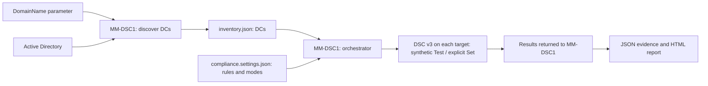

# Domain Controller Compliance with DSC v3: Centralized Auditing, Reporting, and Controlled Remediation

**A security setting being defined somewhere is not proof that every domain controller is running with that setting.**

The [first DSC article](<./Desired State Configuration in 2026 - What It Actually Is and How to Use It.md>) introduced desired state, resources, and remote execution. Here, one administration server checks several domain controllers, reports differences, and corrects only selected settings. The execution path uses **DSC v3 native command-based resources**, not a legacy DSC adapter or Local Configuration Manager (LCM).

> **TL;DR**
>
> - A discovery script on `MM-DSC1` writes the DCs from `mathiasmotron.com` to `inventory.json`.
> - A separate compliance parameter file defines the checks, expected values, configuration owners, and audit or enforcement modes.
> - The orchestrator on MM-DSC1 reads both files: the inventory tells it which machines exist; the parameters tell it what to check.
> - DSC v3 calls five custom resources on each target to read Windows state, then compares the requested properties. PowerShell provides orchestration and reporting.
> - Settings owned by Group Policy are audited, not repeatedly overwritten locally by DSC.
> - Remediation is a separate, explicitly triggered operation against a smaller configuration document. It is disabled by default.

The accompanying scripts implement discovery, eleven checks across five control families, HTML/CSV/JSON reporting, and selective remediation. The walkthrough starts with one DC and one control, then expands to the inventory. **All five `Blog.DC/*` resources are custom examples supplied with this article, not first-party or Microsoft-certified resources.** This is not a complete Microsoft security baseline or an AD health assessment.

---

## Contents

- [The Environment](#the-environment)
- [Who Does What](#who-does-what)
- [The Five Control Families](#the-five-control-families)
- [One Setting, One Configuration Owner](#one-setting-one-configuration-owner)
- [Step 1: Download and Prepare the Files](#step-1-download-and-prepare-the-files)
- [Step 2: Build the DC Inventory](#step-2-build-the-dc-inventory)
- [Step 3: Define the Compliance Parameters](#step-3-define-the-compliance-parameters)
- [Step 4: Prepare the Target DCs](#step-4-prepare-the-target-dcs)
- [Step 5: Run the Compliance Audit](#step-5-run-the-compliance-audit)
- [Step 6: Read the Reports](#step-6-read-the-reports)
- [Step 7: Correct Selected Settings](#step-7-correct-selected-settings)
- [Step 8: Schedule the Audit](#step-8-schedule-the-audit)
- [Operational Constraints](#operational-constraints)
- [Verification](#verification)
- [Sources](#sources)

---

## The Environment

| Component | Role | What is already known |
| --- | --- | --- |
| `MM-DSC1` | Administration and orchestration server | Windows Server 2025; RSAT AD DS tools are already available |
| `mathiasmotron.com` | AD domain to enumerate | Explicitly configured; we do not automatically expand to the entire forest |
| `MM-DC1`, `MM-DC2`, `MM-DC3` | DCs discovered in this environment | Use the FQDNs from the generated inventory; OS versions and read-only status come from AD |

`MM-DSC1` remains the administration server. Nothing in this article promotes it, or the previous article's `MM-SRV01`, to a domain controller.

The inventory runs in **Windows PowerShell 5.1 on MM-DSC1**, from a filesystem location, with an account that has AD read permissions. It requires working domain DNS resolution and connectivity to AD, including Active Directory Web Services for these cmdlets.

**No installation on the DCs is needed for this first step.** It does not use DSC, WinRM, or a remote script on every DC. It queries AD to obtain the list of machines. Successful directory discovery does not prove that those machines can later accept a WinRM connection.

The later compliance steps require a working WinRM endpoint, an account with the necessary Windows permissions, DSC **3.2.3 x64**, and the supplied native resources on each selected DC. Installing RSAT on MM-DSC1 does not provide those components on the targets.

The runner accepts writable Windows Server 2019, 2022, and 2025 DCs, checks their live OS build and identity, and excludes RODCs. Its preflight requires an **elevated x64 Windows PowerShell 5.1 target context**, including for an audit. Directory read access alone is insufficient. MM-DSC1 does not need DSC installed for normal orchestration; only the optional local engine integration test needs a portable runtime there.

---

## Who Does What

A **baseline** is a versioned set of requirements that defines the expected configuration. For example, a baseline might require a particular service to be stopped, or a particular audit subcategory to be enabled.

The download contains **nine root files and a Resources folder containing eight files**. They are not scripts to run one after another. Keep this structure under `C:\DSC\DomainControllersDCS` on MM-DSC1; the main commands load their supporting files automatically.

### Commands You Run

Run these commands from **MM-DSC1**:

| File | What it does | When to use it |
| --- | --- | --- |
| [Get-DCInventory.ps1](./DomainControllersDCS/Get-DCInventory.ps1) | Queries AD and writes the DC hostnames, directory metadata, and discovery time to `inventory.json`. | Create or refresh the inventory. It does not audit or change the DCs. |
| [Initialize-DCCompliance.ps1](./DomainControllersDCS/Initialize-DCCompliance.ps1) | Downloads the pinned DSC runtime and packages the local Resources folder on MM-DSC1, then installs both on selected DCs through WinRM. | Prepare the targets, not before every audit. It installs tools, not the security baseline. |
| [Invoke-DCCompliance.ps1](./DomainControllersDCS/Invoke-DCCompliance.ps1) | Reads the inventory and compliance parameters, invokes DSC on the target DCs, and produces HTML, CSV, and JSON reports. | **The routine entry point.** Audit is the default; correction requires `-Operation Remediate` and explicit target and control selections. |

### Supporting Files

| File | What it does | How it is used |
| --- | --- | --- |
| [compliance.settings.json](./DomainControllersDCS/compliance.settings.json) | Defines controls, expected values, configuration owners, modes, and runtime/resource versions and paths. | **The parameter file you edit**, not a script to execute. Discovery never overwrites it. |
| [DCCompliance.psm1](./DomainControllersDCS/DCCompliance.psm1) | Provides shared functions for input validation, DSC document generation, result interpretation, and reporting. | Imported automatically by the main scripts. It is not a separate command to run. |
| [Invoke-DCResource.ps1](./DomainControllersDCS/Invoke-DCResource.ps1) | Checks the live target context, executes DSC, and captures its output and errors. | Its content is sent through WinRM by the orchestrator and **executed on the target DC**. No manual invocation or separate script copy is needed. |
| [Invoke-ScheduledDCAudit.ps1](./DomainControllersDCS/Invoke-ScheduledDCAudit.ps1) | Refreshes inventory, runs an audit, and records an execution transcript. Stops if discovery fails. | Optional entry point for Task Scheduler on MM-DSC1. It does not create the task or perform remediation. |
| [Test-DCCompliance.ps1](./DomainControllersDCS/Test-DCCompliance.ps1) | Tests the scripts using simulated AD, WinRM, and DSC responses. | Optional offline code validation, not an audit of the real DCs. It is not required to run a normal audit. |
| [Test-NativeResources.ps1](./DomainControllersDCS/Test-NativeResources.ps1) | Tests resource behavior with mocks; optionally exercises the real DSC engine with simulated Windows effects. | Optional local verification, described under [Verification](#verification). It does not validate a live DC. |
| [Resources](./DomainControllersDCS/Resources) | Five `*.dsc.resource.json` manifests plus the three implementation files below. | Copied as a complete, versioned resource package to each selected DC. |

Inside Resources, [Invoke-NativeResource.ps1](./DomainControllersDCS/Resources/Invoke-NativeResource.ps1) is the command entry point, [NativeResources.psm1](./DomainControllersDCS/Resources/NativeResources.psm1) is a plain PowerShell script library, and [NativeAudit.cs](./DomainControllersDCS/Resources/NativeAudit.cs) provides the audit-policy Windows API interop. The `.psm1` extension does **not** make this library a legacy PowerShell DSC module.

The generated `inventory.json` is an additional output file, not a supplied configuration file. It describes **which machines exist**; the compliance parameters describe **what to check**. Neither the test suite nor the scheduled entry point is needed for a manual audit.

Changing a desired value does not require rediscovering the DCs. Rediscovering the DCs does not overwrite the compliance parameters.

For each control, `Audit` means test and report without correction. `Enforce` makes a DSC-owned control eligible for correction when the remediation operation is explicitly started. A normal audit still uses `Test` for both modes. These modes and ownership rules belong to our orchestrator, not to the native DSC resource properties.

The workflow is:



DSC v3 does not discover the domain, provide a central dashboard, or schedule itself. PowerShell and Task Scheduler provide those surrounding functions. The `dsc` command executes on each target DC, not on MM-DSC1.

### How Native Resources Work

A **resource manifest** tells DSC the resource's type, version, property schema, and command to execute. These five manifests define **Get**, which returns observed state as JSON. They do not need a separate Test command: DSC v3 supplies **synthetic Test**, calling Get and comparing the requested desired properties itself. Only Spooler and EventLog also expose **Set**, the operation that can change Windows configuration.

Here, ordinary x64 Windows PowerShell 5.1 hosts those commands. It does not import `PSDesiredStateConfiguration` or call `Invoke-DscResource` or `Get-DscResource`. The `Microsoft.PowerShell` WinRM endpoint is transport only, not a DSC adapter. There are no MOF documents, LCM jobs, or `get-adapter` invocations in this route.

The distinction matters: **native** describes the DSC manifest and command contract, not the implementation language. A PowerShell script can implement a native DSC v3 resource without using legacy PowerShell DSC.

---

## The Five Control Families

These five **families** cover settings expected to be configured identically across the DCs in scope. Each family can contain several resource instances. SMBv1 and SMB signing, for example, should have separate results so that one failure cannot hide the other.

| ID prefix | Custom resource | What it reads | Correction policy |
| --- | --- | --- | --- |
| DSC-01 | `Blog.DC/Spooler` | Service state and startup type through Service Control Manager/CIM | Audit initially; optional Set for DSC-owned settings |
| DSC-02 | `Blog.DC/SmbServer` | Inbox `Get-SmbServerConfiguration`: SMB1 and required server signing | Read-only; correct the owning GPO or tool |
| DSC-03 | `Blog.DC/AuditPolicy` | `AuditQuerySystemPolicy` Windows API: three fixed subcategory GUIDs | Read-only; correct the owning audit policy |
| DSC-04 | `Blog.DC/EventLog` | `EventLogConfiguration` API: log size and mode | Audit initially; optional Set for DSC-owned settings |
| DSC-05 | `Blog.DC/LdapPolicy` | Read-only `RegistryKey` access to two NTDS policy values in `Registry64` | Read-only; assess compatibility before changing policy |

Step 3 defines the exact values used by these checks. The LDAP rows deliberately test **explicit policy configuration**, not effective protocol enforcement inferred from OS defaults.

Two examples explain why this preparation matters:

- **LDAP:** enforcing signing or channel binding can break incompatible applications. Configuration compliance and client compatibility are separate checks.
- **Registry-backed policies:** a missing registry value is not automatically an insecure effective state. Defaults can differ by Windows version and deployment history. The resource must model that distinction.

This is configuration compliance, not a complete AD health assessment. Replication, DNS health, authentication failures, and `dcdiag` results are complementary operational checks.

---

## One Setting, One Configuration Owner

**A setting should have one declared configuration owner.** Checking a value is different from taking responsibility for writing it.

| Declared owner | What our scripts allow | Where a correction belongs |
| --- | --- | --- |
| Group Policy | Test the observed setting; LDAP checks stored policy values only | The owning GPO |
| DSC | Test; Set through the separate remediation workflow | A dedicated remediation configuration |
| Another management tool | Test where a suitable resource exists | The owning tool, such as OSConfig |
| Unknown | Report the observation or the inability to evaluate it | Investigate ownership before enabling correction |

An absent or incomplete GPO result does not identify the setting's owner. Ownership is declared per setting so that DSC and Group Policy do not keep overwriting one another.

You maintain one compliance parameter file. The orchestrator builds **separate DSC configuration documents**, one per control. Audit calls Test. Remediation calls Set only for explicitly selected, DSC-owned controls in `Enforce` mode whose resource supports Set: Spooler or EventLog. Ownership declarations cannot give a read-only resource a write capability.

---

## Step 1: Download and Prepare the Files

**Machine: MM-DSC1.** Prepare the files once before running the commands below:

1. [Download the complete scripts folder as a ZIP](https://download-directory.github.io/?url=https%3A%2F%2Fgithub.com%2F0xMati%2FTech-Blog%2Ftree%2Fmain%2F110%2520-%2520Platform%2FWindows%2520Server%2FConcepts%2FDesired%2520State%2520Configuration%2FDomainControllersDCS).
2. Extract it so that the nine root files and Resources subfolder listed in [Who Does What](#who-does-what) are directly under `C:\DSC\DomainControllersDCS`, not inside an extra nested folder.
3. After reviewing the downloaded code, unblock only the PowerShell files in the root and Resources directories on MM-DSC1:

```powershell
Get-ChildItem -LiteralPath @(
    'C:\DSC\DomainControllersDCS'
    'C:\DSC\DomainControllersDCS\Resources'
) -File -ErrorAction Stop |
    Where-Object { $_.Extension -in @('.ps1', '.psm1') } |
    Unblock-File -ErrorAction Stop
```

This removes the Internet download mark from those scripts and libraries. It does not run them, change execution policy, or recursively process Packages, Reports, or other subfolders. A policy requiring signed scripts still applies.

**Migrating an earlier download:** keep the inventory and report history, and back up the original settings before updating. Replace the **whole scripts and Resources package together**. Start from the new schema 2 settings and manually port your owners, exclusions, and desired values using the new property contracts in Step 3. Do not blindly reuse schema 1 settings or their `ModuleVersions` section. Repeat the scoped unblock command for the updated scripts, then prepare the targets again in Step 4.

---

## Step 2: Build the DC Inventory

**Run this step on MM-DSC1.** The discovery script creates the JSON inventory directly. No DC setting is changed.

### 1. Prepare the discovery script

This step uses one supporting file: [Get-DCInventory.ps1](<./DomainControllersDCS/Get-DCInventory.ps1>). The following command expects it at `C:\DSC\DomainControllersDCS\Get-DCInventory.ps1` on MM-DSC1.

There is no discovery settings file to fill in. The script takes the domain as `-DomainName`, queries AD, and writes `inventory.json` next to the script. It also returns the DC objects for immediate display.

The output contains every discovered DC, including RODCs with `IsReadOnly = true`. Inventory describes what exists; it does not decide which controls to run or authorize corrections. The compliance checks target writable DCs, with exclusions handled by the orchestrator rather than by deleting entries from this generated file.

### 2. Discover the DCs and write the JSON

On MM-DSC1, run:

```powershell
$ErrorActionPreference = 'Stop'

& 'C:\DSC\DomainControllersDCS\Get-DCInventory.ps1' `
    -DomainName 'mathiasmotron.com' |
    Format-Table HostName, OperatingSystem, IsReadOnly -AutoSize -Wrap
```


**Expected:** an `Inventory saved to:` message with `C:\DSC\DomainControllersDCS\inventory.json`, followed by one row per discovered DC. The orchestrator reads this file directly when you start an audit; no manual reload is needed.

The `&` invokes the script. `Format-Table` displays the returned objects without changing the JSON. The default output location is based on the script's directory, not the current console directory. The optional `-OutputPath` parameter selects another JSON destination.

The core query inside the script is:

```powershell
Get-ADDomainController -Filter * -Server 'mathiasmotron.com' -ErrorAction Stop
```

`-Filter *` enumerates the DCs in the specified domain. Do not substitute `-Discover`: that parameter locates a DC meeting discovery criteria, rather than enumerating the domain's DC inventory. `-Server` accepts the domain name here; it does not mean that DSC is executing on that name.

Each successful discovery replaces the destination JSON with the current inventory. The script writes a temporary file first, then publishes it after discovery and serialization succeed. If AD discovery fails, returns no DCs, or returns inconsistent identities, the previous inventory remains unchanged. Its `DiscoveredAtUtc` value still identifies the earlier run, not the failed one.

This command does not test WinRM connectivity or filter machines by ping response. A discovered DC that cannot later be contacted must remain visible in the audit results.

---

## Step 3: Define the Compliance Parameters

**Machine: MM-DSC1.** With the files listed in [Who Does What](#who-does-what) together under `C:\DSC\DomainControllersDCS`, open the compliance parameter file to define the expected values and modes. The inventory remains a generated list of DCs; this step changes the rules, not the machine list.

### 1. Understand a control

This is the Spooler entry from the parameters file:

```json
{
    "Id": "DSC-01-Spooler",
  "Name": "Print Spooler stopped and disabled",
  "Owner": "DSC",
  "Mode": "Audit",
    "ResourceType": "Blog.DC/Spooler",
  "Properties": {
    "Name": "Spooler",
    "State": "Stopped",
    "StartupType": "Disabled"
  }
}
```

`Id` is a stable identifier for selection and reporting. `Name` is the report label. `Properties` contains the actual resource settings. `Owner` and `Mode` are interpreted by our orchestrator; they are not passed to the DSC resource.

`State: Stopped` and `StartupType: Disabled` are separate requirements. This custom resource has no `Ensure` property and does not install a missing service. Failure to retrieve the service is an error, not a successful check with empty data.

The eleven controls use the following exact desired properties. Boolean and integer values remain JSON booleans and numbers, not strings or arrays:

| Control ID | Desired properties |
| --- | --- |
| `DSC-01-Spooler` | `Name = "Spooler"`, `State = "Stopped"`, `StartupType = "Disabled"` |
| `DSC-02-SMB1` | `Name = "Server"`, `EnableSMB1Protocol = false` |
| `DSC-02-Signing` | `Name = "Server"`, `RequireSecuritySignature = true` |
| `DSC-03-Logon` | `Name = "Logon"`, `AuditSuccess = true`, `AuditFailure = true` |
| `DSC-03-Accounts` | `Name = "User Account Management"`, `AuditSuccess = true`, `AuditFailure = true` |
| `DSC-03-DirectoryChanges` | `Name = "Directory Service Changes"`, `AuditSuccess = true`, `AuditFailure = false` |
| `DSC-04-Security` | `LogName = "Security"`, `MaximumSizeInBytes = 1073741824`, `LogMode = "Circular"` |
| `DSC-04-System` | `LogName = "System"`, `MaximumSizeInBytes = 1073741824`, `LogMode = "Circular"` |
| `DSC-04-Directory` | `LogName = "Directory Service"`, `MaximumSizeInBytes = 1073741824`, `LogMode = "Circular"` |
| `DSC-05-Signing` | `ValueName = "LDAPServerIntegrity"`, `Exists = true`, `ValueType = "DWord"`, `ValueData = 2` |
| `DSC-05-ChannelBinding` | `ValueName = "LdapEnforceChannelBinding"`, `Exists = true`, `ValueType = "DWord"`, `ValueData = 2` |

Synthetic Test compares the requested properties using exact equality, not an abstract security score. For Directory Service Changes, **Success + Failure differs from the requested Success-only state**; that difference is not necessarily less secure. Change the desired values if both flags are your intended baseline.

The log sizes are example operational choices, not universal requirements. `1073741824` bytes is 1 GiB. `Circular` overwrites the oldest events when the log fills; it does not guarantee a retention duration. `Retain` and `AutoBackup` have different behavior.

The two SMB controls each request **one boolean** from the same server configuration. They do not inspect the SMB client or prove the SMB1 optional feature is uninstalled. For SMB2 and SMB3, Windows ignores `EnableSecuritySignature`; `RequireSecuritySignature = true` is the server signing requirement checked here.

The audit resource maps the three fixed `Name` values above to fixed subcategory GUIDs and calls `AuditQuerySystemPolicy` through C# P/Invoke. It does not invoke `auditpol.exe`, parse localized CSV, or create a temporary audit CSV. Directory Service Changes also needs suitable object SACLs to generate the intended events; this check does not inspect those SACLs. A denied or failed API query is `Error`, not evidence that auditing is disabled.

**LDAP interpretation matters.** `Blog.DC/LdapPolicy` reads only `LDAPServerIntegrity` and `LdapEnforceChannelBinding` from the hardwired key `HKLM\SYSTEM\CurrentControlSet\Services\NTDS\Parameters`, using `RegistryKey` in the 64-bit registry view (`Registry64`). There is no configurable key path or `Ensure` property, and no Set operation.

A missing value returns `Exists = false`, `ValueType = "Missing"`, and `ValueData = -1`. A present value with the wrong registry type reports its actual `ValueType` and `ValueData = -1`. **That `-1` is a sentinel, not registry data.** Access failures remain errors rather than being reported as missing values.

These are **explicit-policy value checks**, not an inference about OS defaults, GPO provenance, effective LDAP enforcement, or client compatibility. In particular, a missing legacy value does not prove that unsigned LDAP is accepted on Windows Server 2025. Channel-binding value `2` means Always; `1` means When Supported. Assess client compatibility separately before changing LDAP policy.

### 2. Review the modes and versions

On MM-DSC1:

```powershell
$settings = Get-Content -LiteralPath 'C:\DSC\DomainControllersDCS\compliance.settings.json' -Raw -Encoding UTF8 |
    ConvertFrom-Json

$settings.Controls |
    Format-Table Id, Owner, Mode, ResourceType -AutoSize -Wrap
```

**Expected:** eleven controls with `Blog.DC/*` resource types, all with `Mode = Audit`. Spooler and event logs initially declare `Owner = DSC`; the other controls declare `Owner = GPO`.

**`Owner` and `Mode` are rules we added to our PowerShell scripts, not native DSC settings.** You choose their values:

- `Owner`: which tool should configure and maintain the setting: `GPO`, `DSC`, `External` (another tool), or `Unknown`. The script does not detect this automatically.
- `Mode`: `Audit` means check only; `Enforce` allows correction when you explicitly run remediation.

`Owner` is not just a report label: our scripts reject `Enforce` unless `Owner = DSC`. Correction also requires `-Operation Remediate` with selected DCs and controls. An audit run never changes settings, even for controls in `Enforce` mode.

DSC receives the resource configuration and executes Test or Set as requested by our script. It never receives `Owner` or `Mode`. This example permits correction only for Spooler and event logs.

| Global parameter | Supplied value / meaning |
| --- | --- |
| `SchemaVersion` | `2`: structure understood by the native implementation |
| `BaselineVersion` | `2.0.0`: your version of the expected values and control policy; increase it when the baseline changes |
| `MaximumInventoryAgeHours` | `24`: inventory older than this is rejected |
| `DscExecutable` | Path to DSC on each DC: `C:\Tools\DSC\dsc.exe`. The preparation script in Step 4 installs it there. |
| `DscVersion` | `3.2.3`: the version expected by preflight |
| `ResourceVersion` | `1.0.0`: version of the supplied custom resource package |
| `ResourceDirectory` | `C:\Tools\DSC\Resources\DCCompliance\1.0.0`: target installation and discovery directory |
| `ExcludedDCs` | Empty initially; add exact inventory FQDNs to exclude machines without deleting their inventory entries |

An unknown target, duplicate control ID, invalid property, or GPO-owned control in `Enforce` causes a validation error before remote execution. Resource types and writable properties are restricted to this article's control set; the parameters file is not a container for arbitrary scripts.

---

## Step 4: Prepare the Target DCs

**Run this step from MM-DSC1.** Check remoting, then prepare the writable DCs listed in the inventory.

### 1. Check remoting on all DCs

```powershell
$inventory = Get-Content -LiteralPath 'C:\DSC\DomainControllersDCS\inventory.json' -Raw -Encoding UTF8 -ErrorAction Stop |
    ConvertFrom-Json -ErrorAction Stop

if (-not $inventory -or $inventory.DomainControllers -isnot [array] -or $inventory.DomainControllers.Count -eq 0) {
    throw 'The inventory must contain a non-empty DomainControllers array. Run discovery again.'
}

$sessionOptions = New-PSSessionOption -OpenTimeout 15000 -OperationTimeout 30000
$remotingResults = @(
    foreach ($domainController in $inventory.DomainControllers) {
        $result = [pscustomobject]@{
            HostName = $domainController.HostName
            Status = 'Failed'
            PowerShellVersion = $null
            OperatingSystem = $null
            BuildNumber = $null
            Error = $null
        }
        try {
            $remoteInfo = Invoke-Command -ComputerName $domainController.HostName `
                -ConfigurationName 'Microsoft.PowerShell' -Authentication Kerberos `
                -SessionOption $sessionOptions -ErrorAction Stop -ScriptBlock {
                    $operatingSystem = Get-CimInstance Win32_OperatingSystem -ErrorAction Stop
                    [pscustomobject]@{
                        PowerShellVersion = $PSVersionTable.PSVersion.ToString()
                        OperatingSystem = $operatingSystem.Caption
                        BuildNumber = $operatingSystem.BuildNumber
                    }
                }
            $result.Status = 'OK'
            $result.PowerShellVersion = $remoteInfo.PowerShellVersion
            $result.OperatingSystem = $remoteInfo.OperatingSystem
            $result.BuildNumber = $remoteInfo.BuildNumber
        }
        catch {
            $result.Error = $_.Exception.Message
        }
        $result
    }
)

$remotingResults |
    Format-Table HostName, Status, PowerShellVersion, OperatingSystem, BuildNumber -AutoSize -Wrap

$remotingResults | Where-Object Status -eq 'Failed' |
    Format-List HostName, Error
```


**Expected:** one row per DC in the inventory. `OK` means the remote command completed and returned the PowerShell version and OS details. `Failed` keeps the DC visible with its error below the table; it does not stop the checks on the other DCs.

This tests remoting for every inventory entry, including RODCs or DCs excluded from the later compliance audit. It does not install DSC or change the audit scope. If WinRM is not configured, `Enable-PSRemoting -Force` in an elevated Windows PowerShell console **on the affected DC** enables the endpoint and its firewall rules. The full audit preflight also verifies elevation and the live DC identity.

### 2. Install the runtime and custom resources from MM-DSC1

**We use the ZIP package, not a remote WinGet installation.** WinGet/MS Store was convenient for the first article's interactive installation. Here, the ZIP gives every DC the same DSC version and installation path, without relying on a Store command alias associated with a user account.

[Initialize-DCCompliance.ps1](./DomainControllersDCS/Initialize-DCCompliance.ps1) reads `inventory.json` and `compliance.settings.json` from its own folder. By default, it selects every writable DC in the inventory except those listed in `ExcludedDCs`. There is no list of server names to repeat in the command.

It validates eligible writable targets, including their live identity, supported build, and elevated x64 Windows PowerShell 5.1 context. Preparation then handles three steps:

1. **On MM-DSC1:** download the official **DSC 3.2.3 Windows x64 ZIP** and verify the installer's pinned SHA256. Package that archive and the **entire local Resources folder**, including all five manifests and three implementation files.
2. **Over WinRM:** transfer a temporary, normalized ZIP to the selected DCs. This generated file avoids `Copy-Item -ToSession` failures on source attributes such as `Pinned`; the source files and their attributes remain unchanged.
3. **On each DC:** verify the transfer ZIP's SHA256, the original runtime archive hash, and each resource file against the locally recorded hashes. Install the complete runtime to `C:\Tools\DSC` and the custom files to `C:\Tools\DSC\Resources\DCCompliance\1.0.0`.

Only MM-DSC1 needs access to GitHub for the runtime download; the DCs receive the files over WinRM. There are **no Gallery modules, NuGet provider installation, or `Save-Module` downloads** in this workflow. The custom resources come from the companion download, not from a module repository.

The paths are choices for this example, not DSC installation requirements. The full runtime ZIP may contain adapters, but this route does **not discover or invoke them**.

Preview the targets without downloading, copying, or installing anything:

```powershell
& 'C:\DSC\DomainControllersDCS\Initialize-DCCompliance.ps1' -WhatIf
```

Then run the preparation against the same inventory:

```powershell
& 'C:\DSC\DomainControllersDCS\Initialize-DCCompliance.ps1'
```

The script asks for confirmation for the selected DCs, then prepares them one at a time. **Expected:** one row per completed DC with `ComputerName`, `DscPath`, `ResourcePath`, `ResourceVersion`, and `Result = Prepared`. With three writable DCs and no exclusions, this prepares MM-DC1, MM-DC2, and MM-DC3.

The optional `-ComputerName` parameter still limits preparation to specific inventory FQDNs. An installation error stops the script; resolve it before continuing with the audit. It does not silently skip a DC because the earlier remoting check failed.

This installs tools, not the security baseline: no Spooler, SMB, audit-policy, event-log, or LDAP settings are changed. It does not remove previously installed modules or existing LCM jobs. Review any older configuration mechanisms separately; installing the native package does not retire them.

**Resource versions are immutable here.** Preparation refuses an existing same-version resource directory whose content differs from the package. To change resource files, publish a new resource version with matching manifests and update `ResourceVersion` and `ResourceDirectory`; do not silently overwrite version `1.0.0`.

For each DSC child process, the wrapper sets `DSC_RESOURCE_PATH` to the versioned resource directory and includes `%SystemRoot%\System32\WindowsPowerShell\v1.0` in that child's `PATH` so `powershell.exe` resolves. It does not change machine `PATH` or `PSModulePath`.

The runtime ZIP is cached under `C:\DSC\DomainControllersDCS\Packages` on MM-DSC1. Disconnected preparation needs that exact, hash-matching archive and the complete local Resources folder. The transfer ZIP is created under `%TEMP%` and removed when preparation ends, including on failure. Hash failures stop preparation; old cached modules are neither used nor deleted.

---

## Step 5: Run the Compliance Audit

**Machine: MM-DSC1.** The orchestrator reads `inventory.json` and `compliance.settings.json` from its own directory by default. An explicit `-InventoryPath` or `-SettingsPath` overrides those locations.

### 1. Start with the Spooler on one DC

```powershell
$run = & 'C:\DSC\DomainControllersDCS\Invoke-DCCompliance.ps1' `
    -ComputerName 'MM-DC1.mathiasmotron.com' `
    -ControlId 'DSC-01-Spooler'
$auditExitCode = $LASTEXITCODE

$run | Format-List
Write-Output "Audit exit code: $auditExitCode"
```

**Expected:** one evaluated control and the paths of its reports. If Spooler is already stopped and disabled, the result is `Compliant`. If it is running or enabled, the result is `NonCompliant`. Neither outcome changes the service.

Preflight checks the live writable DC identity and build, elevation, x64 Windows PowerShell 5.1, the exact DSC runtime version, and installed custom-file SHA256 hashes against the local Resources package. It performs one native `dsc resource list 'Blog.DC/*'` discovery and validates the required resource versions, `kind = resource`, and absence of `requireAdapter`.

The runner sends a one-resource JSON configuration through WinRM and invokes `dsc config test`. DSC calls the manifest's Get command and compares the desired properties with the returned state. The short-lived configuration file is removed afterward; there is no SMB share or second-hop file read. Resource failures preserve stderr and the native error, return a nonzero exit, and cannot become success with absent data.

Each control prints start and completion progress, including elapsed time. These messages use the **Information stream**, so the ordinary `$run = ...` assignment still receives the run result rather than progress text. Execution remains sequential, with a **180-second limit per native DSC subprocess**. A timeout is an error; partial state after a timed-out Set is not assumed to be correct. No live-DC performance measurement is claimed here.

### 2. Audit all eleven controls on the pilot

```powershell
$run = & 'C:\DSC\DomainControllersDCS\Invoke-DCCompliance.ps1' `
    -ComputerName 'MM-DC1.mathiasmotron.com'
$auditExitCode = $LASTEXITCODE

$run | Format-List
```

**Expected:** eleven results for MM-DC1. A failed resource produces an error for that control while the remaining tests continue. A failed preflight gives every selected control an error or unreachable result; it cannot produce a green report by skipping the DC.

### 3. Extend to the inventory

The DCs were prepared in Step 4. Omit the target and control selections to audit all included DCs:

```powershell
$run = & 'C:\DSC\DomainControllersDCS\Invoke-DCCompliance.ps1'
$auditExitCode = $LASTEXITCODE

$run | Format-List
```

With three writable DCs and no exclusions, **33 control results** are expected. `ExcludedDCs`, RODCs, and machines outside an explicit `-ComputerName` selection stay visible in target coverage. They are not counted as compliant controls.

The current logon identity is used by default. The preparation and audit commands also accept `-Credential $credential`, where `$credential = Get-Credential` is entered directly in the MM-DSC1 console. No credentials belong in either JSON file.

| Exit code | Meaning |
| --- | --- |
| `0` | All evaluated controls in the selected scope are compliant |
| `1` | Evaluation completed with at least one noncompliant control |
| `2` | Invalid input, an unreachable target, a failed check, or another execution error |

These codes belong to the orchestrator. A successful DSC process exit does not, by itself, mean that its configuration is compliant.

---

## Step 6: Read the Reports

Each run creates a new directory under `C:\DSC\DomainControllersDCS\Reports`:

```text
Reports\<UTC time>-<run id>\
    report.html
    report.csv
    report.json
    inventory.input.json
    compliance.input.json
    Evidence\
        <DC>--<control id>.json
```

Open the report from the previous command on **MM-DSC1**:

```powershell
Invoke-Item -LiteralPath $run.HtmlPath
```

The HTML report opens with a **DC / Control Matrix**: one row per DC, one column per selected control, and a result in each cell. The DC column stays visible when scrolling horizontally on smaller screens.

Click a result to open its **Control Details** row. **Owner** and **Mode** have separate columns; expected and observed values are compared property by property, with differences highlighted. Errors and deviations appear first. Filters narrow the details by DC, result, or keyword.

The report opens in dark mode. Use the **Light mode** switch in the header to change the palette; printing always uses a light background.

The report is self-contained: no web server, external script, or CDN is needed. CSV retains one row per DC/control for analysis; JSON retains the structured data.

The image below is retained as a **fictitious report-layout illustration**, with invented targets and results. It needs to be regenerated for the native revision; it is not evidence of a native DSC run.


| Result | Matrix Label | Meaning |
| --- | --- | --- |
| `Compliant` | Pass | Test completed and the requested state matches |
| `NonCompliant` | Drift | Test completed and found a difference |
| `Error` | Error | The result could not be established, for example an invalid resource result, permission problem, or version mismatch |
| `Unreachable` | Offline | A target session could not be established; the connection diagnostic is retained |
| `NotEvaluated` | Pending | No valid test result was obtained |

The overall result is `Incomplete` when any control is in error or a DC is unreachable. Otherwise it reports noncompliance or compliance within the **selected** scope. A report for one DC and one control does not attest to the other DCs or controls. Excluded and unselected machines remain visible in the matrix with their scope and reason, not a compliance verdict.

For example, a Spooler row can contain:

| Expected | Observed | Result |
| --- | --- | --- |
| `State = Stopped`, `StartupType = Disabled` | `State = Running`, `StartupType = Automatic` | `NonCompliant` |

For LDAP, the row explicitly says that it is an explicit-policy value check. A missing value is not automatically interpreted as disabled protocol protection.

The evidence file contains the exact DSC document, stdout, stderr, native exit code, and test result. A remediation run also retains before, Set, and after responses. The HTML/CSV/JSON report structure is retained, with input snapshots, baseline version, timestamps, target runtime/resource metadata, and **native resource-file SHA256 hashes** identifying the package used.

Inspect the results without HTML:

```powershell
$report = Get-Content -LiteralPath $run.JsonPath -Raw -Encoding UTF8 | ConvertFrom-Json
$report.Results |
    Select-Object HostName, ControlId, Owner, Mode, Status, Action, Message |
    Format-Table -AutoSize -Wrap
```

`hadErrors: false` means the DSC operation reported no execution error. The runner separately reads `inDesiredState` for compliance. It validates result identity and types rather than treating missing or malformed results as success.

The inventory is loaded once per run and rejected if it is empty, inconsistent, or older than `MaximumInventoryAgeHours`. A DC that becomes unreachable remains part of that run's expected coverage. To compare runs, use the retained JSON/CSV and stable control IDs; automatic historical trend analysis and exception-expiry management are not part of these scripts.

---

## Step 7: Correct Selected Settings

The correction path has two independent selections: **a control must be DSC-owned and in Enforce mode**, and **the command must explicitly name the DC and control to remediate**. An audit command never performs Set, even when some controls use Enforce.

This example changes only the Spooler requirement's mode. It does not change its desired values. If a GPO owns Spooler in your environment, keep the control in Audit and correct the GPO instead.

### 1. Enable remediation for the Spooler control

On MM-DSC1:

```powershell
$settingsPath = 'C:\DSC\DomainControllersDCS\compliance.settings.json'
$settings = Get-Content -LiteralPath $settingsPath -Raw -Encoding UTF8 | ConvertFrom-Json
$spooler = $settings.Controls | Where-Object Id -eq 'DSC-01-Spooler'
if ($spooler.Owner -ne 'DSC') { throw 'This control is not declared DSC-owned.' }
$spooler.Mode = 'Enforce'
$settings.BaselineVersion = '2.0.1'
$settings | ConvertTo-Json -Depth 15 |
    Set-Content -LiteralPath $settingsPath -Encoding UTF8
```

The parameters file is reread on every invocation. Changing `Mode` does not itself modify a DC or start a background enforcement loop.

### 2. Preview the selected operation

```powershell
$preview = & 'C:\DSC\DomainControllersDCS\Invoke-DCCompliance.ps1' `
    -Operation Remediate `
    -ComputerName 'MM-DC1.mathiasmotron.com' `
    -ControlId 'DSC-01-Spooler' `
    -WhatIf

$preview | Format-List
```

This is **our PowerShell runner's WhatIf**, implemented through `ShouldProcess`. The runner performs preflight and a read-only Test, shows the Set it would request if there is drift, and writes local reports. **It executes no Set.** This is not a simulation of every consequence of stopping a service.

### 3. Apply and verify

```powershell
$remediation = & 'C:\DSC\DomainControllersDCS\Invoke-DCCompliance.ps1' `
    -Operation Remediate `
    -ComputerName 'MM-DC1.mathiasmotron.com' `
    -ControlId 'DSC-01-Spooler'
$remediationExitCode = $LASTEXITCODE

$remediation | Format-List
```

The runner follows **Test / Set / Test**: read and compare current state, ask for confirmation through `ShouldProcess` if a change is needed, invoke Set for this resource only, then read and compare again. Only `Blog.DC/Spooler` and `Blog.DC/EventLog` expose Set. If already compliant, it records `AlreadyCompliant` without Set. A Set failure remains an error even if a subsequent test returns useful state. There is no automatic retry of a timed-out or failed Set.

Stopping Spooler stops printing functions that depend on it. Changing an event-log size or mode also has direct consequences: shrinking a log can discard older entries, and Circular allows old events to be overwritten. These are not rollback operations.

Run a complete audit of that DC afterward:

```powershell
$run = & 'C:\DSC\DomainControllersDCS\Invoke-DCCompliance.ps1' `
    -ComputerName 'MM-DC1.mathiasmotron.com'

Invoke-Item -LiteralPath $run.HtmlPath
```

For GPO-owned controls, DSC remains a checker. The configured `Owner` is not proof of which GPO applies; use resultant-policy information to locate and change the owning policy. A local correction that is overwritten at the next GPO refresh is not durable.

To disable future Spooler corrections, change its mode back to `Audit`. That does not restart the service or restore its previous configuration. The scripts do not automatically reverse prior changes, restart DCs, or remove the installed runtime and custom resources.

---

## Step 8: Schedule the Audit

**Machine: MM-DSC1.** The scheduled entry point always performs discovery first, then calls `Invoke-DCCompliance.ps1 -Operation Audit`. It never starts remediation. Discovery errors stop the run; the previous JSON may still exist, but it is not reused by a failed scheduled run.

Test the entry point manually:

```powershell
& 'C:\DSC\DomainControllersDCS\Invoke-ScheduledDCAudit.ps1' `
    -DomainName 'mathiasmotron.com'
$LASTEXITCODE
```

It writes an execution transcript under `Reports\Runs`, alongside the per-audit report directories. Exit codes remain `0`, `1`, and `2` as described above.

For unattended operation, the account needs batch logon on MM-DSC1, access to the local files and report directory, directory read access, and an elevated WinRM execution context on the DCs. A task's account does not inherit the credentials of the interactive session that created it.

The following example uses an **existing gMSA** named `MATHIASMOTRON\svcDscAudit$`, installed and usable on MM-DSC1. It does not create or grant rights to that account. Replace it with your task identity. For this gMSA example, `Test-ADServiceAccount -Identity 'svcDscAudit'` on MM-DSC1 should return `True`.

In elevated Windows PowerShell on MM-DSC1:

```powershell
$action = New-ScheduledTaskAction `
    -Execute 'C:\Windows\System32\WindowsPowerShell\v1.0\powershell.exe' `
    -Argument '-NoLogo -NoProfile -NonInteractive -File "C:\DSC\DomainControllersDCS\Invoke-ScheduledDCAudit.ps1" -DomainName "mathiasmotron.com"' `
    -WorkingDirectory 'C:\DSC\DomainControllersDCS'

$trigger = New-ScheduledTaskTrigger -Daily -At '02:00'
$principal = New-ScheduledTaskPrincipal `
    -UserId 'MATHIASMOTRON\svcDscAudit$' -LogonType Password -RunLevel Highest
$taskSettings = New-ScheduledTaskSettingsSet `
    -StartWhenAvailable -MultipleInstances IgnoreNew `
    -ExecutionTimeLimit (New-TimeSpan -Hours 2)

Register-ScheduledTask -TaskName 'DC Compliance Audit' `
    -Action $action -Trigger $trigger -Principal $principal -Settings $taskSettings
```

The `Password` logon type here is the Task Scheduler setting used for this gMSA task; no password is embedded in the action or JSON. Interactive-user or service-account alternatives need their corresponding logon configuration. Avoid an S4U task for this workflow: it does not provide the network credentials required by these remote operations.

Start and inspect the task:

```powershell
Start-ScheduledTask -TaskName 'DC Compliance Audit'
Get-ScheduledTaskInfo -TaskName 'DC Compliance Audit' |
    Select-Object LastRunTime, LastTaskResult, NextRunTime
```

After completion, inspect the new transcript and report directory, not just a report left by an earlier run. A nonzero task result can mean detected drift (`1`) as well as execution failure (`2`). If the task reaches its two-hour limit, its last report may be incomplete or absent; the task status and transcript are part of monitoring this workflow.

To stop future scheduled audits:

```powershell
Disable-ScheduledTask -TaskName 'DC Compliance Audit'
```

Disabling the task does not reverse configuration changes or delete reports. Retention is not automated; accumulated evidence and transcripts need a retention policy appropriate to your environment.

---

## Operational Constraints

- **Privilege boundary.** A server that can administer DCs is part of the privileged AD administration boundary. Using the same privileged identity on application servers exposes those credentials to a wider set of machines.
- **Permissions.** The elevated endpoint and Windows API access rights govern what succeeds. `AuditQuerySystemPolicy` requires `SeSecurityPrivilege` or `AUDIT_QUERY_SYSTEM_POLICY` access on the audit security object. Missing rights produce `Error`, not a report that auditing is disabled.
- **Code policy.** The audit implementation loads [NativeAudit.cs](./DomainControllersDCS/Resources/NativeAudit.cs) with `Add-Type`. It requires `FullLanguage` and a code policy that permits this compilation and interop. The workflow does not bypass execution policy or application control; blocked execution is a real failure.
- **Versioning.** Keep the scripts and local Resources package together, and record runtime, baseline, and resource versions with the hashes. Changing resource content requires a new resource version and target preparation; changing desired values requires a baseline revision.
- **File access.** Write access to scripts, the inventory, or compliance parameters can change what a privileged runner executes and which machines it contacts. These files are security-sensitive even without embedded passwords.
- **Report contents.** Inventory and compliance reports expose hostnames, topology, and configuration weaknesses. Their access controls and retention determine who can see that information and for how long.
- **Scheduling.** A scheduled task may use a different account and environment from an interactive session. Native resource discovery, command paths, permissions, and failure reporting must work in that context.

---

## Verification

Verification has three distinct levels: orchestration fixtures, resource tests, and a live pilot audit. Run the local tests from **x64 Windows PowerShell 5.1** on MM-DSC1.

The orchestration suite exercises file validation, target selection, native DSC document generation, error handling, reports, and bounded remediation with **simulated AD, WinRM, and DSC responses**:

```powershell
& 'C:\DSC\DomainControllersDCS\Test-DCCompliance.ps1'
```

This is an offline suite, not a real-DC integration test. Report fixtures cover matrix coverage, ownership columns, missing results, encoding, and export preservation using fictitious data.

The native resource suite tests the custom resource contracts and behavior with **unit mocks**:

```powershell
& 'C:\DSC\DomainControllersDCS\Test-NativeResources.ps1'
```

Optionally, provide the local portable DSC runtime to exercise the **real engine** against temporary fixture resources whose Windows effects are simulated:

```powershell
& 'C:\DSC\DomainControllersDCS\Test-NativeResources.ps1' `
    -DscExecutable 'C:\Tools\DSC\dsc.exe'
```

Only this optional invocation needs DSC installed on MM-DSC1. It checks the native engine/resource interaction without applying settings to real DCs. Passing mocks or fixture-based engine tests does not validate the installed package, privileges, or Windows behavior on the targets.

**Native live-DC validation has not yet been established for this revision.** Step 5's pilot must provide that evidence, with a new report retaining the native resource versions and file hashes. The expected results in the procedure describe what to verify, not an already completed native run.

<details>
<summary>Previous Adapter-Based Runs</summary>

These captures document the earlier adapter and Gallery-module implementation. They are retained as history, **not verification of the native route**. Their original image files are unchanged.

Earlier settings with legacy resource types:


Former NuGet/module preparation, installation preview, confirmation, and completion:


Earlier audit runs:


The older report `20260925T112141Z`, with **14 Pass, 11 Drift, and 8 Error** results, belongs to that former execution path. It does not establish native-resource correctness or current DC compliance.

</details>

---

## Sources

- [Get-ADDomainController](https://learn.microsoft.com/en-us/powershell/module/activedirectory/get-addomaincontroller?view=windowsserver2025-ps): enumeration, parameter sets, returned properties, and discovery behavior.
- [Command-based resource manifest schema](https://learn.microsoft.com/en-us/powershell/dsc/reference/schemas/resource/manifest/root?view=dsc-3.0): resource identity, commands, capabilities, and property schema.
- [Native resource Get](https://learn.microsoft.com/en-us/powershell/dsc/reference/cli/resource/get?view=dsc-3.0): retrieving actual state.
- [Native resource Test](https://learn.microsoft.com/en-us/powershell/dsc/reference/cli/resource/test?view=dsc-3.0): synthetic Test and exact comparison when a resource has no Test command.
- [Native resource Set](https://learn.microsoft.com/en-us/powershell/dsc/reference/cli/resource/set?view=dsc-3.0): required Set capability and the distinction between resource and configuration operations.
- [DSC configuration test](https://learn.microsoft.com/en-us/powershell/dsc/reference/cli/config/test?view=dsc-3.0): the read-only configuration test operation.
- [DSC configuration test result schema](https://learn.microsoft.com/en-us/powershell/dsc/reference/schemas/outputs/config/test?view=dsc-3.0): operation errors and per-resource test results.
- [DSC 3.2.3 release](https://github.com/PowerShell/DSC/releases/tag/v3.2.3): the pinned runtime package.
- [AuditQuerySystemPolicy](https://learn.microsoft.com/en-us/windows/win32/api/ntsecapi/nf-ntsecapi-auditquerysystempolicy): GUID-based system audit queries and required access rights.
- [EventLogConfiguration](https://learn.microsoft.com/en-us/dotnet/api/system.diagnostics.eventing.reader.eventlogconfiguration?view=netframework-4.8): Windows event-log size, mode, and configuration operations.
- [Get-SmbServerConfiguration](https://learn.microsoft.com/en-us/powershell/module/smbshare/get-smbserverconfiguration?view=windowsserver2025-ps): the inbox SMB server query cmdlet.
- [SMB signing](https://learn.microsoft.com/en-us/windows-server/storage/file-server/smb-signing-overview): server signing requirement semantics.
- [LDAP signing defaults](https://learn.microsoft.com/en-us/windows-server/identity/ad-ds/ldap-signing): Windows Server version and deployment differences.
- [LDAP signing Group Policy](https://learn.microsoft.com/en-us/windows-server/identity/manage-ldap-signing-group-policy): newer enforcement policy and precedence.
- [LDAP signing guidance](https://learn.microsoft.com/en-us/troubleshoot/windows-server/active-directory/enable-ldap-signing-in-windows-server): compatibility assessment before enforcing signing requirements.
- [OSConfig overview](https://learn.microsoft.com/en-us/windows-server/security/osconfig/osconfig-overview): another configuration authority to account for on Windows Server 2025.