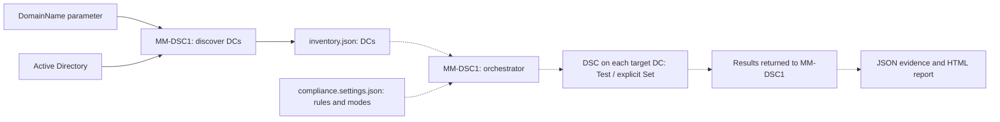

# Domain Controller Compliance with DSC v3: Centralized Auditing, Reporting, and Controlled Remediation

**A security setting being defined somewhere is not proof that every domain controller is running with that setting.**

The [first DSC article](<./Desired State Configuration in 2026 - What It Actually Is and How to Use It.md>) introduced desired state, resources, and remote execution. This article builds on those basics with a more operational question: how can one administration server check the configuration of several domain controllers, explain the differences, and correct only what it is allowed to manage?

> **TL;DR**
>
> - A discovery script on `MM-DSC1` writes the DCs from `mathiasmotron.com` to `inventory.json`.
> - A separate compliance parameter file defines the checks, expected values, configuration owners, and audit or enforcement modes.
> - The orchestrator on MM-DSC1 will read both files: the inventory tells it which machines exist; the parameters tell it what to check.
> - DSC tests the effective configuration on each target. PowerShell provides the orchestration and reporting around it.
> - Settings owned by Group Policy are audited, not repeatedly overwritten locally by DSC.
> - Remediation is a separate, explicitly triggered operation against a smaller configuration document. It is disabled by default.

**Current hands-on coverage:** discovery and automatic JSON export are implemented. The compliance parameter file, DSC orchestrator, and compliance reporting are the next steps. The five control families and their audit/remediation design are described below; an inventory is not a security assessment.

---

## Contents

- [The Environment](#the-environment)
- [Who Does What](#who-does-what)
- [The Five Control Families](#the-five-control-families)
- [One Setting, One Configuration Owner](#one-setting-one-configuration-owner)
- [Step 1: Build the DC Inventory](#step-1-build-the-dc-inventory)
- [What the Compliance Report Must Say](#what-the-compliance-report-must-say)
- [The Remediation Boundary](#the-remediation-boundary)
- [Operational Constraints](#operational-constraints)
- [Next Checkpoint](#next-checkpoint)
- [Sources](#sources)

---

## The Environment

| Component | Role | What is already known |
| --- | --- | --- |
| `MM-DSC1` | Administration and orchestration server | Windows Server 2025; RSAT AD DS tools are already available |
| `mathiasmotron.com` | AD domain to enumerate | Explicitly configured; we do not automatically expand to the entire forest |
| Domain controllers | Future audit targets | Names, OS versions, sites, and read-only status are discovered from AD |

`MM-DSC1` remains the administration server. Nothing in this article promotes it, or the previous article's `MM-SRV01`, to a domain controller.

The inventory runs in **Windows PowerShell 5.1 on MM-DSC1**, from a filesystem location, with an account that has AD read permissions. It requires working domain DNS resolution and connectivity to AD, including Active Directory Web Services for these cmdlets.

**No installation on the DCs is needed for this first step.** It does not use DSC, WinRM, or a remote script on every DC. It queries AD to obtain the list of machines. Successful directory discovery does not prove that those machines can later accept a WinRM connection.

The later DSC step also requires a working WinRM endpoint, an account with the permissions needed by the checks, DSC v3, and the chosen resources on the pilot DC. Installing RSAT on MM-DSC1 does not provide those components on the targets.

---

## Who Does What

A **baseline** is a versioned set of requirements that defines the expected configuration. For example, a baseline might require a particular service to be stopped, or a particular audit subcategory to be enabled.

The workflow separates the machines from the rules:

| Component | Produced or maintained by | Purpose |
| --- | --- | --- |
| `inventory.json` | The discovery script | DC hostnames and directory metadata, with the discovery time |
| `compliance.settings.json` (next step) | You | Control definitions, desired values, configuration owners, and `Audit` or `Enforce` mode |
| Orchestration script on MM-DSC1 (next step) | Runs against both files | Reads targets from the inventory, builds the DSC configuration documents from the parameters, invokes DSC remotely, and collects results |

Changing a desired value does not require rediscovering the DCs. Rediscovering the DCs does not overwrite the compliance parameters.

For each control, `Audit` means test and report without correction. `Enforce` makes a DSC-owned control eligible for correction when the remediation operation is explicitly started. A normal audit still uses `Test` for both modes. These modes and ownership rules belong to our orchestrator, not to the native DSC resource properties.

The intended workflow is:



The solid path is implemented in the inventory step. The dashed path is the next stage.

DSC v3 does not discover the domain, provide a central dashboard, or schedule itself. A later scheduled task on MM-DSC1 can initiate the audit. The `dsc` command still executes on each target DC in this WinRM-based design.

---

## The Five Control Families

These five **families** cover settings expected to be configured identically across the DCs in scope. Each family can contain several resource instances. SMBv1 and SMB signing, for example, should have separate results so that one failure cannot hide the other.

| ID | Control family | What we intend to check | Initial correction policy |
| --- | --- | --- | --- |
| DC-01 | Print Spooler | Service stopped and startup type disabled | Audit; optional DSC Set for DSC-owned settings. |
| DC-02 | SMB | SMBv1 disabled; signing settings match the defined baseline | Audit only; correct the owning GPO where applicable |
| DC-03 | Security auditing | Required advanced audit subcategories are effectively enabled | Audit only; correct the audit policy in its owning GPO |
| DC-04 | Event logs | Required maximum sizes and retention behavior | Audit; optional DSC Set for DSC-owned settings. |
| DC-05 | LDAP security | LDAP signing and channel binding requirements match the defined policy | Audit only; compatibility assessment before a policy change |

Before implementing each family, define the exact expected values, the authoritative configuration tool, the supported OS versions, and the evidence needed to establish the effective state.

Two examples explain why this preparation matters:

- **LDAP:** enforcing signing or channel binding can break incompatible applications. Configuration compliance and client compatibility are separate checks.
- **Registry-backed policies:** a missing registry value is not automatically an insecure effective state. Defaults can differ by Windows version and deployment history. The resource must model that distinction.

This is configuration compliance, not a complete AD health assessment. Replication, DNS health, authentication failures, and `dcdiag` results are complementary operational checks.

---

## One Setting, One Configuration Owner

**A setting should have one declared configuration owner.** Checking a value is different from taking responsibility for writing it.

| Declared owner | What DSC may do | Where a correction belongs |
| --- | --- | --- |
| Group Policy | Test the effective setting | The owning GPO |
| DSC | Test; later Set through the separate remediation workflow | A dedicated remediation configuration |
| Another management tool | Test where a suitable resource exists | The owning tool, such as OSConfig |
| Unknown | Report the observation or the inability to evaluate it | Investigate ownership before enabling correction |

An absent or incomplete GPO result does not identify the setting's owner. Ownership is declared per setting so that DSC and Group Policy do not keep overwriting one another.

You maintain one compliance parameter file. The orchestrator will build **separate DSC configuration documents** from it: an audit document for all applicable checks, and a remediation document containing only DSC-owned controls in `Enforce` mode. Running `dsc config set` against the full audit document could otherwise change settings intended for audit only.

---

## Step 1: Build the DC Inventory

**Run this step on MM-DSC1.** The discovery script creates the JSON inventory directly. No DC setting is changed.

### 1. Verify the execution context

Open Windows PowerShell 5.1 on MM-DSC1 and run:

```powershell
$ErrorActionPreference = 'Stop'

Write-Output "Server: $env:COMPUTERNAME"
Write-Output "Account: $([System.Security.Principal.WindowsIdentity]::GetCurrent().Name)"
$PSVersionTable.PSVersion

Import-Module ActiveDirectory -ErrorAction Stop
Get-Command -Name Get-ADDomainController |
    Select-Object Name, ModuleName
```

**Expected:** the server is `MM-DSC1`, the PowerShell version is `5.1`, and `Get-ADDomainController` comes from the `ActiveDirectory` module. RSAT is already present on MM-DSC1; there is no installation command to run again.

The account displayed here is the account used for directory discovery from this filesystem session. Read access to directory metadata does not grant the permissions needed for later remote compliance checks or remediation.

### 2. Prepare the discovery script

This step uses one supporting file: [Get-DCInventory.ps1](<./DomainControllersDCS/Get-DCInventory.ps1>). The following command expects it at `C:\DSC\DomainControllersDCS\Get-DCInventory.ps1` on MM-DSC1.

There is no discovery settings file to fill in. The script takes the domain as `-DomainName`, queries AD, and writes `inventory.json` next to the script. It also returns the DC objects for immediate display.

The output contains every discovered DC, including RODCs with `IsReadOnly = true`. Inventory describes what exists; it does not decide which controls to run or authorize corrections. The first compliance checks will target writable DCs, with any exclusions handled by the orchestrator rather than by deleting entries from this generated file.

### 3. Discover the DCs and write the JSON

On MM-DSC1, run:

```powershell
$ErrorActionPreference = 'Stop'

& 'C:\DSC\DomainControllersDCS\Get-DCInventory.ps1' `
    -DomainName 'mathiasmotron.com' |
    Format-Table HostName, OperatingSystem, IsReadOnly -AutoSize -Wrap
```

**Expected:** an `Inventory saved to:` message with `C:\DSC\DomainControllersDCS\inventory.json`, followed by one row per discovered DC. The JSON is already on disk when the command finishes; there is no separate export block to run.

The `&` invokes the script. `Format-Table` displays the returned objects without changing the JSON. The default output location is based on the script's directory, not the current console directory. The optional `-OutputPath` parameter selects another JSON destination.

The core query inside the script is:

```powershell
Get-ADDomainController -Filter * -Server 'mathiasmotron.com' -ErrorAction Stop
```

`-Filter *` enumerates the DCs in the specified domain. Do not substitute `-Discover`: that parameter locates a DC meeting discovery criteria, rather than enumerating the domain's DC inventory. `-Server` accepts the domain name here; it does not mean that DSC is executing on that name.

Each successful discovery replaces the destination JSON with the current inventory. The script writes a temporary file first, then publishes it after discovery and serialization succeed. If AD discovery fails, returns no DCs, or returns inconsistent identities, the previous inventory remains unchanged. Its `DiscoveredAtUtc` value still identifies the earlier run, not the failed one.

This command does not test WinRM connectivity or filter machines by ping response. A discovered DC that cannot later be contacted must remain visible in the audit results.

### 4. Read the generated inventory

This works in the same console or a new PowerShell session, because it reads the saved file rather than a variable from the discovery command:

```powershell
$inventoryPath = 'C:\DSC\DomainControllersDCS\inventory.json'
$inventoryDocument = Get-Content -LiteralPath $inventoryPath -Raw -Encoding UTF8 -ErrorAction Stop |
    ConvertFrom-Json -ErrorAction Stop

$inventoryDocument |
    Format-List Domain, DiscoveredAtUtc, SourceComputer

$domainControllers = @($inventoryDocument.DomainControllers)
$domainControllers |
    Format-Table HostName, Site, OperatingSystem, IsReadOnly -AutoSize -Wrap

Write-Output "Discovered DCs: $($domainControllers.Count)"
```

**Expected:** the discovery domain and timestamp, the source computer, and the same DCs that the discovery command displayed. Each DC entry contains `HostName`, `Domain`, `Site`, `OperatingSystem`, and `IsReadOnly`. The `DomainControllers` property is always an array, even for a single DC.

The OS information is directory metadata, not a live remote OS probe. The inventory contains no compliance verdict and no audit or enforcement settings.

The future orchestrator will load this file the same way, then load the separate compliance parameter file. It will use each target's `HostName` for WinRM and the common control definitions to build the DSC tests. It does not need to run discovery again inside every check.

---

## What the Compliance Report Must Say

The next stage will preserve the raw DSC JSON results, then produce a readable HTML report and a CSV export. The report is a PowerShell deliverable around DSC, not a built-in DSC dashboard.

Each evaluated control needs its DC identity, control ID, baseline version, evaluation time, expected state, observed state, configuration owner, and result. Keep the resource and engine versions with the execution evidence so that a later reader can identify what performed the check.

The report must distinguish:

| Control status | Meaning |
| --- | --- |
| `Compliant` | The check completed and the observed state satisfies the declared requirement |
| `NonCompliant` | The check completed and found an actual difference |
| `Error` | The check could not establish compliance, for example because access was denied, a resource was missing, or its output was invalid |
| `Unreachable` | The target could not be reached for the assessment |
| `NotApplicable` | An explicit applicability rule says the control does not apply to this target |
| `NotEvaluated` | No valid evaluation was performed yet |

Scope exclusions remain separate from these control results and visible in the report's coverage figures. Security exceptions retain the observed difference, justification, and expiry instead of rewriting a failed control as compliant.

`hadErrors: false` means the DSC operation did not report an error. It does **not** mean every resource is in the desired state. The reporting code must also inspect each test result, including `inDesiredState` and the differing properties.

The orchestrator will validate the inventory structure and discovery timestamp, then load it once for the audit run. An unreadable, empty, or outdated inventory is not a successful assessment. A DC that becomes unreachable still belongs to that run's expected coverage, even if a later discovery updates the file on disk.

---

## The Remediation Boundary

The first remediation example targets the Print Spooler on one DC, with DSC declared as the configuration owner.

The future runner must require all of the following:

1. The DC is present in the loaded inventory and explicitly selected for the remediation run.
2. The specific control is declared DSC-owned and set to `Enforce` in the compliance parameters.
3. Current state and relevant preconditions are checked again before a change.
4. An operator explicitly approves the bounded operation using the appropriate execution identity.
5. A dedicated remediation document contains only those DSC-owned settings.
6. A fresh audit confirms the resulting state and records the outcome.

The discovery script only produces inventory. It does not read the compliance parameters, grant permissions, or execute remediation. Discovering a new DC never triggers `Set` by itself.

Do not assume that every resource supports `--what-if`. Use the resource's supported read-only test operation and validate its actual capabilities before building a preview workflow. A compliance test is not a simulation of every consequence of a future change.

For GPO-owned settings, the action in the report should lead to the owning GPO and change process. A local `Set` that is undone at the next policy refresh is not a durable correction.

---

## Operational Constraints

- **Privilege boundary.** A server that can administer DCs is part of the privileged AD administration boundary. Using the same privileged identity on application servers exposes those credentials to a wider set of machines.
- **Permissions.** Directory discovery, remote auditing, and remediation have different permission requirements. The execution account determines which checks and changes can succeed.
- **Dependencies.** Resource behavior and supported OS versions determine which checks are reliable. Recording tested package versions makes later results comparable.
- **File access.** Write access to scripts, the inventory, or compliance parameters can change what a privileged runner executes and which machines it contacts. These files are security-sensitive even without embedded passwords.
- **Report contents.** Inventory and compliance reports expose hostnames, topology, and configuration weaknesses. Their access controls and retention determine who can see that information and for how long.
- **Scheduling.** A scheduled task may use a different account and environment from an interactive session. Module discovery, DSC paths, permissions, and failure reporting need to work in that context.

Discovery and JSON export are implemented at this stage. Compliance evaluation and remediation are not yet available.

---

## Next Checkpoint

The JSON inventory identifies the DCs, their reported OS versions, and whether they are writable. One writable DC from this file will serve as the pilot for the first DSC check.

The next step will define the Print Spooler requirement in the compliance parameter file, add its DSC prerequisites on the target, and introduce the orchestrator that reads both files on MM-DSC1. Multiple DCs, the other control families, HTML reporting, and explicitly triggered remediation then build on that first test.

---

## Sources

- [Get-ADDomainController](https://learn.microsoft.com/en-us/powershell/module/activedirectory/get-addomaincontroller?view=windowsserver2025-ps): enumeration, parameter sets, returned properties, and discovery behavior.
- [DSC configuration test](https://learn.microsoft.com/en-us/powershell/dsc/reference/cli/config/test?view=dsc-3.0): the read-only configuration test operation.
- [DSC configuration test result schema](https://learn.microsoft.com/en-us/powershell/dsc/reference/schemas/outputs/config/test?view=dsc-3.0): operation errors and per-resource test results.
- [LDAP signing guidance](https://learn.microsoft.com/en-us/troubleshoot/windows-server/active-directory/enable-ldap-signing-in-windows-server): compatibility assessment before enforcing signing requirements.
- [OSConfig overview](https://learn.microsoft.com/en-us/windows-server/security/osconfig/osconfig-overview): another configuration authority to account for on Windows Server 2025.