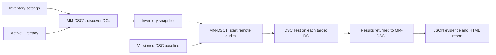

# Domain Controller Compliance with DSC v3: Centralized Auditing, Reporting, and Controlled Remediation

**A security setting being defined somewhere is not proof that every domain controller is running with that setting.**

The [first DSC article](<./Desired State Configuration in 2026 - What It Actually Is and How to Use It.md>) introduced desired state, resources, and remote execution. This article builds on those basics with a more operational question: how can one administration server check the configuration of several domain controllers, explain the differences, and correct only what it is allowed to manage?

> **TL;DR**
>
> - `MM-DSC1` discovers the DCs in `mathiasmotron.com` and coordinates the work.
> - A configuration file defines the discovery scope, exclusions, and a separate machine allowlist for future remediation.
> - DSC tests the effective configuration on each target. PowerShell provides the orchestration and reporting around it.
> - Settings owned by Group Policy are audited, not repeatedly overwritten locally by DSC.
> - Remediation is a separate, explicitly triggered operation against a smaller configuration document. It is disabled by default.

**Current hands-on coverage:** this version implements the inventory lab. The six control families, compliance report, and remediation workflow below define the intended design; the DSC compliance runner, HTML report, and remediation runner are not implemented yet. An inventory result is not a security assessment.

---

## Contents

- [The Lab](#the-lab)
- [Who Does What](#who-does-what)
- [The Six Control Families](#the-six-control-families)
- [One Setting, One Configuration Owner](#one-setting-one-configuration-owner)
- [Lab 1: Build the DC Inventory](#lab-1-build-the-dc-inventory)
- [What the Compliance Report Must Say](#what-the-compliance-report-must-say)
- [The Remediation Boundary](#the-remediation-boundary)
- [Operational Constraints](#operational-constraints)
- [Next Checkpoint](#next-checkpoint)
- [Sources](#sources)

---

## The Lab

| Component | Role | What is already known |
| --- | --- | --- |
| `MM-DSC1` | Administration and orchestration server | Windows Server 2025; RSAT AD DS tools are already available |
| `mathiasmotron.com` | AD domain to enumerate | Explicitly configured; we do not automatically expand to the entire forest |
| Domain controllers | Future audit targets | Names, OS versions, sites, and roles are discovered from AD |

`MM-DSC1` remains the administration server. Nothing in this article promotes it, or the previous lab's `MM-SRV01`, to a domain controller.

The inventory runs in **Windows PowerShell 5.1 on MM-DSC1**, from a filesystem location, with an account that has AD read permissions. It requires working domain DNS resolution and connectivity to AD, including Active Directory Web Services for these cmdlets.

**No installation on the DCs is needed for this first lab.** It does not use DSC, WinRM, or a remote script on every DC. It queries AD to obtain the list of machines. Successful directory discovery does not prove that those machines can later accept a WinRM connection.

The later DSC lab also requires a working WinRM endpoint, an account with the permissions needed by the checks, DSC v3, and the chosen resources on the pilot DC. Installing RSAT on MM-DSC1 does not provide those components on the targets.

---

## Who Does What

A **baseline** is a versioned set of requirements that defines the expected configuration. For example, a baseline might require a particular service to be stopped, or a particular audit subcategory to be enabled.

The inventory settings and the baseline serve different purposes:

- **Inventory settings:** which domains to query, which discovered DCs are included, and which machines are on the remediation allowlist.
- **DSC configuration documents:** which resource instances to test, and which values are expected.
- **Orchestration scripts:** when to run, how to contact targets, how to handle failures, and where to store results.

The intended workflow is:



The solid path is implemented in the inventory lab. The dashed path is the next stage.

DSC v3 does not discover the domain, provide a central dashboard, or schedule itself. A later scheduled task on MM-DSC1 can initiate the audit. The `dsc` command still executes on each target DC in this WinRM-based design.

---

## The Six Control Families

These are six **families** of checks, not necessarily six resource instances. SMBv1 and SMB signing, for example, should have separate results so that one failure cannot hide the other.

| ID | Control family | What we intend to check | Initial correction policy |
| --- | --- | --- | --- |
| DC-01 | Print Spooler | Service stopped and startup type disabled | Candidate for DSC Set when DSC explicitly owns the setting |
| DC-02 | SMB | SMBv1 disabled; signing settings match the defined baseline | Audit only; correct the owning GPO where applicable |
| DC-03 | Security auditing | Required advanced audit subcategories are effectively enabled | Audit only; correct the audit policy in its owning GPO |
| DC-04 | Event logs | Required maximum sizes and retention behavior | Audit first; DSC correction only for explicitly DSC-owned settings |
| DC-05 | LDAP security | LDAP signing and channel binding requirements match the defined policy | Audit only; compatibility assessment before a policy change |
| DC-06 | Windows Time | Time configuration matches the DC's role in the AD hierarchy | Audit only initially; role-aware investigation and correction |

Before implementing each family, define the exact expected values, the authoritative configuration tool, the supported OS versions, and the evidence needed to establish the effective state.

Three examples explain why this preparation matters:

- **LDAP:** enforcing signing or channel binding can break incompatible applications. Configuration compliance and client compatibility are separate checks.
- **Windows Time:** do not assign the same external NTP configuration to every DC. Identify the forest root domain and its PDC Emulator, then evaluate each DC against the appropriate design.
- **Registry-backed policies:** a missing registry value is not automatically an insecure effective state. Defaults can differ by Windows version and deployment history. The resource must model that distinction.

This is configuration compliance, not a complete AD health assessment. Replication, DNS health, authentication failures, and `dcdiag` results are complementary operational checks.

---

## One Setting, One Configuration Owner

**A setting should have one declared configuration owner.** Checking a value is different from taking responsibility for writing it.

| Declared owner | What DSC may do | Where a correction belongs |
| --- | --- | --- |
| Group Policy | Test the effective setting | The owning GPO |
| DSC | Test; later Set through the separate remediation workflow | A dedicated remediation configuration |
| Another management tool | Test where a suitable resource exists | The owning tool, such as OSConfig |
| Unknown | Report the observation or the inability to evaluate it | Investigate ownership before enabling correction |

An absent or incomplete GPO result does not identify the setting's owner. Ownership is declared per setting so that DSC and Group Policy do not keep overwriting one another.

Audit and remediation will use **separate configuration documents**. The audit document can describe all supported checks. The remediation document contains only DSC-owned settings enabled for correction. Running `dsc config set` against the full audit document can attempt changes to settings intended for audit only.

---

## Lab 1: Build the DC Inventory

**Run every step in this lab on MM-DSC1.** The result is a list of discovered DCs, their scope decisions, and a JSON snapshot. No DC setting is changed.

### 1. Verify the execution context

Open Windows PowerShell 5.1 on MM-DSC1 and run:

```powershell
$ErrorActionPreference = 'Stop'

Write-Output "Server: $env:COMPUTERNAME"
Write-Output "Account: $([System.Security.Principal.WindowsIdentity]::GetCurrent().Name)"
$PSVersionTable.PSVersion

Import-Module ActiveDirectory -ErrorAction Stop
Get-Command -Name Get-ADDomainController |
    Select-Object Name, ModuleName
```

**Expected:** the server is `MM-DSC1`, the PowerShell version is `5.1`, and `Get-ADDomainController` comes from the `ActiveDirectory` module. RSAT is already present in this lab; there is no installation command to run again.

The account displayed here is the account used for directory discovery from this filesystem session. Read access to directory metadata does not grant the permissions needed for later remote compliance checks or remediation.

### 2. Review the lab files and the scope

The two supporting files are:

- [Get-DCInventory.ps1](./DCCompliance/Get-DCInventory.ps1): validates the settings, queries AD, and returns PowerShell objects. It does not call DSC, open WinRM sessions, or write to the DCs.
- [inventory.settings.json](./DCCompliance/inventory.settings.json): the initial scope for this lab.

The commands below expect both supporting files directly under `C:\DSC\DCCompliance` on **MM-DSC1**.

Check their presence and display the configuration:

```powershell
$workingDirectory = 'C:\DSC\DCCompliance'

foreach ($fileName in @('Get-DCInventory.ps1', 'inventory.settings.json')) {
    $filePath = Join-Path -Path $workingDirectory -ChildPath $fileName
    if (-not (Test-Path -LiteralPath $filePath -PathType Leaf)) {
        throw "Required lab file is missing on this machine: $filePath"
    }
}

Get-Content -LiteralPath 'C:\DSC\DCCompliance\inventory.settings.json' -Raw -Encoding UTF8
```

The initial settings are:

```json
{
  "Domains": ["mathiasmotron.com"],
  "IncludeReadOnlyDCs": false,
  "ExcludedDCs": [],
  "RemediationAllowedDCs": []
}
```

| Property | Meaning |
| --- | --- |
| `Domains` | An explicit list of domains to enumerate. We start with `mathiasmotron.com` only. |
| `IncludeReadOnlyDCs` | Whether read-only domain controllers are included in the future audit scope. Initially `false`. |
| `ExcludedDCs` | Exact DC FQDNs deliberately outside the audit scope. Empty initially. |
| `RemediationAllowedDCs` | Exact DC FQDNs on the machine allowlist for a future remediation workflow. Empty means none. |

These are **our script's settings**, not native DSC configuration properties. They contain no credentials or security baseline values.

The brackets `[]` denote a JSON array. An empty array means no entries. The Boolean `false` is not the string `"false"`. The script rejects malformed types, unknown properties, empty domain lists, and non-FQDN entries. Host matching is case-insensitive, with no wildcards.

An inventory exclusion removes a machine from the audit scope; it does not establish compliance. This file does not track security-exception owners, justifications, or expiry dates.

### 3. Discover the DCs

Run:

```powershell
$ErrorActionPreference = 'Stop'
$inventory = @()
$auditTargets = @()

$inventory = @(
    & 'C:\DSC\DCCompliance\Get-DCInventory.ps1' `
        -SettingsPath 'C:\DSC\DCCompliance\inventory.settings.json' `
        -ErrorAction Stop
)

$inventory |
    Format-Table HostName, AuditScope, RemediationAllowlisted, ComplianceStatus -AutoSize -Wrap
```

The initial assignments clear any results left from an earlier run. The `@(...)` captures the output as an array, including when the domain has only one DC. The `&` invokes the script at the quoted path.

**Expected with the supplied settings:**

- Writable DCs have `AuditScope = Included`.
- RODCs remain visible, with `AuditScope = Excluded`.
- Every row has `RemediationAllowlisted = False`.
- Every row has `ComplianceStatus = NotEvaluated`.

The names and number of machines come from the actual directory. No sample DC hostname is treated as a real target.

The core query inside the script is:

```powershell
Get-ADDomainController -Filter * -Server 'mathiasmotron.com' -ErrorAction Stop
```

`-Filter *` enumerates the DCs in the specified domain. Do not substitute `-Discover`: that parameter locates a DC meeting discovery criteria, rather than enumerating the domain's DC inventory. `-Server` accepts the domain name here; it does not mean that DSC is executing on that name.

If a configured domain cannot be queried, discovery returns no DCs, a DC has no host name, or the returned identity is inconsistent, the script stops. It buffers the rows until discovery completes, so a later domain failure cannot publish the earlier domains as a complete inventory.

Do not catch such an error and continue using an old inventory as though the current discovery succeeded. Do not prefilter machines with a ping test: lack of an ICMP response is not proof that a future audit cannot run.

### 4. Inspect the metadata and the scope decisions

The compact table answers who is included. Use a list for the longer properties:

```powershell
$inventory |
    Format-List HostName, Domain, Forest, Site, OperatingSystem, IsReadOnly, OperationMasterRoles, ScopeReason

$auditTargets = @($inventory | Where-Object AuditScope -eq 'Included')

[pscustomobject]@{
    DiscoveredDCs = $inventory.Count
    IncludedDCs = $auditTargets.Count
    ExcludedDCs = @($inventory | Where-Object AuditScope -eq 'Excluded').Count
    RemediationAllowlistedDCs = @($inventory | Where-Object RemediationAllowlisted).Count
} | Format-List
```

**Expected:** discovered count equals included count plus excluded count. The remediation count is zero with the supplied settings. An included count of zero means there is no audit target; it does not mean the domain is compliant.

`OperationMasterRoles` lists the FSMO roles reported by AD. The OS information is directory metadata, not a live remote OS probe. Confirm target versions during the next lab's preflight rather than treating this metadata as an attestation.

An explicitly excluded DC remains excluded even if its hostname also appears in `RemediationAllowedDCs`. The allowlist never overrides the audit scope. Unknown hostnames in either list produce warnings so that typos or retired entries are not silently ignored.

Keep `$inventory` as objects. `Format-Table` and `Format-List` are for console display, not for the data that we will export or process.

### 5. Record the inventory snapshot

This step writes files **only on MM-DSC1**. It records inventory, not the result of the six security controls.

Run after a successful discovery in the same PowerShell session:

```powershell
if ($inventory.Count -eq 0) {
    throw 'There is no successful inventory to record. Run discovery before exporting.'
}

$reportDirectory = 'C:\DSC\DCCompliance\Reports'
$null = New-Item -Path $reportDirectory -ItemType Directory -Force -ErrorAction Stop
$runId = [guid]::NewGuid().ToString('N')

$inventoryReport = [pscustomobject][ordered]@{
    ReportType = 'DCInventory'
    InventorySchemaVersion = 1
    RunId = $runId
    SavedAtUtc = (Get-Date).ToUniversalTime().ToString('o')
    SourceComputer = $env:COMPUTERNAME
    ComplianceStatus = 'NotEvaluated'
    DiscoveredCount = $inventory.Count
    IncludedCount = @($inventory | Where-Object AuditScope -eq 'Included').Count
    ExcludedCount = @($inventory | Where-Object AuditScope -eq 'Excluded').Count
    DomainControllers = @($inventory)
}

$reportPath = Join-Path -Path $reportDirectory -ChildPath "inventory-$runId.json"
$inventoryReport | ConvertTo-Json -Depth 8 |
    Set-Content -LiteralPath $reportPath -Encoding UTF8 -ErrorAction Stop

Get-Item -LiteralPath $reportPath | Format-List FullName, Length
```

**Expected:** a new JSON file under `C:\DSC\DCCompliance\Reports`, with a unique run identifier, the time the snapshot was saved, all discovered DCs, and their scope decisions. Earlier snapshots are not deliberately reused or overwritten.

Verify the saved data:

```powershell
$savedReport = Get-Content -LiteralPath $reportPath -Raw -Encoding UTF8 -ErrorAction Stop |
    ConvertFrom-Json -ErrorAction Stop

$savedReport |
    Format-List ReportType, RunId, SavedAtUtc, DiscoveredCount, IncludedCount, ExcludedCount, ComplianceStatus
```

The status must still be `NotEvaluated`. Preserve this distinction when the HTML report is added: collecting an inventory must never produce a green compliance score.

---

## What the Compliance Report Must Say

The next stage will preserve the raw DSC JSON results, then produce a readable HTML report and a CSV export. The report is a PowerShell deliverable around DSC, not a built-in DSC dashboard.

Each evaluated control needs its DC identity, control ID, baseline version, evaluation time, expected state, observed state, configuration owner, and result. Keep the resource and engine versions with the execution evidence so that a later reader can identify what performed the check.

The report must distinguish:

| Control status | Meaning |
| --- | --- |
| `Compliant` | The check completed and the observed state satisfies the declared requirement |
| `NonCompliant` | The check completed and found an actual difference |
| `Error` | The check could not establish compliance, for example because access was denied, a resource was missing, or its output was invalid |
| `Unreachable` | The target could not be reached for the assessment |
| `NotApplicable` | An explicit applicability rule says the control does not apply to this target |
| `NotEvaluated` | No valid evaluation was performed yet |

Scope exclusions remain separate from these control results and visible in the report's coverage figures. Security exceptions retain the observed difference, justification, and expiry instead of rewriting a failed control as compliant.

`hadErrors: false` means the DSC operation did not report an error. It does **not** mean every resource is in the desired state. The reporting code must also inspect each test result, including `inDesiredState` and the differing properties.

Keep the inventory fixed for the duration of an audit run. A DC that becomes unreachable still belongs to that run's expected coverage. A later run can discover a new inventory, but it must not silently discard failed machines from the current one.

---

## The Remediation Boundary

The first remediation example targets the Print Spooler on one DC, with DSC declared as the configuration owner.

The future runner must require all of the following:

1. The DC is in the configured audit scope and explicitly present in `RemediationAllowedDCs`.
2. The specific setting is declared DSC-owned and enabled for remediation.
3. Current state and relevant preconditions are checked again before a change.
4. An operator explicitly approves the bounded operation using the appropriate execution identity.
5. A dedicated remediation document contains only those DSC-owned settings.
6. A fresh audit confirms the resulting state and records the outcome.

The inventory script implements only the scope and machine-allowlist calculation. It does not grant permissions, collect approval, or execute remediation. Adding a hostname to the JSON file cannot stop a service.

Do not assume that every resource supports `--what-if`. Use the resource's supported read-only test operation and validate its actual capabilities before building a preview workflow. A compliance test is not a simulation of every consequence of a future change.

For GPO-owned settings, the action in the report should lead to the owning GPO and change process. A local `Set` that is undone at the next policy refresh is not a durable correction.

---

## Operational Constraints

- **Privilege boundary.** A server that can administer DCs is part of the privileged AD administration boundary. Using the same privileged identity on application servers exposes those credentials to a wider set of machines.
- **Permissions.** Directory discovery, remote auditing, and remediation have different permission requirements. The execution account determines which checks and changes can succeed.
- **Dependencies.** Resource behavior and supported OS versions determine which checks are reliable. Recording tested package versions makes later results comparable.
- **File access.** Write access to scripts, baselines, or target allowlists can change what a privileged runner executes. These files are security-sensitive even without embedded passwords.
- **Report contents.** Inventory and compliance reports expose hostnames, topology, and configuration weaknesses. Their access controls and retention determine who can see that information and for how long.
- **Scheduling.** A scheduled task may use a different account and environment from an interactive session. Module discovery, DSC paths, permissions, and failure reporting need to work in that context.

Only inventory is implemented at this stage. Compliance evaluation and remediation are not yet available.

---

## Next Checkpoint

The inventory identifies the DCs, their reported OS versions, and whether they are writable. One included DC will serve as the pilot for the first DSC check.

The next step adds the prerequisites for the Print Spooler audit on that DC, runs a read-only DSC test from MM-DSC1, and produces the first actual compliance result. Multiple DCs, the other control families, HTML reporting, and explicitly triggered remediation then build on that check.

---

## Sources

- [Get-ADDomainController](https://learn.microsoft.com/en-us/powershell/module/activedirectory/get-addomaincontroller?view=windowsserver2025-ps): enumeration, parameter sets, returned properties, and discovery behavior.
- [Get-ADForest](https://learn.microsoft.com/en-us/powershell/module/activedirectory/get-adforest?view=windowsserver2025-ps): forest metadata, including the root domain, for the later time-service control.
- [DSC configuration test](https://learn.microsoft.com/en-us/powershell/dsc/reference/cli/config/test?view=dsc-3.0): the read-only configuration test operation.
- [DSC configuration test result schema](https://learn.microsoft.com/en-us/powershell/dsc/reference/schemas/outputs/config/test?view=dsc-3.0): operation errors and per-resource test results.
- [LDAP signing guidance](https://learn.microsoft.com/en-us/troubleshoot/windows-server/active-directory/enable-ldap-signing-in-windows-server): compatibility assessment before enforcing signing requirements.
- [OSConfig overview](https://learn.microsoft.com/en-us/windows-server/security/osconfig/osconfig-overview): another configuration authority to account for on Windows Server 2025.