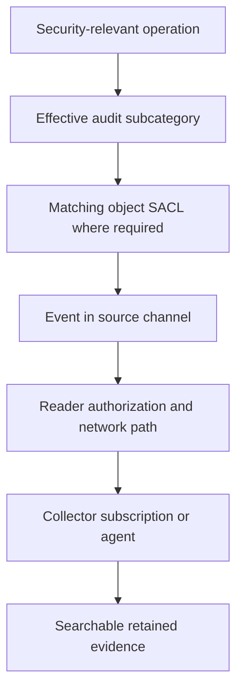

# Windows Security Auditing: Advanced Audit Policy, SACLs and Event Log Delegation

**An event that was never generated cannot be recovered by giving the collector more privileges.**

Reliable security auditing on Windows Server 2022/2025 requires three independent decisions: which operations produce events, which objects are audited, and which identities may read the resulting channels. Forwarding and retention add two more failure points.

> **TL;DR**
> - Configure advanced audit subcategories through the effective computer policy.
> - Add targeted SACLs only where the event family requires them.
> - Grant read access to the collection identity, not administrator or log-clearing rights by default.
> - Distinguish remote Event Log RPC from WinRM-based collection.
> - Test generation on the source and delivery to the collector with the actual reader identity.

## 1. Trace the evidence pipeline



Keep these layers separate during troubleshooting. A successful collector login does not prove that a source SACL matched. A visible event on the DC does not prove that the forwarding subscription includes it.

## 2. Start with the question and the event family

| Question | Relevant audit subcategory | Typical source and evidence |
|---|---|---|
| Who logged on to this computer? | Logon | Accepting computer, 4624/4625 |
| Where was an NTLM credential validated? | Credential Validation | Authoritative account database, commonly DC event 4776 for domain accounts |
| Was a Kerberos ticket requested? | Kerberos Authentication Service / Service Ticket Operations | DC, 4768/4771 and 4769 |
| Who created or deleted an account? | User Account Management / Computer Account Management | Account-managing computer or DC, for example 4720/4726 and 4741/4743 |
| Who changed an AD attribute? | Directory Service Changes | DC, for example 5136; matching SACL and schema behavior matter |
| Who accessed a selected file? | File System | File server, matching SACL; event type depends on requested and exercised access |

Directory Service Changes produces success events, not a parallel set of failure events. Directory Service Access is a different, potentially high-volume subcategory. Enabling every success/failure option is not a substitute for deciding which evidence is useful.

For field interpretation, use [Windows Logon Types Decoded](../../../060%20-%20Active%20Directory/Concepts/Windows%20Logon%20Types%20Decoded%20-%20Events%204624%20and%204625.md) and [Tracing Deleted Active Directory Objects](../../../060%20-%20Active%20Directory/Troubleshoot/Tracing%20Deleted%20Active%20Directory%20Objects%20-%20Events%204726%20and%204743,%20Deleted%20Objects%20and%20Replication%20Metadata.md).

## 3. Configure and verify the effective policy

Use a scoped computer GPO under:

`Computer Configuration > Policies > Windows Settings > Security Settings > Advanced Audit Policy Configuration > Audit Policies`

Enable **Audit: Force audit policy subcategory settings (Windows Vista or later) to override audit policy category settings** under Security Options. Avoid maintaining conflicting basic-category and advanced-subcategory policies.

On the actual target computer, inspect the result from an elevated session:

```powershell
gpresult.exe /scope computer /r
if ($LASTEXITCODE -ne 0) { throw 'Could not inspect the computer Group Policy result.' }

auditpol.exe /list /subcategory:* /v
if ($LASTEXITCODE -ne 0) { throw 'Could not enumerate audit subcategories.' }

auditpol.exe /get /category:* /r
if ($LASTEXITCODE -ne 0) { throw 'Could not read the effective audit policy.' }
```

Audit subcategory names are localized. For automation that selects a subcategory, use its verified GUID rather than an English label copied onto another language build. GPO linkage, filtering and precedence must reach the intended DCs or member servers.

Local `auditpol /set` changes are not a durable replacement for the managing GPO. Verify again after policy refresh. Record the effective success/failure settings on more than one target before expanding a deployment.

## 4. Add a SACL where the event requires it

A **DACL** controls access. A **SACL** selects accesses to audit. Granting Read or Write in the Permissions tab is not configuring auditing.

For a selected AD object or OU, use the advanced security **Auditing** UI with the necessary rights to manage its SACL. Specify the principal, successful operation, relevant properties/object class and inheritance scope. For file-system auditing, configure the corresponding file/folder SACL and the File System audit subcategory on the serving computer.

Start with a known test object and one auditable change. For AD Directory Service Changes, inspect the DC that processed the operation; the resulting Security event is not replicated to every DC simply because the object change is replicated. Protected objects can have inheritance behavior different from the surrounding OU.

Some AD attributes/classes suppress or alter audit generation according to schema settings. Do not promise a before/after event for every possible attribute. Avoid domain-root, all-principal, all-property audit ACEs without measuring the resulting volume.

## 5. Inspect channel access and retention

On the source computer:

```powershell
Get-WinEvent -ListLog Security -ErrorAction Stop |
    Select-Object LogName, IsEnabled, LogMode, MaximumSizeInBytes,
        RecordCount, SecurityDescriptor

wevtutil.exe gl Security /f:xml
if ($LASTEXITCODE -ne 0) { throw 'Could not read Security channel configuration.' }
```

Retain the original channel configuration and SDDL in the change record. They can contain sensitive policy details and should not be published with real environment identifiers.

The event-log-specific access bits are:

| Bit | Permission | Appropriate for a read-only collector? |
|---|---|---|
| `0x1` | Read | Yes, for the required channels |
| `0x2` | Write | No; Security-log writing also has special restrictions |
| `0x4` | Clear | No |

**Manage auditing and security log** (`SeSecurityPrivilege`) is not the default answer to a reader's Access Denied error. It grants capabilities beyond reading. Likewise, making the collection account a local or domain administrator defeats the purpose of read delegation.

## 6. Use the right reader identity and group scope

The built-in **Event Log Readers** group has SID `S-1-5-32-573`. Its actual access depends on channel descriptors and the caller's effective token; it is not a promise that every custom channel is readable.

On a member server, inspect its local group with the 64-bit LocalAccounts module:

```powershell
$readerGroup = Get-LocalGroup -SID 'S-1-5-32-573' -ErrorAction Stop
Get-LocalGroupMember -Group $readerGroup -ErrorAction Stop |
    Select-Object Name, ObjectClass, PrincipalSource
```

On a DC, inspect the directory-backed built-in group instead:

```powershell
Import-Module ActiveDirectory -ErrorAction Stop
$domainController = 'dc01.corp.example'
$readerGroup = Get-ADGroup -Identity 'S-1-5-32-573' `
    -Server $domainController -ErrorAction Stop

Get-ADGroupMember -Identity $readerGroup -Server $domainController -ErrorAction Stop |
    Select-Object Name, ObjectClass, SID
```

DCs do not have an independent member-server local account database. Changing this built-in domain-local group's membership can affect all DCs in that domain. For one channel on selected computers, a dedicated domain group in those channels' access policy can provide a narrower design.

Identify the real reading identity: an interactive analyst, a service account, a gMSA, a computer account or the forwarding service context. For source-initiated Windows Event Forwarding, access on the source must work for the forwarding context, commonly Network Service. Adding the collector operator to a group does not fix that context automatically.

After membership changes, create the appropriate fresh user/service/computer logon context. A stale token can make correct group membership appear ineffective.

## 7. Prepare a channel-specific read ACE without replacing everything

For policy-managed channels, use **Configure log access** under:

`Computer Configuration > Administrative Templates > Windows Components > Event Log Service > <log>`

Use the current, non-legacy setting for current Windows versions. A configured SDDL is a complete descriptor, not an incremental ACE. Preserve the existing SYSTEM, administrator, publisher and other required entries; do not replace the descriptor with a one-line reader ACE.

The following helper prepares an additional read ACE using the Windows security-descriptor parser. It changes only an in-memory copy and returns SDDL. It does not remove pre-existing write/clear grants or override deny ACEs; those need a separate access review.

```powershell
function Add-EventLogReadAce {
    [CmdletBinding()]
    param(
        [Parameter(Mandatory)][string]$Sddl,
        [Parameter(Mandatory)][string]$ReaderSid
    )

    $descriptor = [Security.AccessControl.RawSecurityDescriptor]::new($Sddl)
    $sid = [Security.Principal.SecurityIdentifier]::new($ReaderSid)
    if ($null -eq $descriptor.DiscretionaryAcl) {
        throw 'Review the missing/null DACL explicitly instead of constructing a replacement.'
    }

    foreach ($ace in $descriptor.DiscretionaryAcl) {
        if ($ace -is [Security.AccessControl.QualifiedAce] -and
            $ace.AceQualifier -eq [Security.AccessControl.AceQualifier]::AccessAllowed -and
            $ace.SecurityIdentifier -eq $sid -and
            ([int]$ace.AceFlags -band [int][Security.AccessControl.AceFlags]::InheritOnly) -eq 0 -and
            ($ace.AccessMask -band 1) -eq 1) {
            return $descriptor.GetSddlForm([Security.AccessControl.AccessControlSections]::All)
        }
    }

    $insertAt = $descriptor.DiscretionaryAcl.Count
    for ($index = 0; $index -lt $descriptor.DiscretionaryAcl.Count; $index++) {
        if (([int]$descriptor.DiscretionaryAcl[$index].AceFlags -band
            [int][Security.AccessControl.AceFlags]::Inherited) -ne 0) {
            $insertAt = $index
            break
        }
    }

    $readAce = [Security.AccessControl.CommonAce]::new(
        [Security.AccessControl.AceFlags]::None,
        [Security.AccessControl.AceQualifier]::AccessAllowed,
        1, $sid, $false, $null
    )
    $descriptor.DiscretionaryAcl.InsertAce($insertAt, $readAce)
    $descriptor.GetSddlForm([Security.AccessControl.AccessControlSections]::All)
}

$originalSddl = (Get-WinEvent -ListLog Security -ErrorAction Stop).SecurityDescriptor
$readerSid = (Get-ADGroup -Identity 'GG-SecurityLog-Readers' `
    -Server 'dc01.corp.example' -ErrorAction Stop).SID.Value
$proposedSddl = Add-EventLogReadAce -Sddl $originalSddl -ReaderSid $readerSid

[pscustomobject]@{ Original = $originalSddl; Proposed = $proposedSddl }
```

Run the preparation on the source whose descriptor is being changed, with the AD module available for the group lookup. Compare the descriptors as parsed ACLs, not just text: Windows can normalize equivalent SDDL strings.

For a deliberate local pilot not controlled by GPO, the following wrapper prevents overwriting a descriptor that changed since capture and supports a preview:

```powershell
function Set-ReviewedEventLogAccess {
    [CmdletBinding(SupportsShouldProcess, ConfirmImpact = 'High')]
    param(
        [Parameter(Mandatory)][string]$LogName,
        [Parameter(Mandatory)][string]$ExpectedSddl,
        [Parameter(Mandatory)][string]$ProposedSddl
    )

    $current = Get-WinEvent -ListLog $LogName -ErrorAction Stop
    if ($current.SecurityDescriptor -cne $ExpectedSddl) {
        throw 'Channel access changed since capture. Re-read and review it.'
    }
    [void][Security.AccessControl.RawSecurityDescriptor]::new($ProposedSddl)

    if ($PSCmdlet.ShouldProcess($LogName, 'Apply reviewed channel access descriptor')) {
        wevtutil.exe sl $LogName "/ca:$ProposedSddl"
        if ($LASTEXITCODE -ne 0) { throw 'Channel access update failed.' }
    }
}

Set-ReviewedEventLogAccess -LogName Security -ExpectedSddl $originalSddl `
    -ProposedSddl $proposedSddl -WhatIf
```

After reviewing and retaining the before-state, remove `-WhatIf` to apply that local change. For managed systems, deploy the reviewed descriptor through the owning policy instead. A later GPO refresh can overwrite an ad hoc local change.

## 8. Validate remote reading in the delegated context

Open a fresh session as the actual analyst/reader, not an elevated administrator testing on their behalf:

```powershell
whoami.exe /user
whoami.exe /groups

Get-WinEvent -ComputerName 'dc01.corp.example' -LogName Security `
    -MaxEvents 5 -ErrorAction Stop |
    Select-Object TimeCreated, Id, RecordId, ProviderName, MachineName
```

`Get-WinEvent -ComputerName` uses the remote Event Log service/RPC path, not PowerShell remoting. Source-initiated WEF uses its configured WinRM transport and subscription controls. Local success, RPC success and WEF success are three different tests. Scope the corresponding host/network firewall rules to the collector or administration path.

Verify that the intended channel is readable and that unrelated access has not been granted. Inspect effective privileges/ACLs for clear/write rights; do not test least privilege by attempting to clear a production Security log.

## 9. Prove event generation and delivery

Perform one controlled, identifiable operation covered by the selected policy and SACL, then inspect the source around that time. For an AD attribute-change test:

```powershell
$startTime = (Get-Date).AddMinutes(-15)
Get-WinEvent -ComputerName 'dc01.corp.example' -FilterHashtable @{
    LogName = 'Security'
    Id = 5136
    StartTime = $startTime
} -MaxEvents 100 -ErrorAction Stop |
    Select-Object TimeCreated, Id, RecordId, ProviderName, MachineName
```

A no-matching-events result is different from Access Denied or an RPC failure. Check the event's named XML fields for the intended object, actor and attribute. Preserve provider, event ID/version, source computer and original record ID; a collector's local record ID can differ.

Find the same operation at the collector, measure delivery delay and check subscription filters/bookmarks. For interpretation of raw fields and localized message identifiers, use the logon guide linked earlier rather than parsing rendered prose.

## 10. Size retention around outages and event volume

With overwrite mode, the oldest local evidence disappears when the log fills. With retain mode and no usable archive path, new events can be discarded. Auto-backup adds disk-capacity and archive-access requirements. Decide how long the source must buffer during a collector outage and measure actual peak event rates.

Protect forwarded logs and exports as sensitive operational data. Keep reader and collector administration separate where possible, monitor collection failures, and test recovery from a disconnected collector. Do not change CrashOnAuditFail or clear logs merely to make a forwarding test pass.

To roll back, restore the specifically changed audit settings, SACL entries, group membership and channel descriptor through their owning configuration source. Preserve the captured evidence; clearing the journal is not rollback.

## References

- [Microsoft: advanced security audit policy settings](https://learn.microsoft.com/en-us/windows/security/threat-protection/auditing/advanced-security-audit-policy-settings)
- [Microsoft: Audit Directory Service Changes](https://learn.microsoft.com/en-us/windows/security/threat-protection/auditing/audit-directory-service-changes)
- [Microsoft: configure event-log security locally or through Group Policy](https://learn.microsoft.com/en-us/troubleshoot/windows-server/group-policy/set-event-log-security-locally-or-via-group-policy)
- [Microsoft: wevtutil](https://learn.microsoft.com/en-us/windows-server/administration/windows-commands/wevtutil)
- [Microsoft: Get-WinEvent](https://learn.microsoft.com/en-us/powershell/module/microsoft.powershell.diagnostics/get-winevent)