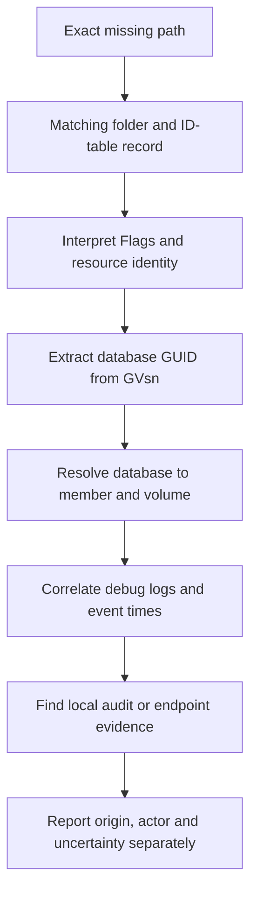

# Investigating DFSR File Deletions: GVSNs, Originating Members, Debug Logs and Preserved Files

**DFSR can replicate a deletion correctly and still leave you with a serious data-loss incident.** Before rebuilding a database or restoring files into a live replicated folder, determine what disappeared, which replica originated the relevant change and what evidence remains.

This guide covers DFS Replication on supported Windows Server versions, including 2022 and 2025. Examples use an ordinary data replication group. SYSVOL-specific diagnosis and recovery remain in the [DFSR SYSVOL troubleshooting guide](../../../060%20-%20Active%20Directory/Troubleshoot/Troubleshooting%20DFSR%20SYSVOL%20-%20Missing%20Shares,%20Initial%20Synchronization%20and%20Content%20Freshness.md).

> **TL;DR**
>
> - A DFS namespace path is not a physical file identity. Establish the actual server, replicated folder and relative path first.
> - `Uid` identifies the resource's creation identity; `GVsn` identifies the version and database that originated the last recorded change.
> - Read `Flags` as a bitmask. A non-present record can represent a deletion or conflict-related tombstone; it does not identify a user.
> - Preserve database-record output, events, debug logs, manifests and available file versions before changing replication state.
> - A matching GVSN can identify an originating database/member. Actor attribution requires preexisting audit or endpoint evidence on that member.
> - Use `-CopyFiles`, a separate recovery directory and explicit scope when extracting preserved data. Never assume ConflictAndDeleted is a backup.

## 1. Define the missing object precisely

Record the full original path, relative path inside the replicated folder, replication group, folder GUID, member and observation time. Also establish how the user reached the data: local access, a direct SMB share or a DFS namespace referral.

```text
Namespace path:     \\corp.example\Data\Projects\Budget.xlsx
Actual SMB target:  \\fs02.corp.example\Projects\Budget.xlsx
Local member path:  D:\Replicated\Projects\Budget.xlsx
Replication group: ProjectData
Replicated folder:  Projects
```

Those paths are related but not interchangeable. A namespace target can disappear while its files remain. A client can also be referred to a member that has not converged. Check explicit member paths before concluding that every replica lost the file.

For a folder deletion, identify both the folder and a representative child. A recursive deletion can produce many records; the first child found is not necessarily the operation that initiated the incident.

Do not rely on a bare file name. Two different parent folders, a renamed file or a deleted-and-recreated file can produce multiple candidates.

## 2. Preserve evidence before repair

Collect from the relevant members before reinitializing replication or reintroducing the missing path:

| Evidence | Why it matters |
|---|---|
| Replication group/folder/member identity and configuration | Establishes where the record belongs and which copies should exist |
| ID-table records, including Uid, GVsn, ParentUid and Flags | Distinguishes resource identity, version and tombstone state |
| DFS Replication events and rotated debug logs | Helps distinguish originating updates from received updates and recovery activity |
| ConflictAndDeleted and PreExisting manifests plus files | May retain recoverable versions and their metadata |
| Security/endpoint/SMB audit evidence | May identify the account and process behind a change |
| Backups and application history | Provides independent recovery and timing evidence |

Keep the source computer, query time, OS build and collection errors with each export. Capture working copies outside all replicated folders. Do not copy or edit a live DFSR database as though it were an ordinary text log; use supported backup/support collection methods for database evidence.

If destructive activity is ongoing, coordinate containment with the storage and incident-response owners. Blanket membership toggles, service restarts or database deletion can destroy the evidence being sought and create another initial-sync event.

DFSR records and logs are not an immutable audit trail. Tombstones can age out, debug logs rotate, preserved files can be purged, and later restoration can supersede the version under investigation.

## 3. Inspect membership and preservation settings

Use the DFSR module from DFS Management Tools in Windows PowerShell 5.1. Run local provider and manifest examples on the relevant member with the necessary access. Configuration reads can use RSAT, but a successful AD configuration query does not prove the member's runtime database is available.

For an ordinary replication group:

```powershell
Import-Module DFSR

$groupName = 'ProjectData'
$folderName = 'Projects'
$domainName = 'corp.example'
$memberName = 'FS02'

Get-DfsrMembership -GroupName $groupName -ComputerName $memberName `
    -DomainName $domainName -ErrorAction Stop |
    Where-Object FolderName -eq $folderName |
    Select-Object GroupName, FolderName, ComputerName, ContentPath,
        ConflictAndDeletedPath, ConflictAndDeletedQuotaInMB,
        RemoveDeletedFiles, ReadOnly, Enabled
```

For an inbound deletion, `RemoveDeletedFiles = False` moves the receiving member's copy into ConflictAndDeleted, while `True` deletes that copy without preserving it there. The originating server does not preserve its local deletion through this DFSR mechanism. Inspect each relevant membership and its history; today's setting does not prove what applied at the incident time. Preservation is still limited by available versions, quota, cleanup and subsequent recovery activity.

Do not change preservation settings during the initial collection and expect old files to reappear. Do not manage the protected SYSVOL replication group as if it were an ordinary custom group; use its documented subscription/provider procedures instead.

## 4. Find the retained DFSR record

The local `DfsrIdRecordInfo` provider can expose records for content known to DFSR, including retained deleted content. It does not guarantee that an arbitrarily old tombstone still exists.

First select the correct replicated-folder instance. The literals below are fixed examples, not a template for concatenating untrusted names into WQL:

```powershell
$folders = @(Get-CimInstance -Namespace 'root\MicrosoftDfs' `
    -ClassName DfsrReplicatedFolderInfo `
    -Filter "ReplicationGroupName='ProjectData' AND ReplicatedFolderName='Projects'" `
    -ErrorAction Stop)

if ($folders.Count -ne 1) {
    throw "Expected one replicated folder, found $($folders.Count)."
}

$folderGuid = $folders[0].ReplicatedFolderGuid
$records = @(Get-CimInstance -Namespace 'root\MicrosoftDfs' `
    -ClassName DfsrIdRecordInfo `
    -Filter "ReplicatedFolderGuid='$folderGuid' AND FileName='Budget.xlsx'" `
    -ErrorAction Stop)

$records | Select-Object FileName, FullPathName, ParentUid, Uid,
    GVsn, Flags, CreateTime, UpdateTime, ReplicatedFolderGuid
```

Compare `FullPathName` and `ParentUid` with the original location. A deleted parent or a changed hierarchy can limit path reconstruction; retain those ambiguous candidates rather than silently selecting the first record. If the query is empty, also consider retention, the wrong member/folder and a rename before concluding that DFSR never knew the file.

The provider uses names such as `GVsn` and `Uid`. The PowerShell `Get-DfsrIdRecord` cmdlet presents a different object model, including names such as `GlobalVersionSequenceNumber`. Do not mix property names from the two APIs in the same parser. A path-based query against a file that no longer exists is not a substitute for a retained-record search.

### Interpret Flags by bits

```powershell
$records | ForEach-Object {
    $record = $_
    if ($null -eq $record.Flags) {
        throw 'Missing Flags value; do not classify this record as deleted.'
    }
    $flags = [int]$record.Flags
    [pscustomobject]@{
        Uid = $record.Uid
        GVsn = $record.GVsn
        Flags = $flags
        Present = ($flags -band 0x1) -ne 0
        NameConflict = ($flags -band 0x2) -ne 0
        KnownToPartners = ($flags -band 0x4) -ne 0
        JournalWrapPendingCheck = ($flags -band 0x10) -ne 0
        PendingTombstone = ($flags -band 0x20) -ne 0
    }
}
```

`Flags = 4` is a familiar example with Present clear and UID-visible set. It is not the only possible tombstone combination. Testing exact equality to 4 misses other combinations and can conceal a name-conflict or pending-operation state.

The name-conflict flag is meaningful for tombstones. Neither a missing Present bit nor a current file-system absence proves that a user deliberately deleted the file; conflict handling, recovery and application activity must be considered.

## 5. Resolve the originating database, not the creation GUID

| Field | What it identifies |
|---|---|
| `Uid` | Stable resource identity allocated when the resource first entered the replication group |
| `GVsn` | Database GUID and version sequence for the last recorded change |
| `ParentUid` | The parent resource identity, useful when names or paths are ambiguous |
| `MemberGuid` in folder/manifest output | A DFSR member identity; not automatically the originating database GUID |
| `UpdateTime` | Last time DFSR updated this local record in response to a resource change |



For an actual deletion version, the GVSN's database GUID identifies where that version originated, not the last relay that forwarded it. `Uid` can point to the original creator even when another server later originated the deletion.

After reviewing the candidates, select exactly one by its complete Uid, then decode its GVSN. The example identity is a placeholder:

```powershell
$recordUid = '{11111111-2222-3333-4444-555555555555}-v10'
$selected = @($records | Where-Object Uid -eq $recordUid)
if ($selected.Count -ne 1) {
    throw 'Select one reviewed record by its complete Uid.'
}

$gvsnText = [string]$selected[0].GVsn
$versionMatch = [regex]::Match($gvsnText, '^\s*\{(?<DatabaseGuid>[0-9A-Fa-f-]{36})\}-(?:v)?(?<Version>[0-9]+)\s*$')
if (-not $versionMatch.Success) {
    throw 'Unexpected GVsn format; retain the original value for investigation.'
}

$databaseGuid = [guid]$versionMatch.Groups['DatabaseGuid'].Value
$versionNumber = [uint64]$versionMatch.Groups['Version'].Value

[pscustomobject]@{
    Uid = $selected[0].Uid
    GVsn = $gvsnText
    OriginatingDatabaseGuid = $databaseGuid
    VersionNumber = $versionNumber
}
```

Resolve the GUID through the public DFSR cmdlet:

```powershell
ConvertFrom-DfsrGuid -GroupName 'ProjectData' -DomainName 'corp.example' `
    -Guid $databaseGuid -ErrorAction Stop | Format-List *
```

The result can identify a member and volume whose database matches the GUID. This operation requires access to the relevant directory/member information. An offline, rebuilt or removed member may no longer resolve a historical database identity. No result is not evidence that the change originated on the member you queried.

Do not compare bare version numbers from different database GUIDs as a global chronological counter. Also avoid presenting `UpdateTime` alone as the user's deletion time: local processing, replication delay, clock accuracy and subsequent changes affect the timeline. Correlate the same Uid/GVSN across member outputs and logs.

## 6. Use debug logs to reconstruct propagation

Inspect the actual local logging configuration before assuming a path or retention window:

```powershell
$logConfiguration = Get-CimInstance -Namespace 'root\MicrosoftDfs' `
    -ClassName DfsrMachineConfig -ErrorAction Stop

$logConfiguration | Select-Object EnableDebugLog, DebugLogFilePath,
    DebugLogSeverity, MaxDebugLogFiles, MaxDebugLogMessages

$debugPath = [Environment]::ExpandEnvironmentVariables([string]$logConfiguration.DebugLogFilePath)
if ([string]::IsNullOrWhiteSpace($debugPath)) {
    throw 'Resolve the local DFSR debug-log path before collecting files.'
}

Get-ChildItem -LiteralPath $debugPath -File -ErrorAction Stop |
    Where-Object Name -like 'DFSR*.log*' |
    Select-Object Name, Length, LastWriteTimeUtc, FullName
```

DFSR commonly writes the active text log and compressed rotations under `%windir%\debug`. Defaults differ by version, so the configured values and available files are the evidence. Preserve the active and rotated files, including `.gz` files, before log rotation removes the incident window.

Work on copies. Extract compressed rotations outside the replicated folder using a tool that understands gzip; do not rename a compressed file to `.log` and search its binary content. A copy of an actively written log may not be a complete consistent endpoint, so record collection time and repeat if the incident is ongoing.

On an extracted working copy, start with the reviewed identity rather than a loose filename match:

```powershell
$logCopyRoot = 'E:\DFSR-Evidence\FS02\ExpandedLogs'
$needles = @($selected[0].Uid, $selected[0].GVsn) |
    Where-Object { -not [string]::IsNullOrWhiteSpace([string]$_) }
if (@($needles).Count -eq 0) {
    throw 'At least one reviewed record identity is required.'
}

Get-ChildItem -LiteralPath $logCopyRoot -Filter '*.log' -File -ErrorAction Stop |
    Select-String -Pattern $needles -SimpleMatch -Context 3, 3
```

Keep the surrounding record, member/connection identity and log-header time-zone/build context. A line showing that FS02 **received** a tombstone does not mean FS02 originated it. A database recovery or conflict record is not interchangeable with an ordinary local deletion.

Log formats and diagnostic messages can change. Treat them as corroborating technical evidence, not as a stable per-user audit API. Increasing logging now does not recreate records already rotated out.

## 7. Find who requested the operation

DFSR knows file identities and replicated changes; it is not the subsystem that reliably identifies the human behind a file operation. Once the originating member and time window are established, examine evidence from that member:

| Evidence | What it can add | Limit |
|---|---|---|
| 4663 with relevant Delete access | Account, object path and process context for an audited access | Requires Audit File System and a matching SACL; a delete-access event alone is not a complete final-state history |
| 4660 | An object was deleted | Does not carry the object name; correlate the handle/session with related object-access events |
| 4656 | Handle requested for an object | Requested access is not proof the operation occurred |
| 4624 | Logon context, possibly source address and authentication package | Correlate on the same computer and appropriate time/session history |
| 5145 | SMB share-access check context when Detailed File Share auditing is enabled | An access check is not proof that the file deletion completed |
| Endpoint/application logs | Process, job or application activity | Coverage must have existed when the action occurred |

Event 4663 records an access right being used, unlike 4656's request for a handle. Delete access can also occur during a rename; correlate 4660, paths and record history before treating it as a completed deletion of the original content.

For a bounded local query on the suspected originating member:

```powershell
$startTime = [datetimeoffset]::Parse('2026-09-24T10:00:00Z').UtcDateTime
$endTime = [datetimeoffset]::Parse('2026-09-24T11:00:00Z').UtcDateTime

Get-WinEvent -FilterHashtable @{
    LogName = 'Security'
    ProviderName = 'Microsoft-Windows-Security-Auditing'
    Id = 4656, 4660, 4663, 5145
    StartTime = $startTime
    EndTime = $endTime
} -ErrorAction Stop |
    Select-Object TimeCreated, Id, MachineName, RecordId, Message
```

Use the event XML's named fields for repeatable correlation. Retain `SubjectUserSid`, `SubjectLogonId`, `HandleId`, `ProcessId` and `ObjectName` where available. Do not join solely on a handle value across machines or reboots.

On a receiving replica, local file operations may be attributed to the DFSR service context. That is replication evidence, not identification of the initiating user. Likewise, an automation account identifies the security context; follow the job or application logs before attributing an action to a person.

Audit policy and the file/folder SACL must predate the incident. Enabling them afterward helps the next investigation but cannot reconstruct missing history. Deleting an AD object instead of a file is a different workflow: see [Tracing Deleted Active Directory Objects](../../../060%20-%20Active%20Directory/Troubleshoot/Tracing%20Deleted%20Active%20Directory%20Objects%20-%20Events%204726%20and%204743,%20Deleted%20Objects%20and%20Replication%20Metadata.md).

## 8. Inspect preserved files without changing the store

DFSR can preserve conflict losers, replicated deletions according to membership settings, and files displaced during initial synchronization. These may appear in ConflictAndDeleted or PreExisting with manifests mapping preserved names to original paths.

Read the manifest on the member that holds it. Replace the example root with the actual local path:

```powershell
Import-Module DFSR

$replicatedRoot = 'D:\Replicated\Projects'
$manifestPath = Join-Path $replicatedRoot 'DfsrPrivate\ConflictAndDeletedManifest.xml'
if (-not (Test-Path -LiteralPath $manifestPath -PathType Leaf)) {
    throw 'No manifest at this location; verify the member, folder and available evidence.'
}

$preservedEntries = @(Get-DfsrPreservedFiles -Path $manifestPath -ErrorAction Stop)
$preservedEntries | Select-Object Path, Uid, Gvsn, MemberGuid, PreservedName,
    PreservedTime, PreservedReason, FileSize
```

Use `PreExistingManifest.xml` to inspect displaced preexisting content. Its meaning is different from a user deletion. Review the exact original path and available versions rather than restoring every entry whose name contains a familiar word.

The manifest is not the file content itself. A listed entry may no longer have recoverable content if files were purged or the store is inconsistent. Preserve both the manifest and available content before recovery work.

Do not assume the Windows Recycle Bin contains a locally deleted file: deletion through SMB, applications or a permanent-delete operation can bypass it. Do not assume every receiving replica preserved the same versions. Check the actual stores, configuration and independent backups.

## 9. Extract copies to a separate recovery directory

`Restore-DfsrPreservedFiles` has a consequential default: **without `-CopyFiles`, it moves preserved files and can discard older versions**. Use a separate location outside every replicated root, keep the originals, and review the operation before performing it.

The cmdlet acts on the supplied **manifest**, not the filtered list previously displayed. A name filter in `Get-DfsrPreservedFiles` does not restrict the scope of a subsequent restore command. Plan for all entries in that manifest and sufficient destination capacity.

```powershell
$recoveryBase = 'E:\DFSR-Recovery'
if (-not (Test-Path -LiteralPath $recoveryBase -PathType Container)) {
    throw 'Choose an existing recovery base outside all replicated folders.'
}
$recoveryPath = Join-Path $recoveryBase ('Projects-' + [guid]::NewGuid().ToString())
if (Test-Path -LiteralPath $recoveryPath) {
    throw 'Use a new destination so no existing files need to be overwritten.'
}

Restore-DfsrPreservedFiles -Path $manifestPath -RestoreToPath $recoveryPath `
    -CopyFiles -RestoreAllVersions -WhatIf
```

After reviewing the manifest scope and destination, execute the same operation with confirmation:

```powershell
if (Test-Path -LiteralPath $recoveryPath) {
    throw 'The destination now exists; select a fresh recovery directory.'
}

Restore-DfsrPreservedFiles -Path $manifestPath -RestoreToPath $recoveryPath `
    -CopyFiles -RestoreAllVersions -Confirm -ErrorAction Stop
```

The examples deliberately avoid `-RestoreToOrigin`, `-AllowClobber` and `-Force`. `-WhatIf` previews intent but does not prove that every source byte is still available or that recovery will succeed. A copy operation can still create a large number of sensitive files; protect the destination accordingly.

Inspect recovered versions, hashes, application usability and relevant permissions before selecting data to return to production. Restoring into the live replicated folder creates new changes that can propagate. Resolve ongoing deletion activity and choose the intended version first.

For SYSVOL, coordinate policy recovery with GPO metadata and the established SYSVOL recovery procedure. Copying arbitrary policy directories back is not a complete Group Policy recovery strategy.

## 10. Report the strongest supported conclusion

| Evidence available | Defensible finding |
|---|---|
| Matching tombstone GVSN and resolved database/member | Origin of the recorded version, subject to record-state and history checks |
| Matching propagation logs on several members | Corroborated direction and approximate timeline of replication |
| Matching originating-member audit and endpoint evidence | Account/process attribution, with any remaining human-attribution limits |
| Preserved file and manifest only | A recoverable version may exist; actor and precise origin may remain unknown |
| Only a recreated path | Current content does not establish what happened to the original Uid |
| Missing records/logs after cleanup | Evidence unavailable, not proof that no deletion occurred |

Close the incident with the affected paths, group/folder identities, examined members, relevant Uids/GVSNs, time-zone assumptions, retained evidence and collection gaps. State separately what was recovered, what caused the replication behavior and what can be attributed to an account.

Prevent recurrence with timely backups, bounded audit coverage for important data, retained member-level events, replication monitoring and application ownership. DFSR convergence replicates the current state, including unwanted deletions; it is not historical backup retention.

## References

- [DfsrIdRecordInfo provider: identity, flags and version fields](https://learn.microsoft.com/en-us/previous-versions/windows/desktop/dfsr/dfsridrecordinfo)
- [ConvertFrom-DfsrGuid](https://learn.microsoft.com/en-us/powershell/module/dfsr/convertfrom-dfsrguid)
- [Get-DfsrMembership](https://learn.microsoft.com/en-us/powershell/module/dfsr/get-dfsrmembership)
- [Set-DfsrMembership: RemoveDeletedFiles semantics](https://learn.microsoft.com/en-us/powershell/module/dfsr/set-dfsrmembership#-removedeletedfiles)
- [Get-DfsrPreservedFiles](https://learn.microsoft.com/en-us/powershell/module/dfsr/get-dfsrpreservedfiles)
- [Restore-DfsrPreservedFiles and default move behavior](https://learn.microsoft.com/en-us/powershell/module/dfsr/restore-dfsrpreservedfiles)
- [DFSR debug logging reference](https://learn.microsoft.com/en-us/troubleshoot/windows-server/networking/change-dfsr-debug-log-settings)
- [Event 4660: an object was deleted](https://learn.microsoft.com/en-us/windows/security/threat-protection/auditing/event-4660)
- [Event 4663: an attempt was made to access an object](https://learn.microsoft.com/en-us/windows/security/threat-protection/auditing/event-4663)
- [Event 5145: network share access check](https://learn.microsoft.com/en-us/windows/security/threat-protection/auditing/event-5145)