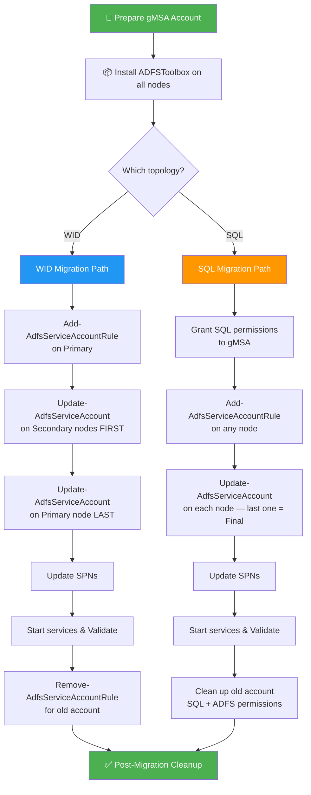

# ADFS — Migrate from a Standard Service Account to a Group Managed Service Account (gMSA)

> This article covers how to migrate your AD FS farm from a traditional domain service account to a **Group Managed Service Account (gMSA)**, for both **WID (Windows Internal Database)** and **SQL Server** deployment topologies using the official **Microsoft ADFSToolbox** module.

🗓️ Published: 2026-03-24

---

## 🗂️ Table of Contents

- [1. Why Migrate to a gMSA?](#1-why-migrate-to-a-gmsa)
- [2. Prerequisites](#2-prerequisites)
- [3. Prepare the gMSA Account](#3-prepare-the-gmsa-account)
- [4. Install the Microsoft ADFSToolbox Module](#4-install-the-microsoft-adfstoolbox-module)
- [5. Migration — ADFS with WID](#5-migration--adfs-with-wid)
  - [5.1. Identify the Primary Node](#51-identify-the-primary-node)
  - [5.2. Grant Permissions to the gMSA (Primary Node)](#52-grant-permissions-to-the-gmsa-primary-node)
  - [5.3. Update Secondary Nodes First](#53-update-secondary-nodes-first)
  - [5.4. Update the Primary Node Last](#54-update-the-primary-node-last)
  - [5.5. Update SPNs](#55-update-spns)
  - [5.6. Start Services and Validate](#56-start-services-and-validate)
  - [5.7. Remove Old Service Account Permissions](#57-remove-old-service-account-permissions)
- [6. Migration — ADFS with SQL Server](#6-migration--adfs-with-sql-server)
  - [6.1. Grant SQL Permissions to the gMSA](#61-grant-sql-permissions-to-the-gmsa)
  - [6.2. Grant ADFS Permissions to the gMSA](#62-grant-adfs-permissions-to-the-gmsa)
  - [6.3. Update Each Node](#63-update-each-node)
  - [6.4. Update SPNs](#64-update-spns)
  - [6.5. Start Services and Validate](#65-start-services-and-validate)
  - [6.6. Clean Up Old Account Permissions](#66-clean-up-old-account-permissions)
- [7. Post-Migration Steps](#7-post-migration-steps)
- [8. Rollback Plan](#8-rollback-plan)
- [9. Common Errors and Troubleshooting](#9-common-errors-and-troubleshooting)

---

## 📊 Migration Overview



---

## 1. Why Migrate to a gMSA?

| Feature | Standard Service Account | gMSA |
|---|---|---|
| Password management | Manual rotation required | Automatic (managed by AD, 30-day cycle) |
| Password exposure risk | Stored/known by admins | Never exposed — managed by the OS |
| SPN management | Manual | Automatic |
| Multi-server support | Yes | Yes (gMSA can be shared across servers) |
| Compliance / Security | ⚠️ Weaker | ✅ Stronger — no human-known password |

> ✅ **Microsoft recommends using gMSA** for AD FS farms. It removes the operational burden of manual password rotation and reduces the attack surface.
>
> As highlighted in [this blog post by Sergey Tunnik](https://tunnik.name/changing-adfs-service-account/), a shared standard service account whose password is known by multiple teams is a significant operational risk — accidental password resets can take down the entire federation service.

---

## 2. Prerequisites

Before starting the migration, ensure the following:

- **AD FS version**: Windows Server 2016 or later (Server 2012 R2 requires a different approach)
- **Domain functional level**: Windows Server 2012 or higher
- **KDS Root Key** must be created and effective (see step 3)
- The account performing the migration must be:
  - A **local administrator** on all AD FS servers
  - A **Domain Admin** (or have rights to create gMSA accounts)
  - An **AD FS administrator**
- All AD FS nodes must be able to retrieve the gMSA password (they must be in the `PrincipalsAllowedToRetrieveManagedPassword` group/list)
- **Tools to install on all ADFS servers:**
  - [ADFSToolbox PowerShell module](https://www.powershellgallery.com/packages/ADFSToolbox/)
  - Active Directory PowerShell module (`RSAT > AD DS & AD LDS > AD for PowerShell`)
- For SQL topology: access to the SQL Server instance to grant permissions

> ⚠️ **Plan a maintenance window.** The AD FS service will be restarted on each node during the migration — expect a brief authentication outage.

---

## 3. Prepare the gMSA Account

### 3.1. Verify or Create the KDS Root Key

The **Key Distribution Services (KDS) Root Key** is required for gMSA password generation. Check if one already exists:

```powershell
Get-KdsRootKey
```

If no key exists, create one. In **production**, use the following (effective after 10 hours of DC replication):

```powershell
Add-KdsRootKey -EffectiveImmediately
```

> ⚠️ Despite the parameter name, `Add-KdsRootKey -EffectiveImmediately` actually sets the effective time to **10 hours in the future** to allow replication. In a **lab environment only**, you can force immediate availability:
>
> ```powershell
> Add-KdsRootKey -EffectiveTime ((Get-Date).AddHours(-10))
> ```

### 3.2. Create a Security Group for ADFS Servers

Create an AD security group containing all your ADFS servers. This group will be granted permission to retrieve the gMSA password.

```powershell
# Create the group
New-ADGroup -Name "grp-ADFS-Servers" `
    -GroupScope Global `
    -GroupCategory Security `
    -Path "OU=Groups,DC=contoso,DC=com"

# Add all ADFS servers to the group
Add-ADGroupMember -Identity "grp-ADFS-Servers" `
    -Members (Get-ADComputer -Identity "ADFS01"), `
             (Get-ADComputer -Identity "ADFS02")
```

> ⚠️ **Important:** After adding computer accounts to the group, **reboot all ADFS servers** (or wait for Kerberos ticket refresh) so they pick up the new group membership.

### 3.3. Create the gMSA Account

```powershell
New-ADServiceAccount -Name "svc-ADFS-gMSA" `
    -DNSHostName "svc-ADFS-gMSA.contoso.com" `
    -PrincipalsAllowedToRetrieveManagedPassword "grp-ADFS-Servers" `
    -KerberosEncryptionType AES128, AES256
```

> 💡 Do **not** set the SPN here — SPNs will be handled in a later step after the migration.

### 3.4. Validate gMSA on Each ADFS Server

On **each** AD FS server, install the gMSA and test it:

```powershell
Install-ADServiceAccount -Identity "svc-ADFS-gMSA"
Test-ADServiceAccount -Identity "svc-ADFS-gMSA"
```

✅ Expected result: `True`

If it returns `False`, verify:
- The server's computer account is in the `grp-ADFS-Servers` group
- The server has been rebooted since group membership was changed
- The KDS Root Key is effective

### 3.5. Configure Local Security Policy for the gMSA

On **each** AD FS server, the gMSA needs two local security rights. Open **Local Security Policy** (`secpol.msc`) and add `CONTOSO\svc-ADFS-gMSA$` to:

- **Local Policies > User Rights Assignment > Generate security audits**
- **Local Policies > User Rights Assignment > Log on as a service**

> 💡 This can also be configured via Group Policy if all ADFS servers are in the same OU.

---

## 4. Install the Microsoft ADFSToolbox Module

The official [Microsoft ADFSToolbox](https://github.com/Microsoft/adfsToolbox/tree/master/serviceAccountModule) provides the supported cmdlets for changing an AD FS service account. Install it on **all AD FS servers**:

```powershell
# Ensure TLS 1.2 is used for PowerShell Gallery
[Net.ServicePointManager]::SecurityProtocol = [Net.SecurityProtocolType]::Tls12

# Install the module
Install-Module -Name ADFSToolbox -Force

# Import the service account module
Import-Module ADFSToolbox
Import-Module "$((Get-Module ADFSToolbox -ListAvailable).ModuleBase)\serviceAccountModule\AdfsServiceAccountModule.psm1"
```

The module provides the following cmdlets:

| Cmdlet | Purpose |
|---|---|
| `Add-AdfsServiceAccountRule` | Grants the new service account permissions in the ADFS config database (required on Server 2016+) |
| `Update-AdfsServiceAccount` | Changes the ADFS service account on the local machine |
| `Remove-AdfsServiceAccountRule` | Removes permissions for the old service account |
| `Restore-AdfsSettingsFromBackup` | Restores settings from a backup generated during Add/Remove operations |

> ⚠️ **Warning from Microsoft:** It is highly recommended to create a backup before attempting to change the service account. Executing cmdlets in the wrong order may result in a non-functioning AD FS farm. **Test in a non-production farm first.**

---

## 5. Migration — ADFS with WID

In a WID farm, there is one **primary node** and one or more **secondary (read-only) nodes**.

> 🔴 **Critical: The order of operations matters!**
> 1. Grant permissions on the **primary** node
> 2. Update service account on **secondary nodes FIRST**
> 3. Update service account on the **primary node LAST**

```mermaid
sequenceDiagram
    participant AD as Active Directory
    participant P as Primary Node
    participant S1 as Secondary Node 1
    participant S2 as Secondary Node 2

    rect rgb(20, 60, 120)
    Note over AD,S2: Phase 1 — Preparation
    AD->>AD: Create gMSA + Security Group
    AD-->>P: Install-ADServiceAccount
    AD-->>S1: Install-ADServiceAccount
    AD-->>S2: Install-ADServiceAccount
    P->>P: secpol.msc — Log on as service + Generate audits
    S1->>S1: secpol.msc — Log on as service + Generate audits
    S2->>S2: secpol.msc — Log on as service + Generate audits
    end

    rect rgb(140, 80, 0)
    Note over AD,S2: Phase 2 — Grant & Migrate
    P->>P: Add-AdfsServiceAccountRule (gMSA)
    P-->>S1: WID Sync
    P-->>S2: WID Sync
    S1->>S1: Update-AdfsServiceAccount (Mode 1)
    S2->>S2: Update-AdfsServiceAccount (Mode 1)
    P->>P: Update-AdfsServiceAccount (Mode 2 — Final)
    end

    rect rgb(15, 90, 40)
    Note over AD,S2: Phase 3 — Validate & Cleanup
    P->>P: setspn -S (new gMSA)
    P->>P: Start-Service adfssrv
    S1->>S1: Start-Service adfssrv
    S2->>S2: Start-Service adfssrv
    P->>P: Test-AdfsServerHealth ✅
    P->>P: Remove-AdfsServiceAccountRule (old account)
    end
```



### 5.1. Identify the Primary Node

Run the following on any AD FS node:

```powershell
Get-AdfsSyncProperties
```

The primary node will show:

```
Role : PrimaryComputer
```

### 5.2. Grant Permissions to the gMSA (Primary Node)

On the **primary AD FS node**, grant the new gMSA account the necessary permissions in the ADFS configuration database. This step is **mandatory on Windows Server 2016 and later**:

```powershell
# Add permission rule for the gMSA (run on PRIMARY node)
# Replace ADFS02 with your actual secondary server(s)
Add-AdfsServiceAccountRule -ServiceAccount "svc-ADFS-gMSA$" -SecondaryServers "ADFS02.contoso.com"
```

> 💡 The `-SecondaryServers` parameter triggers a WID sync to propagate the change to all secondary nodes. If you have multiple secondary servers, separate them with commas:
> ```powershell
> Add-AdfsServiceAccountRule -ServiceAccount "svc-ADFS-gMSA$" -SecondaryServers "ADFS02.contoso.com", "ADFS03.contoso.com"
> ```
>
> This cmdlet automatically creates a backup of your configuration. Note the backup path shown in the output — you will need it for rollback.

### 5.3. Update Secondary Nodes First

On **each secondary node**, run the `Update-AdfsServiceAccount` cmdlet:

```powershell
# Run on EACH SECONDARY node
Update-AdfsServiceAccount
```

When prompted, select **Operating Mode #1 — Federation Server** (not "Final Federation Server").

The cmdlet will:
1. Stop the AD FS service
2. Update the service account on the Windows service (`adfssrv`)
3. Update the AD FS application pool identity

> ⚠️ Do **not** start the AD FS service on secondary nodes yet — wait until all nodes (including primary) have been updated.

### 5.4. Update the Primary Node Last

Once **all secondary nodes** have been updated, run on the **primary node**:

```powershell
# Run on the PRIMARY node LAST
Update-AdfsServiceAccount
```

When prompted, select **Operating Mode #2 — Final Federation Server**.

> This mode performs additional steps: it updates the ADFS configuration database to replace the old service account SID with the new gMSA SID. This is why it must be run **last**.

### 5.5. Update SPNs

The `Update-AdfsServiceAccount` script may fail to update SPNs automatically. If so, manually manage them:

```powershell
# Check current SPNs on the old service account
setspn -L CONTOSO\svc-adfs-old

# Remove the SPN from the old account
setspn -D HOST/adfs.contoso.com CONTOSO\svc-adfs-old

# Add the SPN to the new gMSA
setspn -S HOST/adfs.contoso.com CONTOSO\svc-ADFS-gMSA$
```

> 💡 With gMSA accounts, SPN management is generally automatic for future changes, but the initial migration may require manual intervention.

### 5.6. Start Services and Validate

Start the AD FS service on the **primary node first**, then on each secondary node:

```powershell
# On the primary node
Start-Service adfssrv

# Then on each secondary node
Start-Service adfssrv
```

Validate the farm:

```powershell
# Verify the service account on each node
Get-WmiObject Win32_Service -Filter "Name='adfssrv'" | Select-Object Name, StartName

# Check ADFS health
Test-AdfsServerHealth

# Check sync status on secondary nodes
Get-AdfsSyncProperties
```

✅ The `StartName` should display `CONTOSO\svc-ADFS-gMSA$`

### 5.7. Remove Old Service Account Permissions

Once everything is validated, remove the old service account's permissions from the ADFS configuration database. Run on the **primary node**:

```powershell
# Remove the old account's permission rule
Remove-AdfsServiceAccountRule -ServiceAccount "CONTOSO\svc-adfs-old" -SecondaryServers "ADFS02.contoso.com"
```

---

## 6. Migration — ADFS with SQL Server

When AD FS uses a SQL Server backend, there is no primary/secondary distinction — all nodes are equal. However, additional steps are required to grant the gMSA access to the SQL databases.

```mermaid
sequenceDiagram
    participant AD as Active Directory
    participant SQL as SQL Server
    participant N1 as ADFS Node 1
    participant N2 as ADFS Node 2

    rect rgb(20, 60, 120)
    Note over AD,N2: Phase 1 — Preparation
    AD->>AD: Create gMSA + Security Group
    AD-->>N1: Install-ADServiceAccount
    AD-->>N2: Install-ADServiceAccount
    N1->>N1: secpol.msc — Log on as service + Generate audits
    N2->>N2: secpol.msc — Log on as service + Generate audits
    end

    rect rgb(140, 80, 0)
    Note over AD,N2: Phase 2 — SQL + Grant & Migrate
    SQL->>SQL: CREATE LOGIN [gMSA] + db_owner on ADFS DBs
    N1->>N1: Add-AdfsServiceAccountRule (gMSA)
    N1->>N1: Update-AdfsServiceAccount (Mode 1)
    N2->>N2: Update-AdfsServiceAccount (Mode 2 — Final)
    end

    rect rgb(15, 90, 40)
    Note over AD,N2: Phase 3 — Validate & Cleanup
    N1->>N1: setspn -S (new gMSA)
    N1->>N1: Start-Service adfssrv
    N2->>N2: Start-Service adfssrv
    N1->>N1: Test-AdfsServerHealth ✅
    N1->>N1: Remove-AdfsServiceAccountRule (old account)
    SQL->>SQL: DROP LOGIN / DROP USER (old account)
    end
```



### 6.1. Grant SQL Permissions to the gMSA

Connect to the SQL Server instance and run the following T-SQL:

```sql
-- Create a login for the gMSA
USE [master]
GO
CREATE LOGIN [CONTOSO\svc-ADFS-gMSA$] FROM WINDOWS
GO

-- Grant permissions on the ADFS configuration database
USE [AdfsConfigurationV4]
GO
CREATE USER [CONTOSO\svc-ADFS-gMSA$] FOR LOGIN [CONTOSO\svc-ADFS-gMSA$]
GO
ALTER ROLE [db_owner] ADD MEMBER [CONTOSO\svc-ADFS-gMSA$]
GO

-- Grant permissions on the ADFS artifact database
USE [AdfsArtifactStore]
GO
CREATE USER [CONTOSO\svc-ADFS-gMSA$] FOR LOGIN [CONTOSO\svc-ADFS-gMSA$]
GO
ALTER ROLE [db_owner] ADD MEMBER [CONTOSO\svc-ADFS-gMSA$]
GO
```

> ⚠️ Database names may vary depending on your ADFS version and configuration. Common names include:
> - `AdfsConfigurationV4` (ADFS 2016+)
> - `AdfsConfiguration` (older versions)
> - `AdfsArtifactStore`
>
> Verify your database names in SQL Server Management Studio before running the script.

### 6.2. Grant ADFS Permissions to the gMSA

On **one of the AD FS nodes**, grant the gMSA permissions in the ADFS configuration (required on Server 2016+):

```powershell
Add-AdfsServiceAccountRule -ServiceAccount "svc-ADFS-gMSA$"
```

> 💡 In SQL mode, you do not need the `-SecondaryServers` parameter since there is no WID replication — all nodes access the same SQL database.

### 6.3. Update Each Node

You can update nodes **one at a time** to maintain partial availability. On **each AD FS node**:

```powershell
Update-AdfsServiceAccount
```

Select the appropriate operating mode when prompted:
- For all nodes except the last one: **#1 — Federation Server**
- For the **last node**: **#2 — Final Federation Server**

> ⚠️ The **last node** updated must use mode #2 to finalize the SID replacement in the configuration database.

### 6.4. Update SPNs

Same as for WID — if SPNs were not updated automatically:

```powershell
# Remove the SPN from the old account
setspn -D HOST/adfs.contoso.com CONTOSO\svc-adfs-old

# Add the SPN to the new gMSA
setspn -S HOST/adfs.contoso.com CONTOSO\svc-ADFS-gMSA$
```

### 6.5. Start Services and Validate

Start the AD FS service on each node:

```powershell
Start-Service adfssrv
```

Validate:

```powershell
# Verify the service account on each node
Get-WmiObject Win32_Service -Filter "Name='adfssrv'" | Select-Object Name, StartName

# Verify ADFS is operational
Get-AdfsProperties | Select-Object HostName

# Full health check
Test-AdfsServerHealth
```

### 6.6. Clean Up Old Account Permissions

Once validated, remove the old service account permissions:

```powershell
# From ADFS configuration
Remove-AdfsServiceAccountRule -ServiceAccount "CONTOSO\svc-adfs-old"
```

And from SQL Server:

```sql
USE [AdfsConfigurationV4]
GO
DROP USER [CONTOSO\svc-adfs-old]
GO
USE [AdfsArtifactStore]
GO
DROP USER [CONTOSO\svc-adfs-old]
GO
USE [master]
GO
DROP LOGIN [CONTOSO\svc-adfs-old]
GO
```

---

## 7. Post-Migration Steps

Once all nodes are successfully running with the gMSA:

1. **Verify Device Registration Service (DRS)** — if DRS is configured, update its permissions:

    ```powershell
    Set-AdfsDeviceRegistration
    ```

2. **Disable the old service account** in Active Directory (don't delete it immediately in case rollback is needed):

    ```powershell
    Disable-ADAccount -Identity "svc-adfs-old"
    ```

3. **Update monitoring** — if you have monitoring on the AD FS service account, update it to reference the gMSA.

4. **Update documentation** — record the new service account name and the migration date.

5. **Delete the old service account** after a validation period (e.g., 30 days).

6. **Clean up tools** — uninstall ADFSToolbox if no longer needed.

---

## 8. Rollback Plan

If something goes wrong during the migration, you have two options:

### Option A: Use the ADFSToolbox Restore Cmdlet

The `Add-AdfsServiceAccountRule` and `Remove-AdfsServiceAccountRule` commands automatically create backups. Use the backup to restore:

```powershell
# Restore from the backup created during the migration
Restore-AdfsSettingsFromBackup -BackupPath "C:\Users\Administrator\Documents\serviceSettingsData-2026-03-24-xx-xx-xx.xml"
```

### Option B: Manual Revert

On each node (secondary nodes first, primary last for WID):

```powershell
# Stop the service
Stop-Service adfssrv

# Revert the Windows service to the old account
sc.exe config adfssrv obj= "CONTOSO\svc-adfs-old" password= "P@ssword"

# Start the service
Start-Service adfssrv
```

For SQL topology, ensure the old account still has SQL permissions before reverting.

### Option C: Database SID Fix (Last Resort)

If the service starts but authentication fails with `MSIS5009` errors, the old service account SID may still be hardcoded in the ADFS database. Fix it with the following SQL query ([as documented by Sergey Tunnik](https://tunnik.name/changing-adfs-service-account/)):

```sql
USE AdfsConfiguration  -- or AdfsConfigurationV4

-- Find the SIDs first
-- Old SID: Get-ADUser svc-adfs-old -Properties SID | Select SID
-- New SID: Get-ADServiceAccount svc-ADFS-gMSA -Properties SID | Select SID

UPDATE IdentityServerPolicy.ServiceSettings
SET ServiceSettingsData = REPLACE(
    (SELECT ServiceSettingsData FROM IdentityServerPolicy.ServiceSettings),
    '<old-SID>',
    '<new-SID>'
)
```

> ⚠️ This is an **unsupported** operation. Only use it as a last resort if the `Update-AdfsServiceAccount` tool did not properly update the SID.

---

## 9. Common Errors and Troubleshooting

| Error | Cause | Solution |
|---|---|---|
| `Test-ADServiceAccount` returns `False` | Server not in gMSA's allowed principals | Add the computer account to `grp-ADFS-Servers` and **reboot** the server |
| ADFS service fails to start (Event 364) | gMSA cannot read the SSL certificate private key | Grant Read permission on the certificate private key to the gMSA |
| SQL connection error after migration | gMSA has no SQL login/permissions | Run the SQL permission script from section 6.1 |
| `Update-AdfsServiceAccount` errors on SPN | SPN conflict or insufficient permissions | Manually manage SPNs with `setspn -D` / `setspn -S` (see section 5.5) |
| MSIS5009: Impersonation authorization failed | Old SID still hardcoded in ADFS config DB | The "Final Federation Server" mode was not used on the last node. Use the database SID fix (section 8, Option C) |
| Secondary node not syncing (WID) | Service account mismatch or sync delay | Force sync: `Set-AdfsSyncProperties -PollDuration 5` — or restart the service |
| KDS Root Key not effective | Key was created less than 10 hours ago | Wait for replication or recreate with `-EffectiveTime` in lab only |
| Event 1021: "Encountered error during federation passive request" | Certificate binding or SID issue | Check certificate private key ACLs and verify SID in config DB |
| gMSA missing "Log on as a service" right | Local security policy not configured | Add the gMSA to "Log on as a service" and "Generate security audits" in `secpol.msc` |

---

> 📚 **References:**
> - [Microsoft ADFSToolbox — Service Account Module (GitHub)](https://github.com/Microsoft/adfsToolbox/tree/master/serviceAccountModule) — Official Microsoft module for changing AD FS service accounts
> - [ADFS Change Service Account to gMSA — Greg Beifuss](https://gbeifuss.github.io/p/adfs-change-service-account-to-gmsa/) — Step-by-step walkthrough for WID topology
> - [Changing AD FS Service Account — Sergey Tunnik](https://tunnik.name/changing-adfs-service-account/) — Explains the SID hardcoding issue in the ADFS config database
> - [Configure AD FS to use a gMSA — Microsoft Docs](https://learn.microsoft.com/en-us/windows-server/identity/ad-fs/deployment/configure-a-federation-server)
> - [Group Managed Service Accounts Overview — Microsoft Docs](https://learn.microsoft.com/en-us/windows-server/security/group-managed-service-accounts/group-managed-service-accounts-overview)
