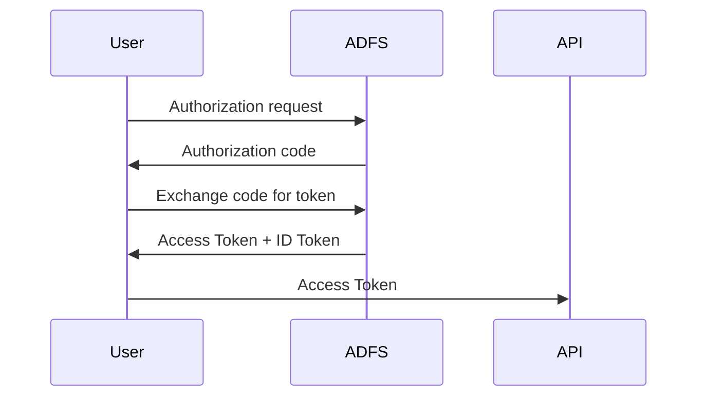

# ADFS Lab — Customizing Access Tokens and ID Tokens (OIDC)

> A fun, geek-friendly deep dive into how ADFS issues and customizes Access Tokens and ID Tokens.

---

## 1. Introduction

This lab explains how to customize an **Access Token** and an **ID Token** issued by ADFS using OpenID Connect (OIDC).

Instead of staying theoretical, we will reproduce the entire authentication flow step by step, inspect the tokens, and modify the claims issued by ADFS.

**Tools used in this lab:**

- OIDC Debugger
- PowerShell
- JWT decoding
- ADFS claim rules

**The idea is simple:**

1. Request an authorization code
2. Exchange it for tokens
3. Decode the Access Token
4. Modify ADFS claim rules
5. Verify the result

By the end, you will fully understand how Access Tokens are produced and customized in ADFS.

---

## 2. Goal of the Lab

We want the Access Token issued by ADFS to include a custom claim: `preferred_username`.

Expected result inside the Access Token:

```json
{
  "aud": "https://oidcdebugger",
  "preferred_username": "darth.vader"
}
```

To achieve this, we configure a claim rule in ADFS that transforms:

**`samAccountName`** → **`preferred_username`**

---

## 3. What You Will Learn

By the end of this lab you will understand:

- How ADFS issues Access Tokens in an OIDC flow
- How Web API claim rules affect the Access Token
- How the `resource` parameter determines the audience
- How to retrieve tokens using PowerShell
- How to decode and inspect JWT tokens
- How to inject custom claims into an Access Token

---

## 4. OIDC Flow with ADFS

The authentication flow used in this lab is the **Authorization Code Flow**.

**Flow overview:**



**Step breakdown:**

1. The client sends an authorization request
2. ADFS authenticates the user
3. ADFS returns an authorization code
4. The client exchanges the code at `/oauth2/token`
5. ADFS returns the Access Token

---

## 5. Understanding ID Token vs Access Token

OIDC produces two different tokens.

| Token        | Purpose                              |
|--------------|--------------------------------------|
| ID Token     | Identity information about the user  |
| Access Token | Authorization token used by APIs     |

> **Important rule in ADFS:**
>
> Web API claim rules affect the **Access Token**.
> They do **not** necessarily modify the ID Token.

In this lab we focus on **Access Token customization**.

---

## 6. Creating the Application Group in ADFS

Before we can request tokens, we need to register an **Application Group** in ADFS. This group contains two components:

- A **Server application** (the OIDC client)
- A **Web API** (the resource / audience)

### Via the ADFS Management Console

1. Open **ADFS Management**
2. Right-click **Application Groups** → **Add Application Group…**
3. Enter a name, e.g. `OIDC Debugger Test`
4. Select the template **Server application accessing a web API** → click **Next**


#### Server application (OIDC Client)

5. Note the **Client ID** generated automatically (e.g. `9668b94b-ca52-4e93-8917-be74ce931d5a`)
6. Add the **Redirect URI**: `https://oidcdebugger.com/debug` → click **Add**, then **Next**


7. Check **Generate a shared secret** — copy and save it securely → click **Next**


#### Web API (Resource)

8. In the **Identifier** field, enter: `https://oidcdebugger` → click **Add**, then **Next**


9. Choose an **Access Control Policy** (e.g. `Permit everyone`) → click **Next**


10. Under **Application Permissions**, ensure at least `openid`, `profile`, `email` and `allatclaims` are checked → click **Next**


11. Review the summary and click **Close**


### Via PowerShell

You can also create the Application Group entirely via PowerShell:

```powershell
# 1. Create the Application Group
New-AdfsApplicationGroup -Name "OIDC Debugger Test"

# 2. Create the Server application (OIDC Client)
$clientId    = [guid]::NewGuid().ToString()
$redirectUri = "https://oidcdebugger.com/debug"
$secret      = "YOUR_SECRET_HERE"

Add-AdfsServerApplication `
    -Name "OIDC Debugger Test - Server application" `
    -ApplicationGroupIdentifier "OIDC Debugger Test" `
    -ClientId $clientId `
    -RedirectUri $redirectUri `
    -GenerateClientSecret

# 3. Create the Web API (Resource)
Add-AdfsWebApiApplication `
    -Name "OIDC Debugger Test - Web API" `
    -ApplicationGroupIdentifier "OIDC Debugger Test" `
    -Identifier "https://oidcdebugger" `
    -AccessControlPolicyName "Permit everyone"

# 4. Grant permissions to the client
Grant-AdfsApplicationPermission `
    -ClientRoleIdentifier $clientId `
    -ServerRoleIdentifier "https://oidcdebugger" `
    -ScopeNames "openid", "profile", "email", "allatclaims"
```

> **Tip:** Save the `$clientId` and the generated secret — you will need them in later steps.

### Verifying the setup

You can verify the Application Group was created correctly:

```powershell
# List Application Groups
Get-AdfsApplicationGroup | Select Name

# List Server applications
Get-AdfsServerApplication | Select Name, Identifier

# List Web APIs
Get-AdfsWebApiApplication | Select Name, Identifier
```

Expected output:

```
Name                         Identifier
----                         ----------
OIDC Debugger Test - Web API {https://oidcdebugger}
```


---

## 7. ADFS Components Summary

To recap, the Application Group contains:

| Component          | Name                                    | Key Property                             |
|--------------------|-----------------------------------------|------------------------------------------|
| Application Group  | `OIDC Debugger Test`                    | —                                        |
| Server application | `OIDC Debugger Test - Server application` | Client ID: `9668b94b-ca52-4e93-8917-be74ce931d5a` |
| Web API            | `OIDC Debugger Test - Web API`          | Identifier: `https://oidcdebugger`       |

The **Server application** Client ID is used as the `client_id` in OIDC requests.

The **Web API** identifier becomes the **audience** (`aud`) of the Access Token.

---

## 8. Building the Authorization Request

We generate the authorization URL using PowerShell.

> **Note:** The scope `allatclaims` is an ADFS-specific scope that instructs ADFS to include all configured claims in the Access Token. Without it, ADFS may only include a minimal set of claims.

```powershell
$clientId    = "73311fb6-dc1f-4ab4-96c1-16801f985071"
$redirectUri = "https://oidcdebugger.com/debug"
$scope       = "openid profile email allatclaims"
$resource    = "https://oidcdebugger"

$authUrl = "https://adfs.mathiasmotron.com/adfs/oauth2/authorize" +
    "?client_id=$clientId" +
    "&response_type=code" +
    "&redirect_uri=$([uri]::EscapeDataString($redirectUri))" +
    "&scope=$([uri]::EscapeDataString($scope))" +
    "&resource=$([uri]::EscapeDataString($resource))" +
    "&state=test123" +
    "&nonce=test456"

$authUrl
```


Open the generated URL in a browser.

After authentication, ADFS returns an **authorization code**.


---

## 9. Exchanging the Code for Tokens

Now we exchange the authorization code for tokens.

```powershell
$clientId     = "73311fb6-dc1f-4ab4-96c1-16801f985071"
$clientSecret = "CLIENT_SECRET"
$code         = "AUTHORIZATION_CODE"
$redirectUri  = "https://oidcdebugger.com/debug"

$body = @{
    grant_type    = "authorization_code"
    client_id     = $clientId
    client_secret = $clientSecret
    code          = $code
    redirect_uri  = $redirectUri
}

$response = Invoke-RestMethod `
    -Method POST `
    -Uri "https://adfs.mathiasmotron.com/adfs/oauth2/token" `
    -Body $body `
    -ContentType "application/x-www-form-urlencoded"

$response
```

The response contains:

- `access_token`


- `refresh_token`


- `id_token`


---

## 10. Decoding the Access Token

The Access Token is a JWT. We decode it using PowerShell.

```powershell
$token   = $response.access_token
$payload = $token.Split('.')[1]

switch ($payload.Length % 4) {
    2 { $payload += '==' }
    3 { $payload += '=' }
}

$payload = $payload.Replace('-', '+').Replace('_', '/')
$bytes   = [System.Convert]::FromBase64String($payload)
$json    = [System.Text.Encoding]::UTF8.GetString($bytes)

$json | ConvertFrom-Json
```

Example decoded token:

```json
{
  "aud": "https://oidcdebugger",
  "preferred_username": "darth.vader",
  "appid": "9668b94b-ca52-4e93-8917-be74ce931d5a"
}
```

---

# Part A — Access Token Customization

## 11. Customizing the Access Token in ADFS

To inject a custom claim, we configure a **claim rule** on the **Web API** (Issuance Transform Rules).

### Claim rule

```
c:[Type == "http://schemas.xmlsoap.org/ws/2005/05/identity/claims/samaccountname"]
=> issue(Type = "preferred_username", Value = c.Value);
```

This transforms `samAccountName` into `preferred_username` inside the Access Token.

### Applying the rule via PowerShell

```powershell
$rules = @'
@RuleName = "Transform samAccountName to preferred_username"
c:[Type == "http://schemas.xmlsoap.org/ws/2005/05/identity/claims/samaccountname"]
=> issue(Type = "preferred_username", Value = c.Value);
'@

Set-AdfsWebApiApplication -TargetName "OIDC Debugger Test - Web API" -IssuanceTransformRules $rules
```

### Applying the rule via the ADFS Management Console

1. Open **ADFS Management**
2. Navigate to **Application Groups** → select your application
3. Double-click the **Web API** entry
4. Go to the **Issuance Transform Rules** tab
5. Click **Add Rule…** → choose **Send Claims Using a Custom Rule**
6. Paste the claim rule above and click **Finish**

---

## 12. Verifying the Result

Repeat the flow:

1. Request authorization code
2. Exchange code for token
3. Decode token

You should now see:

```json
{
  "aud": "https://oidcdebugger",
  "preferred_username": "darth.vader"
}
```

The claim is now successfully injected.

---

# Part B — ID Token Customization

> **Coming soon** — This section will cover how to customize the ID Token issued by ADFS, including which claim rules affect the ID Token and how they differ from Access Token rules.

<!-- TODO: Add ID Token customization content -->

---

## 13. Key Takeaways

- Access Tokens are generated for a **specific resource**
- The `resource` parameter determines the **audience** (`aud`)
- **Web API claim rules** affect Access Tokens
- OIDC flows can be reproduced entirely using PowerShell
- JWT tokens can be decoded easily for inspection
- ID Token and Access Token are customized via **different** claim rule sets in ADFS

---

## 14. Final Thoughts

Once you understand this flow, you can:

- Inject custom claims into Access Tokens and ID Tokens
- Build API authorization systems
- Integrate ADFS with modern applications

And most importantly:

You now understand exactly how ADFS builds an Access Token.

Welcome to the ADFS token wizard club.