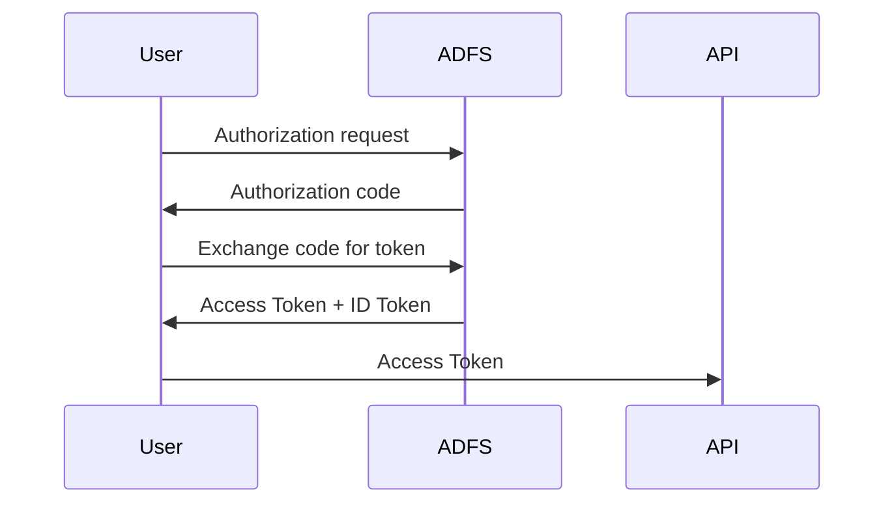

# ADFS Lab — Customizing Access Tokens and ID Tokens (OIDC)

> A fun, geek-friendly deep dive into how ADFS issues and customizes Access Tokens and ID Tokens.

---

## 1. Introduction

This lab explains how to customize an **Access Token** and an **ID Token** issued by ADFS using OpenID Connect (OIDC).

Instead of staying theoretical, we will reproduce the entire authentication flow step by step, inspect the tokens, and modify the claims issued by ADFS.

**Tools used in this lab:**

- OIDC Debugger
- PowerShell
- JWT decoding
- ADFS claim rules

**The idea is simple:**

1. Request an authorization code
2. Exchange it for tokens
3. Decode the Access Token and the ID Token
4. Modify ADFS claim rules
5. Verify the result on both tokens

By the end, you will fully understand how ADFS produces and customizes both Access Tokens and ID Tokens.

---

## 2. Goal of the Lab

We want the tokens issued by ADFS to include a custom claim: `preferred_username`.

Expected result inside the **Access Token**:

```json
{
  "aud": "https://oidcdebugger",
  "preferred_username": "darth.vader"
}
```

Expected result inside the **ID Token**:

```json
{
  "aud": "73311fb6-dc1f-4ab4-96c1-16801f985071",
  "preferred_username": "darth.vader"
}
```

To achieve this, we configure a claim rule in ADFS that transforms:

**`samAccountName`** → **`preferred_username`**

> With the scope `allatclaims`, this single rule applies to **both** tokens.

---

## 3. What You Will Learn

By the end of this lab you will understand:

- How ADFS issues Access Tokens and ID Tokens in an OIDC flow
- How Web API Issuance Transform Rules affect both tokens
- How the `resource` parameter determines the audience
- How the scope `allatclaims` controls claim injection into both tokens
- How to retrieve and decode tokens using PowerShell
- How to inject custom claims into Access Tokens and ID Tokens
- Why you cannot selectively customize one token without the other

---

## 4. OIDC Flow with ADFS

The authentication flow used in this lab is the **Authorization Code Flow**.

**Flow overview:**



**Step breakdown:**

1. The client sends an authorization request
2. ADFS authenticates the user
3. ADFS returns an authorization code
4. The client exchanges the code at `/oauth2/token`
5. ADFS returns the Access Token and the ID Token

---

## 5. Understanding ID Token vs Access Token

OIDC produces two different tokens.

| Token        | Purpose                              |
|--------------|--------------------------------------|
| ID Token     | Identity information about the user  |
| Access Token | Authorization token used by APIs     |

> **Important rule in ADFS:**
>
> Web API **Issuance Transform Rules** primarily target the **Access Token**.
> However, when the scope `allatclaims` is used, these rules also affect the **ID Token** — meaning custom claims injected via the Web API will appear in **both tokens**.
>
> Without `allatclaims`, the ID Token typically contains only standard OIDC claims (`sub`, `upn`, `nonce`, etc.) and is not affected by the Web API claim rules.

In this lab we customize **both tokens** using the Web API Issuance Transform Rules combined with the `allatclaims` scope.

---

## 6. Creating the Application Group in ADFS

Before we can request tokens, we need to register an **Application Group** in ADFS. This group contains two components:

- A **Server application** (the OIDC client)
- A **Web API** (the resource / audience)

### Via the ADFS Management Console

1. Open **ADFS Management**
2. Right-click **Application Groups** → **Add Application Group…**
3. Enter a name, e.g. `OIDC Debugger Test`
4. Select the template **Server application accessing a web API** → click **Next**

#### Server application (OIDC Client)

5. Note the **Client ID** generated automatically (e.g. `73311fb6-dc1f-4ab4-96c1-16801f985071`)
6. Add the **Redirect URI**: `https://oidcdebugger.com/debug` → click **Add**, then **Next**
7. Check **Generate a shared secret** — copy and save it securely → click **Next**

<!-- TODO: insert screenshot of the Server application properties -->

#### Web API (Resource)

8. In the **Identifier** field, enter: `https://oidcdebugger` → click **Add**, then **Next**
9. Choose an **Access Control Policy** (e.g. `Permit everyone`) → click **Next**
10. Under **Application Permissions**, ensure at least `openid`, `profile`, `email` and `allatclaims` are checked → click **Next**
11. Review the summary and click **Close**

<!-- TODO: insert screenshot of the Web API properties -->

### Via PowerShell

You can also create the Application Group entirely via PowerShell:

```powershell
# 1. Create the Application Group
New-AdfsApplicationGroup -Name "OIDC Debugger Test"

# 2. Create the Server application (OIDC Client)
$clientId    = [guid]::NewGuid().ToString()
$redirectUri = "https://oidcdebugger.com/debug"
$secret      = "YOUR_SECRET_HERE"

Add-AdfsServerApplication `
    -Name "OIDC Debugger Test - Server application" `
    -ApplicationGroupIdentifier "OIDC Debugger Test" `
    -ClientId $clientId `
    -RedirectUri $redirectUri `
    -GenerateClientSecret

# 3. Create the Web API (Resource)
Add-AdfsWebApiApplication `
    -Name "OIDC Debugger Test - Web API" `
    -ApplicationGroupIdentifier "OIDC Debugger Test" `
    -Identifier "https://oidcdebugger" `
    -AccessControlPolicyName "Permit everyone"

# 4. Grant permissions to the client
Grant-AdfsApplicationPermission `
    -ClientRoleIdentifier $clientId `
    -ServerRoleIdentifier "https://oidcdebugger" `
    -ScopeNames "openid", "profile", "email", "allatclaims"
```

> **Tip:** Save the `$clientId` and the generated secret — you will need them in later steps.

### Verifying the setup

You can verify the Application Group was created correctly:

```powershell
# List Application Groups
Get-AdfsApplicationGroup | Select Name

# List Server applications
Get-AdfsServerApplication | Select Name, Identifier

# List Web APIs
Get-AdfsWebApiApplication | Select Name, Identifier
```

Expected output:

```
Name                         Identifier
----                         ----------
OIDC Debugger Test - Web API {https://oidcdebugger}
```

---

## 7. ADFS Components Summary

To recap, the Application Group contains:

| Component          | Name                                    | Key Property                             |
|--------------------|-----------------------------------------|------------------------------------------|
| Application Group  | `OIDC Debugger Test`                    | —                                        |
| Server application | `OIDC Debugger Test - Server application` | Client ID: `73311fb6-dc1f-4ab4-96c1-16801f985071` |
| Web API            | `OIDC Debugger Test - Web API`          | Identifier: `https://oidcdebugger`       |

The **Server application** Client ID is used as the `client_id` in OIDC requests.

The **Web API** identifier becomes the **audience** (`aud`) of the Access Token.

---

## 8. Building the Authorization Request

We generate the authorization URL using PowerShell.

> **Note:** The scope `allatclaims` is an ADFS-specific scope that instructs ADFS to include all configured claims in the tokens. Without it, ADFS may only include a minimal set of claims. **When `allatclaims` is used, the Web API Issuance Transform Rules affect both the Access Token and the ID Token.**

> **Important:** The `resource` parameter is **critical**. It tells ADFS which Web API the Access Token is intended for. Without it, ADFS does not know which Issuance Transform Rules to apply, and the Access Token will **not contain any custom claims** — only the default ADFS claims. Always specify `resource` matching your Web API identifier.

```powershell
$clientId    = "73311fb6-dc1f-4ab4-96c1-16801f985071"
$redirectUri = "https://oidcdebugger.com/debug"
$scope       = "openid profile email allatclaims"
$resource    = "https://oidcdebugger"

$authUrl = "https://adfs.mathiasmotron.com/adfs/oauth2/authorize" +
    "?client_id=$clientId" +
    "&response_type=code" +
    "&redirect_uri=$([uri]::EscapeDataString($redirectUri))" +
    "&scope=$([uri]::EscapeDataString($scope))" +
    "&resource=$([uri]::EscapeDataString($resource))" +
    "&state=test123" +
    "&nonce=test456"

$authUrl
```

Open the generated URL in a browser.

After authentication, ADFS returns an **authorization code**.

---

## 9. Exchanging the Code for Tokens

Now we exchange the authorization code for tokens.

```powershell
$clientId     = "73311fb6-dc1f-4ab4-96c1-16801f985071"
$clientSecret = "CLIENT_SECRET"
$code         = "AUTHORIZATION_CODE"
$redirectUri  = "https://oidcdebugger.com/debug"

$body = @{
    grant_type    = "authorization_code"
    client_id     = $clientId
    client_secret = $clientSecret
    code          = $code
    redirect_uri  = $redirectUri
}

$response = Invoke-RestMethod `
    -Method POST `
    -Uri "https://adfs.mathiasmotron.com/adfs/oauth2/token" `
    -Body $body `
    -ContentType "application/x-www-form-urlencoded"

$response
```

The response contains:

- `access_token`
- `id_token`
- `refresh_token`

---

## 10. Decoding the Tokens

Both tokens are JWTs. We decode them using the same PowerShell technique.

### Decoding the Access Token

```powershell
$token   = $response.access_token
$payload = $token.Split('.')[1]

switch ($payload.Length % 4) {
    2 { $payload += '==' }
    3 { $payload += '=' }
}

$payload = $payload.Replace('-', '+').Replace('_', '/')
$bytes   = [System.Convert]::FromBase64String($payload)
$json    = [System.Text.Encoding]::UTF8.GetString($bytes)

$json | ConvertFrom-Json
```

### Decoding the ID Token

```powershell
$token   = $response.id_token
$payload = $token.Split('.')[1]

switch ($payload.Length % 4) {
    2 { $payload += '==' }
    3 { $payload += '=' }
}

$payload = $payload.Replace('-', '+').Replace('_', '/')
$bytes   = [System.Convert]::FromBase64String($payload)
$json    = [System.Text.Encoding]::UTF8.GetString($bytes)

$json | ConvertFrom-Json
```

> **Note:** At this point (before adding claim rules), both tokens contain only default ADFS claims — no custom claims yet.

---

## 11. Customizing the Tokens in ADFS

To inject a custom claim into both tokens, we configure a **claim rule** on the **Web API** (Issuance Transform Rules).

With `allatclaims` in the scope, this single rule will affect **both** the Access Token and the ID Token.

### Claim rule

```
c:[Type == "http://schemas.xmlsoap.org/ws/2005/05/identity/claims/samaccountname"]
=> issue(Type = "preferred_username", Value = c.Value);
```

This transforms `samAccountName` into `preferred_username` inside both tokens.

### Applying the rule via PowerShell

```powershell
$rules = @'
@RuleName = "Transform samAccountName to preferred_username"
c:[Type == "http://schemas.xmlsoap.org/ws/2005/05/identity/claims/samaccountname"]
=> issue(Type = "preferred_username", Value = c.Value);
'@

Set-AdfsWebApiApplication -TargetName "OIDC Debugger Test - Web API" -IssuanceTransformRules $rules
```

### Applying the rule via the ADFS Management Console

1. Open **ADFS Management**
2. Navigate to **Application Groups** → select your application
3. Double-click the **Web API** entry
4. Go to the **Issuance Transform Rules** tab
5. Click **Add Rule…** → choose **Send Claims Using a Custom Rule**
6. Paste the claim rule above and click **Finish**

---

## 12. Verifying the Result

Repeat the flow:

1. Request authorization code
2. Exchange code for tokens
3. Decode both tokens

### Access Token

```json
{
  "aud": "https://oidcdebugger",
  "preferred_username": "darth.vader"
}
```

### ID Token

```json
{
  "aud": "73311fb6-dc1f-4ab4-96c1-16801f985071",
  "preferred_username": "darth.vader",
  "upn": "darth.vader@mathiasmotron.com"
}
```

The custom claim `preferred_username` is now present in **both tokens**.

---

## 13. Understanding the Differences Between the Two Tokens

Although both tokens now contain the same custom claim (`preferred_username`), they are **structurally different**.

### Audience (`aud`)

| Token        | `aud` value                              | Meaning                          |
|--------------|------------------------------------------|----------------------------------|
| Access Token | Web API identifier (`https://oidcdebugger`) | Intended for the API/resource    |
| ID Token     | Client ID (`73311fb6-dc1f-4ab4-96c1-16801f985071`) | Intended for the client app      |

### Claims specific to each token

| Claim               | Access Token | ID Token |
|---------------------|:------------:|:--------:|
| `preferred_username`| Yes          | Yes      |
| `upn`               | No           | Yes      |
| `unique_name`       | No           | Yes      |
| `sub`               | No           | Yes      |
| `nonce`             | No           | Yes      |
| `scp` (scopes)      | Yes          | Yes      |

The ID Token contains more identity-related claims by default, while the Access Token is leaner.

### Claim rule behavior

In an ADFS Application Group (OIDC), there is **only one place** to configure custom claim rules: the **Web API Issuance Transform Rules**.

There are **no separate claim rules dedicated to the ID Token**.

| Scope requested        | Access Token                  | ID Token                               |
|------------------------|-------------------------------|----------------------------------------|
| `allatclaims` included | Web API claim rules applied   | Web API claim rules **also** applied   |
| `allatclaims` absent   | Minimal default claims only   | Standard OIDC claims only (`sub`, `upn`, `nonce`…) |

### Key insight

- You **cannot** customize the Access Token without also affecting the ID Token (and vice versa)
- There is **no way** to add a custom claim to only one of the two tokens using Application Group claim rules alone
- It is **all or nothing** — both tokens receive the same custom claims from the Web API Issuance Transform Rules

---

## 14. Key Takeaways

- Access Tokens are generated for a **specific resource**
- The `resource` parameter determines the **audience** (`aud`)
- **Web API Issuance Transform Rules** are the **only** place to configure custom claims in Application Groups
- With `allatclaims`, these rules affect **both** the Access Token and the ID Token
- Without `allatclaims`, tokens contain only minimal/default claims
- You **cannot** selectively customize one token without the other using Application Group claim rules
- The Access Token `aud` = Web API identifier; the ID Token `aud` = Client ID
- OIDC flows can be reproduced entirely using PowerShell
- JWT tokens can be decoded easily for inspection

---

## 15. Final Thoughts

Once you understand this flow, you can:

- Inject custom claims into Access Tokens and ID Tokens
- Build API authorization systems
- Integrate ADFS with modern applications

And most importantly:

You now understand exactly how ADFS builds and customizes both Access Tokens and ID Tokens.

Welcome to the ADFS token wizard club.