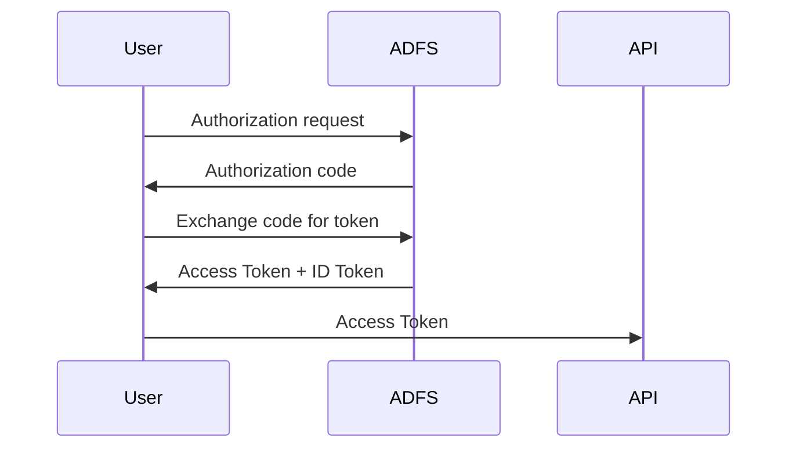

# ADFS Lab — Customizing Access Tokens and ID Tokens (OIDC)

> A fun, geek-friendly deep dive into how ADFS issues and customizes Access Tokens and ID Tokens.

---

## 1. Introduction

This lab explains how to customize an **Access Token** and an **ID Token** issued by ADFS using OpenID Connect (OIDC).

Instead of staying theoretical, we will reproduce the entire authentication flow step by step, inspect the tokens, and modify the claims issued by ADFS.

**Tools used in this lab:**

- OIDC Debugger
- PowerShell
- JWT decoding
- ADFS claim rules

**The idea is simple:**

1. Request an authorization code
2. Exchange it for tokens
3. Decode the Access Token and the ID Token
4. Modify ADFS claim rules
5. Verify the result on both tokens

By the end, you will fully understand how ADFS produces and customizes both Access Tokens and ID Tokens.

---

## 2. Goal of the Lab

We want the tokens issued by ADFS to include a custom claim: `preferred_username`.

Expected result inside the **Access Token**:

```json
{
  "aud": "https://oidcdebugger",
  "preferred_username": "darth.vader"
}
```

Expected result inside the **ID Token**:

```json
{
  "aud": "73311fb6-dc1f-4ab4-96c1-16801f985071",
  "preferred_username": "darth.vader"
}
```

To achieve this, we configure a claim rule in ADFS that queries Active Directory for the `samAccountName` and emits it as `preferred_username`.

> The `resource` parameter and the `allatclaims` scope each play a distinct role in how ADFS applies claim rules to the tokens. We will explore this in detail through empirical testing.

---

## 3. What You Will Learn

By the end of this lab you will understand:

- How ADFS issues Access Tokens and ID Tokens in an OIDC flow
- How Web API Issuance Transform Rules affect the tokens
- How the `resource` parameter determines the audience and enables custom claims
- What the scope `allatclaims` actually does (and what it does **not** do)
- How to retrieve and decode tokens using PowerShell
- How to inject custom claims into Access Tokens and ID Tokens
- The correct claim rule syntax for Application Groups
- The real behavior, tested empirically across 4 scenarios

---

## 4. OIDC Flow with ADFS

The authentication flow used in this lab is the **Authorization Code Flow**.

**Flow overview:**



**Step breakdown:**

1. The client sends an authorization request
2. ADFS authenticates the user
3. ADFS returns an authorization code
4. The client exchanges the code at `/oauth2/token`
5. ADFS returns the Access Token and the ID Token

---

## 5. Understanding ID Token vs Access Token

OIDC produces two different tokens.

| Token        | Purpose                              |
|--------------|--------------------------------------|
| ID Token     | Identity information about the user  |
| Access Token | Authorization token used by APIs     |

> **Important — Two parameters control custom claims:**
>
> 1. The **`resource`** parameter in the authorization request tells ADFS which Web API to target. Without it, ADFS falls back to the generic audience `urn:microsoft:userinfo` and **no custom claims** are applied to any token.
>
> 2. The **`allatclaims`** scope, according to [Microsoft documentation](https://learn.microsoft.com/en-us/windows-server/identity/ad-fs/development/ad-fs-openid-connect-oauth-concepts), instructs ADFS to copy the Access Token claims into the ID Token.
>
> In our empirical tests (section 12–15), when `resource` is specified, custom claims appeared in **both tokens regardless of `allatclaims`**. The explanation lies in the **OAuth flow type** — see section 16 for the full analysis.

### Microsoft's two options for customizing the ID Token

The [official documentation](https://learn.microsoft.com/en-us/windows-server/identity/ad-fs/development/ad-fs-openid-connect-oauth-concepts) describes two options to get extra claims into the ID Token:

| | Option 1 | Option 2 |
|---|---|---|
| **Use case** | Public client, **no separate resource** | Client **with** a separate resource |
| **Requirement** | `response_mode` = `form_post` | `response_mode` = `form_post` |
| **RP identifier** | Same as the Client ID | Different from Client ID |
| **`allatclaims`** | Not needed | Required — assigned via `Grant-AdfsApplicationPermission` |
| **KB** | — | KB4019472 installed on ADFS |

> **Key detail:** Both options mention `response_mode=form_post`, which is used in **implicit/hybrid flows** where the ID Token is returned directly from the `/authorize` endpoint. This is important context for understanding our test results (section 16).

In this lab we customize **both tokens** using the Web API Issuance Transform Rules.

---

## 6. Creating the Application Group in ADFS

Before we can request tokens, we need to register an **Application Group** in ADFS. This group contains two components:

- A **Server application** (the OIDC client)
- A **Web API** (the resource / audience)

### Via the ADFS Management Console

1. Open **ADFS Management**
2. Right-click **Application Groups** → **Add Application Group…**
3. Enter a name, e.g. `OIDC Debugger Test`
4. Select the template **Server application accessing a web API** → click **Next**


#### Server application (OIDC Client)

5. Note the **Client ID** generated automatically (e.g. `73311fb6-dc1f-4ab4-96c1-16801f985071`)
6. Add the **Redirect URI**: `https://oidcdebugger.com/debug` → click **Add**, then **Next**


7. Check **Generate a shared secret** — copy and save it securely → click **Next**


#### Web API (Resource)

8. In the **Identifier** field, enter: `https://oidcdebugger` → click **Add**, then **Next**


9. Choose an **Access Control Policy** (e.g. `Permit everyone`) → click **Next**


10. Under **Application Permissions**, ensure at least `openid`, `profile`, `email` and `allatclaims` are checked → click **Next**


11. Review the summary and click **Close**


### Via PowerShell

You can also create the Application Group entirely via PowerShell:

```powershell
# 1. Create the Application Group
New-AdfsApplicationGroup -Name "OIDC Debugger Test"

# 2. Create the Server application (OIDC Client)
$clientId    = [guid]::NewGuid().ToString()
$redirectUri = "https://oidcdebugger.com/debug"
$secret      = "YOUR_SECRET_HERE"

Add-AdfsServerApplication `
    -Name "OIDC Debugger Test - Server application" `
    -ApplicationGroupIdentifier "OIDC Debugger Test" `
    -ClientId $clientId `
    -RedirectUri $redirectUri `
    -GenerateClientSecret

# 3. Create the Web API (Resource)
Add-AdfsWebApiApplication `
    -Name "OIDC Debugger Test - Web API" `
    -ApplicationGroupIdentifier "OIDC Debugger Test" `
    -Identifier "https://oidcdebugger" `
    -AccessControlPolicyName "Permit everyone"

# 4. Grant permissions to the client
Grant-AdfsApplicationPermission `
    -ClientRoleIdentifier $clientId `
    -ServerRoleIdentifier "https://oidcdebugger" `
    -ScopeNames "openid", "profile", "email", "allatclaims"
```

> **Tip:** Save the `$clientId` and the generated secret — you will need them in later steps.

### Verifying the setup

You can verify the Application Group was created correctly:

```powershell
# List Application Groups
Get-AdfsApplicationGroup | Select Name

# List Server applications
Get-AdfsServerApplication | Select Name, Identifier

# List Web APIs
Get-AdfsWebApiApplication | Select Name, Identifier
```

Expected output:

```
Name                         Identifier
----                         ----------
OIDC Debugger Test - Web API {https://oidcdebugger}
```


---

## 7. ADFS Components Summary

To recap, the Application Group contains:

| Component          | Name                                    | Key Property                             |
|--------------------|-----------------------------------------|------------------------------------------|
| Application Group  | `OIDC Debugger Test`                    | —                                        |
| Server application | `OIDC Debugger Test - Server application` | Client ID: `73311fb6-dc1f-4ab4-96c1-16801f985071` |
| Web API            | `OIDC Debugger Test - Web API`          | Identifier: `https://oidcdebugger`       |

The **Server application** Client ID is used as the `client_id` in OIDC requests.

The **Web API** identifier becomes the **audience** (`aud`) of the Access Token.

---

## 8. Building the Authorization Request

We generate the authorization URL using PowerShell.

> **Note:** The scope `allatclaims` is an ADFS-specific scope. According to Microsoft documentation, it instructs ADFS to copy Access Token claims into the ID Token. We include it here as a best practice, though our tests show custom claims may appear in the ID Token even without it when `resource` is specified.

> **Important:** The `resource` parameter is **critical**. It tells ADFS which Web API the tokens are intended for. Without it, ADFS falls back to the generic audience `urn:microsoft:userinfo`, no Issuance Transform Rules are applied, and **no custom claims appear in any token**. Always specify `resource` matching your Web API identifier.

```powershell
$clientId    = "73311fb6-dc1f-4ab4-96c1-16801f985071"
$redirectUri = "https://oidcdebugger.com/debug"
$scope       = "openid profile email allatclaims"
$resource    = "https://oidcdebugger"

$authUrl = "https://adfs.mathiasmotron.com/adfs/oauth2/authorize" +
    "?client_id=$clientId" +
    "&response_type=code" +
    "&redirect_uri=$([uri]::EscapeDataString($redirectUri))" +
    "&scope=$([uri]::EscapeDataString($scope))" +
    "&resource=$([uri]::EscapeDataString($resource))" +
    "&state=test123" +
    "&nonce=test456"

$authUrl
```


Open the generated URL in a browser.

After authentication, ADFS returns an **authorization code**.


---

## 9. Exchanging the Code for Tokens

Now we exchange the authorization code for tokens.

```powershell
$clientId     = "73311fb6-dc1f-4ab4-96c1-16801f985071"
$clientSecret = "CLIENT_SECRET"
$code         = "AUTHORIZATION_CODE"
$redirectUri  = "https://oidcdebugger.com/debug"

$body = @{
    grant_type    = "authorization_code"
    client_id     = $clientId
    client_secret = $clientSecret
    code          = $code
    redirect_uri  = $redirectUri
}

$response = Invoke-RestMethod `
    -Method POST `
    -Uri "https://adfs.mathiasmotron.com/adfs/oauth2/token" `
    -Body $body `
    -ContentType "application/x-www-form-urlencoded"

$response
```

The response contains:

- `access_token`


- `id_token`


- `refresh_token`


---

## 10. Decoding the Tokens

Both tokens are JWTs. We decode them using the same PowerShell technique.

### Decoding the Access Token

```powershell
$token   = $response.access_token
$payload = $token.Split('.')[1]

switch ($payload.Length % 4) {
    2 { $payload += '==' }
    3 { $payload += '=' }
}

$payload = $payload.Replace('-', '+').Replace('_', '/')
$bytes   = [System.Convert]::FromBase64String($payload)
$json    = [System.Text.Encoding]::UTF8.GetString($bytes)

$json | ConvertFrom-Json
```

### Decoding the ID Token

```powershell
$token   = $response.id_token
$payload = $token.Split('.')[1]

switch ($payload.Length % 4) {
    2 { $payload += '==' }
    3 { $payload += '=' }
}

$payload = $payload.Replace('-', '+').Replace('_', '/')
$bytes   = [System.Convert]::FromBase64String($payload)
$json    = [System.Text.Encoding]::UTF8.GetString($bytes)

$json | ConvertFrom-Json
```

> **Note:** At this point (before adding claim rules), both tokens contain only default ADFS claims — no custom claims yet.


---

## 11. Customizing the Tokens in ADFS

To inject a custom claim into the tokens, we configure a **claim rule** on the **Web API** (Issuance Transform Rules).

### Claim rule syntax

> **Important:** In an Application Group context, the claim type `samaccountname` (short URI) is **not directly available** in the claims pipeline. You must use `windowsaccountname` combined with an **Active Directory store query** to retrieve the `sAMAccountName` attribute.
>
> Using the simpler syntax `c:[Type == "http://schemas.xmlsoap.org/ws/2005/05/identity/claims/samaccountname"] => issue(...)` may silently fail — no error is thrown, but the custom claim simply does not appear in the tokens.

### Claim rule

```
c:[Type == "http://schemas.microsoft.com/ws/2008/06/identity/claims/windowsaccountname", Issuer == "AD AUTHORITY"]
=> issue(store = "Active Directory", types = ("preferred_username"), query = ";sAMAccountName;{0}", param = c.Value);
```

This queries Active Directory for the `sAMAccountName` attribute and emits it as `preferred_username`.

### Applying the rule via PowerShell

```powershell
$rules = @'
@RuleName = "Transform samAccountName to preferred_username"
c:[Type == "http://schemas.microsoft.com/ws/2008/06/identity/claims/windowsaccountname", Issuer == "AD AUTHORITY"]
=> issue(store = "Active Directory", types = ("preferred_username"), query = ";sAMAccountName;{0}", param = c.Value);
'@

Set-AdfsWebApiApplication -TargetName "OIDC Debugger Test - Web API" -IssuanceTransformRules $rules
```

### Applying the rule via the ADFS Management Console

1. Open **ADFS Management**
2. Navigate to **Application Groups** → select your application
3. Double-click the **Web API** entry
4. Go to the **Issuance Transform Rules** tab
5. Click **Add Rule…** → choose **Send Claims Using a Custom Rule**
6. Paste the claim rule above and click **Finish**

> **Reminder:** Use the `windowsaccountname` + Active Directory store query syntax, not the simpler `samaccountname` pass-through syntax.


---

## 12. Test 1 — With `resource` and `allatclaims`

Now that the claim rule is in place, we repeat the full flow with both `resource` and `allatclaims`.

```powershell
$scope    = "openid profile email allatclaims"
$resource = "https://oidcdebugger"
```

1. Request a new authorization code (with `&prompt=login` to force re-authentication)
2. Exchange code for tokens
3. Decode both tokens

### Access Token

```json
{
  "aud": "https://oidcdebugger",
  "preferred_username": "darth.vader",
  "http://custom/mytestclaim": "darth.vader",
  "scp": "allatclaims email profile openid"
}
```

### ID Token

```json
{
  "aud": "73311fb6-dc1f-4ab4-96c1-16801f985071",
  "preferred_username": "darth.vader",
  "http://custom/mytestclaim": "darth.vader",
  "upn": "darth.vader@mathiasmotron.com",
  "scp": "allatclaims email profile openid"
}
```

> **Result:** Custom claims present in **both** tokens. ✓ AT / ✓ IT


---

## 13. Test 2 — With `resource`, without `allatclaims`

Same flow, but `allatclaims` is **removed** from the scope.

```powershell
$scope    = "openid profile email"
$resource = "https://oidcdebugger"
```

### Access Token

```json
{
  "aud": "https://oidcdebugger",
  "preferred_username": "darth.vader",
  "http://custom/mytestclaim": "darth.vader",
  "scp": "email profile openid"
}
```

### ID Token

```json
{
  "aud": "73311fb6-dc1f-4ab4-96c1-16801f985071",
  "preferred_username": "darth.vader",
  "http://custom/mytestclaim": "darth.vader",
  "upn": "darth.vader@mathiasmotron.com",
  "scp": "email profile openid"
}
```

> **Result:** Custom claims present in **both** tokens — even without `allatclaims`. ✓ AT / ✓ IT
>
> This was unexpected. The `resource` parameter alone was sufficient to trigger custom claims in both tokens.

---

## 14. Test 3 — Without `resource`, without `allatclaims`

Now we remove **both** `resource` and `allatclaims`.

```powershell
$scope = "openid profile email"
# No &resource= parameter in the URL
```

### Access Token

```json
{
  "aud": "urn:microsoft:userinfo",
  "scp": "openid"
}
```

### ID Token

```json
{
  "aud": "73311fb6-dc1f-4ab4-96c1-16801f985071",
  "upn": "darth.vader@mathiasmotron.com",
  "unique_name": "MATHIASMOTRON\\darth.vader"
}
```

> **Result:** No custom claims in **either** token. ✗ AT / ✗ IT
>
> Without `resource`, ADFS falls back to the generic audience `urn:microsoft:userinfo`. No Issuance Transform Rules are applied.

---

## 15. Test 4 — Without `resource`, with `allatclaims`

Finally, we test `allatclaims` **without** `resource`.

```powershell
$scope = "openid profile email allatclaims"
# No &resource= parameter in the URL
```

### Access Token

```json
{
  "aud": "urn:microsoft:userinfo",
  "scp": "openid"
}
```

### ID Token

```json
{
  "aud": "73311fb6-dc1f-4ab4-96c1-16801f985071",
  "upn": "darth.vader@mathiasmotron.com",
  "unique_name": "MATHIASMOTRON\\darth.vader"
}
```

> **Result:** No custom claims in **either** token. ✗ AT / ✗ IT
>
> `allatclaims` alone does **not** enable custom claims. Without `resource`, ADFS cannot identify which Web API (and therefore which Issuance Transform Rules) to use.

---

## 16. Empirical Results Summary

### The 4-Test Matrix

| Test | `resource` | `allatclaims` | AT custom claims | IT custom claims | AT `aud` |
|:---:|:---:|:---:|:---:|:---:|---|
| 1 | ✓ | ✓ | ✓ | ✓ | `https://oidcdebugger` |
| 2 | ✓ | ✗ | ✓ | ✓ | `https://oidcdebugger` |
| 3 | ✗ | ✗ | ✗ | ✗ | `urn:microsoft:userinfo` |
| 4 | ✗ | ✓ | ✗ | ✗ | `urn:microsoft:userinfo` |

### What we learned

**`resource` is the key parameter.** When specified:
- ADFS identifies the target Web API
- The Issuance Transform Rules are applied
- Custom claims appear in **both** the Access Token and the ID Token
- The Access Token audience (`aud`) is set to the Web API identifier

**Without `resource`:**
- ADFS falls back to `urn:microsoft:userinfo`
- No Issuance Transform Rules are applied
- No custom claims appear in any token — regardless of `allatclaims`

### What about `allatclaims`?

In our tests, `allatclaims` had **no observable effect** — tests 1 and 2 produced identical results, as did tests 3 and 4.

However, [Microsoft documentation](https://learn.microsoft.com/en-us/windows-server/identity/ad-fs/development/ad-fs-openid-connect-oauth-concepts) states:

> *`allatclaims` allows the application to request that the claims in the access token are also added to the ID token.*

And step 11 of the high-level authentication flow in the same documentation says:

> *"If you include the `scope = allatclaims` in the authentication request, it customizes the ID token to include claims in the access token based on the defined claim rules."*

### Why `allatclaims` had no effect in our tests

The answer lies in the **OAuth flow type**.

The Microsoft documentation describes ID Token customization in the context of **implicit/hybrid flows**, where:
- The ID Token is returned **directly** from the `/authorize` endpoint
- `response_mode=form_post` is required
- The `/authorize` endpoint generates the ID Token **before** the `/token` endpoint is ever called
- In this context, `allatclaims` tells ADFS: *"When you build the ID Token at `/authorize`, also include the claims that would normally only go into the Access Token"*

Our lab uses the **Authorization Code Flow**, which works differently:
1. `/authorize` returns only a **code** (no tokens)
2. `/token` returns AT + IT + RT **together** in a single response
3. At the `/token` endpoint, ADFS has the full context — it knows the `resource`, the Web API, and the Issuance Transform Rules
4. ADFS applies the claim rules to **both tokens** natively, because it is building both at the same time

> **In short:** `allatclaims` is designed for flows where the ID Token is built **separately** from the Access Token (implicit/hybrid). In the Authorization Code Flow, where both tokens are built together at `/token`, custom claims appear in both tokens as long as `resource` is specified — `allatclaims` becomes redundant.

### When `allatclaims` matters

`allatclaims` is likely important in these scenarios:

| Scenario | Why `allatclaims` matters |
|---|---|
| **Implicit flow** (`response_type=id_token+token`) | ID Token is built at `/authorize`, separately from AT |
| **Hybrid flow** (`response_type=code+id_token`) | ID Token is returned at `/authorize` alongside the code |
| **MSAL library** (does not send `resource` explicitly) | Resource URL is embedded in the `scope` parameter — behavior may differ |
| **Different ADFS versions** | Older ADFS builds may behave differently |

> **Best practice:** Always include both `resource` and `allatclaims` in your authorization request to ensure custom claims appear in both tokens across all flows, ADFS versions, and client libraries.

### Audience (`aud`) — always different

| Token        | `aud` value                              | Meaning                          |
|--------------|------------------------------------------|----------------------------------|
| Access Token | Web API identifier (`https://oidcdebugger`) | Intended for the API/resource    |
| ID Token     | Client ID (`73311fb6-dc1f-4ab4-96c1-16801f985071`) | Intended for the client app      |

### Claims specific to each token

| Claim               | Access Token | ID Token |
|---------------------|:------------:|:--------:|
| `preferred_username`| ✓            | ✓        |
| `upn`               | –            | ✓        |
| `unique_name`       | –            | ✓        |
| `sub`               | –            | ✓        |
| `nonce`             | –            | ✓        |
| `scp` (scopes)      | ✓            | ✓        |

### Claim rule syntax pitfall

> **Warning:** The simpler claim rule syntax using `samaccountname` directly:
> ```
> c:[Type == "http://schemas.xmlsoap.org/ws/2005/05/identity/claims/samaccountname"]
> => issue(Type = "preferred_username", Value = c.Value);
> ```
> **does not work** in Application Group Web API Issuance Transform Rules. It fails silently — no error, but no custom claim appears.
>
> You **must** use the `windowsaccountname` + Active Directory store query syntax:
> ```
> c:[Type == "http://schemas.microsoft.com/ws/2008/06/identity/claims/windowsaccountname", Issuer == "AD AUTHORITY"]
> => issue(store = "Active Directory", types = ("preferred_username"), query = ";sAMAccountName;{0}", param = c.Value);
> ```

---

## 17. Key Takeaways

- The **`resource`** parameter is the most important parameter — it tells ADFS which Web API to target and enables custom claims in the tokens
- Without `resource`, ADFS falls back to `urn:microsoft:userinfo` and applies **no** custom claim rules
- **Web API Issuance Transform Rules** are the **only** place to configure custom claims in Application Groups
- In the **Authorization Code Flow**, `resource` alone is sufficient to get custom claims in **both** tokens — ADFS builds AT and IT together at the `/token` endpoint
- `allatclaims` is designed for **implicit/hybrid flows** where the ID Token is built separately at `/authorize` — in the Authorization Code Flow, it is redundant but harmless
- Always include both `resource` and `allatclaims` as a **best practice** — this covers all flows and ADFS versions
- The claim rule syntax matters: use `windowsaccountname` + Active Directory store query, **not** `samaccountname` pass-through
- The Access Token `aud` = Web API identifier; the ID Token `aud` = Client ID
- OIDC flows can be reproduced and tested entirely using PowerShell

---

## 18. Final Thoughts

Once you understand this flow, you can:

- Inject custom claims into Access Tokens and ID Tokens
- Build API authorization systems
- Integrate ADFS with modern applications
- Debug token issues using the 4-test matrix approach
- Avoid the silent claim rule syntax pitfall
- Understand why `allatclaims` behaves differently depending on the OAuth flow

And most importantly:

You now understand exactly how ADFS builds and customizes both Access Tokens and ID Tokens — tested and verified empirically, with the documentation explained.

Welcome to the ADFS token wizard club.