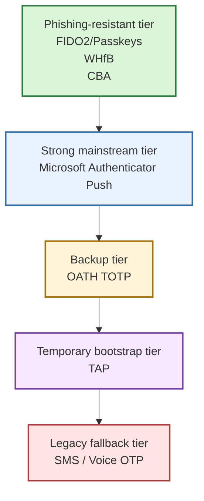

# Strong Authentication Methods in Entra ID
**Practical guide: what to choose, why, and when (without marketing fluff) 🔐**
Published: 2026-05-04

---

## TL;DR ⚡ (for busy admins)

Short version:

- 🛡️ Priority 1: **Phishing-resistant MFA** (FIDO2/Passkeys, Windows Hello for Business, CBA)
- 📲 Priority 2: **Microsoft Authenticator push** (with number matching)
- 🔢 Priority 3: **TOTP** (useful, but more vulnerable to phishing)
- ⚠️ Keep to an absolute minimum: **SMS/Voice** (temporary fallback, not a strategy)
- 🚀 **Temporary Access Pass (TAP)**: excellent for bootstrap/onboarding, not for daily use

---

## 1. What is a strong authentication method in Entra ID? 🧠

In Entra ID, MFA is often discussed as a simple yes/no checkbox. In reality, not all MFA methods are equal.

Two users can both be "doing MFA", but:

- one uses a phishing-resistant FIDO2 key,
- the other uses an SMS code that can be intercepted.

Both are technically MFA. Security-wise, they are not the same game.

Think of it like gaming gear: both setups can "run the game", but one is ultra settings at 120 FPS and the other is lagging at 18 FPS.

The goal of a solid Entra ID design is to:

- allow the right methods (Authentication Methods Policy),
- enforce the right strength by context (Authentication Strengths + Conditional Access),
- keep user experience practical so the helpdesk does not turn into a crisis hotline.

Quick takeaway: strong auth is not about adding more prompts, it is about using the right method for the right risk.

---

## 2. Quick comparison table 📊

| Method | Quick score | Phishing resistance level | User experience | Prerequisites | Pros | Cons | Best use case |
|---|---|---|---|---|---|---|---|
| FIDO2 Security Keys / Passkeys | ⭐⭐⭐⭐⭐ | 🟢 Very high (5/5) | Fast (tap + PIN/biometric) | Compatible key, modern browser/OS, FIDO2 policy | Very strong, no shared secret, great for admins | Hardware cost, key logistics, loss/replacement handling | Admins, privileged access, high-risk environments |
| Windows Hello for Business (WHfB) | ⭐⭐⭐⭐⭐ | 🟢 Very high (5/5) | Excellent on managed endpoints | Compliant/joined device, TPM recommended, Intune/GPO config | Passwordless, excellent UX, device-bound credential | Depends on device posture, broader rollout effort | Internal users on company-managed devices |
| Certificate-Based Authentication (CBA) | ⭐⭐⭐⭐ | 🟢 High to very high (4-5/5) | Varies by setup | PKI, user certificates, cert lifecycle processes | Robust, compliance-friendly in regulated sectors | PKI complexity, heavier operations | Regulated environments, smartcard/CAC scenarios |
| Microsoft Authenticator (push + number matching) | ⭐⭐⭐⭐ | 🟡 Medium to high (3-4/5) | Very good for most users | Smartphone, Authenticator app, proper policy tuning | Easy to deploy, fast adoption, strong balance | MFA fatigue risk if misconfigured, mobile dependency | Large user populations, transition to passwordless |
| OATH TOTP (app/hardware token) | ⭐⭐⭐ | 🟠 Medium (3/5) | Good | TOTP app or hardware token, enrollment | Works offline, simple fallback | Phishable, more friction, reset overhead | Backup method, users with limited mobile data |
| Temporary Access Pass (TAP) | ⭐⭐⭐ | 🔵 Context-dependent (temporary method) | Good for onboarding | TAP policy enabled, HR/IT process | Great for passwordless bootstrap and recovery | Temporary by design, risky if validity window is too broad | Onboarding, break-fix, secure reset |
| SMS / Voice OTP | ⭐⭐ | 🔴 Low to medium (2/5) | Familiar but fragile | Valid phone number, telecom availability | Maximum compatibility | SIM swap risk, interception risk, lower trust level | Temporary fallback only |

---

## 2.1 Visual map: strength ladder at a glance 🪜

If you remember only one thing: move up the ladder for sensitive access, and keep lower tiers as controlled exceptions.

---

## 3. Method-by-method details (field reality edition) 🎮

### 3.1 FIDO2 Security Keys and Passkeys

Quick take: best-in-class for high-value access and admin scenarios.

#### ✅ Why it is great

- Native phishing resistance 🛡️
- No password entry
- Excellent for privileged accounts

#### ⚠️ Watch-outs

- Physical key lifecycle management (stock, loss, replacement)
- Requires a clean backup and recovery process

#### 🎯 Best fit

- Admin, IT, and SecOps teams
- Admin portals, PIM activation, critical consoles

---

### 3.2 Windows Hello for Business (WHfB)

Quick take: top-tier security with excellent daily UX on managed devices.

#### ✅ Why it is great

- Excellent user comfort (local PIN/biometric)
- Credential is bound to the device
- Strong resistance against common credential attacks

#### ⚠️ Watch-outs

- Requires serious device hygiene
- More of a structured program than "just enable MFA"

#### 🎯 Best fit

- Internal users on managed laptops
- Long-term passwordless strategy

---

### 3.3 Certificate-Based Authentication (CBA)

Quick take: extremely strong if your PKI game is mature.

#### ✅ Why it is great

- Very strong when PKI is mature
- Good fit for compliance-heavy requirements

#### ⚠️ Watch-outs

- PKI means operations, procedures, lifecycle, support
- Poor PKI design quickly becomes technical debt

#### 🎯 Best fit

- Regulated sectors, smartcards, legacy federation contexts

---

### 3.4 Microsoft Authenticator (push + number matching)

Quick take: the practical default for large populations and phased modernization.

#### ✅ Why it is great

- Strong security/UX balance
- Fast user adoption
- Works well in phased migrations

#### ⚠️ Watch-outs

- Can suffer from MFA fatigue if policies are too permissive
- Dependency on personal or corporate smartphones

#### 🎯 Best fit

- Large user base
- Transitional phase before phishing-resistant by default

---

### 3.5 OATH TOTP (third-party apps or hardware token)

Quick take: useful backup path, but not where you want to stop.

#### ✅ Why it is useful

- Works even without mobile data
- Simple alternative in constrained environments

#### ⚠️ Watch-outs

- More phishing-vulnerable (replayable code in a time window)
- Less fluid UX than push/passkeys

#### 🎯 Best fit

- Backup method
- Specific cases without push notification support

---

### 3.6 Temporary Access Pass (TAP)

Quick take: fantastic bootstrap tool, risky if governance is loose.

#### ✅ Why it is excellent

- Ideal bootstrap to move users into passwordless flows 🚀
- Supports recovery without bypassing security controls

#### ⚠️ Watch-outs

- If validity is too long, risk surface grows unnecessarily
- Requires strict governance

#### 🎯 Best fit

- Day-one onboarding
- Controlled recovery (support + identity verification)

---

### 3.7 SMS and Voice OTP

Quick take: keep only as a tightly controlled emergency fallback.

#### ✅ Why it still exists

- Nearly universal reach
- Very easy to explain to users

#### ⚠️ Watch-outs

- Weaker security compared to modern methods ⚠️
- Vulnerable to SIM swap and telecom attacks

#### 🎯 Best fit

- Temporary fallback, tightly scoped, with a migration-off plan

---

## 4. How to choose without regretting it in 6 months 🧭

Use this simple rule:

- The more sensitive the resource, the more phishing-resistant the method must be.
- The more privileged the user, the rarer the exception should be.
- The weaker the method, the smaller and more temporary its scope should be.

### Pragmatic rollout order

1. Enable and enforce Microsoft Authenticator (number matching, consistent geo controls when relevant).
2. Deploy WHfB for managed internal devices.
3. Target FIDO2/Passkeys for admins and high-risk populations.
4. Keep TOTP as a limited backup.
5. Reduce SMS/Voice to strict minimum.
6. Use TAP for onboarding/recovery, never as a permanent method.

Bonus reality check: if your strongest method is optional, users will discover the weakest one in record time.

---

## 5. Example matrix: method by population 👥

| Population | Primary method | Secondary method | Avoid |
|---|---|---|---|
| Cloud/tenant admins | FIDO2 or WHfB | Authenticator push | SMS/Voice |
| Internal managed users | WHfB | Authenticator push | SMS as default method |
| External users/B2B | Based on cross-tenant trust + Authentication Strength | Authenticator/TOTP based on partner policy | Untracked exceptions |
| Field teams without corporate smartphone | Hardware TOTP or FIDO2 | TAP for recovery | Full dependency on SMS |

---

## 6. Entra ID implementation checklist ✅

- 🔄 Verify Authentication Methods migration status is fully modern and complete
- 🧹 Clean up remaining legacy MFA options
- 🧱 Define clear Authentication Strengths (standard vs phishing-resistant)
- 🔗 Map the right strengths to the right Conditional Access policies
- 🛡️ Protect sensitive user actions (MFA registration, device registration)
- 🆘 Define a recovery process (TAP, identity verification, time limits)
- 🚨 Implement tightly controlled break-glass exclusions
- 📈 Monitor sign-in logs and authentication method changes

---

## 7. Conclusion 🎯

Not all MFA methods are equal. The real question is not "MFA enabled: yes/no". The real question is:

- which method,
- for which population,
- in which context,
- with which governance model.

If you want one practical north star:

- target phishing-resistant by default,
- keep weaker methods as exceptions,
- treat onboarding/recovery as first-class security operations.

That is where Entra ID moves from checkbox MFA to production-grade strong authentication. 🎯
