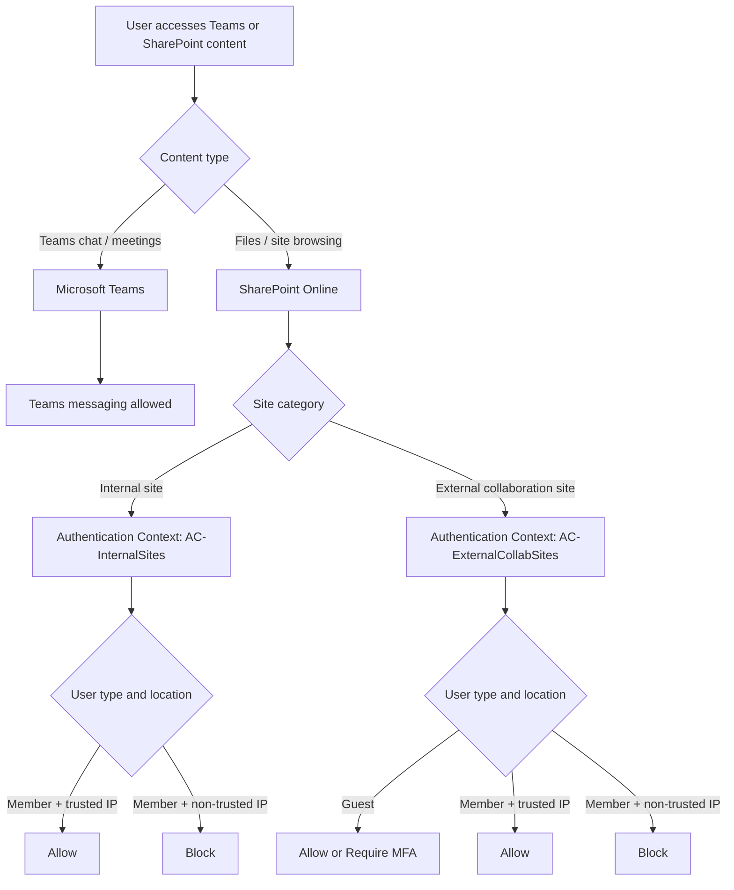

## SharePoint Online Conditional Access Use Case: Internal and External Collaboration

If you've ever tried to secure SharePoint Online and then realized that Teams file access was collateral damage, you have already seen the real problem: Teams chat and Teams files do not follow the same control path.

Microsoft gives you several building blocks:

- Authentication Context
- Restricted Access Control
- App-Enforced Restrictions
- Defender for Cloud Apps
- SharePoint and Teams sharing settings

The difficult part is not knowing those features exist. The difficult part is combining them so they match a real collaboration matrix.

> **Note**: this article covers one specific design scenario, not every SharePoint and Teams Conditional Access pattern. The design choices here are driven by a concrete set of business requirements described in section 1.

> **TL;DR**: the target scenarios are achievable, but not with a simple model like "block internal sites, allow external sites". The clean design is based on **site-level Authentication Context**, **separate Conditional Access logic for members and guests**, and a **clear internal vs external collaboration model** in SharePoint and Teams.

---

## 1. The Target Scenario

The objective is a mix of business enablement and security controls. The table below describes the expected behavior for each user type, location, and workload.

> `*blocked*` indicates scenarios that a naive "block internal / allow external" design fails to cover correctly, and that the recommended architecture is specifically designed to address.

| User type | IP | Teams Chat (1:1, Group, Meeting) | Internal Team — Chat | External Team — Chat | Internal Team — Files | External Team — Files | Internal SPO Site | External SPO Site |
|---|---|---|---|---|---|---|---|---|
| Internal user | Trusted IP | ✅ | ✅ | ✅ | ✅ | ✅ | ✅ | ✅ |
| Internal user | Non-trusted IP | ✅ | ✅ | ✅ | 🚫 | `*blocked*` | 🚫 | `*blocked*` |
| Guest (external) | Non-trusted IP | ✅ | 🚫 | ✅ | 🚫 | ✅ | 🚫 | ✅ |

The key design constraints that follow from this table:

- **Teams chat and meetings** must remain accessible to all users regardless of IP or user type.
- **Teams chat behavior and Teams file behavior must be treated differently** — they do not share the same access control path.
- **Guests must be able to access external collaboration spaces** even from non-trusted IPs.
- **Internal users on non-trusted IPs must be blocked from file access**, including on external collaboration spaces — this is the scenario the basic design misses.

The last two points in combination are the hardest to express correctly. This is what drives the architecture.

A policy targeting SharePoint Online does not just affect direct site browsing. It also affects the SharePoint-backed parts of Teams.

| Experience | Back-end service |
|---|---|
| Teams chat / meetings / messaging | Microsoft Teams |
| Teams files tab / channel documents / shared files | SharePoint Online |
| Direct SharePoint site browsing | SharePoint Online |

---

## 2. Why This Gets Complicated Quickly

At a technical level:

- Teams files are stored in SharePoint Online.
- The Files tab in Teams is still a SharePoint access path.
- A Conditional Access policy targeting **Office 365 SharePoint Online** applies to:
  - direct SharePoint browsing,
  - Teams channel files,
  - files shared in Teams chats,
  - and most file operations behind Teams.

So a simple rule like this:

- block SharePoint from untrusted IPs

also blocks the SharePoint-backed parts of Teams.

That is why the real question is not "how do I secure SharePoint?" but rather:

> How do I secure SharePoint-backed content differently depending on the site type and the user type, without breaking Teams messaging?

---

## 3. Control Options and Their Limits

Before defining the target architecture, it helps to position each control honestly.

### 3.1 Authentication Context

**What it does**

- Applies Conditional Access at the **site level**.
- Lets you associate a dedicated CA policy with a specific SharePoint site.

**What it is good at**

- Differentiating internal sites from external collaboration sites.
- Applying different policies to members and guests on the same site.
- Protecting only the sites that need a different behavior.

**What it does not solve alone**

- It is not a tenant-wide baseline.
- It must be assigned to the relevant sites.

**Verdict**

This is the key control for the target scenario.

---

### 3.2 Restricted Access Control

**What it does**

- Restricts access to a SharePoint site to allowed security groups.

**What it is good at**

- Hardening specific sites.
- Enforcing strong allow-list access.

**What it does not solve well**

- It does not naturally express: "internal members from untrusted IP blocked, but guests still allowed."

**Verdict**

Useful as an additional hardening layer, but not the main answer here.

---

### 3.3 App-Enforced Restrictions

**What it does**

- Provides web-only / limited SharePoint access from untrusted contexts.
- Commonly blocks download, sync, print, and copy while preserving browser access.

**What it is good at**

- Establishing a global SharePoint baseline.
- Reducing exfiltration risk without fully blocking access.

**What it does not solve alone**

- It does not model nuanced rules like:
  - internal member blocked,
  - guest allowed,
  - only for selected collaboration sites.

**Verdict**

Very useful as a baseline. Not sufficient on its own for this matrix.

---

### 3.4 Defender for Cloud Apps

**What it does**

- Adds session-level controls through Conditional Access App Control.
- Supports advanced actions like download blocking, watermarking, or label-based restrictions.

**What it is good at**

- Fine-grained session behavior.
- Advanced download protections.

**What it does not solve best**

- It adds complexity.
- It is often unnecessary if the main objective is straightforward allow/block logic based on site type and user type.

**Verdict**

Optional enhancement, not the foundation.

---

### 3.5 SharePoint and Teams Sharing Settings

**What they do**

- Define whether a site accepts guests.
- Define whether a Team allows guest collaboration.
- Separate internal-only spaces from external collaboration spaces.

**What they are good at**

- Establishing the collaboration model.
- Preventing accidental mixing of internal and partner-facing spaces.

**What they do not solve alone**

- They do not enforce trusted vs non-trusted location behavior by themselves.

**Verdict**

Mandatory foundation, but they must be combined with Conditional Access.

---

## 4. Why the Basic "Block Internal / Allow External" Design Leaves Gaps

This is where many initial designs fail.

Example:

- internal SharePoint sites -> `ConditionalAccessPolicy BlockAccess`
- external SharePoint sites -> `ConditionalAccessPolicy AllowFullAccess`
- internal Teams -> no guests
- external Teams -> guests allowed
- plus a global CA baseline with App-Enforced Restrictions

At first glance, it looks reasonable. In reality, it leaves an important gap.

Why?

- External collaboration sites remain configured for **full access**.
- Teams external file access still relies on SharePoint.
- If an internal member is authorized on that external collaboration site, they can still access it according to that site's SharePoint policy.

So the design cannot express this requirement cleanly:

- guest can access the external site,
- but internal member on non-trusted IP must be blocked from that same site.

This is not a platform limitation.

It is a limitation of the chosen architecture.

---

## 5. Recommended Architecture

The cleanest model is to combine collaboration classification with Authentication Context and separate CA logic for members and guests.



### Layer 1 - Internal vs External Collaboration Model

Separate your sites and Teams into two categories:

- **Internal spaces**
  - no guest sharing
  - no guest access to Teams
- **External collaboration spaces**
  - guests allowed
  - sharing limited to the intended collaboration model

This is the collaboration foundation.

### Layer 2 - Authentication Context by Site Type

Use Authentication Context on the sites that need differentiated Conditional Access.

Suggested naming:

- `AC-InternalSites`
- `AC-ExternalCollabSites`

This is the key move because it avoids relying on one tenant-wide SharePoint behavior.

### Layer 3 - Separate CA Policies for Members and Guests

This is what unlocks the full scenario matrix.

#### Policy A - Internal members on internal sites

- Target resource: Authentication Context `AC-InternalSites`
- Users: internal members
- Condition: untrusted locations
- Grant: block

Result:

- internal users on non-trusted IPs cannot access internal SharePoint sites,
- internal Teams file access tied to those sites is also blocked,
- Teams chat and meetings remain unaffected.

#### Policy B - Internal members on external collaboration sites

- Target resource: Authentication Context `AC-ExternalCollabSites`
- Users: internal members only
- Condition: untrusted locations
- Grant: block

Result:

- internal users on non-trusted IPs are blocked from external collaboration files and sites.

#### Policy C - Guests on external collaboration sites

- Target resource: Authentication Context `AC-ExternalCollabSites`
- Users: guests and external users
- Grant: allow, optionally with MFA

Result:

- guests can still access the external collaboration spaces they were invited to,
- while internal non-trusted users can be blocked from the same site.

### Optional Layer 4 - App-Enforced Restrictions as Baseline

If the customer wants a web-only posture for generic SharePoint access from untrusted locations, App-Enforced Restrictions still fit well as a baseline.

In this architecture, they are a baseline protection layer, not the main decision engine.

### Optional Layer 5 - Defender for Cloud Apps

Add Defender for Cloud Apps only if the customer also wants advanced session behavior like:

- browser view allowed but download blocked,
- watermarking,
- label-based controls.

---

## 6. Scenario Mapping

The design maps back to business outcomes like this:

| Scenario | Expected result | Main control |
|---|---|---|
| Internal user on trusted IP -> internal Teams chat | ✅ | Teams native behavior |
| Internal user on trusted IP -> internal Teams files | ✅ | Normal SharePoint access |
| Internal user on non-trusted IP -> internal Teams chat | ✅ | Not targeted by SharePoint CA |
| Internal user on non-trusted IP -> internal Teams files | 🚫 | Authentication Context + CA Policy A |
| Internal user on non-trusted IP -> internal SharePoint site | 🚫 | Authentication Context + CA Policy A |
| Internal user on non-trusted IP -> external Teams files | 🚫 | Authentication Context + CA Policy B |
| Internal user on non-trusted IP -> external SharePoint site | 🚫 | Authentication Context + CA Policy B |
| Guest -> internal Teams chat | 🚫 | Teams guest access disabled on internal Teams (`AllowToAddGuest $false`) |
| Guest -> internal Teams files | 🚫 | SPO sharing disabled on internal sites (`SharingCapability Disabled`) |
| Guest -> internal SharePoint site | 🚫 | SPO sharing disabled on internal sites (`SharingCapability Disabled`) |
| Guest on non-trusted IP -> external Teams chat | ✅ | Guest enabled on external Teams |
| Guest on non-trusted IP -> external Teams files | ✅ | CA Policy C on `AC-ExternalCollabSites` |
| Guest on non-trusted IP -> external SharePoint site | ✅ | CA Policy C on `AC-ExternalCollabSites` |

Note that the guest blocking on internal content (rows 8–10) is not enforced by Conditional Access policies. It is enforced entirely by the collaboration model settings defined in Step 1. No CA policy is needed for those scenarios — if guests are not members of the Team and have no sharing permission on the site, they simply cannot access the content.  
This is exactly the scenario the simpler `AllowFullAccess` model cannot express properly.

---

## 7. Configuration Walkthrough

### Step 1 - Classify Sites and Teams

Create two clear categories:

- Internal-only SharePoint and Teams
- External collaboration SharePoint and Teams

Recommended settings:

| Workload | Internal spaces | External collaboration spaces |
|---|---|---|
| SharePoint SharingCapability | `Disabled` | `ExistingExternalUserSharingOnly` or according to policy |
| Teams guest access | `AllowToAddGuest $false` | `AllowToAddGuest $true` |

The exact sharing choice depends on the governance model, but the separation must be explicit.

To configure Teams guest access per Team:

```powershell
# Disable guest access on an internal Team
Set-Team -GroupId <InternalTeamGroupId> -AllowToAddGuest $false

# Enable guest access on an external collaboration Team
Set-Team -GroupId <ExternalTeamGroupId> -AllowToAddGuest $true
```

To configure SharePoint sharing at the site level:

```powershell
Connect-SPOService -Url https://contoso-admin.sharepoint.com

# Internal site - no external sharing
Set-SPOSite -Identity https://contoso.sharepoint.com/sites/InternalProject `
    -SharingCapability Disabled

# External collaboration site - existing guests only
Set-SPOSite -Identity https://contoso.sharepoint.com/sites/PartnerProject `
    -SharingCapability ExistingExternalUserSharingOnly
```

### Step 2 - Create Authentication Contexts

Create at least:

- `AC-InternalSites`
- `AC-ExternalCollabSites`

In Entra ID:

1. Go to **Protection** -> **Conditional Access** -> **Authentication Contexts**
2. Create the contexts
3. Record their IDs

### Step 3 - Assign Authentication Contexts to Sites

Example:

```powershell
Connect-SPOService -Url https://contoso-admin.sharepoint.com

# Internal site
Set-SPOSite -Identity https://contoso.sharepoint.com/sites/InternalProject `
    -ConditionalAccessPolicy AuthenticationContext `
    -AuthenticationContextName "AC-InternalSites"

# External collaboration site
Set-SPOSite -Identity https://contoso.sharepoint.com/sites/PartnerProject `
    -ConditionalAccessPolicy AuthenticationContext `
    -AuthenticationContextName "AC-ExternalCollabSites"
```

You can also use sensitivity labels with Sites and Groups scope if you prefer a label-driven approach.

### Step 4 - Create Conditional Access Policies

#### CA Policy - Internal members blocked on internal sites from untrusted locations

- Target resource: `AC-InternalSites`
- Users: internal members
- Locations: any, excluding trusted IPs
- Grant: block

#### CA Policy - Internal members blocked on external collaboration sites from untrusted locations

- Target resource: `AC-ExternalCollabSites`
- Users: internal members
- Locations: any, excluding trusted IPs
- Grant: block

#### CA Policy - Guests allowed on external collaboration sites

- Target resource: `AC-ExternalCollabSites`
- Users: guests and external users
- Grant: allow
- Optional: require MFA

This split between members and guests is what removes the residual gap.

> **Note on guest blocking for internal content**: there is no Conditional Access policy needed to block guests from internal sites or Teams. That is handled entirely by the collaboration model settings from Step 1: `SharingCapability Disabled` prevents guests from ever being granted SPO access on internal sites, and `AllowToAddGuest $false` prevents guests from being added to internal Teams. A guest who has no membership and no sharing permission simply cannot reach the Authentication Context challenge. No CA policy is needed.

### Step 5 - Optional Global Baseline with App-Enforced Restrictions

If the customer wants a generic web-only restriction for unmanaged or untrusted contexts:

1. Create a CA policy targeting **Office 365 SharePoint Online**
2. Use **Session controls** -> **Use app-enforced restrictions**
3. In SharePoint Admin Center -> **Policies** -> **Access control** -> **Unmanaged devices**
4. Select **Allow limited, web-only access**

Again, this is useful as a baseline, not as the main way to express the scenario matrix.

---

## 8. Where Restricted Access Control and Defender for Cloud Apps Still Fit

### Restricted Access Control

Use it when the customer wants additional hard allow-list protection on specific sites.

It should be treated as an access hardening control, not as the main trusted vs non-trusted location mechanism.

### Defender for Cloud Apps

Use it when the customer also wants:

- view in browser but block download,
- watermarking,
- more advanced session decisions.

It is not required to meet the scenario matrix described in this article.

---

## 9. Recommended Decision Guide

If the customer asks which control should be used, the quick answer is:

- Need to differentiate **internal vs external sites**? -> **Authentication Context**
- Need to differentiate **members vs guests on the same external site**? -> **Authentication Context plus separate CA policies**
- Need a global browser-only baseline? -> **App-Enforced Restrictions**
- Need advanced session or download logic? -> **Defender for Cloud Apps**
- Need strict allow-list access to a site? -> **Restricted Access Control**

---

## 10. Best Practices

- Start every Conditional Access policy in **Report-only** mode.
- Keep **trusted locations** accurate and documented.
- Clearly identify which Teams and sites are **internal** and which are **external collaboration**.
- Scope Conditional Access separately for **members** and **guests**.
- Do not assume `AllowFullAccess` on external sites is enough if internal non-trusted users still need to be blocked.
- Validate all three experiences:
  - direct SharePoint access,
  - Teams file access,
  - Teams chat access.

---

## 11. Final Takeaway

The main lesson is simple:

> The hard part is not the Microsoft features themselves. The hard part is assembling them in a way that matches the collaboration model.

If the design is only:

- internal = blocked,
- external = full access,

you will likely leave gaps.

If the design becomes:

- site classification,
- Authentication Context,
- separate CA logic for members and guests,
- optional SharePoint baseline,

then the target scenarios become much easier to express cleanly.

That is the design pattern behind protecting SharePoint without breaking Teams.

---

## References

- [Authentication Context in Conditional Access](https://learn.microsoft.com/en-us/entra/identity/conditional-access/concept-conditional-access-cloud-apps#authentication-context)
- [SharePoint integration with Authentication Context](https://learn.microsoft.com/en-us/sharepoint/authentication-context-example)
- [Control access from unmanaged devices](https://learn.microsoft.com/en-us/sharepoint/control-access-from-unmanaged-devices)
- [Restricted Access Control in SharePoint Advanced Management](https://learn.microsoft.com/en-us/sharepoint/restricted-access-control)
- [Session policies in Defender for Cloud Apps](https://learn.microsoft.com/en-us/defender-cloud-apps/session-policy-aad)
- [Cross-tenant access for B2B collaboration](https://learn.microsoft.com/en-us/entra/external-id/cross-tenant-access-settings-b2b-collaboration)