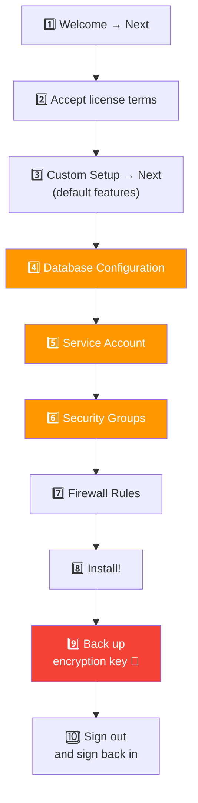
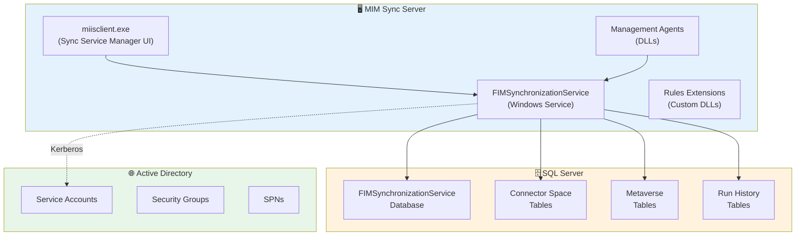

# Installing MIM Synchronization Service — Step by Step
🗓️ Published: 2026-04-22

This guide walks you through the complete installation of **Microsoft Identity Manager (MIM) 2016 Synchronization Service**, from preparing the domain to running the installer. It's written to be easy to follow — even if it's your first time deploying MIM. 🚀

> **TL;DR** — Create AD service accounts & groups → prepare SQL Server → prepare the Windows Server → install MIM Sync → back up the encryption key → you're done.

---

## 🗺️ Overview

Here's the full installation flow at a glance:


---

## 📋 Prerequisites

### Supported Platforms

| Component | Supported Versions |
|---|---|
| 🖥️ Windows Server | 2019, 2022 |
| 🗄️ SQL Server | 2017, 2019 |
| 🌐 Active Directory | Windows Server 2016+ functional level |
| 💻 Dev tools (optional) | Visual Studio 2017 |

> ⚠️ Windows Server 2016 and SQL Server 2016 are supported but **not recommended** for new deployments.

### Software Prerequisites

Install these on the MIM Sync server **before** running the MIM installer:

| Software | Required For |
|---|---|
| .NET Framework 4.6 | MIM Sync Service |
| [Visual C++ 2013 Redistributable](https://www.microsoft.com/download/details.aspx?id=40784) | MIM Sync |
| [SQL Server Native Client](https://www.microsoft.com/download/details.aspx?id=50402) | MIM Sync database connectivity |

> 💡 If using **TLS 1.2 only** or **FIPS mode**, see [MIM 2016 SP2 in TLS 1.2/FIPS environments](https://learn.microsoft.com/en-us/microsoft-identity-manager/preparing-tls).

### Hardware

| Resource | Minimum |
|---|---|
| RAM | 8–12 GB |
| CPU | 4 cores recommended |
| Disk | 80 GB (more for large environments) |

---

## 👥 Step 1 — Prepare Active Directory (Accounts & Groups)

### Create Service Accounts

#### MIM Sync Service Account

| Account | Purpose |
|---|---|
| `MIMInstall` | Installation account — local admin on MIM Sync server, `sysadmin` on SQL. Use this to run the installer. |
| `MIMSync` | Runs the FIMSynchronizationService Windows service |

> 💡 Having a dedicated `MIMInstall` account is a best practice: it separates the installation privileges (`sysadmin`, local admin) from the runtime service account. After installation, `MIMInstall` can be locked down or disabled.

```powershell
Import-Module ActiveDirectory
$sp = ConvertTo-SecureString "YourStrongPassword!" -AsPlainText -Force

@("MIMInstall", "MIMSync") | ForEach-Object {
    New-ADUser -SamAccountName $_ -Name $_ -Enabled $true -PasswordNeverExpires $true
    Set-ADAccountPassword -Identity $_ -NewPassword $sp
}
```

> 🔐 In production, use strong unique passwords and store them in a vault (Azure Key Vault, KeePass, etc.). Don't use `PasswordNeverExpires` if your security policy requires rotation — see the [Change Passwords in MIM](Change%20Passwords%20in%20MIM.md) article instead.

#### Management Agent Accounts

Each Management Agent (MA) connects to a target system (Active Directory, SQL database, LDAP, etc.) and needs its own service account with **just enough permissions** on that system. Plan these before you start creating MAs:

| Example Account | Target System | Typical Permissions Needed |
|---|---|---|
| `svc-MIM-AD` | Active Directory | Read/Write on target OUs, Replicate Directory Changes (for delta imports) |
| `svc-MIM-HR` | HR SQL Database | `db_datareader` (or `db_datawriter` if writeback) |
| `svc-MIM-LDAP` | LDAP Directory | Read access (+ write if provisioning) |
| `svc-MIM-Entra` | Entra ID (via Graph) | Application registration with appropriate Graph API permissions |

> 💡 **One account per MA** is a best practice. Don't reuse the MIM Sync service account (`MIMSync`) as an MA connector account — it makes auditing a nightmare and violates least-privilege.

### Create Security Groups (Optional but Recommended)

The MIM Sync installer asks for 5 security groups. You have **two choices**:

| Option | What happens |
|---|---|
| **Don't create them beforehand** | The installer creates them as **local groups** on the MIM Sync server. Fine for labs and single-server setups. |
| **Create them in AD beforehand** | Use domain groups — required if you want to manage permissions centrally or have multiple admins. **You must prefix with `DOMAIN\` in the installer.** |

If you go with domain groups, here's what to create:

| Group | Purpose |
|---|---|
| `MIMSyncAdmins` | Full admin rights on MIM Sync |
| `MIMSyncOperators` | Can run management agents and view sync status |
| `MIMSyncJoiners` | Can create join rules |
| `MIMSyncBrowse` | Can browse objects (used for password management WMI queries) |
| `MIMSyncPasswordSet` | Can perform password set/change operations via WMI |

```powershell
# Create domain groups
@("MIMSyncAdmins", "MIMSyncOperators", "MIMSyncJoiners", "MIMSyncBrowse", "MIMSyncPasswordSet") | ForEach-Object {
    New-ADGroup -Name $_ -GroupCategory Security -GroupScope Global -SamAccountName $_
}

# Add initial members to Admins
Add-ADGroupMember -Identity MIMSyncAdmins -Members Administrator, MIMInstall
```

> 💡 **SPNs and DNS records** are not required for MIM Sync alone — they're only needed if you also install the MIM Service and Portal.

---

## 🗄️ Step 2 — Prepare SQL Server

MIM Sync stores its configuration and connector space data in a SQL Server database. You can use a **local** or **remote** SQL instance.

### Install SQL Server (if not already done)

Quick silent install:

```powershell
.\setup.exe /Q /IACCEPTSQLSERVERLICENSETERMS /ACTION=install `
    /FEATURES=SQL /INSTANCENAME=MSSQLSERVER `
    /SQLSVCACCOUNT="CONTOSO\SqlServer" /SQLSVCPASSWORD="YourStrongPassword!" `
    /AGTSVCSTARTUPTYPE=Automatic /AGTSVCACCOUNT="NT AUTHORITY\Network Service" `
    /SQLSYSADMINACCOUNTS="CONTOSO\Administrator"
```

### Required SQL Configuration

| Setting | Value |
|---|---|
| Instance | Default (MSSQLSERVER) or named |
| Authentication | Windows Authentication |
| sysadmin role | Add the install account (`MIMInstall`) |
| TDE | Supported with MIM SP2+ |
| AlwaysOn | Supported with MIM SP2+ (but `RegisterAllProvidersIP` must be **0** — cross-subnet failover not supported) |

### Performance Tips

| Recommendation | Why |
|---|---|
| 🗄️ **Separate disks for data and logs** | Put MDF files on one volume, LDF on another — avoids I/O contention and improves recoverability |
| 🧠 **Set SQL Max Memory** | Leave at least 4 GB for the OS. E.g., on a 16 GB server: set SQL Max Memory to **12288 MB** (`sp_configure 'max server memory', 12288`) |
| 📊 **Rebuild indexes regularly** | The MIM Sync database grows fast — schedule weekly index maintenance to prevent fragmentation |

> 💡 The MIM Sync installer creates the database automatically. You don't need to create it manually. With MIM 2016 SP2+, you can customize the database name during installation.

---

## 🖥️ Step 3 — Prepare the Windows Server

### Join the Domain

1. Set a **static IP** and configure DNS to point to your domain controller
2. **Join** the server to your domain (e.g., `contoso.com`)
3. Log in as your install account (`CONTOSO\MIMINSTALL`)

### Install Windows Features

MIM Sync itself doesn't require IIS or web server features. You just need .NET 4.6 (included in Windows Server 2019+) and optionally RSAT tools:

```powershell
Import-Module ServerManager

Install-WindowsFeature Net-Framework-45-Core, `
    RSAT-AD-PowerShell
```

> 💡 IIS, SharePoint, and web-related features are only needed for the **MIM Service & Portal** — not for MIM Sync standalone.

### Configure Local Security Policy

Open `secpol.msc` and configure these user rights:

| Policy | Add these accounts |
|---|---|
| **Log on as a service** | `MIMSync` |
| **Deny access to this computer from the network** | `MIMSync` |
| **Deny log on locally** | `MIMSync` |

> 🔒 Denying local logon and network access for service accounts is a security best practice — these accounts should only run as services.

---

## 🔧 Step 4 — Install MIM Synchronization Service

Now the fun part! 🎉

### Run the Installer

1. Log in as `CONTOSO\MIMINSTALL` (must be local admin)
2. Navigate to the MIM installation media → `Synchronization Service` folder
3. Run the installer (`Synchronization Service.msi`)

### Installation Wizard Steps



### Key Screens — What to Enter

**4️⃣ Database Configuration:**

| Field | Value |
|---|---|
| SQL Server location | `corpsql.contoso.com` (or `localhost` if local) |
| SQL Server instance | Default instance (or your named instance) |
| Database name | Default (`FIMSynchronizationService`) or custom (SP2+) |

**5️⃣ Service Account:**

| Field | Value |
|---|---|
| Service account | `MIMSync` |
| Password | Your password |
| Domain | `CONTOSO` |

> 💡 **Group Managed Service Accounts (gMSA):** Supported with MIM SP2+. Use `MIMSync$` as the account name and leave the password field **empty**.

**6️⃣ Security Groups:**

| Role | Group |
|---|---|
| Administrator | `CONTOSO\MIMSyncAdmins` |
| Operator | `CONTOSO\MIMSyncOperators` |
| Joiner | `CONTOSO\MIMSyncJoiners` |
| Connector Browse | `CONTOSO\MIMSyncBrowse` |
| WMI Password Management | `CONTOSO\MIMSyncPasswordSet` |

> 🚨 **Classic gotcha:** Always prefix group names with `DOMAIN\` (e.g., `CONTOSO\MIMSyncAdmins`). If you type just `MIMSyncAdmins` without the domain prefix, the installer will **create local groups** on the server instead of using your Active Directory groups. This is a very common mistake that leads to permission headaches later — you won't be able to manage group membership centrally from AD.

**7️⃣ Firewall Rules:**

✅ Check **"Enable firewall rules for inbound RPC communications"** — this is required for PCNS and remote management.

### 🔑 Back Up the Encryption Key!

After installation, a dialog prompts you to back up the encryption key. **This is critical** — do it now!

- Choose a secure folder
- Store the backup in a vault or secure share
- Without this key, you **cannot restore** the MIM Sync database on another server

> 🚨 **No encryption key backup = no disaster recovery.** Treat this like your most sensitive credential.

### Sign Out

The installer asks you to sign out. **Do it** — group membership changes (MIMSyncAdmins, etc.) won't take effect until you log out and back in.

---

## ✅ Step 5 — Post-Installation Validation

### Verify the Service is Running

```powershell
Get-Service FIMSynchronizationService | Select-Object Name, Status, StartType
```

Expected output:
```
Name                        Status  StartType
----                        ------  ---------
FIMSynchronizationService   Running Automatic
```

### Open the Sync Service Manager

Run `miisclient.exe` (installed at `C:\Program Files\Microsoft Forefront Identity Manager\2010\Synchronization Service\UIShell\miisclient.exe`).

You should see:
- **Management Agents** tab — empty (no MAs configured yet)
- **Operations** tab — empty (no runs yet)
- **Metaverse Search** — functional
- **Joiner** — accessible

### Verify SQL Database

Connect to SQL Server and confirm the database exists:

```sql
SELECT name FROM sys.databases WHERE name = 'FIMSynchronizationService';
```

### Check Event Log

Open **Event Viewer** → **Application** log. Look for events from source `FIMSynchronizationService` confirming successful startup.

---

## 🏗️ Architecture — What Gets Installed Where



---

## 🐛 Common Installation Issues

| Problem | Cause | Fix |
|---|---|---|
| Installer fails at database step | MIM install account doesn't have `sysadmin` on SQL | Add `MIMINSTALL` to the SQL sysadmin role |
| Service won't start | Service account doesn't have "Log on as a service" | Add it in Local Security Policy (`secpol.msc`) |
| Can't open miisclient.exe | User not in `MIMSyncAdmins` group | Add your user and **sign out/in** |
| RPC connectivity issues (PCNS, remote MAs) | Firewall rules not enabled | Re-run installer or manually open RPC ports |

| Encryption key lost | No backup was made | 🚨 Not recoverable — must reinstall from scratch |

---

## 🔒 Security Hardening Tips

- 🔐 Use **Group Managed Service Accounts (gMSA)** when possible (MIM SP2+)
-  Rotate service account passwords regularly — see [Change Passwords in MIM](Change%20Passwords%20in%20MIM.md)
- 📊 Enable **SQL TDE** (Transparent Data Encryption) for the MIM database
- 🔒 Don't grant `sysadmin` to the MIM Sync service account — it only needs `db_owner` on its own database after installation
- 🛡️ Keep "Deny log on locally" and "Deny access from network" policies active for service accounts

---

## 📚 References

- [Prepare a Domain for MIM](https://learn.microsoft.com/en-us/microsoft-identity-manager/preparing-domain)
- [Prepare Windows Server](https://learn.microsoft.com/en-us/microsoft-identity-manager/prepare-server-ws2016)
- [Prepare SQL Server](https://learn.microsoft.com/en-us/microsoft-identity-manager/prepare-server-sql2016)
- [Install MIM Synchronization Service](https://learn.microsoft.com/en-us/microsoft-identity-manager/install-mim-sync)
- [Supported Platforms for MIM 2016](https://learn.microsoft.com/en-us/microsoft-identity-manager/microsoft-identity-manager-2016-supported-platforms)
- [MIM 2016 in TLS 1.2 / FIPS mode](https://learn.microsoft.com/en-us/microsoft-identity-manager/preparing-tls)
- [MIM Licensing and Downloads](https://learn.microsoft.com/en-us/microsoft-identity-manager/microsoft-identity-manager-licensing)
