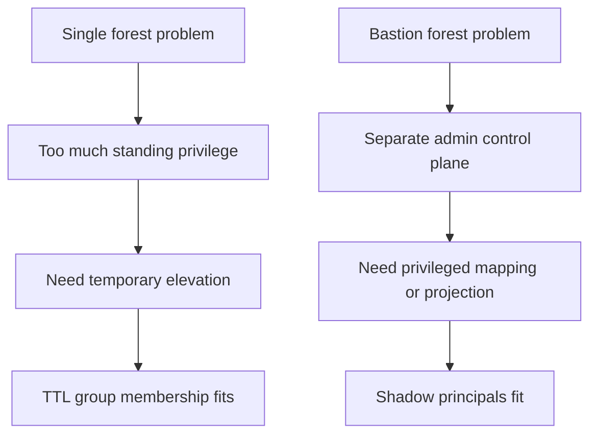
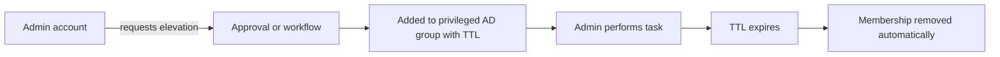
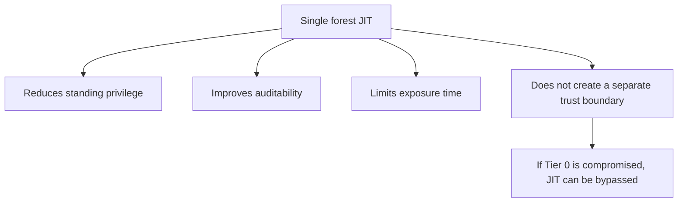
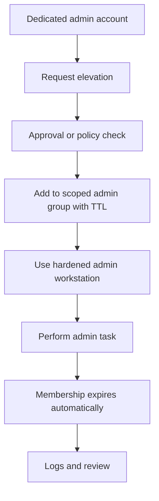
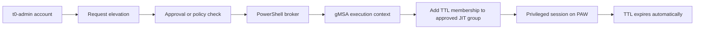
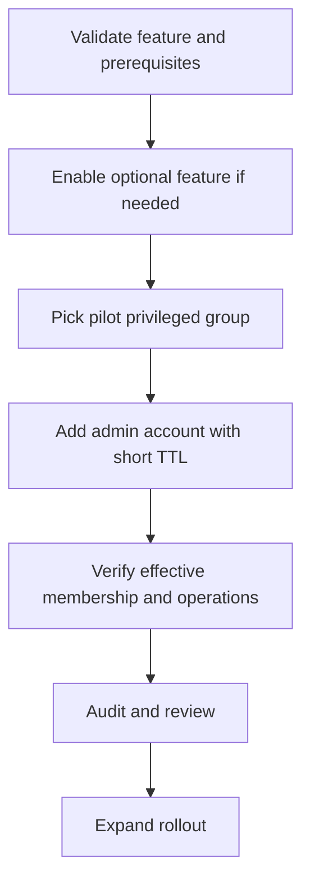
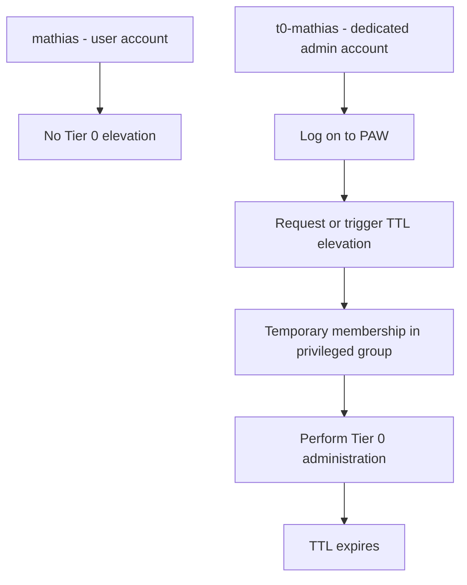

# Active Directory Just In Time Administration in a Single Forest

When people talk about Just In Time administration in Active Directory, several models are usually mixed together:

- dedicated admin forest or bastion forest
- Microsoft Identity Manager PAM
- shadow principals
- temporary group memberships with TTL
- custom workflows around approval and removal of privilege

That mix creates confusion fast, because these mechanisms do not solve the same problem and do not belong to the same architectural generation.

This first article focuses on a simpler and very common case:

- one AD forest
- no dedicated administration forest
- no bastion forest
- no MIM PAM design
- classic on-premises AD administration that still needs to reduce standing privilege

And just as importantly, this article is intentionally focused on the TTL mechanism itself:

- what it is
- when it fits
- when it does not
- how to think about it technically in a single forest

Delegation remains extremely important, but the detailed design of delegated admin groups is not the subject here.

In that context, the question becomes very practical:

Should you use shadow principals? Should you use TTL group memberships? What is the right JIT model when the environment stays in a single forest?

Short answer:

- do not use shadow principals in this scenario
- prefer time-bound privileged group membership based on TTL, including for highly privileged built-in groups if needed
- treat JIT as a reduction of standing privilege, not as a security boundary equivalent to a hardened admin forest
- keep in mind that delegation and scoped admin groups matter a lot, even if this article does not explain how to design them

## The key idea

In a single forest, the cleanest JIT goal is usually this:

1. administrators do not keep permanent membership in privileged groups
2. they request elevation only when needed
3. the privilege expires automatically after a short period
4. the elevation is audited and ideally approved

That gives you a much better posture than permanent Domain Admin or Server Admin membership, while staying operationally realistic.

## Why shadow principals are not the right tool here

Shadow principals belong to another model.

They are tied to the bastion forest / PAM design, where a separate administrative control plane is introduced and privileged access is projected or controlled through that architecture.

In other words, shadow principals make sense when you deliberately build a separate administrative boundary.

In a single forest:

- the same forest hosts the identities, groups, domain controllers, and control plane
- the same Tier 0 boundary remains in place
- the main problem is usually standing privilege, not cross-forest privilege projection

That is why shadow principals are misaligned here. They are designed for a control model that assumes a distinct administrative boundary. In a single forest, that boundary does not exist.

So if you stay in one forest:

- there is no bastion forest to host that abstraction cleanly
- there is no cross-boundary privilege model to project
- you mainly add complexity without solving the actual problem

And the actual problem in this scenario is simple: too much standing privilege inside the same forest.

Visual comparison:



The important consequence is this:

- shadow principals do not create a new security boundary in a single forest
- they do not naturally solve temporary elevation inside that forest
- they are harder to explain and operate than native temporary group membership

If the goal is to replace permanent privilege with short-lived elevation inside one forest, the better fit is TTL-based group membership, not shadow principals.

## Why TTL group membership is the right starting point

If your objective is to reduce standing privilege inside one forest, TTL-based membership is the most natural native AD mechanism.

The logic is straightforward:

- the admin account is added to a privileged group
- that membership has a limited lifetime
- when the TTL expires, the membership disappears automatically

That maps very well to real operational administration.

Typical use cases:

- temporary membership in a server administrators group
- temporary membership in Account Operators or delegated admin groups
- temporary membership in a tightly controlled Tier 0 administrative group
- temporary elevation for a maintenance window or incident response task

Visual model:



This is usually the best fit for a single-forest JIT design because it is:

- operationally simple
- understandable by AD teams
- auditable
- much less complex than a bastion forest approach

## Important nuance: TTL membership and "PAM"

Many teams say "we do not want PAM", but they often mix two different meanings:

1. MIM PAM / bastion forest architecture
2. the native AD DS optional feature that enables expiring links for group membership

If by "no PAM" you mean no MIM, no bastion forest, and no heavyweight privileged access architecture, then TTL membership is still absolutely relevant.

The nuance is simply that expiring group membership relies on the native AD DS capability for expiring links.

So the correct position is usually:

- no MIM PAM architecture
- yes to native AD time-bound group membership if the forest supports it

That distinction matters, otherwise teams reject the right mechanism for the wrong reason.

## What JIT in a single forest does well

A single-forest JIT model based on temporary group membership is very good at reducing these risks:

- admins keeping permanent standing privilege
- forgotten privileged memberships
- privilege creep over time
- broad reuse of high-privilege groups for convenience
- overexposed accounts that remain privileged 24/7

It also improves investigations because you can correlate:

- who requested elevation
- when elevation started
- which group was granted
- when it expired

## What it does not solve

This is the critical architectural limit.

In a single forest, JIT is not a substitute for a stronger security boundary.

If the control plane of the forest is already compromised, an attacker with sufficient control can still:

- grant themselves privileged membership
- alter the workflow
- tamper with delegated paths
- persist through other Tier 0 mechanisms

So JIT in a single forest reduces standing privilege, but it does not create an independent administrative trust boundary.

That is why the design goal must stay realistic:

- improve privilege hygiene
- reduce exposure time
- improve auditability
- make abuse harder and noisier
- but do not pretend this is equivalent to a separate secure administration plane

Visual summary:



## Recommended model in a single forest

For a first practical JIT model in one forest, I usually recommend this pattern:

1. keep permanent privileged membership as close to zero as possible
2. use dedicated admin accounts, not standard user accounts
3. grant elevation through temporary membership in specific admin groups
4. keep TTL windows short
5. require an approval or ticket reference for high-impact groups
6. log and review every elevation
7. use hardened admin workstations or privileged access workstations for the actual privileged sessions

The real design should look like this:



That pattern is usually more valuable than chasing an overly sophisticated design that the team will never operate correctly.

At this stage, the point is not to explain the full art of delegation design. The point is to establish the right native JIT mechanism for a single forest and to explain how TTL-based elevation fits into that model.

## Should you use Domain Admin with TTL?

Yes, if that is what the environment currently needs. It is still much better than keeping multiple permanent members in Domain Admins.

So a realistic transitional model can absolutely be:

- keep one or very few break-glass accounts as permanent members
- remove all other permanent privileged membership
- require TTL-based elevation for built-in privileged groups, including Domain Admins when necessary

That already reduces standing privilege significantly, which is a meaningful improvement.

The nuance is that this should usually be seen as a strong intermediate state, not the most mature end-state.

Why? Because JIT should ideally reduce both:

- the duration of privilege
- the blast radius of privilege

TTL on Domain Admins improves the first point immediately. Delegation and scoped admin groups improve the second.

So the better long-term approach is still:

- use the narrowest possible administrative groups
- delegate at the right scope
- reserve the most powerful built-in groups for exceptional cases only

In other words, TTL on built-in privileged groups is valid and useful, but the design gets better as you move daily administration away from the broadest groups.

That said, the detailed question of how to redesign delegation is deliberately out of scope for this first article. Here, the important point is simpler: TTL is a valid native mechanism, including for built-in privileged groups when needed, and delegation remains an important design concern around it.

## Should you keep permanent break-glass accounts?

Yes, but extremely limited in number and tightly controlled.

A realistic design usually needs:

- one or a very small number of emergency accounts
- strong authentication
- strong monitoring
- vaulting or sealed operational procedure
- no day-to-day use

JIT should cover normal administration.
Break-glass covers exceptional operational failure.
The two are complementary.

## Prerequisites

Before implementing TTL-based privileged membership in a single forest, verify these points:

- the forest supports the native AD DS capability for expiring links
- the Active Directory PowerShell module is available on the administration host
- the team understands that TTL changes group membership, not the broader privilege model by itself
- administrative accounts are separated from standard user identities
- privileged workstations or hardened admin hosts are part of the operational model
- monitoring and auditing are ready before the first pilot
- the elevation process is defined, even if it is initially simple

The most important technical prerequisite is the AD DS optional feature behind expiring links. If that feature is not available or not enabled in the forest, TTL-based membership will not work.

In practice, the clean first step is to validate the feature state explicitly instead of assuming the forest is ready.

Example:

```powershell
Import-Module ActiveDirectory

Get-ADOptionalFeature -Filter 'name -like "Privileged Access Management*"' |
    Select-Object Name, EnabledScopes
```

If the feature is not enabled for the forest yet, plan that change carefully. It is not the kind of switch you want to discover mid-implementation.

## Deployment approach

There are two practical deployment patterns you can describe clearly in a single-forest TTL model.

### Minimal deployment model

The first model is the basic one: the dedicated admin account requests and performs its own elevation.

In practice, that means a dedicated admin identity such as `t0-mathias` is temporarily added to the target privileged group with TTL, then used for the administrative task.

This model is simple, but it raises an important control question: who is allowed to modify the membership of the privileged group?

If the admin account can trigger its own elevation directly, then one of these must be true:

- the admin account itself has delegated rights to modify the target group membership
- a local script or tool runs under a more privileged context and performs the change on its behalf

That is why this model is acceptable for a first deployment or a controlled pilot, but it is not the strongest governance model. It reduces standing privilege, but it still leaves the elevation decision close to the operator.

### Workflow-assisted model with PowerShell and gMSA

The more mature model is to separate the requester from the actor that modifies group membership.

In that design:

- the admin account requests elevation for a specific role and duration
- an approval step or policy check validates the request
- a PowerShell-based broker executes the change
- the broker runs under a dedicated `gMSA`
- only that `gMSA` has the delegated right to add TTL membership to the approved JIT groups

That model is usually much more interesting operationally because it gives you a real control plane around TTL:

- the user does not modify group membership directly
- approval can be enforced before elevation
- the PowerShell broker can check allowed groups, maximum TTL, justification, or ticket reference
- the execution path becomes much easier to audit

The important design rule is simple: the `gMSA` must not receive broad write access across the directory. It should only have the minimum delegated rights required for the approved JIT groups. And because it can indirectly grant privileged access, it must itself be treated as a Tier 0 asset.

Visual workflow:



### Example of a PowerShell broker model

In a simple implementation, the workflow does not need a full PAM product. A small PowerShell broker can be enough if it enforces strict rules.

The logic is usually:

1. read a validated request
2. verify that the requester is allowed to request the target group
3. cap the TTL to the maximum allowed for that role
4. write an execution log
5. apply the TTL membership through `Add-ADGroupMember`

Illustrative example:

```powershell
param(
    [Parameter(Mandatory)]
    [string]$Requester,

    [Parameter(Mandatory)]
    [string]$TargetGroup,

    [Parameter(Mandatory)]
    [int]$RequestedMinutes,

    [Parameter(Mandatory)]
    [string]$TicketId
)

Import-Module ActiveDirectory

$allowedGroups = @{
    't0-mathias' = @('GG-Tier0-AD-Admins-JIT')
    't1-sophie'  = @('GG-ServerOps-Prod-Admins-JIT')
}

$maxTtlByGroup = @{
    'GG-Tier0-AD-Admins-JIT'     = 30
    'GG-ServerOps-Prod-Admins-JIT' = 240
}

if (-not $allowedGroups.ContainsKey($Requester)) {
    throw "Requester not authorized: $Requester"
}

if ($TargetGroup -notin $allowedGroups[$Requester]) {
    throw "Requester $Requester cannot request group $TargetGroup"
}

if (-not $maxTtlByGroup.ContainsKey($TargetGroup)) {
    throw "Target group not managed by the broker: $TargetGroup"
}

$approvedMinutes = [Math]::Min($RequestedMinutes, $maxTtlByGroup[$TargetGroup])
$ttl = New-TimeSpan -Minutes $approvedMinutes

$params = @{
    Identity         = $TargetGroup
    Members          = $Requester
    MemberTimeToLive = $ttl
}

Add-ADGroupMember @params

[pscustomobject]@{
    Requester       = $Requester
    TargetGroup     = $TargetGroup
    ApprovedMinutes = $approvedMinutes
    TicketId        = $TicketId
    ExecutedAt      = Get-Date
}
```

This is not a complete product. It is only a useful pattern: the broker becomes the only component allowed to write TTL membership, and its policy is explicit in code.

### Minimal delegation model for the broker

The key point is not just to use a `gMSA`, but to delegate the right scope.

The safe principle is:

- the broker can modify only the membership of the approved JIT groups
- the broker cannot create groups
- the broker cannot change unrelated objects
- the broker cannot write broadly across Tier 0 containers
- the broker is denied from becoming a generic directory administration backdoor

So in practice, the minimal model should look like this:

- one dedicated `gMSA` for the broker
- one list of approved JIT groups
- delegated membership management only on those groups
- no broad inheritance-based delegation at domain root unless absolutely required

That is also why the minimal self-service model and the broker model are different in substance, not just in tooling:

- in the minimal model, the operator stays close to the privilege change
- in the broker model, the operator requests and the broker executes
- that separation is what makes approval, review, and audit much easier to defend

The simplest rollout is usually:

1. validate prerequisites in a lab or pilot OU
2. enable the optional feature if required
3. choose a small pilot group
4. add one admin account with a short TTL
5. verify membership visibility and operational behavior
6. expand to additional privileged groups

Visual sequence:



### 1. Validate the forest capability

Start by checking whether the optional feature is visible and whether it is already enabled.

```powershell
Import-Module ActiveDirectory

$forest = Get-ADForest

Get-ADOptionalFeature -Filter 'name -like "Privileged Access Management*"' |
    Select-Object Name, EnabledScopes
```

### 2. Enable the feature if required

If the feature is not enabled yet, the change is done at forest scope.

Example:

```powershell
Import-Module ActiveDirectory

$forest = Get-ADForest

$params = @{
    Identity = 'Privileged Access Management Feature'
    Scope    = 'ForestOrConfigurationSet'
    Target   = $forest.Name
}

Enable-ADOptionalFeature @params
```

This is a control-plane change. Treat it like one:

- do it from a trusted admin host
- document when it was enabled
- validate replication afterward

### 3. Add a member with TTL

Once the feature is available, the core operation is simple: use `Add-ADGroupMember` with `-MemberTimeToLive`.

Example with a delegated admin group:

```powershell
Import-Module ActiveDirectory

$ttl = New-TimeSpan -Hours 2

$params = @{
    Identity         = 'GG-Tier0-AD-Admins-JIT'
    Members          = 'adm-jdupont'
    MemberTimeToLive = $ttl
}

Add-ADGroupMember @params
```

Example with a built-in privileged group when that is still required operationally:

```powershell
Import-Module ActiveDirectory

$ttl = New-TimeSpan -Minutes 45

$params = @{
    Identity         = 'Domain Admins'
    Members          = 'adm-jdupont'
    MemberTimeToLive = $ttl
}

Add-ADGroupMember @params
```

That command is the heart of the mechanism. Operationally, this is what turns TTL into native JIT.

### 4. Verify the TTL membership

You should verify the membership immediately after granting it.

The useful cmdlet here is `Get-ADGroup` with `-ShowMemberTimeToLive`.

```powershell
Import-Module ActiveDirectory

Get-ADGroup -Identity 'Domain Admins' -Properties member -ShowMemberTimeToLive |
    Select-Object -ExpandProperty member
```

You can also verify a pilot delegated group the same way:

```powershell
Get-ADGroup -Identity 'GG-Tier0-AD-Admins-JIT' -Properties member -ShowMemberTimeToLive |
    Select-Object -ExpandProperty member
```

### 5. Understand the operational reality

TTL membership is directory state. It does not magically rewrite every already-issued token on every machine.

That means your validation should also include:

- fresh sign-in behavior
- new administrative session creation
- Kerberos ticket renewal behavior
- what happens when the TTL expires while the admin is still connected

This point is important enough to say clearly: do not stop testing at "the group shows a TTL". Test the real admin workflow end to end.

## Practical PowerShell examples

## Which account should receive the TTL elevation?

In practice, TTL elevation should normally be applied to the dedicated admin account, not to the everyday user account.

For example:

- `mathias` = standard user account for daily work
- `t0-mathias` = dedicated Tier 0 administrative account

In that model:

- `mathias` does not receive temporary Tier 0 privilege
- `t0-mathias` is the account that is temporarily added to the privileged group

Visual example:



That separation matters because the user account is typically exposed to much broader daily activity, while the dedicated admin account is supposed to stay inside the privileged administration path.

There is also an important operational nuance: adding `t0-mathias` to a privileged group with TTL does not always mean the already-open session instantly sees the new rights.

In practice, you should validate:

- fresh sign-in after elevation
- a new administrative console or process launched after elevation
- Kerberos ticket and session behavior during the TTL window

So the practical sequence is often:

1. sign in to the PAW with `t0-mathias`
2. trigger the TTL elevation for `t0-mathias`
3. open a fresh admin session or tool context if needed
4. perform the privileged task

This is one of the reasons pilot testing matters: the directory change is immediate, but the usable privilege in the running session may depend on logon token and Kerberos context.

### Grant 30 minutes of elevation

```powershell
$ttl = New-TimeSpan -Minutes 30

$params = @{
    Identity         = 'Domain Admins'
    Members          = 'adm-jdupont'
    MemberTimeToLive = $ttl
}

Add-ADGroupMember @params
```

### Grant 4 hours of elevation to a scoped admin group

```powershell
$ttl = New-TimeSpan -Hours 4

$params = @{
    Identity         = 'GG-ServerOps-Prod-Admins-JIT'
    Members          = 'adm-jdupont'
    MemberTimeToLive = $ttl
}

Add-ADGroupMember @params
```

### Inspect current members with their TTL

```powershell
Get-ADGroup -Identity 'GG-ServerOps-Prod-Admins-JIT' -Properties member -ShowMemberTimeToLive |
    Select-Object -ExpandProperty member
```

### Inspect several privileged groups in one pass

```powershell
$groups = @(
    'Domain Admins',
    'Enterprise Admins',
    'GG-Tier0-AD-Admins-JIT',
    'GG-ServerOps-Prod-Admins-JIT'
)

foreach ($group in $groups) {
    Write-Host "`n=== $group ===" -ForegroundColor Cyan
    Get-ADGroup -Identity $group -Properties member -ShowMemberTimeToLive |
        Select-Object -ExpandProperty member
}
```

## How to audit TTL-based elevation

There are really three layers to audit.

### 1. Audit the request and approval path

Even if the workflow is initially simple, you need a record of:

- who asked for elevation
- for which group
- for how long
- why
- who approved it, if approval exists

Without that, TTL reduces standing privilege, but it does not give you a mature operational trail.

### 2. Audit the directory change itself

Group membership changes should be logged and reviewed.

At minimum, enable and monitor security events related to group membership changes, such as:

- `4728` / `4729` for global security groups
- `4732` / `4733` for local security groups
- `4756` / `4757` for universal security groups

The exact event mix depends on the group scope and your audit policy, but the principle is simple: every elevation and every removal should be observable.

### 3. Audit the live TTL state

Security events tell you that a change happened. They do not replace a direct view of the current TTL state.

That is why it is useful to run regular checks against the actual privileged groups.

Example:

```powershell
$groups = @(
    'Domain Admins',
    'Enterprise Admins',
    'GG-Tier0-AD-Admins-JIT'
)

foreach ($group in $groups) {
    Get-ADGroup -Identity $group -Properties member -ShowMemberTimeToLive |
        Select-Object @{Name='Group';Expression={$group}}, @{Name='Members';Expression={$_.member}}
}
```

For a production deployment, this usually becomes:

- a scheduled control
- a dashboard or report
- an alert when a privileged group has an unexpected member or an abnormal TTL duration

## What to test during a pilot

Before expanding the model, validate these points with a small admin pilot:

- adding a TTL membership works consistently
- replication delay is understood
- the admin receives the expected rights in a fresh session
- rights disappear as expected after expiration
- audit events are visible
- the helpdesk or admin team knows how to explain what happened if access is denied after TTL expiry

This is the stage where most operational surprises are discovered, which is exactly why you want a pilot instead of an all-at-once rollout.

## My recommendation

For a single forest, without an administration forest, and without MIM PAM, the most sensible first article and first deployment model is this:

- recommend native JIT through temporary AD group membership with TTL
- explicitly reject shadow principals for this scenario
- explain that this is a privilege hygiene and exposure-reduction model, not a separate security boundary
- insist on dedicated admin accounts, short TTL windows, approval workflow, hardened admin workstations, and very limited permanent break-glass accounts
- state clearly that delegation quality still matters, without turning this article into a delegation design guide

If I had to summarize the advice in one line:

Use TTL-based temporary group membership as the native JIT mechanism for a single forest, including for privileged built-in groups when needed, but keep pushing the design toward delegated scoped administration and a very small break-glass core.

## Practical position for the next article

A good follow-up article would be:

- prerequisites and caveats of TTL memberships in Active Directory
- how to design the admin groups correctly before enabling JIT
- how to avoid turning "temporary Domain Admin" into the whole strategy
- how to combine JIT with PAW, delegated administration, logging, and break-glass accounts

That is usually where the real engineering value begins.
