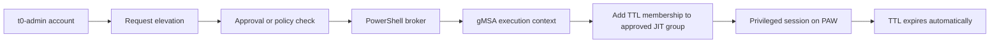

# Active Directory Just In Time Administration in a Single Forest

## Introduction

This article covers a common case:

- one AD forest
- no administration forest
- no bastion forest
- no MIM PAM design
- classic on-premises AD administration with too much standing privilege

The goal is simple: present TTL group membership as the native JIT mechanism for this scenario, then show several deployment models with examples.

Example scripts referenced in this article are provided in the same folder:

- `Invoke-SelfElevation.ps1`
- `New-JitRequest.ps1`
- `Invoke-JitBroker.ps1`
- `JitBrokerPolicy.psd1`

## Why TTL for JIT in a Single Forest

In a single forest, TTL group membership is usually the right starting point for JIT because it is native to AD, operationally simple, and easy to wrap with audit or approval.

The mechanism is simple:

- an admin account is added to a privileged group
- the membership has a limited lifetime
- the membership expires automatically

Shadow principals are not the right tool here because they belong to a bastion forest / PAM model with a separate administrative boundary. Here, the goal is temporary elevation inside the same forest.

One nuance matters: saying "no PAM" often means "no MIM PAM architecture". It does not exclude native TTL membership in AD if the forest supports expiring links.

TTL reduces standing privilege and improves auditability, but it does not create a new trust boundary. If Tier 0 is already compromised, TTL can still be bypassed.

## Design Principles

- use dedicated admin accounts, not standard user accounts
- keep permanent privileged membership close to zero
- keep TTL windows short
- prefer scoped admin groups when possible
- use TTL on built-in groups if the environment still needs it
- keep break-glass accounts very limited
- use hardened admin workstations for privileged sessions
- require approval or a ticket reference for the most sensitive roles

TTL on `Domain Admins` is valid as a transitional model if needed. The better long-term direction is still to reduce both duration and blast radius by moving toward narrower delegated groups.

## Common Technical Prerequisites

Before implementing TTL-based privileged membership, verify:

- the forest supports expiring links
- the Active Directory PowerShell module is available
- administrative accounts are separated from standard user accounts
- privileged workstations or hardened admin hosts are part of the model
- monitoring and auditing are ready before the first pilot

### Validate the forest capability

```powershell
Import-Module ActiveDirectory

Get-ADOptionalFeature -Filter 'name -like "Privileged Access Management*"' |
    Select-Object Name, EnabledScopes
```

### Enable the feature if required

```powershell
Import-Module ActiveDirectory

$forest = Get-ADForest

$params = @{
    Identity = 'Privileged Access Management Feature'
    Scope    = 'ForestOrConfigurationSet'
    Target   = $forest.Name
}

Enable-ADOptionalFeature @params
```

If you enable the feature, do it from a trusted admin host and validate replication.

## Deployment Model 1: Basic Self-Elevation

This is the simplest model: the dedicated admin account requests and performs its own elevation.

That means one of these must be true:

- the admin account itself has delegated rights to modify the target group membership
- a local script or tool runs under a more privileged context and performs the change

This model is acceptable for a pilot or a minimal deployment, but it is weak from a governance perspective because the operator stays close to the privilege change.

### Typical sequence

1. sign in to the PAW with the dedicated admin account
2. add that account to the target privileged group with TTL
3. open a fresh admin session if needed
4. perform the task
5. let the membership expire

### Example: built-in privileged group

```powershell
Import-Module ActiveDirectory

$ttl = New-TimeSpan -Minutes 30

$params = @{
    Identity         = 'Domain Admins'
    Members          = 't0-mathias'
    MemberTimeToLive = $ttl
}

Add-ADGroupMember @params
```

### Example: scoped admin group

```powershell
Import-Module ActiveDirectory

$ttl = New-TimeSpan -Hours 4

$params = @{
    Identity         = 'GG-ServerOps-Prod-Admins-JIT'
    Members          = 't0-mathias'
    MemberTimeToLive = $ttl
}

Add-ADGroupMember @params
```

### Practical example: self-elevation helper

In a pilot, teams often wrap the elevation in a small script instead of typing `Add-ADGroupMember` manually each time.

```powershell
param(
    [Parameter(Mandatory)]
    [string]$TargetGroup,

    [Parameter(Mandatory)]
    [int]$Minutes
)

Import-Module ActiveDirectory

$adminAccount = $env:USERNAME
$ttl = New-TimeSpan -Minutes $Minutes

$params = @{
    Identity         = $TargetGroup
    Members          = $adminAccount
    MemberTimeToLive = $ttl
}

Add-ADGroupMember @params

Get-ADGroup -Identity $TargetGroup -Properties member -ShowMemberTimeToLive |
    Select-Object -ExpandProperty member
```

Typical use:

```powershell
.\Invoke-SelfElevation.ps1 -TargetGroup 'GG-Tier0-AD-Admins-JIT' -Minutes 30
```

This is still self-service. It is useful for a lab, a pilot, or a first rollout, but it does not create separation of duties.

## Deployment Model 2: Workflow with PowerShell Broker and gMSA

This model separates the requester from the actor that modifies group membership.

- the admin account requests elevation for a role and a duration
- an approval step or policy check validates the request
- a PowerShell broker executes the change
- the broker runs under a dedicated `gMSA`
- only that `gMSA` can add TTL membership to the approved JIT groups

This is the more mature model because it gives you a real control plane around TTL.



### Minimal delegation model for the broker

- one dedicated `gMSA` for the broker
- one list of approved JIT groups
- delegated membership management only on those groups
- no broad inheritance-based delegation at domain root unless absolutely required

Because the broker can indirectly grant privilege, the `gMSA` must itself be treated as a Tier 0 asset.

### Example of a PowerShell broker

```powershell
param(
    [Parameter(Mandatory)]
    [string]$Requester,

    [Parameter(Mandatory)]
    [string]$TargetGroup,

    [Parameter(Mandatory)]
    [int]$RequestedMinutes,

    [Parameter(Mandatory)]
    [string]$TicketId
)

Import-Module ActiveDirectory

$allowedGroups = @{
    't0-mathias' = @('GG-Tier0-AD-Admins-JIT')
    't1-sophie'  = @('GG-ServerOps-Prod-Admins-JIT')
}

$maxTtlByGroup = @{
    'GG-Tier0-AD-Admins-JIT'       = 30
    'GG-ServerOps-Prod-Admins-JIT' = 240
}

if (-not $allowedGroups.ContainsKey($Requester)) {
    throw "Requester not authorized: $Requester"
}

if ($TargetGroup -notin $allowedGroups[$Requester]) {
    throw "Requester $Requester cannot request group $TargetGroup"
}

if (-not $maxTtlByGroup.ContainsKey($TargetGroup)) {
    throw "Target group not managed by the broker: $TargetGroup"
}

$approvedMinutes = [Math]::Min($RequestedMinutes, $maxTtlByGroup[$TargetGroup])
$ttl = New-TimeSpan -Minutes $approvedMinutes

$params = @{
    Identity         = $TargetGroup
    Members          = $Requester
    MemberTimeToLive = $ttl
}

Add-ADGroupMember @params

[pscustomobject]@{
    Requester       = $Requester
    TargetGroup     = $TargetGroup
    ApprovedMinutes = $approvedMinutes
    TicketId        = $TicketId
    ExecutedAt      = Get-Date
}
```

### Practical example: request file + broker execution

In a simple implementation, the request can be a JSON document created by a portal, a script, or an ITSM connector.

Example request file:

```json
{
  "Requester": "t0-mathias",
  "TargetGroup": "GG-Tier0-AD-Admins-JIT",
  "RequestedMinutes": 30,
  "TicketId": "INC-2026-00421",
  "ApprovalState": "Approved"
}
```

Example broker reading and executing that request:

```powershell
param(
    [Parameter(Mandatory)]
    [string]$RequestPath
)

Import-Module ActiveDirectory

$request = Get-Content -Path $RequestPath -Raw | ConvertFrom-Json

if ($request.ApprovalState -ne 'Approved') {
    throw "Request is not approved"
}

$allowedGroups = @{
    't0-mathias' = @('GG-Tier0-AD-Admins-JIT')
}

$maxTtlByGroup = @{
    'GG-Tier0-AD-Admins-JIT' = 30
}

if ($request.TargetGroup -notin $allowedGroups[$request.Requester]) {
    throw "Requester not allowed for target group"
}

$approvedMinutes = [Math]::Min(
    [int]$request.RequestedMinutes,
    $maxTtlByGroup[$request.TargetGroup]
)

$ttl = New-TimeSpan -Minutes $approvedMinutes

$params = @{
    Identity         = $request.TargetGroup
    Members          = $request.Requester
    MemberTimeToLive = $ttl
}

Add-ADGroupMember @params

[pscustomobject]@{
    Requester       = $request.Requester
    TargetGroup     = $request.TargetGroup
    ApprovedMinutes = $approvedMinutes
    TicketId        = $request.TicketId
    ExecutedAt      = Get-Date
} | Export-Csv -Path 'C:\Logs\JIT-Broker.csv' -Append -NoTypeInformation
```

Typical use:

```powershell
.\Invoke-JitBroker.ps1 -RequestPath 'C:\JIT\Requests\INC-2026-00421.json'
```

In practice, this script would run under the broker `gMSA`, launched by a scheduled task, a service, or an API wrapper.

### Practical example: creating a request in PowerShell

The request itself can also be generated by a small operator-side script.

```powershell
$request = [pscustomobject]@{
    Requester        = 't0-mathias'
    TargetGroup      = 'GG-Tier0-AD-Admins-JIT'
    RequestedMinutes = 30
    TicketId         = 'INC-2026-00421'
    ApprovalState    = 'Pending'
}

$request | ConvertTo-Json | Set-Content -Path 'C:\JIT\Requests\INC-2026-00421.json'
```

That gives you a simple pattern:

1. create a request
2. approve it in the chosen workflow
3. let the broker read and execute it

## Verification and Operational Reality

### Verify the TTL membership

Use `Get-ADGroup` with `-ShowMemberTimeToLive`.

```powershell
Import-Module ActiveDirectory

Get-ADGroup -Identity 'GG-Tier0-AD-Admins-JIT' -Properties member -ShowMemberTimeToLive |
    Select-Object -ExpandProperty member
```

You can also inspect several privileged groups in one pass:

```powershell
$groups = @(
    'Domain Admins',
    'Enterprise Admins',
    'GG-Tier0-AD-Admins-JIT',
    'GG-ServerOps-Prod-Admins-JIT'
)

foreach ($group in $groups) {
    Write-Host "`n=== $group ===" -ForegroundColor Cyan
    Get-ADGroup -Identity $group -Properties member -ShowMemberTimeToLive |
        Select-Object -ExpandProperty member
}
```

### Which account should receive the TTL elevation?

The dedicated admin account should receive the TTL elevation, not the daily user account.

Example:

- `mathias` = daily user account
- `t0-mathias` = dedicated Tier 0 admin account

So the elevation targets `t0-mathias`, not `mathias`.

### Session and Kerberos reality

TTL membership is directory state. It does not automatically rewrite every token already issued on every machine.

Validate at least:

- fresh sign-in behavior
- a new admin console or process after elevation
- Kerberos ticket behavior during the TTL window
- rights removal after expiration

Do not stop at "the group shows a TTL". Test the real admin workflow end to end.

### Practical example: open a fresh admin shell after elevation

```powershell
Start-Process powershell.exe -Credential (Get-Credential 'CONTOSO\t0-mathias')
```

This is a simple way to validate whether the new session receives the expected rights after the TTL membership is added.

## Auditing

Audit should cover three layers:

### Request and approval path

Record at least:

- who requested elevation
- which group was requested
- for how long
- why
- who approved it, if approval exists

### Directory change

Monitor group membership changes, including:

- `4728` / `4729` for global security groups
- `4732` / `4733` for local security groups
- `4756` / `4757` for universal security groups

### Live TTL state

Security events do not replace a direct view of the current TTL state.

```powershell
$groups = @(
    'Domain Admins',
    'Enterprise Admins',
    'GG-Tier0-AD-Admins-JIT'
)

foreach ($group in $groups) {
    Get-ADGroup -Identity $group -Properties member -ShowMemberTimeToLive |
        Select-Object @{Name='Group';Expression={$group}}, @{Name='Members';Expression={$_.member}}
}
```

In production, this usually becomes a scheduled control, a dashboard, or an alert.

## Pilot and Rollout Strategy

Start small and validate:

- TTL membership creation
- replication behavior
- fresh session behavior
- privilege removal after expiration
- audit visibility
- operator understanding of TTL expiration

Expand only after the pilot is stable.

## Conclusion

For a single forest, without an administration forest and without MIM PAM, the sensible first approach is native JIT through temporary AD group membership with TTL.

Use the basic self-elevation model for a pilot if needed. Move to a broker model with workflow and `gMSA` when you want better governance, separation of duties, and auditability.
