# Roadmap — Décommissionnement AD FS vers Entra ID

Date : 2026-06-05

## En une page

Le projet consiste à **supprimer la ferme AD FS** existante et à confier toute l'authentification directement à **Entra ID**. La cible : plus aucune dépendance à AD FS, des utilisateurs externes gérés en mode invité (B2B), et les ~90 applications repointées vers Entra.

Le projet est découpé en **6 phases**, dont certaines se déroulent en parallèle :

1. **Phase 1** — Basculer les utilisateurs internes vers une authentification directe sur Entra.
2. **Phase 2** — Reconstruire dans Entra les deux portails self-service existants. *(en parallèle de Phase 1)*
3. **Phase 3** — Migrer les utilisateurs externes (partenaires, prestataires) vers Entra B2B. *(démarre quand Phase 2 est livrée)*
4. **Phase 4** — Migrer les ~90 applications une par une vers Entra. *(démarre quand Phases 1 et 2 sont stables, en parallèle de Phase 3)*
5. **Phase 5** — Éteindre définitivement AD FS.
6. **Phase 6** — Activer les fonctionnalités modernes d'Entra et entrer en run.

---

## Glossaire express

| Terme | Signification simple |
|-------|----------------------|
| **AD FS** | Service Microsoft on-prem qui assure aujourd'hui l'authentification fédérée — c'est ce qu'on veut supprimer |
| **Entra ID** | Service d'identité Microsoft dans le cloud (anciennement Azure AD) — la cible |
| **Application fédérée / RP** | Application qui aujourd'hui délègue son authentification à AD FS — il y en a ~90 à migrer |
| **Authentification managée (PHS)** | Mode où Entra valide directement les mots de passe, sans passer par AD FS |
| **B2B Guest** | Compte invité dans Entra pour un utilisateur externe (partenaire, prestataire) |
| **Enterprise App** | Représentation d'une application dans Entra (équivalent Entra du RP AD FS) |
| **SAML / OIDC** | Protocoles standard d'authentification entre une app et son fournisseur d'identité |
| **MFA** | Authentification à deux facteurs |
| **Conditional Access** | Règles de sécurité Entra (MFA obligatoire, blocage hors entreprise, etc.) |

---

## Contexte de départ

- Ferme AD FS en production, fédérée à Entra ID.
- ~90 applications à migrer.
- 2 annuaires Active Directory : 1 interne (collaborateurs), 1 externe (partenaires, prestataires).
- Bascule progressive des internes vers Entra déjà commencée et fonctionnelle (Staged Rollout PHS).
- Deux portails self-service custom existants : création de compte externe + demande d'accès aux applications.
- Une analyse des 90 applications a déjà été faite : pas de blocage majeur, **SAP** identifié comme l'élément le plus complexe.

## Cible

- Plus aucune ferme AD FS.
- Internes : restent dans l'AD interne mais s'authentifient directement sur Entra (sans AD FS).
- Externes : sortent de l'AD externe et deviennent des invités (Guests) dans Entra.
- Les deux portails self-service sont reconstruits avec les fonctionnalités natives d'Entra.
- Les 90 applications pointent vers Entra (plus vers AD FS).

---

## Comment les phases s'enchaînent

```mermaid
gantt
    title Phases de décommissionnement AD FS
    dateFormat X
    axisFormat %s
    section Identité
    Phase 1 - Bascule internes vers Entra            :a1, 0, 3
    Phase 3 - Externes vers Entra B2B                :a2, 3, 3
    section Self-Service
    Phase 2a - Portail compte externe                :b1, 0, 3
    Phase 2b - Portail demande d'accès               :b2, 0, 3
    section Apps
    Phase 4 - Migration des 90 applications          :c1, 3, 5
    section Décom
    Phase 5 - Extinction AD FS                       :d1, 8, 1
    Phase 6 - Run & optimisation                     :d2, 9, 2
```

**Lecture du diagramme** :

- Les **Phases 1 et 2** démarrent ensemble, dès le début du projet.
- La **Phase 3** ne peut pas commencer tant que la Phase 2 (portails) n'est pas livrée — sinon les nouveaux externes ne pourraient plus être créés pendant la transition.
- La **Phase 4** ne démarre qu'une fois les Phases 1 et 2 stables — elle se déroule en parallèle de la Phase 3.
- Les **Phases 5 et 6** sont séquentielles, à la fin.

> Les durées du diagramme sont **relatives** et à affiner selon les effectifs disponibles, les fenêtres de change et la criticité métier.

---

## Phase 1 — Basculer les internes vers une authentification Entra directe

**Objectif** : tous les collaborateurs s'authentifient directement sur Entra, sans passer par AD FS.

**Pourquoi en premier** : c'est la base. On déconnecte progressivement la population la plus large d'AD FS, ce qui valide tout le mécanisme et réduit le risque sur la suite.

**Actions** :

1. Découper la population interne en vagues (par département, criticité métier, etc.).
2. Définir les critères pour qu'un utilisateur soit éligible à la bascule (Authenticator installé, pas d'application bloquante, etc.).
3. Lancer 3 pilotes : équipe IT, métier early adopter, dirigeants / VIP.
4. Pour chaque vague : basculer, puis suivre les connexions sur le tableau de bord Entra (comparer les flux "Managed" vs "Federated").
5. Documenter et **tester** à chaque vague la procédure de retour arrière (en cas de problème, on peut re-fédérer en quelques minutes).

**Sortie de phase** : 100 % des internes en authentification managée. Plus aucun flux fédéré côté interne dans les logs. AD FS reste allumé uniquement pour les applications.

**Déclenche** : prérequis stable pour démarrer la Phase 4.

---

## Phase 2 — Reconstruire les deux portails self-service dans Entra *(en parallèle de Phase 1)*

**Objectif** : avoir les portails Entra opérationnels avant de migrer les externes (Phase 3) et les applications (Phase 4).

**Pourquoi en parallèle de Phase 1** : c'est un chantier indépendant des bascules d'utilisateurs, et il doit être prêt à temps. Si on attend, on bloque les Phases 3 et 4.

### 2a — Portail "création de compte externe"

**Actions** :

1. Modéliser dans Entra les règles de validation actuelles (workflow d'approbation, sponsors, durée de vie, etc.) sous forme d'**Access Packages**.
2. Déclarer les organisations partenaires connues (*Connected Organizations*).
3. Si des règles métier spécifiques existent (numéro de contrat, code projet, double approbation, sync vers l'ITSM) : développer les automatisations correspondantes via Logic Apps.
4. Activer le cycle de vie automatique : notification J-30 d'expiration, désactivation auto, offboarding.
5. URL d'accès unique pour les externes : `myaccess.microsoft.com`.

> Si les règles de l'actuel portail sont très métier-spécifiques (ce qui est probable), c'est ici que se concentre la complexité du chantier.

### 2b — Portail "demande d'accès aux applications"

**Actions** :

1. Pour chaque application (au fur et à mesure de la Phase 4) : créer un **Access Package** dédié.
2. Définir l'approbateur principal (propriétaire métier de l'app) et un fallback (sécurité).
3. Activer les **revues d'accès** annuelles (chaque accès doit être revu au moins une fois par an).
4. Définir une politique d'expiration (pas d'accès "à vie").

**Sortie de phase** : les deux portails Entra sont opérationnels. Les anciens portails restent en place le temps de la transition, puis sont supprimés.

**Déclenche** : prérequis pour démarrer Phase 3 et Phase 4.

---

## Phase 3 — Migrer les externes vers Entra B2B *(démarre quand Phase 2 est livrée)*

**Objectif** : les externes ne sont plus des comptes AD, ils deviennent des invités (Guests) dans Entra.

**Pourquoi à ce moment** : il faut les portails Entra (Phase 2) prêts pour que les nouvelles demandes d'externes ne tombent pas dans le vide. La Phase 1 (internes) n'est pas un prérequis, mais on évite généralement de tout bouger en même temps.

**Actions** :

1. Inventaire complet de l'AD externe : actifs, dormants, comptes de service.
2. Nettoyage : suppression des comptes inutilisés.
3. Pour chaque externe : vérifier qu'il a un email professionnel valide. Sinon, prévoir un process alternatif (sponsor + code à usage unique).
4. Stratégie d'invitation B2B : fédération avec le tenant Entra du partenaire si possible, sinon Microsoft Account ou code à usage unique.
5. Configurer les politiques de confiance inter-tenants (*Cross-tenant access settings*) pour les partenaires connus — améliore l'expérience SSO.
6. Mettre en place les **revues d'accès trimestrielles** sur les Guests.
7. Politique de sécurité dédiée Guest (MFA obligatoire, durée de session courte, etc.).
8. Toutes les nouvelles demandes d'externes passent dorénavant par le portail Entra (Phase 2a), plus par l'AD externe.

**Sortie de phase** : tous les externes actifs sont devenus des Guests Entra. L'AD externe est mis en lecture seule, puis planifié pour suppression.

---

## Phase 4 — Migrer les 90 applications par vagues *(démarre quand Phases 1 et 2 sont stables)*

**Objectif** : chaque application pointe vers Entra au lieu d'AD FS.

**Pourquoi à ce moment** : on a besoin que les internes soient stables sur Entra (Phase 1) et que le portail de demande d'accès Entra soit prêt (Phase 2b) pour gérer les accès aux applications migrées.

### Découpage en 4 vagues

| Vague | Type d'applications | Volume |
|-------|---------------------|--------|
| **Vague 0 — Pilote** | 3 à 5 apps simples (SAML basique, internes uniquement) | Validation du process |
| **Vague 1 — Quick wins** | Apps SAML standard, sans logique complexe | ~30 à 40 apps |
| **Vague 2 — Moyenne complexité** | Apps avec règles de transformation, multi-domaines | ~30 à 40 apps |
| **Vague 3 — Complexes** | SAP, apps à configuration spéciale, apps legacy | ~10 à 15 apps (dont SAP) |

### Process pour chaque application (7 étapes)

1. **Préparer** : créer la nouvelle configuration dans Entra, sans encore basculer.
2. **Configurer** le protocole (SAML ou OIDC) avec les paramètres techniques équivalents à ceux d'AD FS.
3. **Traduire** les règles d'authentification d'AD FS vers Entra (l'outil d'assessment aide, certains cas restent manuels).
4. **Tester** avec un utilisateur pilote — vérifier que tous les attributs nécessaires à l'app sont bien transmis.
5. **Basculer** : idéalement, l'application accepte les deux fournisseurs d'identité en parallèle quelques jours, sinon bascule courte avec rollback préparé.
6. **Surveiller** à J+1, J+7, J+30 — logs Entra et retours utilisateurs.
7. **Désactiver** (sans supprimer) l'application côté AD FS, pour pouvoir revenir en arrière si besoin.

### Cas SAP — à traiter en dernière vague

À gérer comme un mini-projet dédié :

- Vérifier la compatibilité SAML 2.0 côté SAP (NetWeaver, BTP, S/4HANA selon le périmètre).
- Option recommandée : passer par **SAP Identity Authentication Service** comme intermédiaire fédéré à Entra.
- Tests UAT lourds (SAP touche souvent finance et RH — risque métier élevé).

**Sortie de phase** : les 90 applications sont migrées. AD FS ne reçoit plus de trafic applicatif.

---

## Phase 5 — Éteindre AD FS

**Objectif** : sortir AD FS du SI.

**Actions** :

1. **Période de gel** de 30 jours minimum après la dernière migration : AD FS reste allumé mais ne doit plus recevoir de trafic.
2. **Surveillance du trafic résiduel** (logs serveur, IIS, alertes Sentinel) pour détecter toute connexion oubliée.
3. **Conversion définitive** du domaine côté Entra : passage de "Federated" à "Managed".
4. **Suppression** des configurations applicatives côté AD FS.
5. **Snapshot final** des serveurs AD FS, conservation 90 jours, puis arrêt et suppression des VM.
6. **Mise à jour** de la documentation, CMDB, runbooks, schémas d'architecture, procédures support.

**Sortie de phase** : plus de ferme AD FS dans le SI.

---

## Phase 6 — Run et optimisation

**Objectif** : tirer parti des fonctionnalités modernes d'Entra qui n'étaient pas accessibles avec AD FS.

**Actions** :

1. Activer le **Conditional Access** granulaire (politiques fines par app, par utilisateur, par contexte).
2. Activer **Identity Protection** (détection des connexions à risque, comportements anormaux).
3. Activer **PIM** (gestion des privilèges admin, élévation temporaire avec justification).
4. Activer **Token Protection** et **Continuous Access Evaluation** (sécurité renforcée des sessions).
5. Migrer les méthodes MFA vers Authenticator uniquement (à terme, suppression du SMS).
6. Personnaliser la page de connexion Entra (charte graphique, logo).
7. Mettre en place les tableaux de bord et alertes (échecs de connexion, anomalies).

---

## Synthèse — toutes les actions dans l'ordre

| # | Phase | Action |
|---|-------|--------|
| 1 | 1 | Découper la population interne en vagues |
| 2 | 1 | Définir les critères d'éligibilité à la bascule |
| 3 | 1 | Lancer 3 pilotes (IT, métier, VIP) |
| 4 | 1 | Basculer les vagues une par une |
| 5 | 1 | Tester la procédure de retour arrière à chaque vague |
| 6 | 2a | Modéliser les règles du portail externe en Access Packages |
| 7 | 2a | Déclarer les organisations partenaires (Connected Organizations) |
| 8 | 2a | Développer les automatisations métier (Logic Apps) |
| 9 | 2a | Activer le cycle de vie automatique (Lifecycle Workflows) |
| 10 | 2b | Créer les Access Packages pour la demande d'accès aux apps |
| 11 | 2b | Définir approbateurs et politiques d'expiration |
| 12 | 3 | Inventorier l'AD externe |
| 13 | 3 | Nettoyer les comptes inutiles |
| 14 | 3 | Vérifier l'email pro de chaque externe |
| 15 | 3 | Inviter les externes en B2B Guest |
| 16 | 3 | Configurer les politiques inter-tenants |
| 17 | 3 | Activer les revues d'accès trimestrielles |
| 18 | 3 | Mettre l'AD externe en lecture seule |
| 19 | 4 | Vague 0 — Pilote (3-5 apps simples) |
| 20 | 4 | Vague 1 — Quick wins (~30-40 apps) |
| 21 | 4 | Vague 2 — Moyenne complexité (~30-40 apps) |
| 22 | 4 | Vague 3 — Complexes + SAP (~10-15 apps) |
| 23 | 5 | Période de gel AD FS (30 jours) |
| 24 | 5 | Surveiller le trafic résiduel |
| 25 | 5 | Convertir le domaine en Managed |
| 26 | 5 | Snapshot et arrêt des VM AD FS |
| 27 | 5 | Mettre à jour documentation et CMDB |
| 28 | 6 | Activer CA granulaire, Identity Protection, PIM |
| 29 | 6 | Migrer les méthodes MFA vers Authenticator |
| 30 | 6 | Personnaliser la page de connexion |
| 31 | 6 | Mettre en place tableaux de bord et alertes |

---

## Plan de communication

### Cartographie des audiences

| Audience | Enjeu pour eux | Canal | Fréquence |
|----------|---------------|-------|-----------|
| **Comité de direction / DSI** | Risque, budget, conformité | Comité projet + jalons clés | Mensuel |
| **Métiers / propriétaires d'applications** | Continuité de service, planning de bascule de leur app | Email + atelier dédié par vague | À chaque vague |
| **Helpdesk / support N1-N2** | Ête prêts à traiter les tickets, FAQ à jour | Formation + canal Teams dédié | Avant chaque vague |
| **Utilisateurs internes** | Changement de page de login, parfois MFA renforcée | Intranet + email + popup pré-bascule | J-15, J-7, J-1, J+1 |
| **Utilisateurs externes** | Changement majeur (deviennent invités, doivent accepter une invitation) | Email personnalisé + tutoriel vidéo + page d'aide dédiée | J-30, J-15, J-7, J-1 |
| **Partenaires (organisations externes)** | Préparation éventuelle de leur côté si fédération B2B | Réunion dédiée par partenaire si > 50 utilisateurs | One-shot + suivi |

### Communications à préparer

- Email type « Votre application X bascule sur Entra ID le J/M/A » (par application).
- Tutoriel vidéo 2 min « Comment me connecter après la bascule ».
- FAQ « J'ai oublié mon mot de passe / mon Authenticator ne marche plus ».
- Page de connexion personnalisée (charte graphique de l'entreprise).

---

## Gouvernance projet

| Comité | Composition | Cadence |
|--------|-------------|---------|
| **Comité de pilotage** | Sponsor IT, RSSI, lead projet, partenaire d'intégration | Mensuel |
| **Comité technique** | Lead identité, lead réseau, lead applications, architecte | Hebdomadaire |
| **Stand-up de vague** | Équipe migration + propriétaire métier de l'application en cours | Quotidien pendant la vague |
| **War room de bascule** | Mêmes participants + helpdesk + astreinte | Lors des bascules majeures |

---

## Risques principaux & mitigations

| Risque | Impact | Mitigation |
|--------|--------|-----------|
| Externes non migrés à temps → perdent l'accès | Critique | Communication anticipée + période de double fonctionnement (B2B + ancien AD) pendant 60 à 90 jours |
| Application avec règles d'authentification trop complexes pour être traduites automatiquement | Bloquant pour cette application | Analyse fine en amont avec l'outil d'assessment, plan B : conserver AD FS isolé pour cette app jusqu'à refonte |
| SAP : retards côté équipe SAP | Décale la fin du projet | Lancer le sous-chantier SAP dès le début du projet, pas en fin de Phase 4 |
| Helpdesk débordé | Insatisfaction utilisateurs, escalades | Vagues petites, FAQ prête, équipe N1 renforcée pendant les bascules |
| Comptes de service / techniques sur AD FS oubliés | Surprises après extinction | Inventaire dès la phase de cadrage et plan de remplacement côté Entra |
| Procédure de retour arrière mal testée | Catastrophique en cas de problème majeur | Tester le retour arrière à chaque vague d'internes, pas seulement au début |

---

## Quick wins en parallèle

À déclencher tôt pour produire de la valeur visible et préparer le terrain :

- **Réinitialisation de mot de passe en self-service** → réduit la charge du helpdesk avant même la fin du projet.
- **MFA via Authenticator** → meilleure expérience que le SMS, et prépare la suite (méthodes anti-phishing).
- **Règles de sécurité de base** : blocage des authentifications anciennes, MFA obligatoire pour les administrateurs.
- **Page de connexion personnalisée** activée tôt pour lisser visuellement la transition.
- **Détection des connexions à risque** activée en mode surveillance (sans bloquer dans un premier temps).

---

## Annexes — à approfondir au démarrage

- Détail du **process unitaire de migration d'une application** (checklist J-X / Jour J / J+X).
- Architecture cible des **2 portails self-service** (diagrammes de flux, automatisations).
- Inventaire des **comptes de service / techniques** côté AD FS et stratégie de remplacement.
- Stratégie de gestion des **certificats** côté Entra (rotation, surveillance des échéances).
- Plan de **bascule réseau** (suppression de l'entrée DNS `sts.entreprise.com`, suppression du proxy WAP).
