# Roadmap — Décommissionnement AD FS vers Entra ID

Date : 2026-06-05

## Contexte client

- Ferme **AD FS** existante, fédérée à **Entra ID**.
- **~90 Relying Parties** (RP) à migrer.
- **2 forêts/AD** :
  - 1 AD **interne** (collaborateurs).
  - 1 AD **externe** (partenaires, prestataires).
- **Staged Rollout PHS** déjà en place et fonctionnel pour les internes.
- Deux portails self-service custom existants :
  - Demande de **création de compte AD externe**.
  - Demande **d'accès aux RP AD FS**.
- **Assessment tool** RP AD FS → Entra a été exécuté : aucun blocage majeur, **SAP** identifié comme charge réelle.

## Cible

- Plus d'AD FS du tout.
- Internes restent dans l'AD interne, authentifiés en **Managed authentication** via PHS.
- Externes **ne sont plus dans un AD**, ils deviennent **Guests Entra (B2B)**.
- Les deux portails self-service reconstruits sur les briques Entra (**Entitlement Management** + **Lifecycle Workflows**).
- Toutes les apps fédérées migrées en **Enterprise Apps** Entra (SAML / OIDC).

---

## Vue d'ensemble des phases

```mermaid
gantt
    title Phases de décommissionnement AD FS
    dateFormat X
    axisFormat %s
    section Identité
    Phase 1 - Cutover internes vers PHS managed     :a1, 0, 3
    Phase 2 - Externes vers Entra B2B Guest         :a2, 1, 3
    section Self-Service
    Phase 3a - Portail demande compte externe       :b1, 2, 3
    Phase 3b - Portail demande d'accès RP           :b2, 2, 3
    section Apps
    Phase 4 - Migration des 90 RP par vagues        :c1, 2, 6
    section Décom
    Phase 5 - Décommissionnement AD FS              :d1, 6, 2
    Phase 6 - Run & optimisation                    :d2, 7, 2
```

> Les durées sont **relatives**, à caler avec le client en fonction des effectifs disponibles, des fenêtres de change et de la criticité métier.

---

## Phase 1 — Finir la bascule des utilisateurs internes vers PHS managé

**Objectif** : 100 % des comptes internes en *Managed authentication* via PHS. AD FS reste en place comme filet de sécurité (federation revert disponible et **testée**).

| Action | Détail |
|--------|--------|
| Définir les vagues | Par UO / département / criticité métier. ~5 à 10 vagues selon volumétrie |
| Critères de bascule | Aucun blocage CA / MFA, *Authenticator* installé, pas d'app legacy bloquée |
| Pilotes | 1 pilote IT, 1 pilote métier "early adopter", 1 pilote dirigeants / VIP (souvent piégeux) |
| Suivi | Dashboard Entra → *Sign-in logs* filtré sur "Managed" vs "Federated" par vague |
| Plan de bascule arrière | `Update-MgDomain -DomainId tenant.com -AuthenticationType Federated` documenté avec runbook |

**Sortie de phase** : zéro flux fédéré pour les internes. AD FS encore allumé pour les RP.

---

## Phase 2 — Migrer les externes vers Entra B2B Guest *(parallélisable avec Phase 1)*

**Décision structurante** : les externes ne sont **plus dans un AD**, ils deviennent des **Guests Entra** (ou *External member* selon les cas). C'est un changement majeur sur le cycle de vie des comptes — à anticiper côté gouvernance.

| Action | Détail |
|--------|--------|
| Inventaire | Export du 2e AD : externes actifs vs dormants vs comptes de service. Nettoyage avant migration |
| Mapping | Pour chaque externe : email professionnel valide ? Si non → process à part (sponsor désigne email valide ou OTP) |
| Stratégie d'invitation | B2B *Invitation Redemption* avec *Federation* vers leur tenant Entra si dispo, sinon Microsoft Account ou one-time passcode |
| Cross-tenant access settings | À configurer si les externes viennent de tenants connus (partenaires) → améliore l'UX (*SSO transparent*) |
| Cycle de vie | **Access Reviews** trimestrielles sur les Guests, sinon ça pourrit vite |
| Conditional Access | Politique dédiée Guests (MFA obligatoire, *Compliant device* non requis, *Sign-in frequency* renforcée) |

**Sortie de phase** : tous les externes ayant un usage actif sont invités comme Guests. L'AD externe peut entrer en *read-only* puis être planifié pour décommission.

---

## Phase 3 — Reconstruire les deux portails self-service sur Entra

### 3a. Demande de création de compte externe → Entitlement Management + External user lifecycle

L'équivalent Entra du portail actuel n'est **pas un seul produit**, c'est une combinaison :

| Brique | Rôle |
|--------|------|
| **Entitlement Management — Access Packages** | Définir *qui* peut demander, *à quoi* il a accès, avec workflow d'approbation à plusieurs étapes |
| **Connected Organizations** | Lier un domaine externe (ex : `partenaire.com`) pour accepter ou bloquer ses utilisateurs |
| **Custom Extensions (Logic Apps)** | Si besoin de logique métier (validation tier, génération d'identifiant interne, sync vers ITSM) |
| **My Access portal** | URL unique `myaccess.microsoft.com` où l'externe demande, le sponsor approuve |
| **Lifecycle Workflows** | Onboarding / offboarding automatisé : grâce/notification J-30 expiration, désactivation |

> Si le portail actuel a des **règles de validation très métier** (numéro de contrat, code projet, double approbation hiérarchique + sécurité), les **Custom Extensions** sont indispensables et c'est là que se cache la complexité.

### 3b. Demande d'accès aux applications → Access Packages liés aux Enterprise Apps

Bien plus simple à reproduire :

- 1 **Access Package** par RP (ou par grappe logique de RP).
- Liaison : *Resource roles* = rôles de l'Enterprise App correspondante.
- Workflow : approbateur principal = propriétaire métier de l'app, approbateur fallback = sécurité.
- **Access Reviews** annuelles obligatoires.
- **Expiration policies** : pas d'accès "à vie", min. revue tous les 12 mois.

**Avantage gros par rapport à AD FS** : auditabilité totale dans Entra, intégration native avec CA, et l'utilisateur voit toutes ses demandes / accès dans `myaccess.microsoft.com`.

---

## Phase 4 — Migration des 90 RP par vagues *(commence dès Phase 1 stable)*

### Stratégie de découpage en vagues

| Vague | Critère | Volumétrie indicative |
|-------|---------|----------------------|
| **Vague 0 — Pilote** | 3-5 RP simples (SAML basique, 1 claim, internes only) | Validation du process de migration |
| **Vague 1 — Quick wins** | RP "SAML standard" sans transformations complexes, externes minoritaires | ~30-40 RP |
| **Vague 2 — Moyenne complexité** | Claim transformations, multi-domaines, RP utilisant AD attributes via `customSecurityAttributes` | ~30-40 RP |
| **Vague 3 — Complexes** | SAP, apps avec `acs` multiples, custom encryption certs, apps WS-Fed legacy | ~10-15 RP dont SAP |

### Process unitaire par RP

1. **Pre-stage** : créer Enterprise App dans Entra (sans bascule DNS / config app).
2. **Configurer SAML / OIDC** : `entityID`, `ACS URL`, signing cert, claims.
3. **Mapper les claims rules ADFS → claims transformations Entra** :
   - Outil : `ADFS to Entra ID Relying Party Migration Assessment Tool`.
   - Mapping manuel pour cas complexes (`RegEx`, `Issue` conditionnels).
4. **Test côté pilote** : utilisateur test connecté, capture HAR, validation du token (claim par claim).
5. **Cutover** :
   - Idéal : double-fed temporaire (ADFS + Entra coexistent côté app si elle accepte 2 IdP).
   - Sinon : fenêtre de bascule courte avec rollback préparé (re-enable RP côté ADFS).
6. **Monitoring** : J+1, J+7, J+30 (Sign-in logs + retours users).
7. **Désactivation du RP côté ADFS** (pas suppression, *disable* — permet rollback immédiat).

### Cas SAP

À traiter en dernière vague avec un mini-projet dédié :

- Vérifier la compatibilité SAML 2.0 du SAP IdP-side (NetWeaver, BTP, S/4HANA selon contexte).
- Possiblement passer par **SAP Identity Authentication Service (IAS)** comme proxy IdP, fédéré à Entra.
- Attention aux *NameID format* spécifiques SAP, aux certificats chained, au `OneTimeUse` flag.
- Tests UAT lourds car SAP touche souvent finance / RH.

---

## Phase 5 — Décommissionnement AD FS

| Action | Détail |
|--------|--------|
| **Période de gel** | 30 jours minimum après dernier RP migré, où ADFS reste en place mais sans trafic attendu |
| **Monitoring du trafic résiduel** | `Get-AdfsRequestContext`, IIS logs sur la WAP, Sentinel / Defender connecteur ADFS si en place |
| **Convert federation** | `Update-MgDomain -DomainId tenant.com -AuthenticationType Managed` (Microsoft Graph) |
| **Suppression des RP** | Côté ADFS, suppression progressive ou bulk |
| **Décommission ferme** | Snapshot final avant arrêt, conservation 90j puis suppression VM |
| **Documentation** | Update de la CMDB, runbooks, schémas d'archi, procédures support |

---

## Phase 6 — Run & optimisation

- Activer toutes les briques Entra que tu n'avais pas avant : **CA granulaire**, **Risk-based policies** (Identity Protection), **PIM**, **Token Protection**, **Continuous Access Evaluation**.
- Bascule des **Authentication Methods** sur la nouvelle expérience (Authenticator-only à terme).
- **Branded sign-in** pour cohérence visuelle après disparition de la page ADFS.
- Surveillance : *Workbook Entra Sign-In Failures* + alertes Sentinel sur anomalies.

---

## Plan de communication

### Cartographie des audiences

| Audience | Enjeu | Canal | Fréquence |
|----------|-------|-------|-----------|
| **Comité de direction / DSI** | Risque, budget, ROI, conformité | Comité projet mensuel + jalons | Mensuel + jalons clés |
| **Métiers / Business owners par RP** | Continuité de service, planning bascule de leur app | Email + workshop dédié par vague | À chaque vague RP |
| **Helpdesk / N1-N2** | Préparer aux tickets, scripts de support, FAQ | Formations + canal Teams dédié | Avant chaque vague |
| **Utilisateurs internes** | Changement page de login, parfois MFA renforcée | Intranet + email + popup pré-bascule | J-15, J-7, J-1, J+1 |
| **Utilisateurs externes** | Changement majeur (devient Guest, redemption invitation) | Email personnalisé + tutoriel vidéo + page d'aide dédiée | J-30, J-15, J-7, J-1 |
| **Partenaires (org externes)** | Préparation de leur tenant si fédération B2B | Réunion dédiée par partenaire si > 50 utilisateurs | One-shot + suivi |

### Templates de comm à préparer

- Email "Votre application X bascule sur Entra ID le J/M/A" (par RP).
- Tutoriel vidéo 2 min "Comment me connecter après la bascule".
- FAQ "J'ai oublié mon mot de passe / mon Authenticator ne marche plus".
- Page d'accueil tenant / branded sign-in cohérente.

---

## Gouvernance projet

| Comité | Composition | Cadence |
|--------|-------------|---------|
| **Comité de pilotage** | Sponsor IT, RSSI, lead projet, intégrateur | Mensuel |
| **Comité technique** | Lead identité, lead réseau, lead apps, archi | Hebdo |
| **Stand-up vague RP** | Migration team + business owner du RP en cours | Quotidien pendant la vague |
| **War room cutover** | Mêmes + helpdesk + on-call | Lors des bascules majeures |

---

## Risques & mitigations

| Risque | Impact | Mitigation |
|--------|--------|-----------|
| Externes non migrés à temps → perdent l'accès | Critique | Comm anticipée + double-run B2B/AD pendant 60-90j |
| RP avec claim rules complexes non traduisibles | Bloquant pour le RP | Pré-analyse fine via assessment tool, fallback : conserver ADFS pour ce RP isolé jusqu'à refonte |
| SAP : retards sur côté SAP IdP | Décale Phase 5 | Démarrer SAP en parallèle dès Phase 1, pas en dernier — kickoff dès le début |
| Helpdesk débordé | Insatisfaction users, escalade DG | Vagues petites, scripts de support prêts, FAQ à jour, équipe N1 renforcée pendant cutover |
| Comptes service / non-interactifs sur ADFS | Surprises post-décom | Inventaire dès Phase 0 : *Service Principal* à recréer côté Entra, *Workload Identity* |
| Réversibilité fédération "à 0%" mal testée | Catastrophique en cas de pépin | Procédure `Update-MgDomain -AuthenticationType Federated` validée à chaque vague d'internes, pas seulement au début |

---

## Quick wins à proposer en parallèle

À pousser tôt pour montrer de la valeur visible et préparer le terrain :

- **SSPR** activé → réduit charge helpdesk avant même la décom ADFS.
- **MFA via Authenticator push** → meilleure UX que SMS, prépare aux Phishing-resistant methods.
- **Conditional Access baseline** : block legacy auth, MFA obligatoire admins, *Sign-in frequency* sur ressources sensibles.
- **Branded sign-in** activé tôt pour lisser visuellement la transition.
- **Identity Protection — Risky users / sign-ins** : monitoring, sans bloquer encore.

---

## Annexes — points à approfondir au moment du démarrage

- Détail du **process unitaire de migration RP** (checklist J-X, jour J, J+X).
- Architecture cible des **2 portails self-service** (diagrammes des flux, intégrations Logic Apps).
- Inventaire des **comptes de service / SPN** côté ADFS et leur stratégie de remplacement.
- Stratégie **certificats** (signing / encryption) côté Entra (rotation, monitoring expiration).
- Plan de **bascule réseau** (suppression entrée DNS `sts.client.com`, suppression WAP).
