# Roadmap — Décommissionnement AD FS vers Entra ID

Date : 2026-06-05

## Résumé exécutif

Le projet vise à **supprimer la ferme AD FS** existante et à confier toute l'authentification directement à **Entra ID**.

L'approche retenue privilégie les **gains rapides et visibles dès le début** (réinitialisation de mot de passe, reporting, portails utilisateur unifiés), puis suit l'ordre logique suivant :

1. **Phase 1** — Bascule des utilisateurs internes vers Entra (PHS) ⚡
2. **Phase 2** — Fondations Entra & Quick Wins *(en parallèle de Phase 1)* ⚡
3. **Phase 3** — Migration des applications utilisées uniquement par les internes ⚡
4. **Phase 4** — Mise en place du provisioning des comptes externes (Guest)
5. **Phase 5** — Migration des applications utilisées par les externes *(dépend de Phase 4)*
6. **Phase 6** — Extinction d'AD FS ⚡
7. **Phase 7** — Run et perspectives futures *(Cross-Tenant Sync, App Governance, MFA renforcée, scénarios CA étendus)*

Le symbole ⚡ identifie les phases ayant un **effort minimal**, un **impact rapide et mesurable**.

> Les **Phases 1 et 2 sont interchangeables** : elles se déroulent en parallèle et n'ont aucune dépendance entre elles. L'ordre proposé reflète la maturité actuelle du projet (pilote PHS déjà opérationnel — autant capitaliser dessus immédiatement).

---

## Glossaire express

| Terme | Signification |
|-------|---------------|
| **AD FS** | Service Microsoft on-prem qui assure aujourd'hui l'authentification fédérée — c'est ce qu'on supprime |
| **Entra ID** | Service d'identité Microsoft dans le cloud (anciennement Azure AD) — la cible |
| **PHS (Password Hash Sync)** | Mode où Entra valide directement les mots de passe sans passer par AD FS |
| **Application fédérée / RP** | Application qui aujourd'hui délègue son authentification à AD FS — il y en a ~90 à migrer |
| **B2B Guest** | Compte invité dans Entra pour un utilisateur externe (partenaire, prestataire) |
| **SSPR** | *Self-Service Password Reset* : permet à l'utilisateur de changer son mot de passe lui-même via un portail Entra |
| **MyApps / MyAccount** | Portails Entra où l'utilisateur retrouve toutes ses applications et gère son profil |
| **Logic App** | Service d'automatisation Azure permettant d'orchestrer des actions (ex : créer un Guest dans Entra suite à la validation d'un ticket) |
| **MFA** | Authentification à deux facteurs |
| **Conditional Access** | Règles de sécurité Entra (MFA obligatoire, blocage hors entreprise, etc.) |
| **App Governance / Access Packages** | Fonctions natives de gouvernance d'accès aux applications dans Entra — mentionnées comme **évolution future** |
| **Cross-Tenant Sync** | Synchronisation automatique d'utilisateurs entre tenants Entra partenaires — mentionnée comme **évolution future** |

---

## Contexte de départ

- Ferme **AD FS** en production, fédérée à Entra ID, portant **~90 applications**.
- **Deux annuaires Active Directory** :
  - **AD interne** (collaborateurs) — déjà synchronisé vers Entra via Entra Connect.
  - **AD externe** (partenaires, prestataires) — non synchronisé vers Entra aujourd'hui.
- **Staged Rollout PHS** mis en place pour un **lot d'utilisateurs pilotes** : il fonctionne, mais l'extension à toute la population reste à valider — notamment **sur mobile**.
- **Outil de ticketing** existant pour deux usages aujourd'hui portés par AD FS :
  - Demande de **création de compte externe** dans l'AD externe.
  - Demande **d'accès aux applications**, pour internes et externes.
- AD FS porte également la fonction de **changement de mot de passe** des utilisateurs.
- **Dérives connues** : certains utilisateurs disposent d'un compte dans **les deux AD** (interne + externe). Ce n'est pas une situation normale, à traiter au cas par cas.
- **Analyse des 90 applications** déjà effectuée : **aucun blocage insurmontable**. Certaines applications seront cependant **plus simples à migrer que d'autres** (SAP identifié comme l'élément le plus complexe).

## Cible

- Plus aucune ferme AD FS.
- **Internes** : restent dans l'AD interne, mais s'authentifient directement sur Entra (mode managed via PHS).
- **Externes** : sortent de l'AD externe et deviennent des **comptes invités (Guest)** dans Entra.
- **Création de compte externe** : le **ticketing actuel est conservé** ; la validation du ticket déclenche la création du Guest dans Entra via une **Logic App** *(option privilégiée)*.
- **Demande d'accès aux applications** : le **ticketing actuel est conservé** ; le workflow d'approbation est adapté pour ajouter l'utilisateur (interne ou Guest) au **groupe Entra ID** assigné à l'application.
- Les ~90 applications pointent vers Entra ID au lieu d'AD FS.
- **SSPR** activé dans Entra pour reprendre le rôle de changement de mot de passe.

> Une **alternative full-Entra** existe pour les deux portails (Self-Service via *Entitlement Management / Access Packages*). Elle est **mentionnée pour le futur** (Phase 7) car elle nécessite une maturité organisationnelle qui n'est pas encore atteinte.

---

## Comment les phases s'enchaînent

```mermaid
gantt
    title Phases de décommissionnement AD FS
    dateFormat X
    axisFormat %s
    section Internes
    Phase 1 - Bascule internes vers PHS       :a1, 0, 4s
    Phase 3 - Migration apps internes-only    :a3, 2, 5s
    section Fondations
    Phase 2 - Fondations Entra & Quick Wins   :a2, 0, 3s
    section Externes
    Phase 4 - Provisioning Guest (Logic App)  :b1, 2, 3s
    Phase 5 - Migration apps avec externes    :b2, 5, 5s
    section Décom
    Phase 6 - Extinction AD FS                :c1, 10, 1s
    Phase 7 - Run & perspectives              :c2, 11, 2s
```

**Points clés du séquencement :**

- La **Phase 1** (bascule des internes en PHS) démarre dès J0, en vagues progressives.
- La **Phase 2** démarre également dès J0, en parallèle : ses livrables (SSPR, reporting, portails utilisateur) sont des **quick wins indépendants** du reste — les Phases 1 et 2 sont interchangeables.
- La **Phase 3** (migration des apps internes-only) commence dès que les premières vagues PHS sont validées : **aucun prérequis sur les externes**, gains rapides.
- La **Phase 4** (provisioning Guest via Logic App) doit être livrée **avant la Phase 5**.
- La **Phase 5** ne démarre **qu'une fois la Phase 4 terminée** (tous les externes existent en Guest), pour garantir qu'aucun utilisateur ne perde l'accès à son application au moment de la bascule.
- La **Phase 6** (extinction AD FS) intervient une fois toutes les applications migrées.
- La **Phase 7** capitalise sur la cible et trace les évolutions futures.

> Les durées du diagramme sont **relatives** et à affiner selon les effectifs disponibles, fenêtres de change et criticité métier.

---

## Phase 1 — Bascule des utilisateurs internes en authentification directe (PHS) ⚡

**Objectif** : tous les collaborateurs internes s'authentifient directement sur Entra, sans passer par AD FS.

**Pourquoi en premier** : c'est la base du projet ; cela supprime la dépendance à AD FS pour la population la plus large. Le pilote PHS étant déjà fonctionnel, on est en mode **étendre par vagues** et **valider les cas particuliers** — autant capitaliser sur cette avance.

> **Note** : les Phases 1 et 2 sont **interchangeables**. Elles se déroulent en parallèle et n'ont pas de dépendance entre elles. L'ordre proposé reflète la maturité actuelle (pilote PHS déjà opérationnel).

**Actions** :

1. **Découper la population interne en vagues** (par département, criticité, profils mobiles particuliers).
2. **Définir les critères d'éligibilité** (Authenticator installé, pas d'application bloquante…).
3. **Élargir progressivement le Staged Rollout PHS** vague par vague.
4. **Valider les usages mobiles à chaque vague** — vrai point de vigilance signalé sur le pilote actuel.
5. **Tester la procédure de retour arrière** à chaque vague (en cas d'incident, possibilité de re-fédérer en quelques minutes).

**Quick win** : ⚡ chaque vague est un palier visible côté tableaux de bord (% Managed vs Federated).

**Communication users** :

- Oui, par vague : J-15, J-7, J-1, J+1.
- Tutoriel court « Comment me connecter après la bascule ».
- FAQ helpdesk préparée avant chaque vague.

**Sortie de phase** : 100 % des internes en authentification managée. AD FS reste allumé uniquement pour les applications.

---

## Phase 2 — Fondations Entra & Quick Wins ⚡ *(en parallèle de Phase 1)*

**Objectif** : poser les briques Entra qui apportent de la valeur visible avant même la décom.

**Pourquoi à ce moment** : ces actions sont indépendantes du reste de la roadmap et **livrent un retour sur investissement immédiat** pour les utilisateurs et l'organisation. Elles peuvent démarrer dès J0 (interchangeables avec la Phase 1).

**Actions** :

1. **SSPR** — réinitialisation de mot de passe en self-service via Entra (remplace la fonction aujourd'hui portée par AD FS).
2. **Reporting Entra** — *Sign-in logs* et *Audit logs* : visibilité immédiate sur les connexions, les échecs, les appareils, les pays. Pas d'équivalent simple aujourd'hui côté AD FS.
3. **MyApps & MyAccount** — portails utilisateur Entra : point d'entrée unifié pour les applications et la gestion du profil. Très visible côté communication.
4. **Page de connexion personnalisée** (logo, charte) pour cohérence visuelle pendant et après la transition.
5. **Règles de sécurité de base (Conditional Access)** : blocage des authentifications anciennes, MFA obligatoire pour les administrateurs.

**Quick wins** : ⚡ SSPR, ⚡ Reporting, ⚡ MyApps/MyAccount.

**Communication users** :

- **SSPR** : oui, communication ciblée (email + tutoriel) annonçant que le mot de passe se change désormais via le portail Entra.
- **MyApps** : oui, invitation à l'utiliser comme nouveau point d'entrée applicatif.
- Reste : pas de comm directe (impact côté administrateurs et équipes projet).

**Sortie de phase** : SSPR opérationnel, dashboards en place, MyApps/MyAccount adoptés, charte de connexion active.

---

## Phase 3 — Migration des applications utilisées uniquement par les internes ⚡

**Objectif** : repointer vers Entra toutes les applications dont la population d'utilisateurs est exclusivement interne.

**Pourquoi à ce moment** : ces applications **n'ont aucun prérequis** lié aux externes. Les internes étant déjà synchronisés dans Entra (et ayant basculé en Phase 1), il suffit d'**assigner les groupes Entra** aux applications côté Entra. C'est la **vague de gains rapides**.

**Actions** :

1. **Inventaire** des ~90 applications par typologie d'utilisateurs : internes only, externes only, mixtes.
2. **Découpage en vagues** des applications internes-only (vague pilote 3-5 apps simples, puis vagues quick wins).
3. **Pour chaque application** :
   - Préparer la configuration Entra (sans bascule).
   - Tester avec un utilisateur pilote.
   - Basculer (idéalement en double-fournisseur quelques jours, sinon bascule courte avec rollback préparé).
   - Surveiller à J+1, J+7, J+30.
   - Désactiver l'application côté AD FS (sans supprimer, pour rollback).
4. **Communication ciblée** auprès du métier propriétaire de chaque application avant chaque bascule.

**Quick win** : ⚡ chaque vague d'applications migrées est un jalon visible. Sur les 90 applications, une part significative sera traitée ici.

**Communication users** :

- Oui, par application : email « Votre application X bascule sur Entra le J/M/A » (avec capture d'écran de la nouvelle page de connexion).
- Tutoriel court réutilisable.

**Sortie de phase** : toutes les applications internes-only sont sur Entra. AD FS ne sert plus qu'aux applications utilisées par des externes.

---

## Phase 4 — Mise en place du provisioning des comptes externes (Guest)

**Objectif** : remplacer le mécanisme actuel de création de comptes dans l'AD externe par un mécanisme de **création de Guest dans Entra**, **sans casser le ticketing existant**.

**Pourquoi à ce moment** : ce chantier est un **prérequis à la Phase 5** (migration des apps utilisées par les externes). Il peut démarrer en parallèle de la Phase 3, dès que les premières vagues PHS (Phase 1) sont validées.

### Approche retenue : conserver le ticketing + Logic App

**Actions** :

1. **Adapter le workflow du ticketing** : la validation finale du ticket déclenche un appel à une **Logic App**.
2. **Logic App de création de Guest** : invitation B2B dans Entra avec paramètres (sponsor, durée, organisation, etc.).
3. **Identification et résolution des dérives « double compte »** :
   - Lister les utilisateurs présents dans les deux AD.
   - Trancher au cas par cas : conserver l'identité interne, créer un Guest, ou supprimer l'un des deux.
4. **Migration progressive de la population externe historique** vers les Guests, par vagues, **avant** le démarrage de la Phase 5.

> Le **cycle de vie automatisé des Guests** (notification d'expiration au sponsor, désactivation des inactifs, revues d'accès périodiques) n'est pas couvert par la Logic App. Ce sujet est traité en **Phase 7** parmi les perspectives futures.

### Approche alternative (mentionnée pour le futur)

> Entra propose nativement un portail self-service de demande de compte externe via **Entitlement Management** (Access Packages, Connected Organizations, workflow d'approbation, *My Access portal*). Cette approche permettrait à terme de supprimer le ticketing pour ce cas d'usage. **Non retenue à court terme** — à reconsidérer en Phase 7.

**Communication users** :

- **Externes** : oui, communication individuelle au moment de leur migration en Guest (email d'invitation B2B à accepter).
- **Sponsors internes** : oui, communication sur la nouvelle nature des comptes (Guest et non plus AD).
- **Helpdesk** : formation aux nouveaux flux.

**Sortie de phase** : tout nouveau compte externe est créé comme Guest Entra via le ticketing. La population externe historique a commencé sa migration.

---

## Phase 5 — Migration des applications utilisées par les externes (et adaptation du process d'accès)

**Objectif** : repointer vers Entra les applications utilisées par des externes, et adapter le workflow de demande d'accès.

**Pourquoi à ce moment** : ces applications nécessitent que les externes existent côté Entra comme Guests — c'est le livrable de la Phase 4.

### Migration des applications

**Actions** :

1. **Découpage en vagues** des applications externes / mixtes (les plus simples d'abord, SAP en dernière vague).
2. **Pour chaque application** : même process que Phase 3 (préparation, test, bascule, surveillance, désactivation côté AD FS).
3. **Cas SAP** : potentiellement plus complexe (compatibilité SAML, recours possible à **SAP Identity Authentication Service (IAS)** comme intermédiaire entre SAP et Entra). À traiter comme un mini-projet dédié, à cadrer en début de projet avec l'équipe SAP.

### Adaptation du process « demande d'accès aux applications »

#### Approche retenue : conserver le ticketing + ajout au groupe Entra

**Actions** :

1. Pour chaque application migrée, identifier (ou créer) un **groupe Entra** porteur de l'assignation.
2. **Adapter le workflow du ticketing** : la validation finale ajoute l'utilisateur (interne ou Guest) au groupe Entra correspondant via une Logic App ou Microsoft Graph.
3. Conserver le workflow d'approbation existant (propriétaire métier de l'application + sécurité).

#### Approche alternative (mentionnée pour le futur)

> Entra propose un mécanisme natif de gouvernance d'accès via **App Governance / Access Packages / Catalog** : portail unifié, revues d'accès périodiques, expiration automatique, audit complet, expérience utilisateur sur `myaccess.microsoft.com`. **Non retenu à court terme** ; à reconsidérer en Phase 7.

**Communication users** :

- **Externes** : oui, par application migrée.
- **Internes** : oui également (page de login change pour les apps concernées).
- **Métiers propriétaires** : workshop dédié par vague.

**Sortie de phase** : toutes les applications sont sur Entra. AD FS ne reçoit plus de trafic applicatif.

---

## Phase 6 — Extinction d'AD FS ⚡

**Objectif** : sortir AD FS du SI.

**Actions** :

1. **Période de gel** de 30 jours minimum après la dernière migration : AD FS reste allumé mais ne doit plus recevoir de trafic.
2. **Surveillance du trafic résiduel** pour détecter toute connexion oubliée.
3. **Conversion définitive** du domaine côté Entra : passage de « Federated » à « Managed ».
4. **Suppression** des configurations applicatives côté AD FS.
5. **Snapshot final** des serveurs AD FS, conservation 90 jours, puis arrêt et suppression des VM.
6. **Mise à jour** de la documentation, CMDB, runbooks, schémas d'architecture.

**Quick win** : ⚡ jalon majeur — la disparition d'AD FS est un livrable visible et mesurable (réduction de surface d'attaque, simplification du SI, fin de la dette legacy).

**Communication users** : pas spécifique (tout est déjà sur Entra). Communication interne IT sur le jalon atteint.

**Sortie de phase** : plus de ferme AD FS dans le SI.

---

## Phase 7 — Run et perspectives futures

**Objectif** : tirer parti de la cible Entra et tracer les évolutions.

### Run

1. Surveillance Entra (dashboards, alertes Sentinel sur anomalies).
2. Revues régulières des Guests (suppression des inactifs).
3. Migration des méthodes MFA vers Authenticator uniquement (à terme, suppression du SMS).

### Perspectives — à présenter pour le futur (organisation pas prête aujourd'hui)

| Sujet | Apport | Quand |
|-------|--------|-------|
| **Cross-Tenant Sync** | Synchronisation automatique de comptes entre tenants Entra partenaires. Élimine les invitations B2B manuelles pour les partenaires fréquents. | Lorsque des partenaires majeurs sont identifiés et alignés |
| **Cycle de vie automatisé des Guests** | Notification d'expiration au sponsor (J-30), désactivation des Guests inactifs ou expirés, revues d'accès périodiques. Couvert par **Lifecycle Workflows** et **Access Reviews**. | Lorsque l'organisation veut industrialiser la gouvernance des externes |
| **Migration vers App Governance / Access Packages** | Audit, revues d'accès périodiques, expiration automatique, expérience utilisateur unifiée sur `myaccess.microsoft.com`. À terme, supprime la dépendance au ticketing pour la création de Guest et la demande d'accès. | Lorsque l'organisation est prête à adopter le modèle |
| **MFA renforcée pour les Guests (et tous)** | La cible Entra rend possible l'application cohérente du MFA sur la totalité de la population, internes comme Guests. Pas réalisable avec AD FS. | À planifier dès stabilisation post-décom |
| **Scénarios Conditional Access étendus** | Politiques granulaires par contexte (appareil conforme, géolocalisation, niveau de risque, type d'application). La cible Entra ouvre tous ces scénarios — auparavant limités par AD FS. | À piloter par la sécurité, post-décom |

---

## Synthèse — toutes les actions dans l'ordre

⚡ = Quick win.

| # | Phase | Action | Comm users |
|---|-------|--------|-----------|
| 1 | 1 ⚡ | Découper la population interne en vagues | Non |
| 2 | 1 ⚡ | Élargir le Staged Rollout PHS par vagues | Oui — par vague (J-15, J-7, J-1, J+1) |
| 3 | 1 ⚡ | Valider les usages mobiles à chaque vague | Non |
| 4 | 1 ⚡ | Tester le retour arrière à chaque vague | Non |
| 5 | 2 ⚡ | Activer SSPR | Oui — info utilisateurs |
| 6 | 2 ⚡ | Activer dashboards Sign-in / Audit logs | Non |
| 7 | 2 ⚡ | Déployer MyApps & MyAccount | Oui — invitation à utiliser |
| 8 | 2 | Personnaliser la page de connexion | Non |
| 9 | 2 | Activer les règles CA de base | Non |
| 10 | 3 ⚡ | Inventorier les applications par typologie (interne / externe / mixte) | Non |
| 11 | 3 ⚡ | Migrer les apps internes-only par vagues | Oui — par application |
| 12 | 4 | Adapter le ticketing pour déclencher la Logic App | Non (technique) |
| 13 | 4 | Mettre en service la Logic App de création de Guest | Non |
| 14 | 4 | Identifier et résoudre les dérives « double compte » | Spécifique aux cas concernés |
| 15 | 4 | Migrer la population externe historique en Guest | Oui — externes par vague |
| 16 | 5 | Migrer les apps utilisées par les externes (vagues) | Oui — par application |
| 17 | 5 | Traiter le cas SAP en mini-projet dédié | Oui — population SAP |
| 18 | 5 | Adapter le ticketing pour ajout au groupe Entra | Non |
| 19 | 6 ⚡ | Période de gel et surveillance résiduelle AD FS | Non |
| 20 | 6 ⚡ | Conversion définitive du domaine en Managed | Non |
| 21 | 6 ⚡ | Snapshot et arrêt des VM AD FS | Non |
| 22 | 7 | Mettre en place les routines de run | Non |
| 23 | 7 | Présenter les perspectives futures | Non |

---

## Quick wins (synthèse)

| Phase | Quick win | Bénéfice |
|-------|-----------|--------------------|
| Phase 1 | **Bascule PHS** | Métriques visibles : % de la population sortie d'AD FS |
| Phase 2 | **SSPR** | Réduction des tickets helpdesk dès activation |
| Phase 2 | **Reporting Entra** | Visibilité immédiate sur les connexions et incidents (zéro coût supplémentaire) |
| Phase 2 | **MyApps & MyAccount** | Point d'entrée utilisateur unifié, message visible fort |
| Phase 3 | **Migration apps internes** | Chaque vague = palier visible vers la cible |
| Phase 6 | **Extinction AD FS** | Jalon majeur : fin de la dette technique, surface d'attaque réduite |

---

## Plan de communication

### Cartographie des audiences

| Audience | Enjeu pour eux | Canal | Fréquence |
|----------|---------------|-------|-----------|
| **Sponsors / DSI** | Risque, budget, conformité | Comité projet + jalons clés | Mensuel |
| **Métiers / propriétaires d'applications** | Continuité de service, planning de bascule de leur app | Email + atelier dédié par vague | À chaque vague |
| **Helpdesk / support N1-N2** | Ête prêts à traiter les tickets, FAQ à jour | Formation + canal Teams dédié | Avant chaque vague |
| **Utilisateurs internes** | Changement de page de login, parfois MFA renforcée | Intranet + email + popup pré-bascule | J-15, J-7, J-1, J+1 |
| **Utilisateurs externes** | Changement majeur (deviennent invités, doivent accepter une invitation) | Email personnalisé + tutoriel vidéo + page d'aide dédiée | J-30, J-15, J-7, J-1 |
| **Partenaires (organisations externes)** | Préparation éventuelle de leur côté si fédération B2B | Réunion dédiée par partenaire si > 50 utilisateurs | One-shot + suivi |

### Communications à préparer

- Email type « Votre application X bascule sur Entra ID le J/M/A » (par application).
- FAQ « J'ai oublié mon mot de passe / mon Authenticator ne marche plus ».
- Page de connexion personnalisée (charte graphique de l'entreprise).

---

## Risques principaux & mitigations

| Risque | Impact | Mitigation |
|--------|--------|-----------|
| Bascule PHS qui dégrade les connexions mobiles | Insatisfaction users, escalade rapide | Valider chaque vague sur des profils mobiles représentatifs avant d'étendre ; vague pilote dédiée mobile |
| Dérives « double compte » (un même utilisateur dans les deux AD) | Confusion d'identité, droits dupliqués | Inventaire dédié dès la phase de cadrage, traitement au cas par cas, arbitrage avec le métier |
| Application avec règles d'authentification trop complexes | Bloquant pour cette application | Analyse fine en amont avec l'outil d'assessment, plan B : conserver AD FS isolé pour cette app jusqu'à refonte |
| SAP : retards côté équipe SAP | Décale la fin du projet | Lancer le sous-chantier SAP dès le début du projet, pas en fin de Phase 5 |
| Helpdesk débordé sur les vagues massives | Insatisfaction utilisateurs, escalades | Vagues petites, FAQ prête, équipe N1 renforcée pendant les bascules |
| Comptes de service / techniques sur AD FS oubliés | Surprises après extinction | Inventaire dès la phase de cadrage et plan de remplacement côté Entra |
| Procédure de retour arrière mal testée | Catastrophique en cas de problème majeur | Tester le retour arrière à chaque vague d'internes, pas seulement au début |
| Logic App de création de Guest indisponible | Blocage de l'onboarding externe | Surveillance applicative + procédure de création manuelle de secours |

---

## Annexes — à approfondir au démarrage

- Détail du **process unitaire de migration d'une application** (checklist J-X / Jour J / J+X).
- Architecture de la **Logic App de création de Guest** (paramètres, traitement d'erreurs, journalisation).
- Inventaire des **comptes de service / techniques** côté AD FS et stratégie de remplacement.
- Méthodologie de traitement des **dérives « double compte »** (critères d'arbitrage, processus décisionnel).
- Stratégie de gestion des **certificats** côté Entra (rotation, surveillance des échéances).
- Plan de **bascule réseau** (suppression de l'entrée DNS `sts.entreprise.com`, suppression du proxy WAP).
